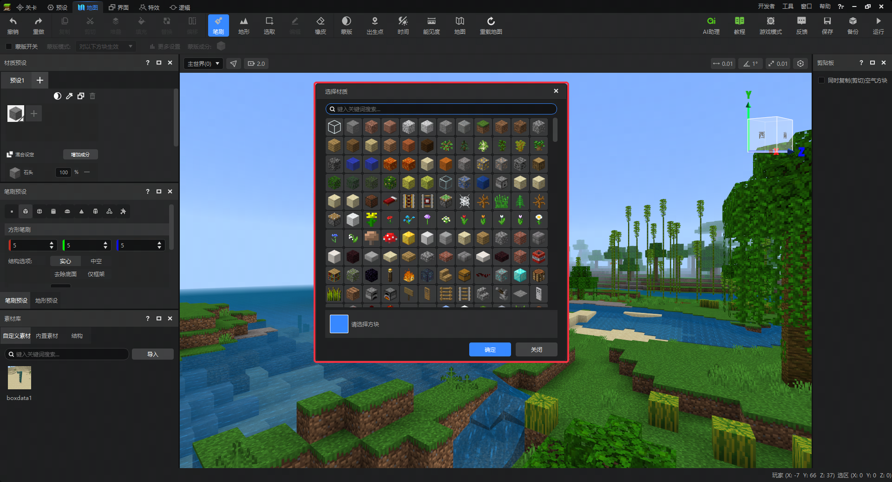
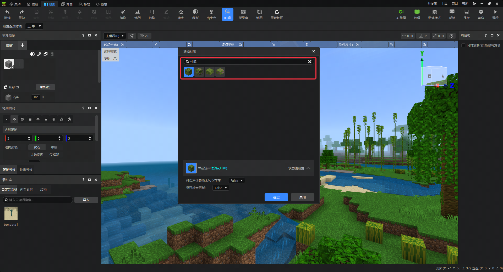
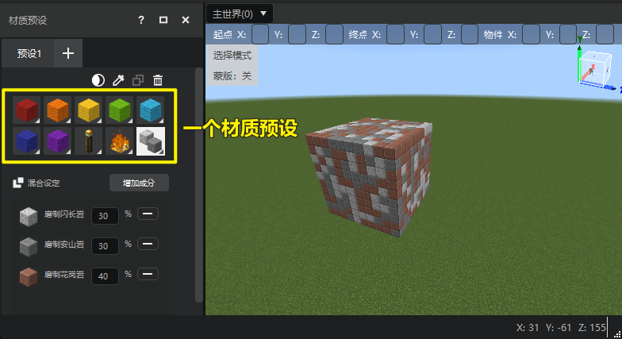
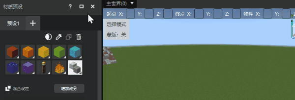
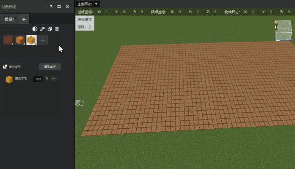
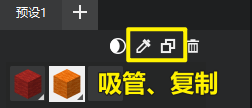
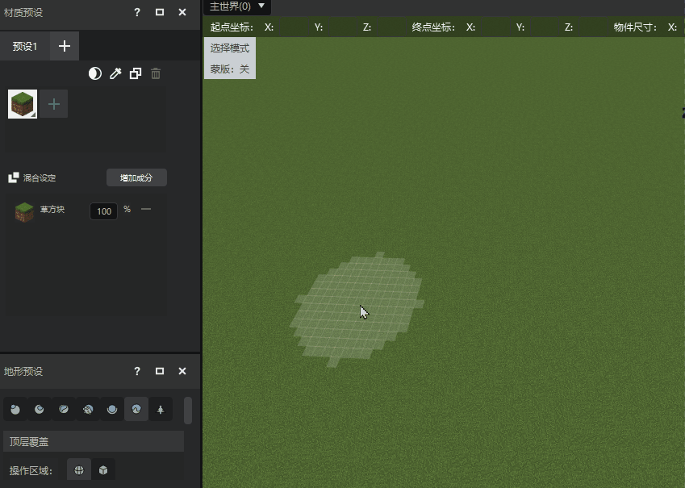

# 材质选择

在制作我的世界地图时，选择合适的方块至关重要。

在本指南中，您将学会：

- 如何使用 **地图编辑器** 基础操作—— **材质选择** 。

## 要求

建议在开始本指南之前先了解以下内容。

- [地图编辑器使用说明](./2-地图编辑器使用说明.md)
- [选取工具](./3-选取工具.md)
- [编辑工具](./4-编辑工具.md)

## 方块材质

地图编辑器使用 [**材质预设功能**](#材质预设) 将方块类型包装为 **方块材质** ，就像在涂鸦软件中选择一个色值一样。每种方块类型即是色值的一种。

在一个作品中，可能存在着非常多的自定义方块和原有的原版方块，这些方块材质都可以通过 **选择材质** 窗体找到。

通过搜索框，可以快速匹配到想要的方块材质。

::: danger 快捷键

可以使用默认快捷键E打开 **选择材质** 窗体。

:::

## 材质预设

材质预设指的是1个至多10个方块材质的组合。在材质预设中被选中的方块将作为笔刷、地形等工具的材质使用。

::: danger 快捷键

启用一个材质预设时，可以通过主键盘数字键1~0来快速切换当前预设中的材质，应用到工具中。

:::

### 创建、删除材质预设

我们可以点击预设页签右侧的【+】按钮新增预设，或通过点击预设页签内的【×】按钮删除已存在的预设。

### 预设内添加、删除材质

点击材质右侧的【+】按钮，会打开材质选择框，选择好方块后点击【确认】按钮即可应用该方块到材质。想要删除预设中的材质，使用鼠标左键选中该材质后点击窗口右上角的【删除】按钮即可。

::: info 注意

材质方块选择支持指定状态值。详见[这篇文档](./91-方块状态值设置说明.md)。

:::

另外还有2个快捷的工具可以帮助您添加材质：

- **吸管：** 可以直接选择地图中已有的方块，应用到材质中。
- **复制：** 选中一个材质后点击复制按钮，即可创建一个与之完全相同的材质（包括状态值相同）。

::: info 注意

材质窗口有一个蒙版按钮，用于将当前材质应用到蒙版的快捷操作。是感兴趣的开发者可以阅读[这篇文档](./92-蒙版工具说明.md)了解蒙版的功能。

:::

## 混合材质

混合材质有助于实现比较多样化的材质效果，避免单一材质应用到笔刷、地形工具后产生过于单一的效果。

**使用方法如下：**
1. 点击 **添加成分** 按钮，添加更多的方块。
2. 修改每个方块的占比数值，使所有方块占比相加不超过100%（低于100%将有部分空间被留作空气。
3. 直接使用笔刷或地形工具即可看到混合材质的效果。

下图中我们展示了使用混合材质制作一条更加真实的石路效果。

## 下一步：笔刷工具

现在您已经学习了材质选择的所有功能，包括如何添加材质预设、改变方块材质、混合方块材质等。

在下一节中，您将学习如何使用笔刷工具在地图中绘制想要的方块。学习结束时，您会重新将它们用于搭建基础地形、建造建筑框架。