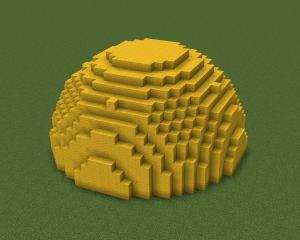

# 笔刷工具

使用笔刷工具，您可以直接在地图中快速生成指定形状的方块。笔刷首先需要指定材质，这需要用到上一篇介绍的[材质选择](./5-材质选择.md)功能。

在本指南中，您将学会：

- 如何使用 **地图编辑器** 基础操作—— **笔刷工具** 。

下面将逐一展示当前地图编辑器支持的笔刷类型。

## 要求

建议在开始本指南之前先了解以下内容。

- [地图编辑器使用说明](./2-地图编辑器使用说明.md)
- [选取工具](./3-选取工具.md)
- [编辑工具](./4-编辑工具.md)
- [材质工具](./5-材质选择.md)

## 单点笔刷

单点笔刷用于放置单个方块。

**笔刷参数**
|参数名|参数说明|
|:---|:---|
|连续生成间距|在输入框中输入正整数，以指定当鼠标拖动多少格距离后生成一个笔刷形状。|
|直线生成|勾选后，先单击一个坐标A，然后单击另一个坐标B，就会在以AB两点为端点的线段上生成笔刷形状。|
|覆盖原方块|若勾选，则笔刷形状生成的方块会覆盖地图上位置重叠的已有方块。|
|放置基点|① 停靠：笔刷形状会贴着鼠标选中的方块生成，比如鼠标选中方块的上表面，则笔刷形状生成在该方块上方，鼠标选中方块的下表面，则笔刷形状生成在方块下方。 ② 居中：会以选中的方块作为中心生成笔刷形状。 ③ 向上：会以选中的方块作为下顶点生成笔刷形状。 ④ 向下：会以选中的方块作为上顶点生成笔刷形状。|

## 立方体笔刷

立方体笔刷用于生成一个立方体形状，可指定该立方体在XYZ上的边长，同时可根据需要生成中空立方体、去除上下底面的中空立方体（可用于生成围墙）、立方体框架等。

**笔刷参数**
|参数名|参数说明|
|:---|:---|
|笔刷尺寸|输入立方体在XYZ三轴上的边长。|
|结构选项|① 实心：生成实心立方体。 ② 中空：生成空心立方体，搭配“厚度”参数可指定外壳部分厚度。 ③ 去除底面：去除除立方体的上下底面，仅剩四周的4个面，支持配置“厚度”。 ④ 仅框架：仅保留立方体框架结构，框架的粗细可使用“厚度”参数指定。
|厚度|用于指定中空、去除底面情况下的面的厚度，以及仅框架情况下的框架粗细。|
|连续生成间距|在输入框中输入正整数，以指定当鼠标拖动多少格距离后生成一个笔刷形状。|
|直线生成|勾选后，先单击一个坐标A，然后单击另一个坐标B，就会在以AB两点为端点的线段上生成笔刷形状。|
|覆盖原方块|若勾选，则笔刷形状生成的方块会覆盖地图上位置重叠的已有方块。|
|放置基点|① 停靠：笔刷形状会贴着鼠标选中的方块生成，比如鼠标选中方块的上表面，则笔刷形状生成在该方块上方，鼠标选中方块的下表面，则笔刷形状生成在方块下方。 ② 居中：会以选中的方块作为中心生成笔刷形状。 ③ 向上：会以选中的方块作为下顶点生成笔刷形状。 ④ 向下：会以选中的方块作为上顶点生成笔刷形状。|

## 球体笔刷

用于生成一个球体，当半球体包围盒XYZ三个轴上的尺寸参数配置不等时，即生成椭球体。可根据需要生成空心球。

**笔刷参数**
|参数名|参数说明|
|:---|:---|
|笔刷尺寸|输入球体的包围盒在XYZ三轴上的边长。当三个数值不完全相等时，即生成椭球体。|
|结构选项|① 实心：生成实心球体。 ② 中空：生成空心球体，搭配“厚度”参数可指定外壳部分厚度。
|厚度|用于指定中空情况下的球壳厚度。|
|连续生成间距|在输入框中输入正整数，以指定当鼠标拖动多少格距离后生成一个笔刷形状。|
|直线生成|勾选后，先单击一个坐标A，然后单击另一个坐标B，就会在以AB两点为端点的线段上生成笔刷形状。|
|覆盖原方块|若勾选，则笔刷形状生成的方块会覆盖地图上位置重叠的已有方块。|
|放置基点|① 停靠：笔刷形状会贴着鼠标选中的方块生成，比如鼠标选中方块的上表面，则笔刷形状生成在该方块上方，鼠标选中方块的下表面，则笔刷形状生成在方块下方。 ② 居中：会以选中的方块作为中心生成笔刷形状。 ③ 向上：会以选中的方块作为下顶点生成笔刷形状。 ④ 向下：会以选中的方块作为上顶点生成笔刷形状。|

## 半球体笔刷

用于生成一个球体，当半球体包围盒在X轴、Z轴上的边长不同时等于Y轴边长的2倍时，生成非标准半球体。可根据需要生成空心半球体、去除底面的空心半球体（可用于生成穹顶等）。

**笔刷参数**
|参数名|参数说明|
|:---|:---|
|笔刷尺寸|输入**默认状态下**半球体的包围盒在XYZ三轴上的边长。当X轴、Z轴上的数值不同时等于Y轴数值的2倍时，生成非标准半球体。 对于半球体默认状态指的是以+Y为放置方向的状态。改变放置方向后会出现XYZ数值与实际游戏内笔刷包围盒在XYZ轴上的三边不一样的情况。|
|结构选项|① 实心：生成实心半球体。 ② 中空：生成空心半球体，搭配“厚度”参数可指定外壳部分厚度。 ③ 去除底面：去除半球体的底面，仅剩半球形外壳，支持配置“厚度”。|
|厚度|用于指定中空、去除底面情况下的球壳厚度。|
|连续生成间距|在输入框中输入正整数，以指定当鼠标拖动多少格距离后生成一个笔刷形状。|
|直线生成|勾选后，先单击一个坐标A，然后单击另一个坐标B，就会在以AB两点为端点的线段上生成笔刷形状。|
|覆盖原方块|若勾选，则笔刷形状生成的方块会覆盖地图上位置重叠的已有方块。|
|放置基点|① 停靠：笔刷形状会贴着鼠标选中的方块生成，比如鼠标选中方块的上表面，则笔刷形状生成在该方块上方，鼠标选中方块的下表面，则笔刷形状生成在方块下方。 ② 居中：会以选中的方块作为中心生成笔刷形状。 ③ 向上：会以选中的方块作为下顶点生成笔刷形状。 ④ 向下：会以选中的方块作为上顶点生成笔刷形状。|
|放置基点|① 停靠：笔刷形状会贴着鼠标选中的方块生成，比如鼠标选中方块的上表面，则笔刷形状生成在该方块上方，鼠标选中方块的下表面，则笔刷形状生成在方块下方。 ② 居中：会以选中的方块作为中心生成笔刷形状。 ③ 向上：会以选中的方块作为下顶点生成笔刷形状。 ④ 向下：会以选中的方块作为上顶点生成笔刷形状。|
|放置方向|即半球切面正对的方向。共6种选项：+X，+Y，+Z，-X，-Y，-Z。|

## 圆柱笔刷

用于生成一个圆柱体，当圆柱体包围盒在X轴、Z轴上的边长不相等，生成一个椭圆柱体。可根据需要生成空心圆柱体、去除上下底面的空心圆柱体（可用于生成围墙、空心柱子等）。

**笔刷参数**
|参数名|参数说明|
|:---|:---|
|笔刷尺寸|输入**默认状态下**圆柱体的包围盒在XYZ三轴上的边长。当X轴、Z轴上的数值不同时，生成椭圆柱体。 对于圆柱体默认状态指的是以Y轴为放置方向的状态。改变放置方向后会出现XYZ数值与实际游戏内笔刷包围盒在XYZ轴上的三边不一样的情况。|
|结构选项|① 实心：生成实心圆柱体。 ② 中空：生成空心圆柱体，搭配“厚度”参数可指定侧面厚度。 ③ 去除底面：去除圆柱体的上下底面，仅剩侧面，支持配置“厚度”。|
|厚度|用于指定中空、去除底面情况下的厚度。|
|连续生成间距|在输入框中输入正整数，以指定当鼠标拖动多少格距离后生成一个笔刷形状。|
|直线生成|勾选后，先单击一个坐标A，然后单击另一个坐标B，就会在以AB两点为端点的线段上生成笔刷形状。|
|覆盖原方块|若勾选，则笔刷形状生成的方块会覆盖地图上位置重叠的已有方块。|
|放置基点|① 停靠：笔刷形状会贴着鼠标选中的方块生成，比如鼠标选中方块的上表面，则笔刷形状生成在该方块上方，鼠标选中方块的下表面，则笔刷形状生成在方块下方。 ② 居中：会以选中的方块作为中心生成笔刷形状。 ③ 向上：会以选中的方块作为下顶点生成笔刷形状。 ④ 向下：会以选中的方块作为上顶点生成笔刷形状。|
|放置基点|① 停靠：笔刷形状会贴着鼠标选中的方块生成，比如鼠标选中方块的上表面，则笔刷形状生成在该方块上方，鼠标选中方块的下表面，则笔刷形状生成在方块下方。 ② 居中：会以选中的方块作为中心生成笔刷形状。 ③ 向上：会以选中的方块作为下顶点生成笔刷形状。 ④ 向下：会以选中的方块作为上顶点生成笔刷形状。|
|放置方向|即与圆柱两地面中心点连线平行的轴。共3种选项：X，Y，Z。|

## 圆锥笔刷

用于生成一个圆锥体，当圆锥体包围盒在X轴、Z轴上的边长不相等，生成一个椭圆锥体。可根据需要生成空心圆锥体、去除底面的空心圆锥体（可用于生成建筑尖顶等）。

**笔刷参数**
|参数名|参数说明|
|:---|:---|
|笔刷尺寸|输入**默认状态下**圆锥体的包围盒在XYZ三轴上的边长。当X轴、Z轴上的数值不同时，生成椭圆锥体。 对于圆锥体默认状态指的是以+Y轴为放置方向的状态。改变放置方向后会出现XYZ数值与实际游戏内笔刷包围盒在XYZ轴上的三边不一样的情况。|
|结构选项|① 实心：生成实心圆锥体。 ② 中空：生成空心圆锥体，搭配“厚度”参数可指定侧面厚度。 ③ 去除底面：去除圆锥体的上下底面，仅剩侧面，支持配置“厚度”。|
|厚度|用于指定中空、去除底面情况下的厚度。|
|连续生成间距|在输入框中输入正整数，以指定当鼠标拖动多少格距离后生成一个笔刷形状。|
|直线生成|勾选后，先单击一个坐标A，然后单击另一个坐标B，就会在以AB两点为端点的线段上生成笔刷形状。|
|覆盖原方块|若勾选，则笔刷形状生成的方块会覆盖地图上位置重叠的已有方块。|
|放置基点|① 停靠：笔刷形状会贴着鼠标选中的方块生成，比如鼠标选中方块的上表面，则笔刷形状生成在该方块上方，鼠标选中方块的下表面，则笔刷形状生成在方块下方。 ② 居中：会以选中的方块作为中心生成笔刷形状。 ③ 向上：会以选中的方块作为下顶点生成笔刷形状。 ④ 向下：会以选中的方块作为上顶点生成笔刷形状。|
|放置基点|① 停靠：笔刷形状会贴着鼠标选中的方块生成，比如鼠标选中方块的上表面，则笔刷形状生成在该方块上方，鼠标选中方块的下表面，则笔刷形状生成在方块下方。 ② 居中：会以选中的方块作为中心生成笔刷形状。 ③ 向上：会以选中的方块作为下顶点生成笔刷形状。 ④ 向下：会以选中的方块作为上顶点生成笔刷形状。|
|放置方向|即与圆柱两地面中心点连线平行的轴。共3种选项：X，Y，Z。|

## 多棱柱笔刷

用于生成一个多棱柱。与之前的笔刷类型不同的是，多棱柱笔刷仅能生成底面为正多边形的多棱柱，并且以底面外接圆半径和边数，来定义多棱柱底面的大小和形状。可根据需要生成空心多棱柱、去除上下底面的空心多棱柱（可用于生成围墙、柱子等）。

**笔刷参数**
|参数名|参数说明|
|:---|:---|
|外接圆半径|底面外接圆圆心到任意顶点的距离，为1~999之间的整数。|
|底面边数|底面多边形的边数，为1~100之间的整数。|
|高度|多棱柱的高度，为1~300之间的整数。|
|结构选项|① 实心：生成实心多棱柱。 ② 中空：生成空心多棱柱，搭配“厚度”参数可指定侧面厚度。 ③ 去除底面：去除多棱柱的上下底面，仅剩侧面，支持配置“厚度”。|
|厚度|用于指定中空、去除底面情况下的厚度。|
|连续生成间距|在输入框中输入正整数，以指定当鼠标拖动多少格距离后生成一个笔刷形状。|
|直线生成|勾选后，先单击一个坐标A，然后单击另一个坐标B，就会在以AB两点为端点的线段上生成笔刷形状。|
|覆盖原方块|若勾选，则笔刷形状生成的方块会覆盖地图上位置重叠的已有方块。|
|放置基点|① 停靠：笔刷形状会贴着鼠标选中的方块生成，比如鼠标选中方块的上表面，则笔刷形状生成在该方块上方，鼠标选中方块的下表面，则笔刷形状生成在方块下方。 ② 居中：会以选中的方块作为中心生成笔刷形状。 ③ 向上：会以选中的方块作为下顶点生成笔刷形状。 ④ 向下：会以选中的方块作为上顶点生成笔刷形状。|
|放置基点|① 停靠：笔刷形状会贴着鼠标选中的方块生成，比如鼠标选中方块的上表面，则笔刷形状生成在该方块上方，鼠标选中方块的下表面，则笔刷形状生成在方块下方。 ② 居中：会以选中的方块作为中心生成笔刷形状。 ③ 向上：会以选中的方块作为下顶点生成笔刷形状。 ④ 向下：会以选中的方块作为上顶点生成笔刷形状。|
|放置方向|即与圆柱两地面中心点连线平行的轴。共3种选项：X，Y，Z。|
|旋转角度|笔刷相对于0°的顺时针旋转度数，取值范围0-360°|

## 素材笔刷

素材笔刷用于直接将素材库中保存的自定义素材和编辑器内置素材直接作为笔刷形状，刷在地图中，从而大大减少我们的操作步骤，提升素材复用效率。

**笔刷参数**
|参数名|参数说明|
|:---|:---|
|素材|通过下拉框选择笔刷需要以哪个素材为形状。|
|连续生成间距|在输入框中输入正整数，以指定当鼠标拖动多少格距离后生成一个笔刷形状。|
|直线生成|勾选后，先单击一个坐标A，然后单击另一个坐标B，就会在以AB两点为端点的线段上生成笔刷形状。|
|覆盖原方块|若勾选，则笔刷形状生成的方块会覆盖地图上位置重叠的已有方块。|
|放置基点|① 停靠：笔刷形状会贴着鼠标选中的方块生成，比如鼠标选中方块的上表面，则笔刷形状生成在该方块上方，鼠标选中方块的下表面，则笔刷形状生成在方块下方。 ② 居中：会以选中的方块作为中心生成笔刷形状。 ③ 向上：会以选中的方块作为下顶点生成笔刷形状。 ④ 向下：会以选中的方块作为上顶点生成笔刷形状。|
|放置基点|① 停靠：笔刷形状会贴着鼠标选中的方块生成，比如鼠标选中方块的上表面，则笔刷形状生成在该方块上方，鼠标选中方块的下表面，则笔刷形状生成在方块下方。 ② 居中：会以选中的方块作为中心生成笔刷形状。 ③ 向上：会以选中的方块作为下顶点生成笔刷形状。 ④ 向下：会以选中的方块作为上顶点生成笔刷形状。|
|放置方向|即与圆柱两地面中心点连线平行的轴。共3种选项：X，Y，Z。|
|旋转角度|笔刷相对于0°的顺时针旋转度数，共有0°、90°、180°、-90°四种选项。|

## 拼图方块笔刷

拼图方块笔刷主要用于在地图中快捷放置自定义大型特征中的拼图方块（线锯方块），通过可视化的属性编辑和放置，减少我们在游戏模式手动设置拼图方块参数的繁琐操作，详情可以参考[自定义大型特征](../20-玩法开发/15-自定义游戏内容/4-自定义维度/6-自定义大型特征.md)。

|参数名|参数说明|
|:---|:---|
|类型|代表拼图方块的三种主要使用场景，类型1.目标方块：代表这个拼图方块所在的结构是放在目标池内的结构，被动等待其他【源】类型的拼图方块来拼接，这种类型的拼图方块会被省略掉【目标池】和【目标方块】属性；类型2.源方块，代表这个拼图方块会主动从目标池抽取结构，并且试图寻找对应的目标方块进行拼接，与目标方块相反，这个类型的拼图方块会被省略掉【名称】属性；类型3.自定义方块：实际上一个拼图方块既可以作为目标方块也可以作为源方块，即自定义方块可以是源方块和目标方块的并集，自定义拼图方块所有属性都可以自定义，但使用难度会比较高。|
|名称|此拼图方块的名称，默认值为"minecraft:empty" 。|
|目标池|此拼图方块用于选取结构的结构池,结构池的定义可查看[结构池配置](../20-玩法开发/15-自定义游戏内容/4-自定义维度/6-自定义大型特征.md#_1-4-2-结构池配置),默认值为"minecraft:empty",即为空。|
|目标名称|当结构从目标池中生成时希望对接的拼图方块的名称，默认值为"minecraft:empty"。|
|变为|指的是拼图方块在成功对接并且结构被放置后会转变的方块，默认值为"minecraft:air"，即空气。|
|放置方向|即拼图方块箭头所指的方向，只有箭头相对才能被视作拼接成功。|
|接点类型|只在拼图方块朝上或朝下时有效。1.可滚动：生成时，拼图方块会随机将目标结构置于与该拼图方块处于同一XZ轴的结构方块的边界内，即对接的结构会随机绕Y轴旋转。默认为此类型。2.固定：生成时，拼图方块会直接把目标结构或实体置于自身所朝的方向（上方或下方），即不会随机绕Y轴旋转，可用于连接结构。|

## 下一步：地形工具

现在您已经了解了笔刷工具，它可以在地图区域内进行精细的局部修改。而地形工具则适用于大范围的地形调整和造景。

在下一节中，您将学习如何使用地形工具来修改地图的高度、坡度和地形形状等方面。
