# 地形工具

地形工具用于对地图整体地形进行调整，例如让某块区域隆起、凹陷、平滑等等。

在本指南中，您将学会：

- 如何使用 **地图编辑器** 基础操作—— **地形工具** 。

::: info 提示

大部分地形工具的设置都会用到下列几种参数：

| 参数名         | 参数说明                                                     |
| :------------- | :----------------------------------------------------------- |
| 操作区域       | 可以选择地形工具影响的范围，有球体范围和立方体范围两个选项。 |
| 区域直径       | 正整数，用于指定操作区域的直径。                             |
| 强度           | 正整数，取值范围1~10。指定每秒进行几次操作（数值越高越快）。 |
| 不影响流体方块 | 指定地形操作是否会影响到已有的水或岩浆方块。                 |

:::

## 要求

建议在开始本指南之前先了解以下内容。

- [地图编辑器使用说明](./2-地图编辑器使用说明.md)
- [选取工具](./3-选取工具.md)
- [编辑工具](./4-编辑工具.md)
- [材质工具](./5-材质选择.md)
- [笔刷工具](./6-笔刷工具.md)

## 隆起

让指定区域内的方块向相机所在位置隆起1格。

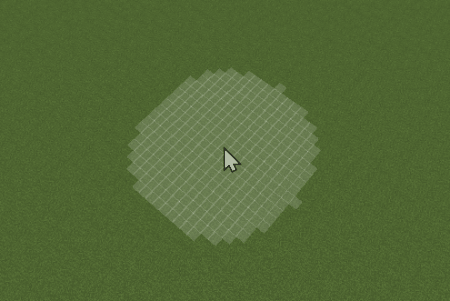

## 凹陷

让指定区域内的方块向远离相机的方向凹陷1格。

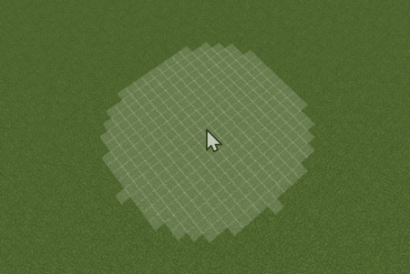

## 侵蚀

去掉突出的方块。

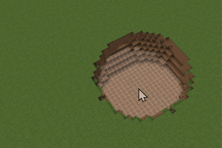

## 平滑

去掉突出的方块，填充凹陷的区域，让选中区域变得更加平滑。

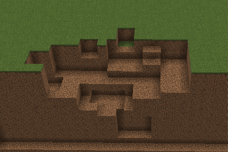

## 填充

填充凹陷的区域和空洞。

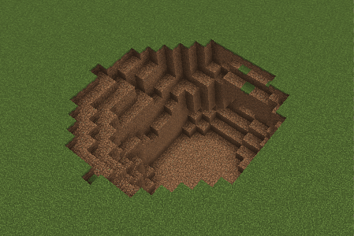

## 顶层覆盖

顶层覆盖功能是3个子效果的集合：

- **顶层覆盖：** 在选中区域顶部覆盖若干层[材质预设](./5-材质选择.md#材质预设)窗口中选定的材质。层数可指定。

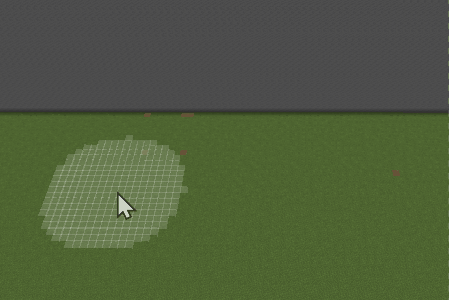

- **顶层替换：** 将选中区域顶部若干层方块替换为[材质预设](./5-材质选择.md#材质预设)窗口中选定的材质。层数可指定。

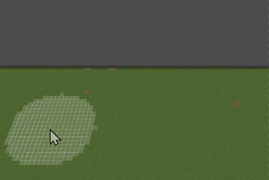

- **表层替换：** 不限于顶层，可替换侧面方块，但仅可替换1层。

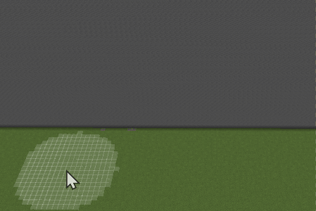

## 植被工具

植被工具用于在地图中放置植被特征（feature）。并且支持范围放置。

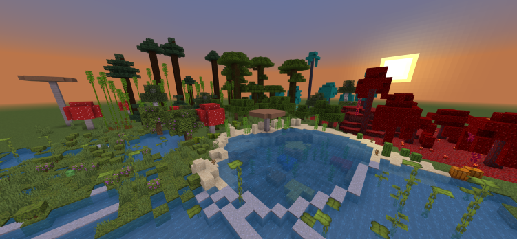

### 单点放置

将 **模式** 选项切换到 **单点模式** 后，您可以通过一次点击尝试放置一个指定类型的植物特性。

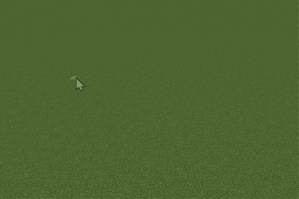

### 范围放置

选择 **范围模式** 后，您可以通过一次点击在鼠标选定的区域内生成多个植物特性。可以通过调整`操作区域`和`区域直径`参数来设置所选区域的大小，通过`密度`参数来调整区域内植被的生成密度。

`密度`参数与所选区域内生成点的期望个数 E(n) 的关系如下：

E(n) = [密度数值] × [选区内包含的格数] / 100

结果**四舍五入**取整。

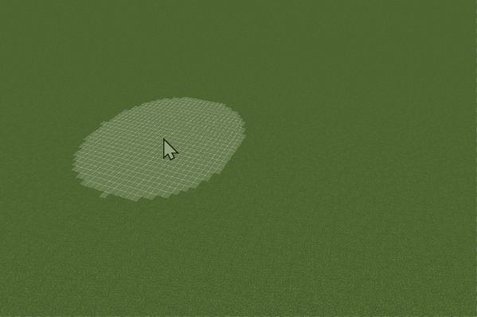

::: danger 注意

1. 密度数值也会影响指定区域内植物feature的生成。在所选区域面积较小的情况下，密度数值过低将无法生成植物。

2. 您可以根据自身需求调整密度参数。通常情况下，对于较矮的树木（例如普通尺寸的橡树、白桦树等），密度设置为5已经相当茂密，过高的密度可能会影响玩家的正常游戏体验。

3. 如果传入的`区域直径`和`密度`参数过小，导致无法生成有效的feature，预览窗口上方将弹出以下提示。

   

:::

### 植被类型选择

植被工具支持原生游戏中大部分植被feature的放置生成，开发者可以先选择 **类型** ，然后在 **子类型** 中选择详细的子类型。

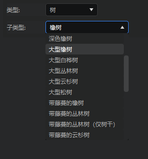

::: danger 注意

1. 植被工具能否如预期生成指定的植物类型，取决于原生游戏的特性生成逻辑。如果引擎判定该植物feature无法在指定位置生成，则不会生成。

2. 部分具有特殊生成方块要求的植被feature已添加提示。这些子类型选项后面会显示一个感叹号标志，您可以将鼠标悬停在上面查看提示文本。

   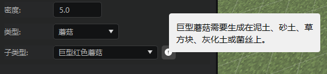

3. 如果所选的植被类型无法在指定区域内生成，预览窗口上方将弹出以下提示。

   

4. 由于原生游戏引擎的限制，部分植被在放置后无法撤销。这些子类型已添加提示文本，请您谨慎使用这些植被特性。生成后，如需清除，需手动操作。

   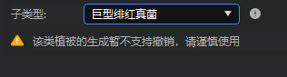

:::

## 大型结构

大型结构工具用于在地图中放置预配置的结构池，以生成相应的大型结构，便于在编辑器中快速验证结构池配置的正确性。有关结构池的定义，请参阅[结构池配置](../20-玩法开发/15-自定义游戏内容/4-自定义维度/6-自定义大型特征.md#_1-4-2-结构池配置)。

## 下一步：素材库、结构与剪贴板

在下一节中，您将学习如何使用素材库、结构与剪贴板功能。这些工具可以帮助您便捷地批量复制和存储某一区域的方块，并在另一位置复用。掌握这些功能后，您将能够高效管理和重复使用各种地图元素，从而提升地图编辑效率和创作自由度。
