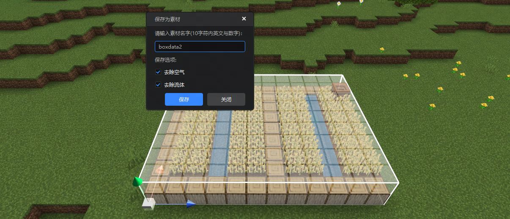

# 素材库、结构与剪贴板

素材库、结构、剪贴板三个功能可以更便捷地对一个范围内的所有方块进行批量复制、存储，并在另一处位置复用。

在本指南中，您将学会：

- 如何使用 **地图编辑器** 基础操作—— **素材、结构保存与使用** 。
- 如何使用 **剪贴板** 。

## 要求

建议在开始本指南之前先了解以下内容。

- [地图编辑器使用说明](./2-地图编辑器使用说明.md)
- [选取工具](./3-选取工具.md)
- [编辑工具](./4-编辑工具.md)
- [材质工具](./5-材质选择.md)

## 素材库

素材库是地图编辑器的一个重要功能，它可以保存方块为素材，并在同一作品内的其他位置，或同一设备上的不同作品进行重复利用，大大提升地图制作效率。

### 素材的保存与使用

使用选取工具选择好需要保存的方块后，可右键包围盒选择 **保存为素材** 按钮将选区内方块结构存入素材库长期使用。

保存时可以修改素材名称，同时也可以指定是否需要保存空气、流体方块。

::: info 素材文件存储位置

素材数据保存在.mdl文件中，默认存储路径位于 `AppData\Roaming\Sunshine\Temp\Genesis\ModelPrefab\CustomModel`文件夹下。

:::

要将保存好的素材文件放置到地图中，只需要在 **素材库** 窗口单击需要放置的素材，即可在地图中通过左键单击放置，连续单击可以放置多个。

#### 放置前的二次编辑

在素材摆放到地图中但未确认生成时，可进行二次编辑，包括位移、旋转、缩放、翻转等操作。

如下图所示，点击左键将`boxdata1`素材摆放进地图，此时移动鼠标时会发现素材形状仍在渲染。因为素材可连续摆放，您目前处于连续放置状态。

**点击鼠标右键结束放置状态**，此时移动鼠标不会显示素材形状渲染。**左键单击刚放置的素材（此时有包围盒）表示选中，即可进行编辑操作。**

此时可对选中的素材进行编辑操作，如位移、旋转、翻转、缩放等。调整完毕后，点击 **确定生成** 即可。

对于已放置的多个素材，取消放置状态后，可左键点击不同素材分别进行调整，操作与上述一致。

#### `.mdl`素材文件的导入与导出

素材`.mdl`文件可以导出到电脑的指定位置，也可以从其他路径导入编辑器以供地图编辑使用。

鼠标右键点击自定义素材库或素材库中的素材，选择 **导出** 即可将该素材`.mdl`文件导出到任意位置。

点击素材库窗口 **自定义素材** 分页的 **导入** 按钮，即可从本地选择`.mdl`文件导入编辑器作为素材使用。

#### 导入模型为素材

素材库 **自定义素材** 分页的 **导入** 按钮还可以导入模型作为素材。

当前地图编辑器支持的模型类型有：`.obj`、`.fbx`、`.3ds`、`.ply`、`.stl`。

如果模型本身自带贴图，编辑器会读取其颜色，并做简单的颜色匹配，生成彩色素材。

MC中可以与贴图颜色对应的方块有限，开发者可以在模型生成后按需要使用 **替换** 工具进行进一步的方块调整。

#### 应用素材到预设

您可以将素材导入为预设素材，这样在预设编辑器就可以将素材挂接到预设上。

在预设编辑器打开一个空预设后，可以点击工具栏的 **添加素材** 按钮，将刚刚在地图编辑器中保存的素材导入到预设中。

## 结构

### 结构的保存

使用选取工具创建选区后，右键选区点击 **保存为结构**，即可将包围盒选择范围内的方块保存为结构`.mcstructure`文件。

保存时有如下选项可以选择：

- **包含实体：** 保存的结构数据文件中将包含实体(动态,可移动)对象信息。

- **去除空气方块：** 生成的结构数据文件中将不包含空气方块信息。

- **保存为网易版优化结构：** 在文件尺寸和性能上做出一定优化。

- **切分结构：** 会按照选择的结构边长，将结构切分成多个结构数据文件，适用于大范围的方块信息保存。

::: info 切分结构

切分结构生成的结构文件在当前作品的 行为包的`structures/命名空间` 文件夹下 。

:::

### 结构的使用

保存的结构可在素材库窗口的 **结构** 分页找到。可以直接像摆放素材一样，通过鼠标点击将结构摆放至场景中。

::: danger 注意

需注意的是，【结构】分页仅会显示当前作品中的结构文件，并不会像素材一样可以跨作品使用。

结构同样也可以连续摆放，并且支持[在放置前进行二次编辑](#放置前的二次编辑)。

:::

另外，我们也可以使用结构方块，输入对应结构文件所在文件夹和文件名称来使用此结构。

如果选择了切分结构，将选择范围内的方块生成多个结构文件保存，则会同时生成对应的各个结构文件基础坐标的配置信息。

解析此配置文件，通过`ModSDK`的<a href="../../mcdocs/1-ModAPI/接口/世界/地图.html#placestructure" rel="noopenner"> PlaceStructure </a>接口在脚本中设置对应的坐标和结构文件名称信息，即可在对应维度地图中生成还原出保存的地图数据。

## 剪贴板

剪贴板用于存放复制的选区方块。

::: danger 素材库与剪贴板的区别

- 素材库内容会长期储存，可以应用到同一个开发者账号、同一台设备上的全部地图作品中。
- 剪贴板内容仅为临时储存，将在关闭编辑器后被清除。

:::

使用选取工具框选一个区域后，按下 **复制** 或 **剪切** 按钮，即可将选区方块保存到剪贴板。剪贴板可存储多个内容。新的内容会顶下旧的内容，显示在粘贴板的最上方。您可以左键点击选择需要的内容，再在地图中左键点击需要粘贴的位置，即可完成粘贴。

::: info 剪贴板

剪贴板内容同样也可以连续摆放，并且支持[在放置前进行二次编辑](#放置前的二次编辑)。内容可重新命名，方便辨识。

:::

剪贴板内容可以直接导入素材库使用。只需要在剪贴板中右键点击一个内容，选择 **添加到素材库** ，即可在素材库窗口中的 **自定义素材** 分页找到它。

## 记住上次配置

保存结构时，可以记住上次的配置。例如：勾选**“去除空气”**并记住该配置后，下次保存结构时无需重复选择同类选项。减少重复勾选步骤，提升开发效率。

## 下一步：方块状态值设置说明

在下一节中，您将学习如何使用方块状态值设置功能来配置笔刷、填充和替换工具所用的方块材质状态值。

这些状态值决定了方块的外观和行为，使得建筑更具多样性与美观性。
