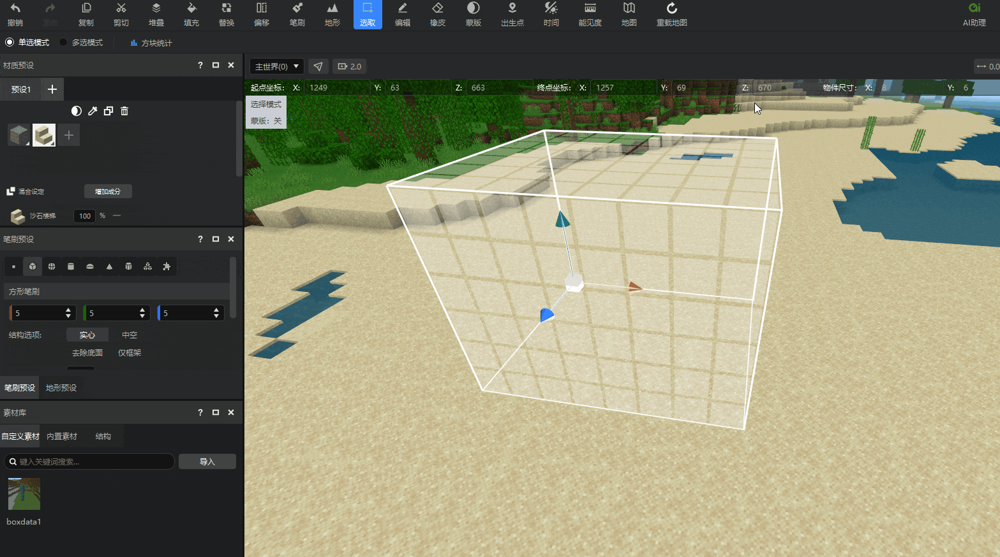

# 方块状态值设置

方块状态值进一步定义了方块的外观和行为。通过设置方块状态值，您可以在地图中快速生成指定形状的方块。

在本指南中，您将学会：

- 如何使用 **地图编辑器** 基础操作—— **方块状态值设置** 。

下面来具体看下方块状态值设置功能是如何使用的吧！

## 要求

建议在开始本指南之前先了解以下内容。

- [地图编辑器使用说明](./2-地图编辑器使用说明.md)
- [选取工具](./3-选取工具.md)
- [编辑工具](./4-编辑工具.md)
- [材质工具](./5-材质选择.md)

## 材质预设状态值设置

首先，创建一个新的材质预设。在 **选择材质** 窗口中，选择一个带有多种状态值的方块，可以看到窗口右下角出现了 **状态值设置** Tab。

展开Tab，我们可以看到当前所选方块的可配置状态值，直接通过下拉选框调整即可修改所选方块的状态值，并应用到材质预设中。

- 从上图的示例中可看出，混合材质中的每个材质都能进行单独的状态值编辑。
- 方块贴图无法直接反映状态值变化。为方便判断混合材质中的每个材质，当鼠标悬停在混合材质面板的某个方块上时，提示框将展示该方块的具体状态值配置。

配置好的材质预设可以应用到笔刷、填充等多个功能，并且能够保留其中的状态值设置。

## 填充工具状态值设置

填充工具的方块选择也可以使用状态值设置进行精确调整。

您可以直接使用在材质预设中设置好的预设项进行填充，也可以直接选择需要使用的方块，在下方设置其状态值后直接应用。

## 替换工具状态值设置

在引入了状态值之后，不同状态值的同种方块在替换窗口会分别显示，这样可以单独对其中一种状态值进行替换处理，而不影响其他状态值的该方块。

您可以将鼠标悬停在左侧窗口的方块上，查看提示框上显示的状态值信息，判断是否是自己需要替换的状态值。

## 其他说明

- 材质预设窗口的 **吸管** 、 **复制** 工具均会保留方块状态值信息。
- 工具栏中的 **方块统计** 功能会将不同状态值的同种方块合并统计，而不会每种状态值单独统计。

## 下一步：蒙版工具

使用地形与笔刷工具，您可以调整地图的地形与方块区域。但是，有时您不希望对整个区域进行全局调整，而希望对特定区域进行校正。

例如，您在使用地形工具时，只希望对地图里的草方块进行修改而不影响其他方块。要在地图编辑器里进行局部校正，就需要使用蒙版工具。

您已经走得很远了，坚持下去！