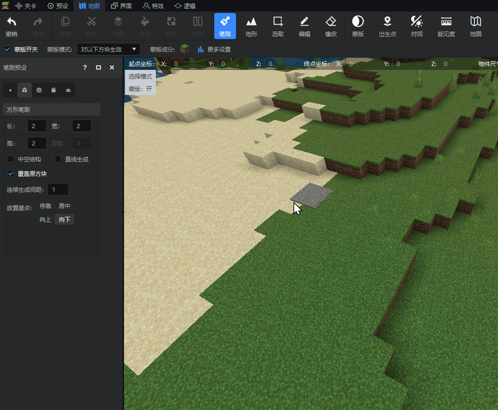
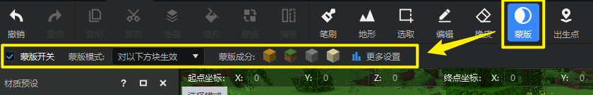
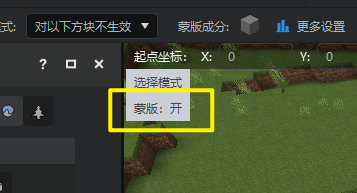
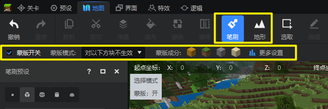

# 蒙版工具说明

在本指南中，您将学会：

- 如何使用 **地图编辑器** 进阶操作—— **蒙版工具** 。

下面就一起来看看蒙版工具的使用方法吧！

## 要求

建议在开始本指南之前先了解以下内容。

- [地图编辑器使用说明](./2-地图编辑器使用说明.md)
- [选取工具](./3-选取工具.md)
- [编辑工具](./4-编辑工具.md)
- [材质工具](./5-材质选择.md)
- [笔刷工具](./6-笔刷工具.md)
- [地形工具](7-地形工具.md)

## 什么是蒙版

蒙版可以用来限制开发者地图编辑操作的生效对象。蒙版一共有2种：

### 对以下方块生效

地图编辑操作仅会修改蒙版成分中的方块。例如当您希望笔刷只会覆盖掉地图里的草方块而不影响其他的方块，就可以使用这种蒙版。

### 对以下方块不生效

地图编辑操作仅会修改除蒙版成分中方块以外的其他方块。例如当你希望你的顶层覆盖操作不影响到你的石头小路，只覆盖旁边的其他方块时，就可以使用这种蒙版。

## 蒙版基础设置

### 蒙版工具栏选项

打开地图编辑器，在顶部工具栏即可找到【蒙版】按钮。点击【蒙版】按钮，会在次级工具栏显示蒙版选项。

- **蒙版开关**：勾选框，用于启用或关闭蒙版功能。
- **蒙版模式**：下拉选框，共有两个可选项，【对以下方块生效】和【对以下方块不生效】。
- **蒙版成分**：当前蒙版中包括的方块。
- **更多设置**：对蒙版的更详细配置，点击即会打开蒙版设置窗口。

::: info 提示

蒙版开启状态会在预览窗左上角显示。

:::

### 蒙版设置窗口

蒙版设置窗口允许开发者对蒙版进行更详细的配置。除了工具栏中已有的【蒙版开关】和【蒙版模式】两项外，在设置窗口中还可以进行对蒙版成分方块的直接增删。

#### 增加蒙版成分

想要为蒙版成分中增加更多方块，只需要在下方搜索、选择到相应的方块，点击下方蓝色【添加】按钮即可。选择完毕后点击【关闭】按钮即可立即生效蒙版改动。

::: info 提示

蒙版工具支持对成分中方块的状态值进行详细设置。例如你可以选择进包含上下颠倒的橡木楼梯方块。
**不同状态值 ** 的 **同种** 方块将在【当前蒙版包含的方块】一栏分别列为不同的成分方块。

:::

#### 删除蒙版成分

只需要在 **当前蒙版包含的方块** 一栏中再次点击想要删除的方块，即可将其从蒙版成分中删除。

### 材质预设应用至蒙版

您可以直接将材质预设中选好的方块组合直接一键应用至蒙版成分设置。只需要点击吸管工具左侧的 **应用为蒙版** 按钮即可将当前蒙版的成分设置为所选方块预设里的全部方块。

::: danger 注意

方块预设里包含百分比信息，但是应用为蒙版成分后不会生效。即使在方块预设中某个方块的百分比为0%，它仍然会被应用至蒙版成分中。
方块预设应用为蒙版会保留方块预设中每个方块的状态值设置。

:::

## 蒙版与其他工具的配合使用

蒙版是一个全局控制选项，当蒙版开启后，会对地图编辑器中所有能够产生方块修改的操作生效，所以您需要根据自己的需要，在合适的情况下使用蒙版工具。

### 笔刷与地形

我们在[前文](#什么是蒙版)中已通过动图的形式举例过蒙版在笔刷与地形操作中的应用。
在进行笔刷或地形操作时，蒙版次级工具栏同样会显示出来，方便开发者直接对蒙版进行快捷配置，而不需要进行多余的切换步骤。

### 填充

蒙版开启后，会对开发者的【填充】操作生效。
1. 当蒙版模式为【对以下方块生效】时，填充操作不会修改选区中非蒙版成分的方块。
2. 当蒙版模式为【对以下方块不生效】时，填充操作不会修改选区中的蒙版成分方块。

### 替换

蒙版开启后，会对开发者的【替换】操作生效。被蒙版判定为不可修改的方块，在替换窗口中不可点击。

### 橡皮

蒙版开启后，被蒙版判定为不可修改的方块，不会被橡皮工具擦除。

### 编辑

蒙版在编辑操作中的应用可能会有些反直觉，您需要了解其中的原理，从而确定是否要在编辑操作时开启蒙版。

举个例子：尝试将下面这个选区中的桦木板方块向上移动。我们将蒙版设置为“仅对桦木板方块生效”，然后开始移动操作。

从上图中可发现，我们点击确定生成后，桦木板方块直接消失了，有悖于我们的直觉。

主要的原因是：MC中无法直接对方块进行偏移、旋转等操作，而是需要把旧方块删除之后生成新方块，而这又分为2步：① 原方块的删除；② 新方块的生成。

在第①步中，蒙版生效，仅会删除桦木板方块。在第②步中，蒙版生效，我们尝试在新的位置生成桦木板失败了，因为新的位置当前是空气，我们尝试用桦木板方块替换这里的空气方块时会被蒙版阻止，导致生成失败。所以最终的表现就是仅仅删除了旧的桦木板方块而没有在移动后的新位置生成新的桦木板方块。

类似的情况还可能发生在进行旋转、伸缩、翻转等操作时。

### 其他

除了上述工具外，其他任何对方块产生修改的操作都会受到蒙版工具的影响，例如素材库的素材放置等。

