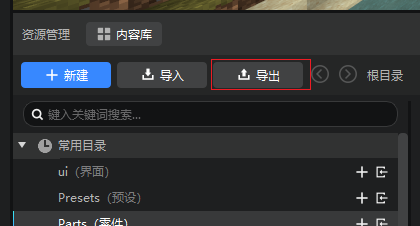
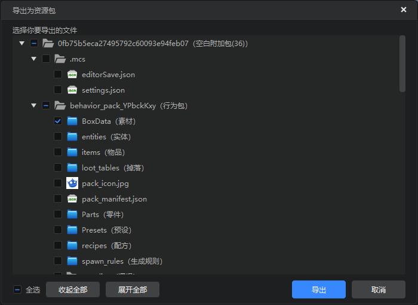
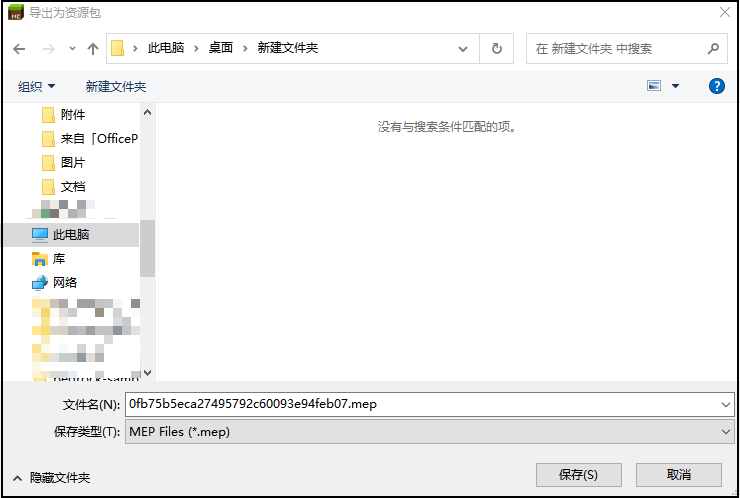
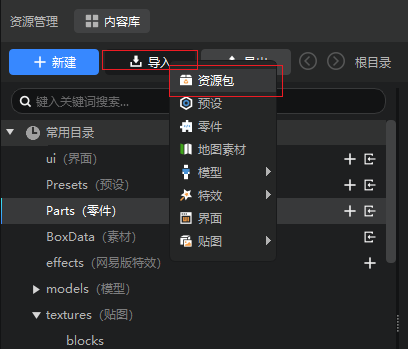
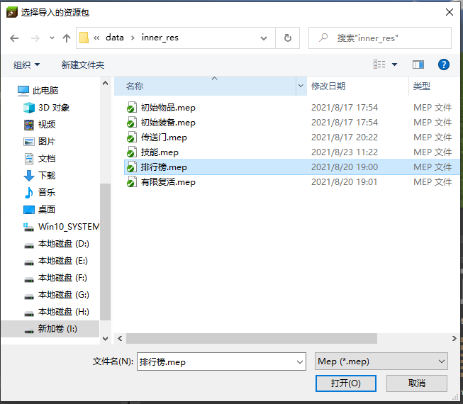
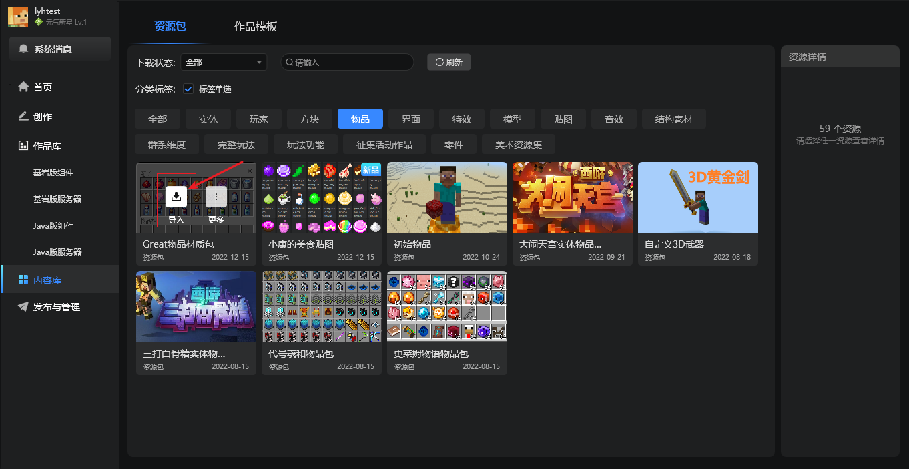

# 资源包

## 什么是资源包
1. 资源包是存储我的世界编辑器作品的一部分资源文件的压缩包文件，它一般包含了组件中的可以公用的一部分内容。
2. 资源包可从我的世界编辑器的某个组件中导出，也可以被导入到其他组件中，来实现一些共用资源的备份和复用。
3. 我的世界开发工作台提供的官方内容库中，有资源包和作品模板两个分页，其中的资源包分页的内容均可下载和导入到任意作品中。

## 资源包导出

您可以使用资源管理器中的“导出”功能来制作一个资源包：

点击“导出”按钮后，会弹出“导出为资源包” 界面， 在该界面，您可以选择相应的文件，然后点击“导出”按钮进行导出。

点击“导出”按钮后，选择对应的文件路径进行保存为资源包（mep文件），一个资源包就成功导出了。

## 外部资源包导入

您可以使用资源管理器中的“导入”按钮来进行资源包的导入：

选择二级菜单中的“资源包”，您可以直接导入外部的资源包。

在弹出的文件选择框中选择你需要的资源包（mep格式），即可导入对应内容。

## 内容库资源包导入
您可以直接打开内容库的资源包分页，选择你需要的作品并下载，此时点击该作品卡片上的导入按钮，即可将其一键导入到当前编辑器所打开的作品中，详情可参考[内容库文档](./11-内容库.md#导入资源)。

## 导入规则

1、对于资源包中一般的文件，若目标组件中不存在对应的文件，将会直接复制到对应的路径。若目标组件中存在相同的文件，则直接跳过。若目标组件中存在同名但内容不同的文件，则中止本次导入，并提示冲突。

2、对于behavior_pack_XXX和resource_pack_XXX中的文件，将会合并到目标组件中第一个behavior_pack_XXX和resource_pack_XXX中对应的路径 。

3、对于resource_pack_XXX中特殊公用文件，如block.json等，将会对各个文件进行对应的合并处理，无法正确的合并时，将会中止本次导入，并提示冲突。

4、特殊文件的相对路径为有:
- ` resource_pack/blocks.json`
- ` resource_pack/materials/common.json`
- ` resource_pack/models/mobs.json、`
- ` resource_pack/models/netease_models.json`
- ` resource_pack/sounds/sound_definitions.json`
- ` resource_pack/textures/flipbook_textures.json`
- ` resource_pack/textures/flipbook_textures_items.json`
- ` resource_pack/textures/item_texture.json`
- ` resource_pack/textures/terrain_texture.json`
- ` resource_pack/ui/_ui_defs.json`
- ` resource_pack/texts/zh_CN.lang文件`

## 注意事项

1、资源包导出时，如果相关路径的文件发生了改变，需要重新导出。

2、暂不支持Script目录的导入导出。

