# 内容库

## 一、简介
1. 内容库是一个在线的模组开发资源库，这里存放了附加包配置、预设零件、结构素材、特效贴图等一切与MC模组开发有关的资源，这里的素材可供开发者灵活改编和复用，助力开发者更快制作出更好的模组！
2. 内容库分为**资源包**、**作品模板**和**其他**、**我的资源**四个分页：
    > 资源包:用于存放可直接导入到当前已有作品的资源包文件（.mep后缀）。
    > 作品模板：用于存放可创建为作品的模板文件，与新建作品的参考模板类似。
    > 其他：用于存放所有无法直接用于编辑器，但对模组开发仍有帮助的第三方格式的模型、工具、示例等资源。
    > 我的资源：类似组件的云端列表，用于存放开发者自己账号下的内容库资源，方便开发者进行自测，详情参考[内容库资源投递指南](../35-上架与入驻/课程15-内容库资源投递指南.md)。

## 二、使用说明
> 温馨提示：下列示意图中的下载量和评分等数据均为开发阶段随机测试值，请以线上数据为准。
### 访问与浏览
1. 开发者每次打开我的世界开发工作台时，都可以在内容库分页获取到当前所有可用的资源包，也可点击刷新按钮刷新内容库的资源。

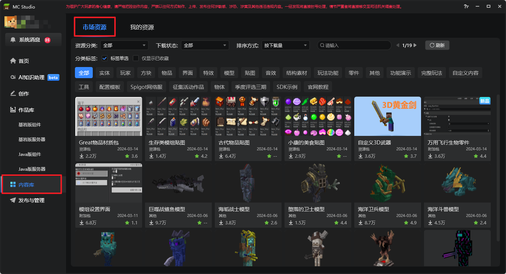

2. 通过搜索、筛选、标签功能，开发者可快速查询自己想要的资源。
> 标签默认为多选模式，即筛选出同时符合多个标签的资源，当勾选图中的**标签单选**时，则会将标签设为单选模式，点击一个标签会自动将其他标签取消选择。

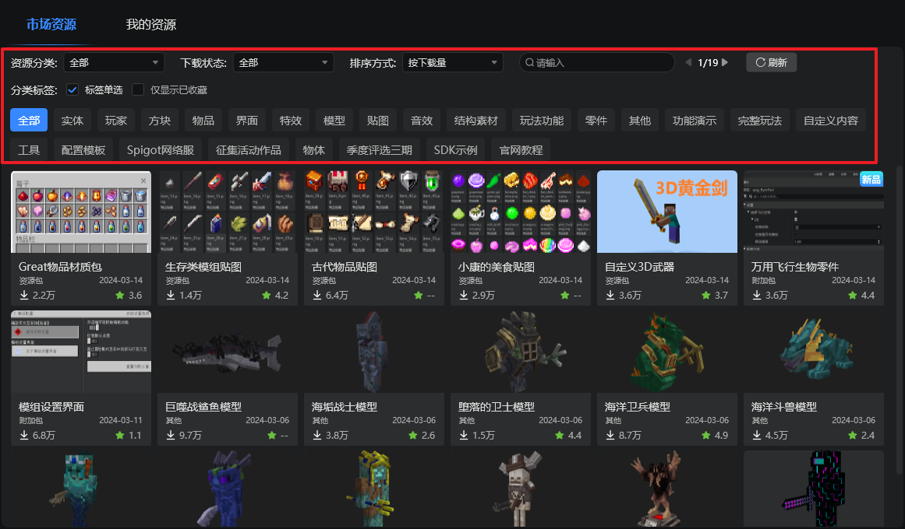

3. 点击资源卡片的详情按钮，可在资源详情弹窗查看该资源包的详细介绍，如作者、版本信息和使用说明等等。

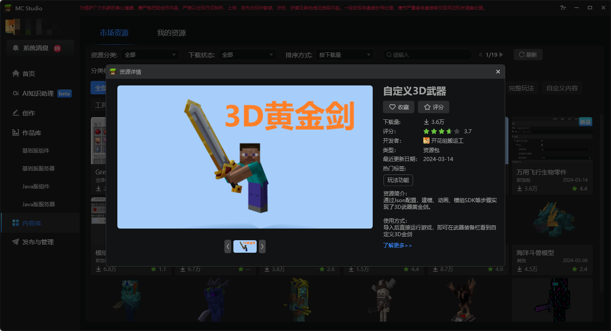

4. 资源详情页中可点击收藏按钮，再次点击则取消收藏

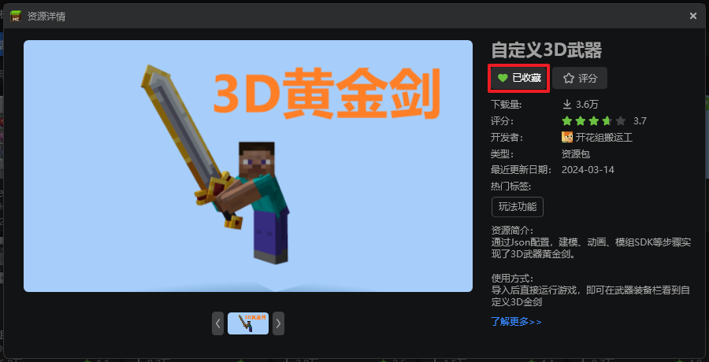

5. 在分类标签右侧可勾选【仅显示已收藏】选项，快速筛选所需的资源

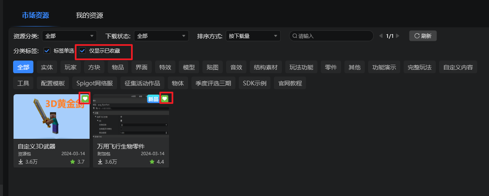

6. 在资源详情页，可点击评分按钮，为对应资源评分

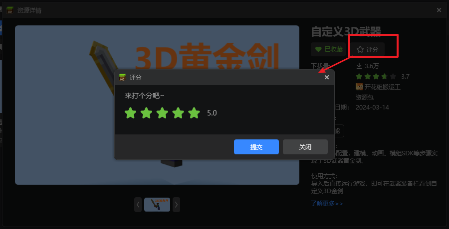

### 下载资源
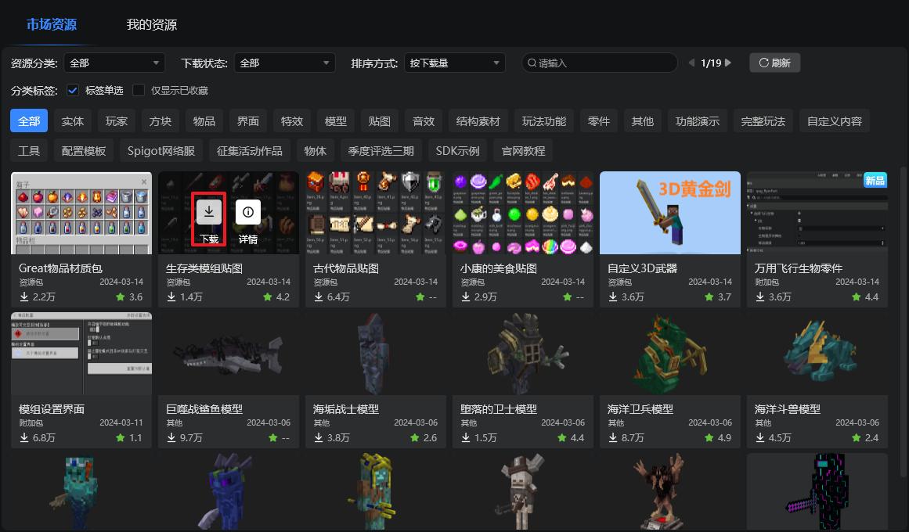

1. 当确认需要该资源时，可以点击下载，将资源包下载到本地，如过资源包较大或网速较差时，需要耐心等待进度条完成，如下图所示：

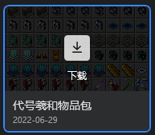

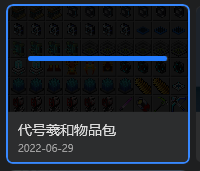

2. 下载完毕后，资源卡片的下载按钮消失，把鼠标移动到该资源，即可看到导入和更多菜单，如下图所示：

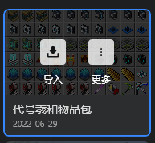

### 导入
#### 1.导入【资源包】
1. 当我们需要将资源包分页中的资源文件导入到作品中时，我们需要保证已经使用编辑器打开该作品，否则就会出现如下提示：

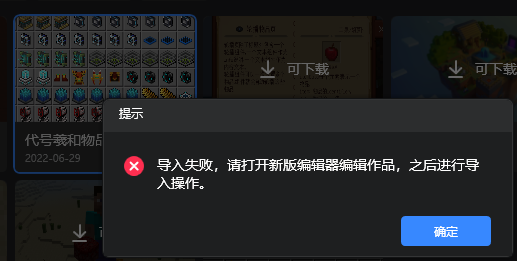

2. 如果已经使用编辑器打开了该作品，则点击导入按钮后，会自动切换到编辑器界面，并且弹出导入资源包弹窗，如下图所示：

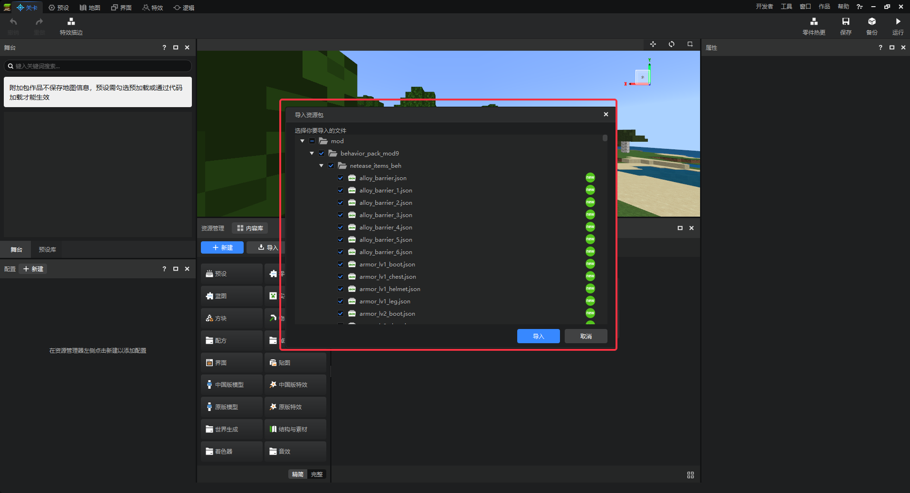

3. 我们可以参考每个资源右侧的图标提示，并根据自己的需要勾选自己想要的文件，一般情况下，只需要保持默认状态导入即可。

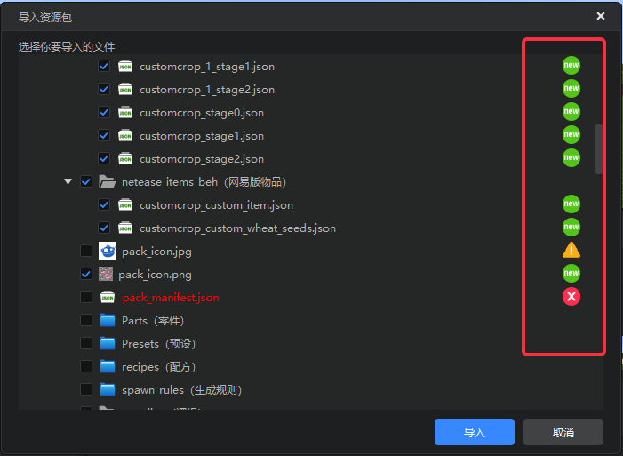

> 1. 文件右侧的图标为绿色的"new"字样时，说明该文件是全新的文件，可以直接导入该作品。
> 2. 文件右侧的图标为黄色的警告样式时，说明该文件可能是该文件在作品中已有完全相同的文件，默认不为您勾选，勾选则覆盖本地资源。
> 3. 文件右侧的图标为红色的冲突样式时，说明该文件与作品中现有的资源存在冲突且无法修复，勾选则会强制覆盖本地资源，请谨慎确认后选择是否导入。

#### 2.导入【地图】或【附加包】
1. 点击导入按钮，可直接将该模板资源导入到开发者的作品库，导入结束后会出现弹窗提示，点击**前往查看**可前往创作页查看刚创建的作品，也可以选择**开始编辑**直接打开编辑器。

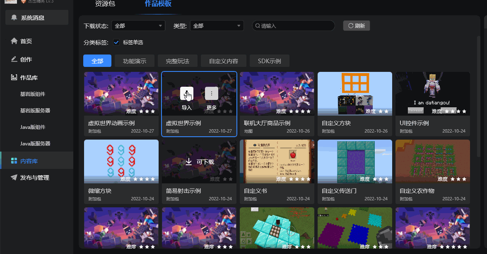

#### 3. 导入【其他】资源

1. 点击导入按钮，可直接将该资源导入至指定的目录中，可在弹窗中打开对应目录并使用该资源。

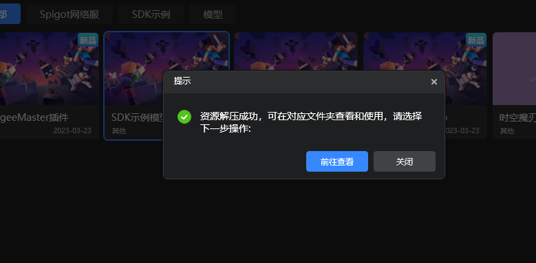

## 三、投稿资源
如您希望将自己的资源投递到内容库，分享给其他开发者，帮助他们提升开发模组的效率和能力，请参考[内容库资源投递指南](../35-上架与入驻/课程15-内容库资源投递指南.md)。

## 四、其他事项
1. 在编辑器内的资源管理器左上角也增加了内容库按钮，点击后可呼出我的世界开发工作台并切换到内容库分页，如下图所示：

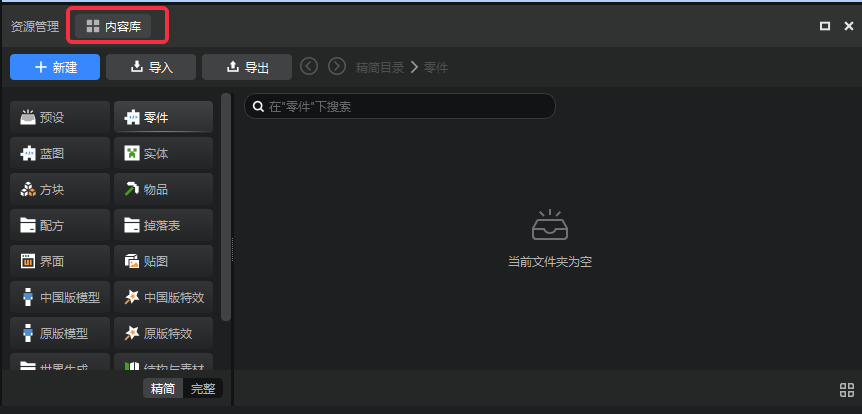

2. 在启动器的新建模板界面也增加了内容库入库，点击后可跳转至内容库，如下图所示：

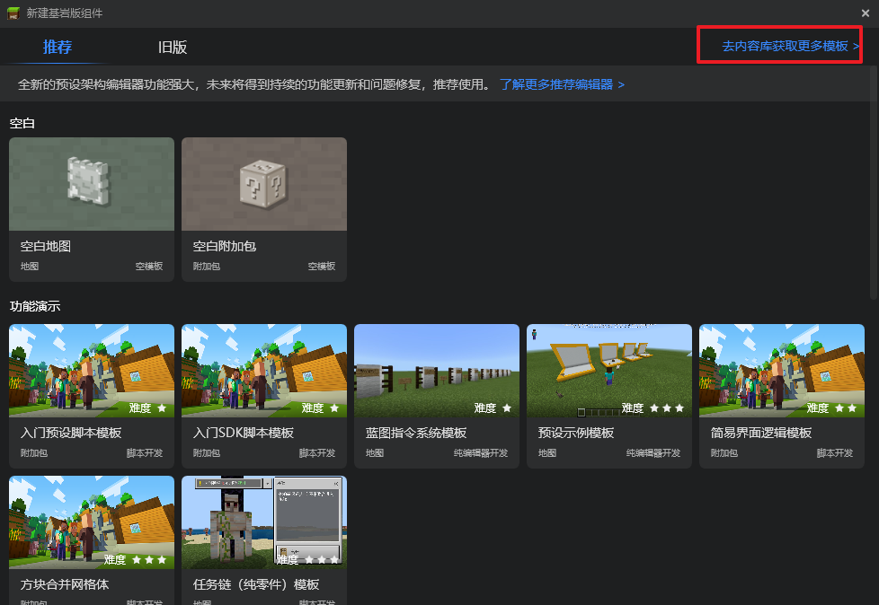

