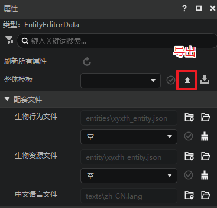
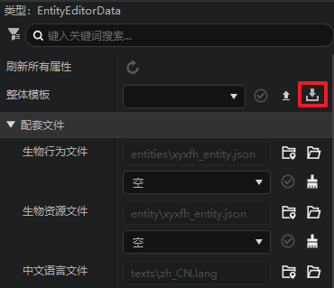
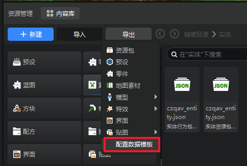
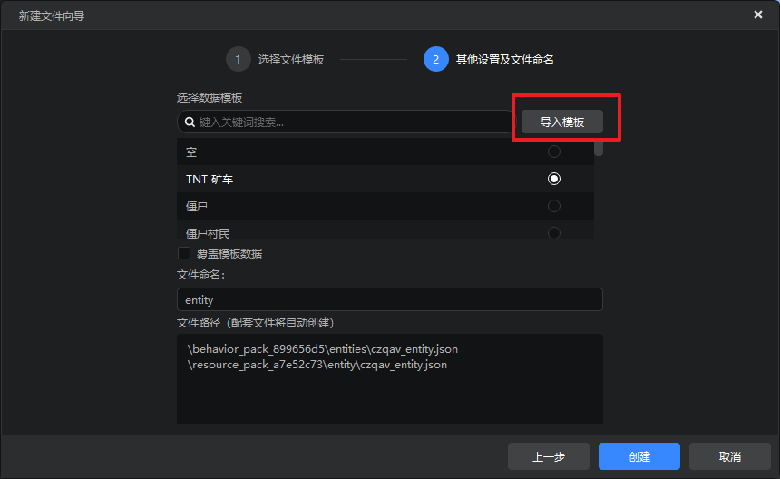
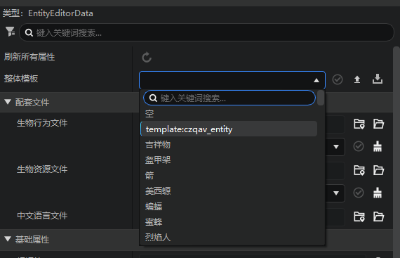
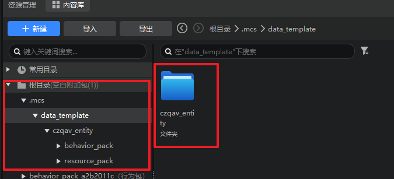

---
front:
hard: 入门
time: 5分钟
selection: true
---

# 配置数据模板

## 什么是配置数据模板
1. 配置：配置是编辑器管理模组数据驱动附加包的基本单位，按照游戏内容将可以自定义的实体、物品、方块等抽象成一个配置，方便管理和属性编辑，关于如何使用配置，你可以查看[这篇文档](../20-玩法开发/11-组装简单玩法/0-关卡编辑器.md#五、配置面板)。
2. 数据模板：数据模板记录了某个状态下的配置属性，用于同类配置之间的批量迁移和复用。
3. 示例：开发者定义好了一个具有复杂行为逻辑的实体配置，并希望在另一个作品中再次使用这个配置，在过去，开发者需要手动在作品目录找到该配置的所有配套文件，并逐一迁移至新作品的对应目录中去，而现在，数据模板可以作为一个整体一键导出和导入配置的相关配套文件，让开发者轻松完成迁移和复用的过程。
## 数据模板导出
在配置的整体模板属性中，可以点击导出按钮，将当前配置的所有配套文件的属性进行统一导出，最终导出的文件格式为**identifier.dt**。

> 目前有部分配置暂无整体模板属性，我们将在后续版本逐一补充，请耐心等待~

## 外部数据模板导入
1. 属性面板导入：
与导出类似，开发者也可在配置的【整体模板】属性中点击导入按钮，导入上一步导出的dt文件，如图所示：

2. 导入菜单

在资源管理器的导入菜单，开发者也可以找到导入配置数据模板的选项，如图所示：

1. 新建文件向导导入

在新建文件向导选择数据模板的界面，开发者也可以找到导入选项，如图所示：

成功导入后，可以在对应类型的配置属性中找到该模板并应用，如图所示：

## 注意事项

1. 目前导出数据模板仅导出**配套文件**的相关文件，而配置中引用的贴图、模型、动画文件，暂时不支持导出；

2. 导入后的数据模板可以在.mcs/data_template文件夹找到对应数据模板的配置，该文件夹的内容不会包含在导出发布的作品包体中，不影响最终的包体大小。

