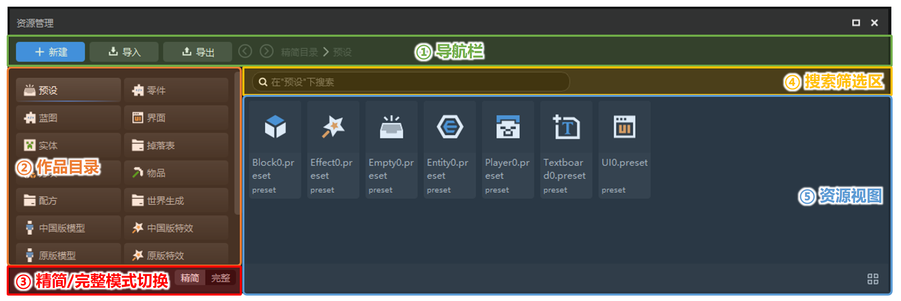
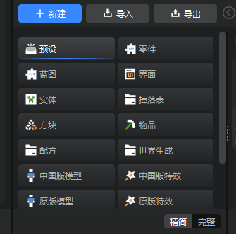
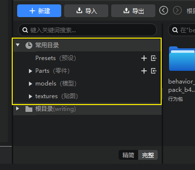
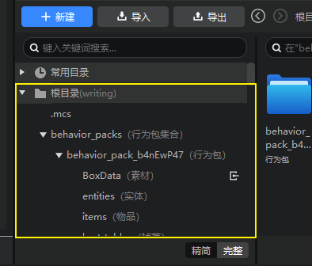
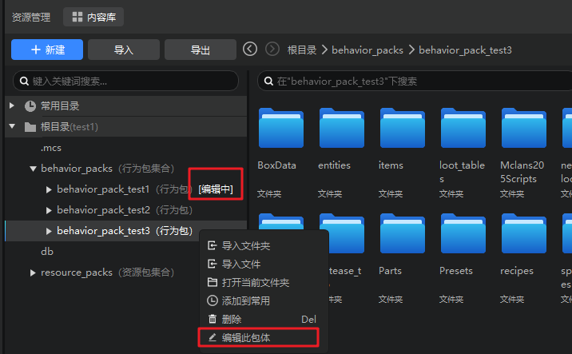
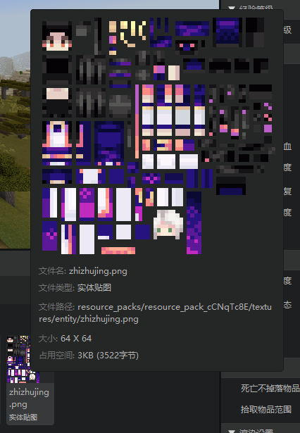
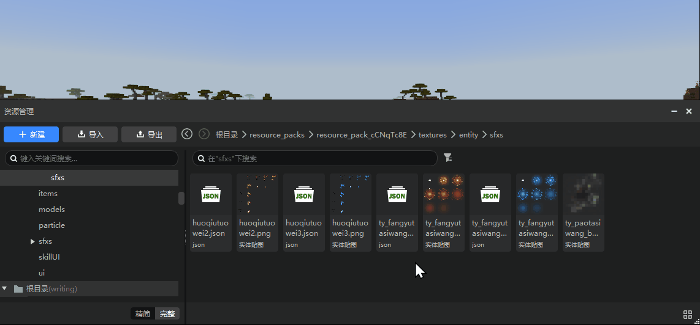

# 资源管理器（新版）
在本次更新中，我们对资源管理器进行了全新的升级，以期给各位开发者带来更便捷的文件定位、搜索与管理体验。下面就让我们来认识一下新版资源管理器吧！

## 新版界面概览

新版资源管理器界面被划分为5大功能区：
1. 导航栏
2. 作品目录
3. 精简/完整模式切换
4. 搜索筛选区
5. 资源视图

我们将在下文中对这5大功能区进行逐一介绍。

## 导航栏

在导航栏处集中了【**新建**】、【**导入**】、【**导出**】3个较为重要的操作按钮。

+ 新建按钮点击后会自动打开新建文件向导，用于新建各类编辑器支持的文件。
+ 导入按钮整合了编辑器所有可导入的文件类型，开发者再也不用到各个编辑器找不同的按钮导入不同类型的文件了！
+ 导出按钮一般用于将作品目录下的部分文件以资源包的形式导出，以便进行单独保存或复用到其他作品中。

同时，新版资源管理器在导航栏还提供了【**前进**】、【**后退**】按钮和**面包屑导航**。

## 作品目录
这里展示的是当前作品的文件目录，点击需要的目录即可在右侧展示该路径下的所有文件。

作品目录有两种展示形式：

#### 精简模式
新版编辑器默认显示模式是【精简模式】。精简模式旨在为不完全熟悉我的世界附加包文件结构的开发者提供一个比较简单明了的资源分类方式。在这个模式下，开发者定位自己需要的文件时，不再需要一层一层地展开完整的文件结构树，而是可以直接点击一个带图标的分类按钮，并直接在右侧找到该分类的所有文件。精简模式更适合日常的轻量级使用，以及新手开发者上手编辑器。

 

#### 完整模式
完整模式即传统的完整树状结构显示模式。在完整模式下，作品目录界面被划分成了两块：
1. **常用目录：** 在这里会展示一些默认的使用频率较高的目录。开发者可以自定义常用目录：① 想要将某个文件夹添加到常用目录，只需要在作品目录窗口对其点击右键，并选择【**添加到常用目录**】即可；② 想要将某个常用目录删除，只需要对其右键，并点击【**从常用中删除**】即可。

    

2. **完整目录：** 完整目录从根目录开始，可层层展开显示每一个子文件夹，点击子文件夹可以在右侧显示该文件夹内的所有文件。

   
3. **切换编辑包体**：编辑器只能同时修改一个行为包和一个资源包，对于有多个行为包和资源包的作品，可以通过右键菜单切换编辑的包体，如下图：
> 注意：切换编辑包体会影响文件创建、导入、保存的初始路径，请在了解组件的包体构成和内容之间的关联关系后再使用此功能。

## 精简/完整模式切换

新版编辑器默认显示模式是【**精简模式**】。精简模式旨在为不完全熟悉我的世界附加包文件结构的开发者提供一个比较简单明了的资源分类方式。在这个模式下，开发者定位自己需要的文件时，不再需要一层一层地展开完整的文件结构树，而是可以直接点击一个带图标的分类按钮，并直接在右侧找到该分类的所有文件。**精简模式更适合日常的轻量级使用，以及新手开发者上手编辑器。经验丰富的成熟开发者，可以在此点击【完整】，切换到传统的树状文件结构，进行更加精确的文件定位和管理。**

## 搜索筛选区

在这里我们提供了搜索框，开发者可以输入关键词以定位到该目录下所有文件名包含该关键词的文件。**新版资源管理器的搜索功能支持对所选目录的各级子文件夹进行穿透搜索**，而不是像以前一样只能搜索当前文件夹了。

另外我们还提供了【筛选器】供开发者在当前展示的文件中进行进一步的筛选，已达到更精确定位的效果。
  > 需要注意的是，在精简模式下筛选器被隐藏，但搜索框依然是可以使用的。

## 资源视图

在新版资源管理器中，我们使用了卡片样式，以展示更多的文件信息（包括更长的文件名展示，以及文件类型展示）。当鼠标悬浮到文件卡片上方时，会通过悬浮窗展示该文件的详细信息；图片类文件还会额外显示缩略图。

选中一个文件或文件夹后，会在底部显示其文件路径，点击复制后可以复制其完整路径（本地计算机磁盘路径）。

点击右下角的视图按钮，可在卡片平铺和列表两种视图间切换。

