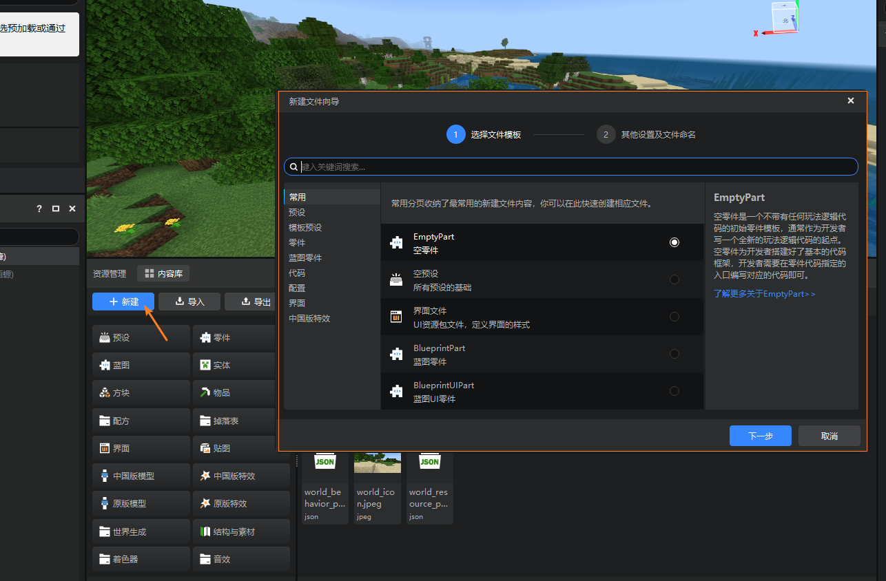
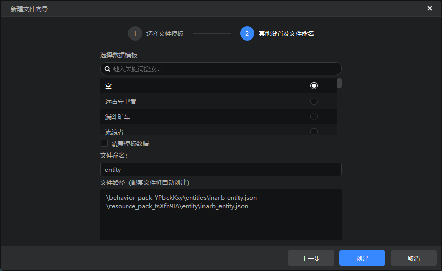
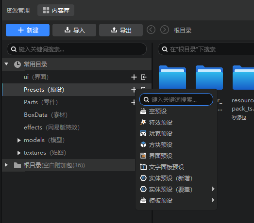

# 新建文件

## 从新建文件向导创建内容
点击资源管理器中的新建按钮，弹出新建文件向导。
你可以在新建文件向导中创建配置、预设、零件、特效、界面等文件。

使用新建文件向导创建文件除了可以新建文件之外，还提供：

- 文件类型说明
- 实体预设，部分配置等选择数据模板（如下图所示）
- 文件命名
- 预设和零件的配套文件创建
- ModMain脚本文件和配套文件的创建
- 脚本代码文件中自动生成必要代码

我们非常推荐您使用新建文件向导的方式进行文件的新建，可有效避免各类不必要的目录配置工作。

## 从作品文件夹创建内容

除了新建文件向导之外，我们还在完整模式下提供了通过文件夹新建的方法。

在完整模式下点击对应的文件夹的“+”，可以通过弹出的菜单进行快捷新建，可以通过这种方式新建的文件类型包括：

- 预设（Presets文件夹）
- 零件（Parts文件夹）
- 网易版特效（effects文件夹）
- 界面（ui文件夹）
- 素材（BoxData文件夹）

