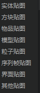

# 文件导入

## 导入菜单

点击资源管理器左侧的导入按钮（如下图），在这里你可以导入：

1. 资源包
导入专属于编辑器的资源格式，具体详情可参考[资源包](./10-资源包.md)。
1. 预设
将.preset后缀的预设文件导入到当前作品的Presets文件夹下。
1. 零件
将存放有.part后缀的零件及其相关python代码的文件夹一起导入到当前作品的Parts目录下。
1. 地图素材
将外部的.mdl素材文件导入到当前作品的BoxData文件夹下。
1. 模型
导入骨骼模型和原版模型，详细导入教程可参考[模型的导入与使用](../16-美术/9-特效/10-模型导入.md)。
6. 特效
导入中国版特效（包含序列帧和粒子特效）和原版粒子特效，详情可参考[导入特效](../16-美术/9-特效/30-中国版特效创建与使用.md#创建导入中国版特效)。
7. 材质
导入材质和对应所需要的着色器（shader）。
8. 界面
导入界面文件，用于在界面编辑器进行编辑，详情可参考[界面资源管理](../18-界面与交互/1-界面编辑器使用说明.md#界面资源管理)。
9. 贴图
导入贴图文件，用于实体、方块、物品等需要贴图的属性，具体支持的贴图类别如下图。

> 虽然开发者可以直接拖拽文件到作品目录，但上述内容文件结构较复杂，推荐使用编辑的导入功能进行导入。
