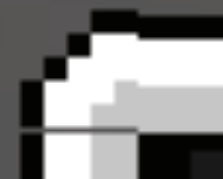
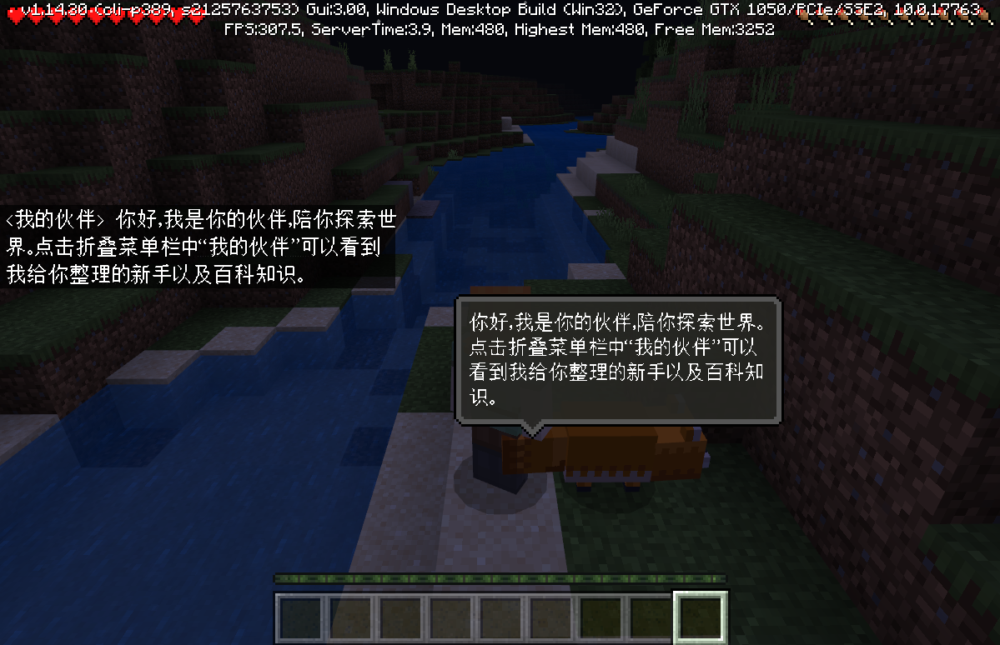
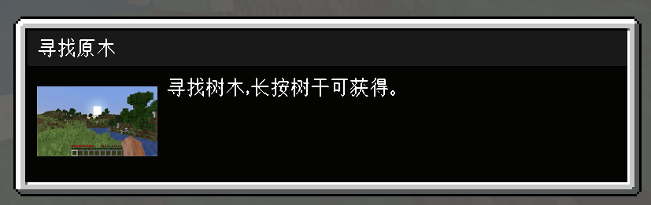
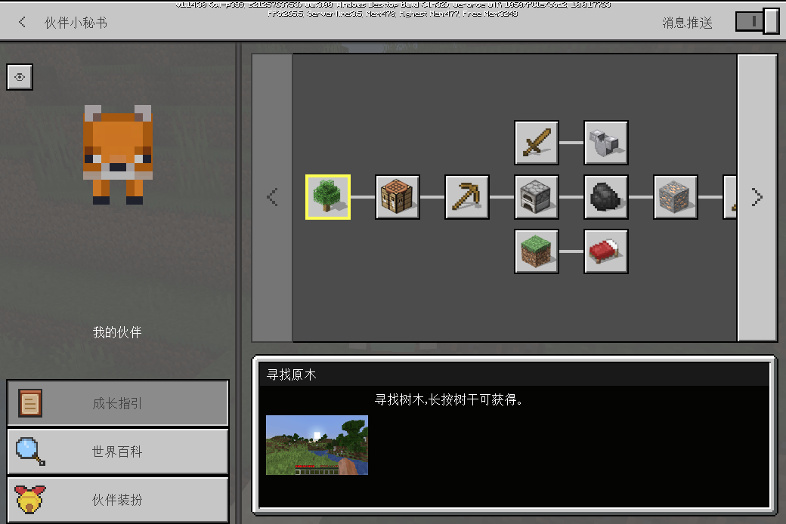

---
front:
hard: 入门
time: 分钟
---

# MC九宫格使用与贴图规范

## 九宫格使用

#### 写在前面——我们的九宫格与微软的九宫格

在微软支持九宫格拉伸之前我们自己实现了一套九宫格拉伸的工具，但是该工具无法适配微软原生的自动UI scale缩放。微软会根据当前屏幕尺寸对UI整体进行缩放，我们的九宫格是在ui缩放后再对图片进行九宫格处理，而微软原生的是先对图片进行九宫格处理后再进行UI缩放。这就会导致贴图资源四边如果只有1像素细节的话，用我们的九宫格拉伸后四边会特别细，而微软的就比较正常，如下图所示，左侧为我们的九宫格，右侧为微软原版九宫格：

同时，由于计算精度问题，我们自己实现的九宫格会出现计算精度有问题导致四角显示异常，如下图所示：

因此我建议使用微软原版九宫格来对图片进行拉伸，后文贴图规范均建立在使用微软原版九宫格基础上。

#### 九宫格拉伸原理

如上图所示，九宫格是将一张图分为9个部分，其中四边的间距对应微软原版九宫格的参数依次是[left, top, right, bottom]，具体json中的配置如下图所示：

在拉伸过程中，1、3、7、9四个部分是不会被拉伸的，2、8部分被横向拉伸，4、6部分被纵向拉伸，中间5部分则是横纵向均被拉伸。因此美术同学在出图的时候应该避免将一些不能被拉伸的元素放在2468区域，比如对话框的尖角，如下图所示：

美术在设计的时候尽量将这个尖角放偏移一下，避免放在正中间，这样程序可以通过代码设置将其置于1379这四个不被拉伸的区域，效果如下：

#### 一些可以使用九宫格的示例

原图：

拉伸后效果：

原图：

拉伸后效果：

注意：此处的“寻找原木”的背景是深灰，实际上是直接通过直接设置一张空白图片的颜色得到的，也就是说这种可以通过拼接实现的是可以不用出纯色资源的。

原图：

拉伸后效果：

## 贴图规范及建议
- 大部分贴图首次显示是需要进行异步加载的，程序可以通过指定预先加载贴图避免一些贴图闪烁问题，详见<a href="../20-玩法开发/18-性能优化/内存优化.html#贴图预加载" rel="noopenner"> 贴图预加载 </a>。

- 纯色资源可以不出，程序可以通过在对应的位置参考下图配置json实现纯色资源，其中color色号和alpha透明度直接设置即可，如有需要还可以设置对应的size和offset：

- 贴图的长宽建议选择2的幂次方，比如2、4、8、16、32、64、128、256、512。例：如果一张图完成之后大小为30x130，建议重新切成32x128，不然在实际中该贴图将会占用32x256的内存空间，造成额外的浪费。
- **建议模型特效贴图最大不要超过128x128，超过该尺寸的贴图数量应作严格限制，一张256x256的图占用内存等于4张128x128，而一张1024x1024的图就等于64张128x128了**。
- 可以通过九宫格拉伸的如果四边规整，切图建议16x16即可；如果四边细节不规则，如上述例子的第一个，那么保证四边比例的基础上中间拉伸区域5可以只留1像素。——理论上四边规整也可以只留中间1像素进行拉伸，不过因8x8和16x16差距不大不做更严格要求。
- 除此之外，下图中的图片可作参考：张望、绕圈、高兴等动作图标出128x128、成长指引树中的图标出64x64、返回按钮下方的眼睛按钮出32x32，在手机上均能表现出非常好的效果，无需更大的图标。原版物品贴图大小均为16x16，看起来就是像素风的，美术同学可以参考这几个尺寸出图标。

