---
front:
hard: 入门
time: 分钟
---

# 原版模型制作指南

## 1. Blockbench

Blockbench 是由 JannisX11 开发的一款专门用于 Minecraft 3D 建模的免费软件。

使用软件：Blockbench 3.4.2

官方网站：https://blockbench.net/

因为官网源地址下载太慢，依据软件的MIT协议，这里提供一个国内的下载备份[地址](https://mcrealms.gdl.netease.com/Blockbench_3.4.2.exe)。


Blockbench有以下优点：

*  软件操作简单，上手几乎没有门槛；
*  免费开源软件，任何人都可以自由的使用它 ；
*  支持插件功能，可以方便的添加功能强大的插件；
*  制作的模型可以导出为 OBJ 文件，你可以使用任意现代化的 3D 建模软件渲染它，制作出好看的图片；
*  支持 Minecraft Java 版的方块物品建模，Minecraft Java 版实体建模，Minecraft 基岩版本的实体建模，OptiFine 模组的实体建模等诸多功能。是你制作 Minecraft 模型不可或缺的工具。

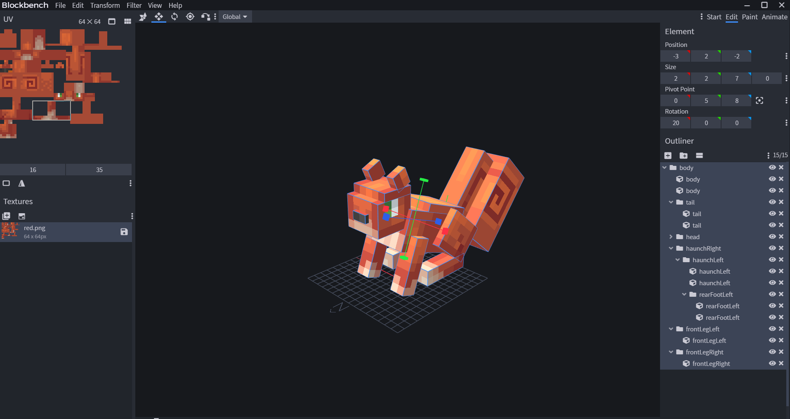


本文档我们将介绍如何使用Blockbench制作生物模型与动作。

**注意**：Blockbench 3.x版本默认启用1.12.0版本基岩版模型。

下面，我们以制作“松鼠”模型和动作为例，详细说明如何制作模型和动作，最终输入资源路径为：示例\6-4 资源制作\工具和示例\bbmodel


## 2.模型制作流程

### 2.1 创建工程

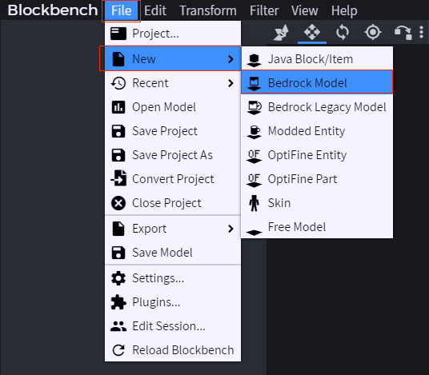

### 2.2 参数设置

这里创建一个松鼠的模型，文件名为squirrel，模型Identifier为netease:squirrel，贴图大小为64，设置完直接点击“Confirm”进入下一步。

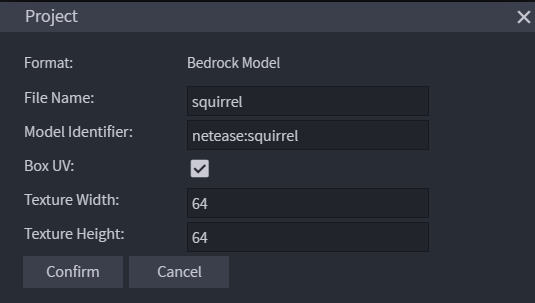

### 2.3 导入贴图

在软件界面的左下角中找到贴图界面，导入模型将要使用的贴图，该贴图的大小应该和上一步中设置的参数一致，如下所示：

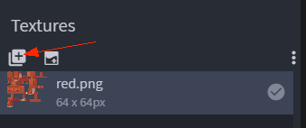

### 2.4 创建模型几何

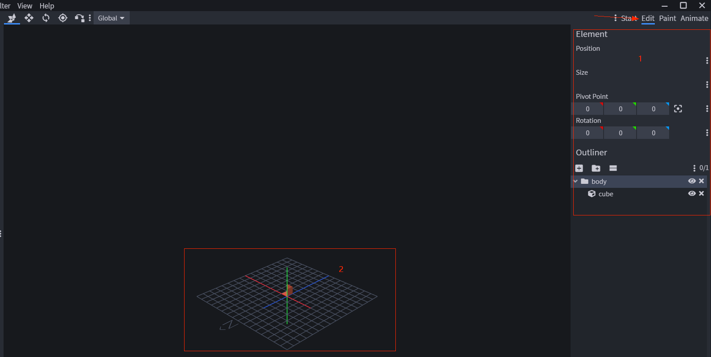

如上图所示，在"**Edit**"标签下，我们可以编辑几何模型，区域1可以编辑模型，区域2实时显示模型。

* 创建分组与立方体

在大纲栏（Outliner）中，可以通过创建分组来管理立方体。

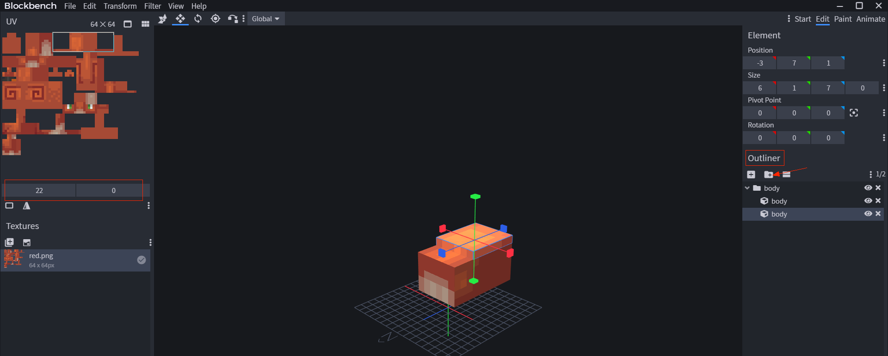

如上图所示，创建一个分组body，里面包含两个立方体（命名为body）

* 编辑立方体

在创建分组与立方体完成之后，选中指定的立方体（如上图中第二个body），便可以编辑其位置（Position）、大小（Size）、 轴心点 （Pivot Point）、旋转角度（Rotation）等信息。

* 编辑立方体贴图UV

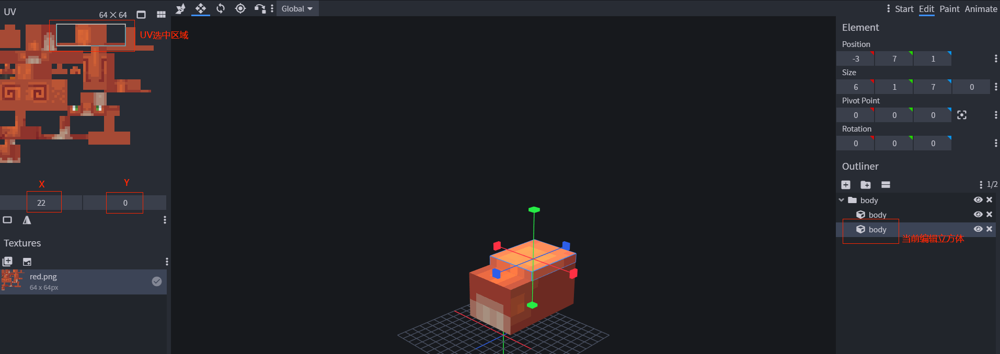

如图所示，在左上角可以通过调整**X**和**Y**的值来调整“**当前编辑立方体**”使用的贴图。

### 2.5 导出模型

在完成模型编辑之后，我们可以通过导出模型json，便可以在游戏中使用。

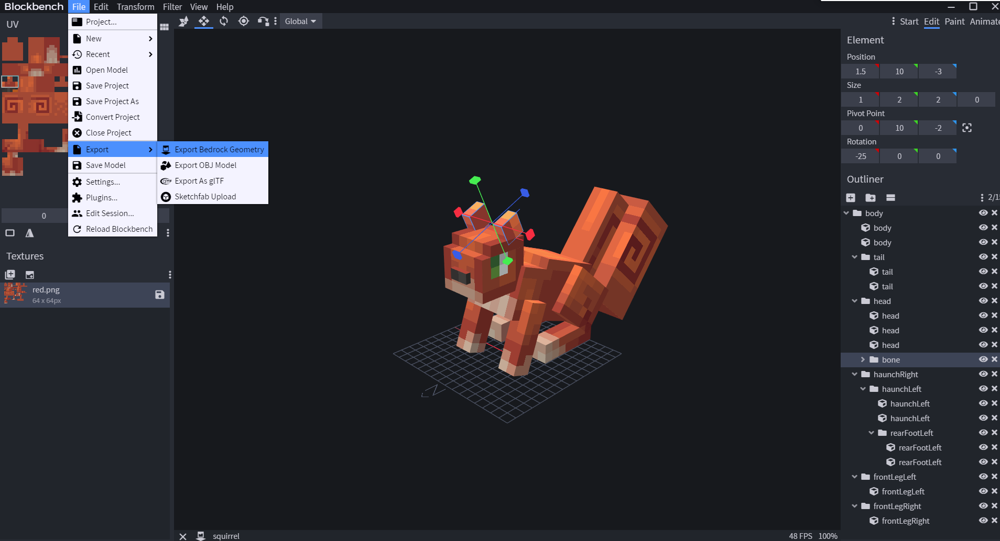

在本示例中，导出名称为squirrel.geo.json，内容如下所示：

```json
{
	"format_version": "1.12.0",
	"minecraft:geometry": [
		{
			"description": {
				"identifier": "geometry.netease:squirrel", # 对应参数设置中的模型Identifier
				"texture_width": 64, # 对应参数设置中的贴图大小
				"texture_height": 64,
				"visible_bounds_width": 4,
				"visible_bounds_height": 1,
				"visible_bounds_offset": [0, 0.5, 0]
			},
			"bones": [
				{
					"name": "body",
					"pivot": [0, 5, 8],
					"rotation": [-20, 0, 0],
					"mirror": true,
					"cubes": [
						{"origin": [-3, 2, -2], "size": [6, 5, 10], "uv": [0, 0], "mirror": false},
						{"origin": [-3, 7, 1], "size": [6, 1, 7], "uv": [22, 0], "mirror": false}
					]
				},
				...
			]
		}
	]
}
```


## 3.动作制作流程

首先，有一点我们需要清楚：动作是在模型的基础上，对模型的节点的位置、旋转角度进行调整。

### 3.1 界面说明

我们先来初步了解一下动作制作界面。

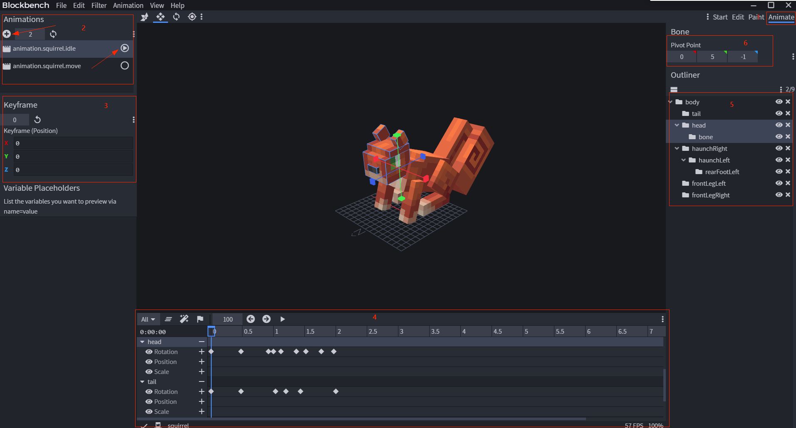

* 区域1：编辑动作需要切换到"**Animate**"标签
* 区域2：动作增加、动作删除、动作长度设置、动作预览、动作属性设置（如：是否循环播放等）
* 区域3：动作关键帧编辑
* 区域4：动作编辑管理
* 区域5：模型分组大纲栏
* 区域6：模型分组对应的骨骼瞄点


### 3.2 新建动作

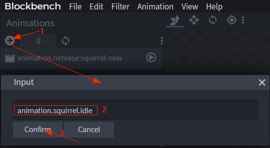

步骤如下：

* 点击创建动作按钮，弹出输入框；
* 输入动作名称，如animation.squirrel.idle；
* 点击确定


### 3.3 编辑动作

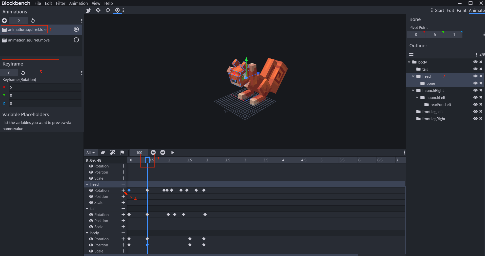

* 选中需要编辑的动作

如图，选中动作animation.squirrel.idle

* 选中模型立方体

如图，选中节点head

* 选中动作时间节点

如图，选中时间线上的0.5ms

* 插入关键帧信息

如图，点击head下的Rotation右边的“+”按钮增加关键帧

* 编辑关键帧信息

如图，编辑关键帧信息Rotation（5，0，0）

### 3.4 导出动作

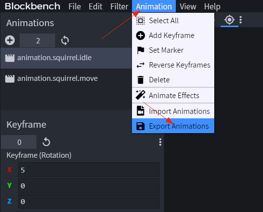

输入命名squirrel.animation.json后保存便得到我们需要的动作。

```json
{
	"format_version": "1.8.0",
	"animations": {
		"animation.squirrel.idle": {
			"loop": true,
			"animation_length": 2,
			"bones": {
				"rearFootLeft": {
					"rotation": {
						"0.0": [0, 0, 0],
						"0.4833": [15, 0, 0],
						"1.6": [10, 0, 0],
						"1.8833": [-10, 0, 0],
						"2.0": [0, 0, 0]
					}
				},
				...
			}
		},
		"animation.squirrel.move": {
			"loop": true,
			"animation_length": 0.48,
			"bones": {
				"rearFootLeft": {
					"rotation": {
						"0.0": [5, 0, 0],
						"0.1667": [125, 0, 0],
						"0.4333": [5, 0, 0]
					}
				},
				...
			}
		}
	}
}
```


至此，我们可以将导出的模型和动作用于制作自定义生物了。