# 骨骼模型制作指南（3DMAX)

## 1. 模型制作技术规范

本文档说明了如何使用软件MAX 2014制作符合《我的世界》规范的模型。

### 1.1 模型单位

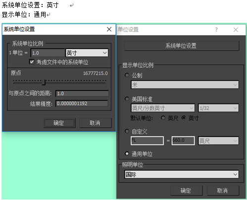

### 1.2 朝向

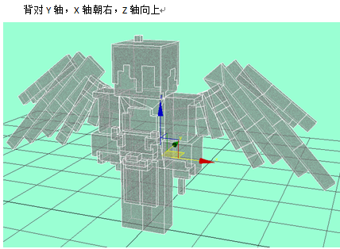

### 1.3 贴图

- 只支持一张贴图，贴图名称必须为英文

- **模型制作当中，避免使用镜像或者对称！**

### 1.4 顶点

- **每个长方体通常是8个顶点，整个模型应控制在300个顶点，特殊模型可在1000以内**

- **每个顶点只绑定一根骨骼**

- **注意事项：法线检查**

模型制作完成提交前必须完成以下4个步骤：

1. 属性中将模型设置为背面消隐，查看模型是否有反面，如果有的话 **（flip）。（检查过程当中多尝试）**

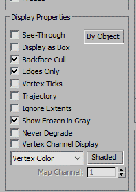

2. Reset Xform **（多点击几次，然后塌陷）**

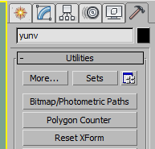

3. Mesh Select **（与4一起，点击完后，不用操作，直接塌陷）**

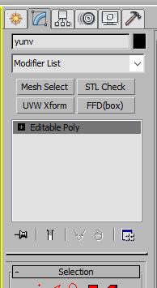

4. STL Check

   并最终转化为Poly模型提交，此步骤可避免模型在引擎中显示出错。

   如果模型出现法线问题，将法线出错的位置选择并反相 **（flip）** 即可。

   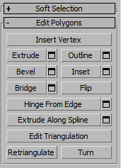

### 1.5 动作输出注意事项

#### 1.5.1 关于蒙皮

- 骨骼架设使用纯bone

- 骨骼控制在20根以内，最多不能超过50（这种是为了做特殊boss用）

- 需要添加root，up，down 三根骨骼
  - root，是质心的父级，位移旋转都要归于坐标原点（0.0）
  - up，控制上半身，质心的子级，身体的父级
  - down，控制下半身，质心的子级，双脚的父级

- 所有的骨骼都要有链接，（武器挂件坐骑等都要链接给相应的手，质心等位子，可使用link）

- 蒙皮选项当中的高级参数中，有个**骨骼影响限制,需要调为1**

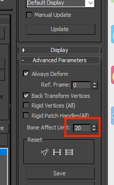

#### 1.5.2 动作输出

- 文件版本为MAX 2014

- 输出文件命名使用拼音如（技能_狂气）输出（spell_kuangqi）

- 文件需要输出FBX，输出文件夹命名英文

- 输出文件需要塌陷骨骼动画

- root、up、down骨骼不可以有动画

- 缩放动画必须用等比缩放，且不能有单轴向缩放

- 蒙皮与待机pose确认后再进行其余动作制作

**注意事项：模型当中不能有任何的中文**

#### 1.5.3 FBX输出设置

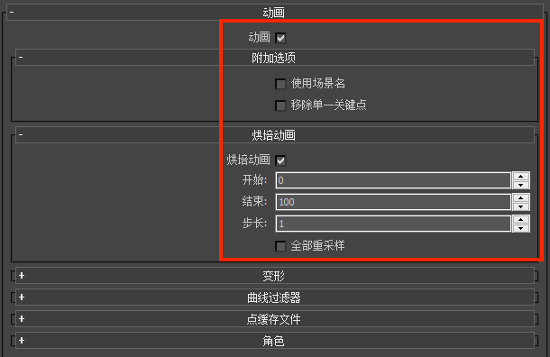

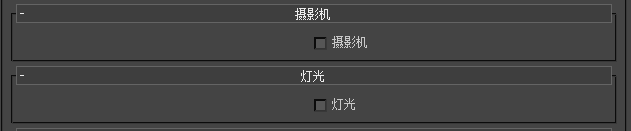

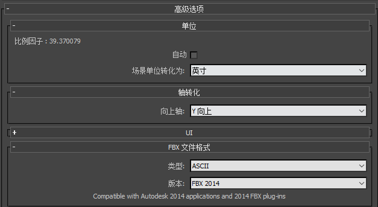

输出为FBX格式的文件后，参考[教学中心-编辑器基础-关卡编辑器使用说明-资源管理-资源导入](../../15-资源管理/5-文件导入.md)转化为我的世界中可用的模型格式。

## 2. 制作导出流程

以大天狗制作流程为例

### 2.1 原画概念设计

1. 打开人形式神基础模型（基础模型的每个格子单位为1，就是像素单位，不要改变这个大小）

   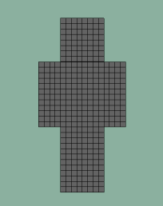

2. 利用材质球上色截图或者PS上色均可，正面的效果可以比较快地确定颜色分布。

   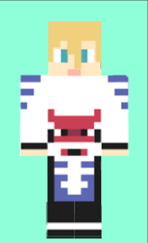

3. 增加外轮廓的辨识度，突出的部分尽量归纳，减少细节，这一步使用PS绘制概念图。

   

4. 进一步增加轮廓的辨识度，注意角色身上最具有特点的部位，一个角色身上只有一到两个特征需要这样强调，比如大天狗的翅膀。这一步同样使用PS绘制示意图，背面也需要有设计。

   因为风格限制，不强制侧面的效果，但是需要考虑到4分之一侧面的效果。

   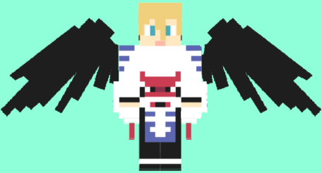

   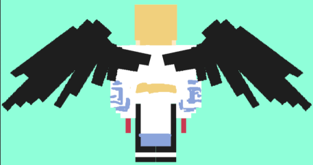

   参考：《阴阳师》大天狗设计图，在转换为我的世界模型风格时，需要减少没有代表性的琐碎细节。

   * 鞋子的造型需要直接归纳到腿部

   * 翅膀的3层羽毛层次减少到2层，边缘细节概括处理

   **注意：设计归纳的时候注意估算一下顶点数量，小怪在300以下，复杂模型在700以下，BOSS在1000以下，尽量低于最高值，以免制作完成后超过难以修改。**

   

   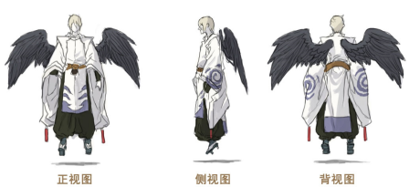

### 2.2 建模附材质

#### 2.2.1 制作模型

根据绘制草图制作模型，建模部分可以在原本的格子上直接挤出来造型。**注意挤出的高度单位也是1**。

建模方法如下：

1. 根据游戏中的规范，用头部放大，然后删去不要的部分来建模（比如大天狗）。

   **注意方法1与方法2不能使用在同一个部件上**。

2. 如果头发造型过于复杂或者有动作上的可能性，则需要另外建模（比如酒吞童子）。

   **注意检查挤出后不要有一些废面藏在模型里。**

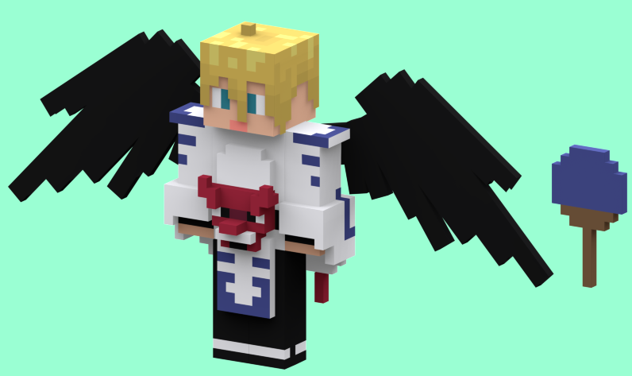

#### 2.2.2 开始上色

因为我们使用的是一像素单位的像素格，使用为单个面赋予材质球的方式来上色。

**给同一个色相类型的材质球命名好，编好号，方便管理。（比如黄色以Y开头，Y-1 、Y-2类似）**

区分好固有色后，开始细分色阶，同样一个固有色细分2~4个色阶，不要太多，细分太过细腻会削弱像素元素本身的美感。

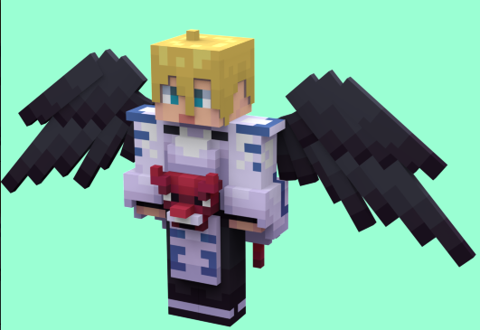

### 2.3 材质球（贴图）处理

本步骤是为了方便整理材质，也可以不做

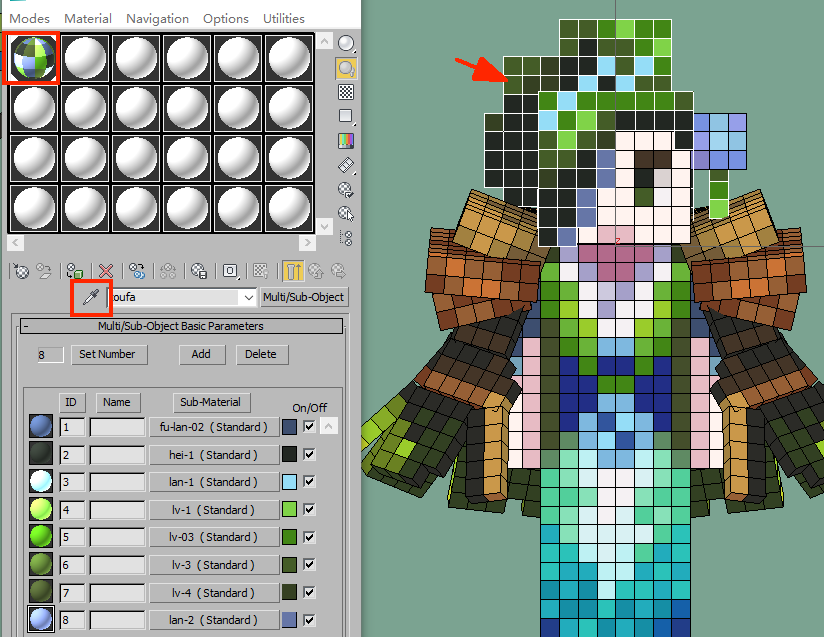

在上一步模型以及材质赋予步骤完成之后，参考上图步骤清空材质球选框，依次从左至右吸取头发、头部、身体等材质。（将会得到如上的多维子材质球）

制作中需要注意单个颜色的ID的排序参考上图由浅至深依次排列，方便制作以及修改。

1. 按照下图中三个步骤，新建一个材质库

   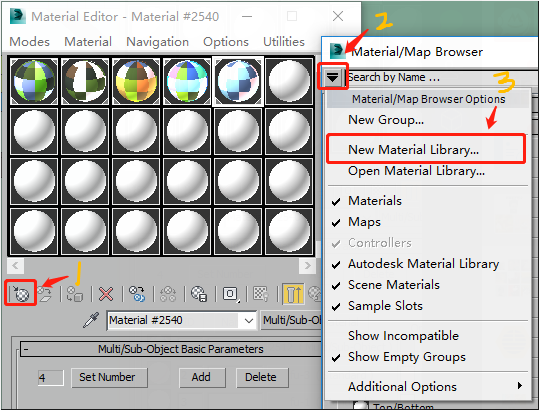

2. 保存材质库的命名（以角色名称为命名），之后材质目录中会出现该材质库（下图示例：yunv)

   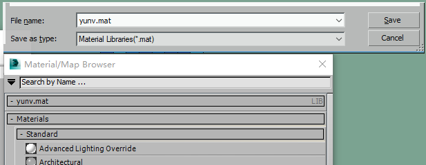

3. 选择单一材质球，依下图标识将该材质球加入材质库（所有材质球依次制作一遍）

   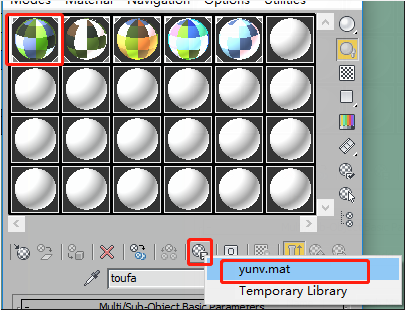

   注意材质球需要以部件名称为命名

   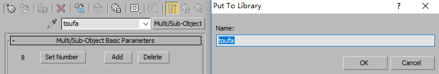

4. 再次打开材质库，可见所有材质球已经被导入材质库，在材质库中右键，保存入第一步中创建的mat文件中即可。**这么做的原因是为了方便整理材质球，便于调整颜色。**

   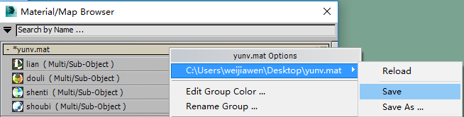

### 2.4 后处理

#### 2.4.1 分UV

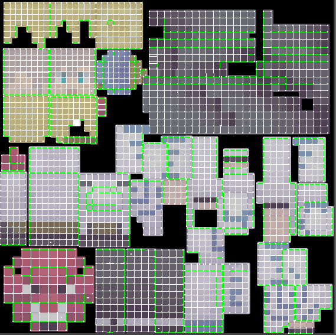

- 所有的UV线都必须横平竖直，不能有倾斜，否则会出现锯齿。

- UV边界需要像素填充，通过烘焙可以扩边4个像素

- UV摆放原则，身体结构按部位从上到下摆放，不能颠倒朝向

- UV格子大小需要基本一致，不能有太大的差别

#### 2.4.2 烘焙

**注意烘焙之前上传一版NXN做备份**

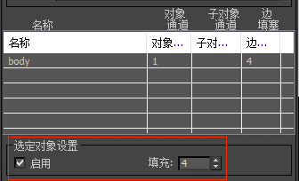

启用填充，烘焙贴图有扩边效果

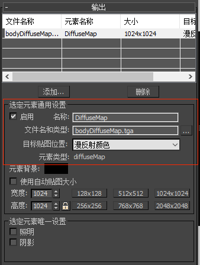

贴图大小可以烘焙得大一点提高精度，然后在PS里面缩小到**512X512**，注意缩小的时候使用邻近（硬边缘），因为都是像素格，这样缩小不会损失任何精度。

#### 2.4.3 减面

只留下必须的点面，多余的点面全部减掉，注意贴上烘焙好的贴图进行减面，**减的时候注意不要出现贴图拉伸变形的情况。**

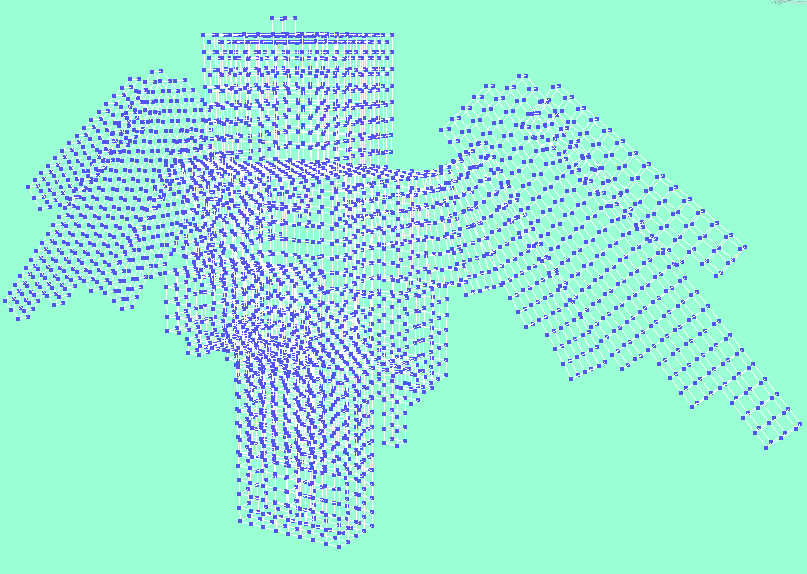

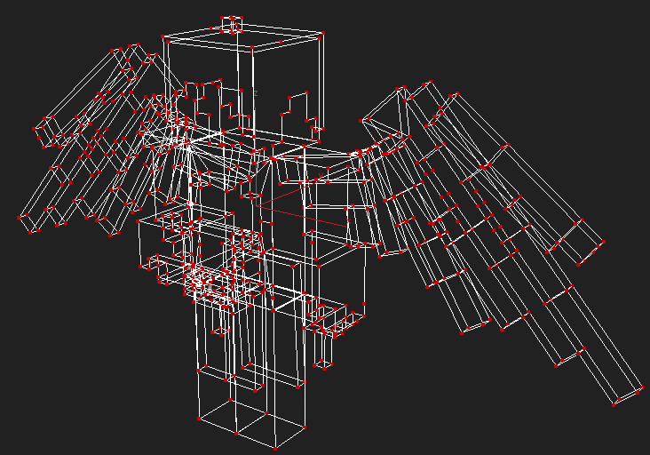

### 2.5 完成

制作完的MAX文件，贴上烘焙好的贴图的效果截图

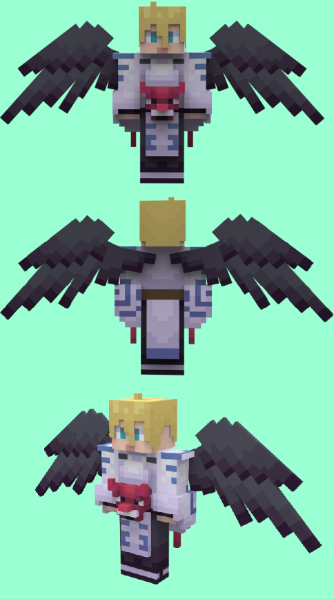