---
front:
hard: 入门
time: 分钟
---

# 骨骼模型制作指南（Blender）

## 1.模型制作技术规范

使用软件：blender 2.82

### 1.1 模型单位设置

模型单位设置为：英寸

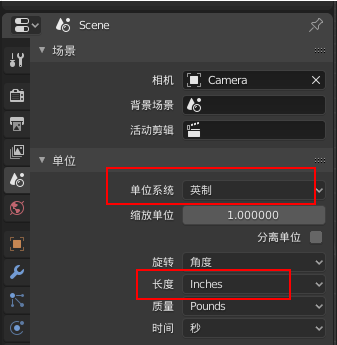

### 1.2 朝向

背对y轴，x轴朝右，z轴朝上

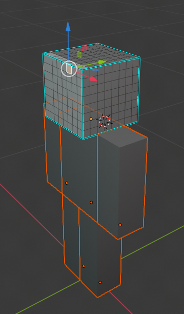

### 1.3 贴图

只支持一张贴图，贴图名称必须为英文

**模型制作当中，避免使用镜像或者对称！**

### 1.4 顶点

每个长方体通常是8个，整个模型控制在300个顶点，特殊模型可以在1000以内

每个顶点只绑定一根骨骼

注意事项：法线检查

模型制作完成提交前必须完成2个步骤：

- 检查法线朝向

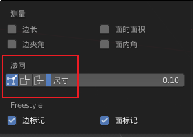

- 游标归于模型中心，模型位于场景中心

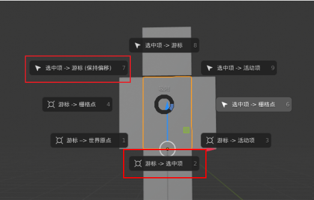

### 1.5 关于蒙皮

对于蒙皮，主要注意以下几点：

 1）骨骼需要有总控root骨骼，且每部分只能用一根骨骼，骨骼示意以及层级关系如下图：

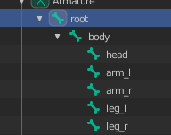

2）骨骼命名也需要按照肢体去规范名字

- 总控=root
- 身体=body
- 头=head
- 左胳膊=arm_l
- 右胳膊= arm_r
- 左腿=leg_l
- 右腿=leg_r

3）骨骼数要控制在20根以内，最多不能超50（某种特殊boss可能会用到50根以内的骨骼，常规要控制在20根以内）

4）蒙皮需要注意的，每个模块只能受一根骨骼影响，如下图所示，头部只能受“head”骨骼影响。

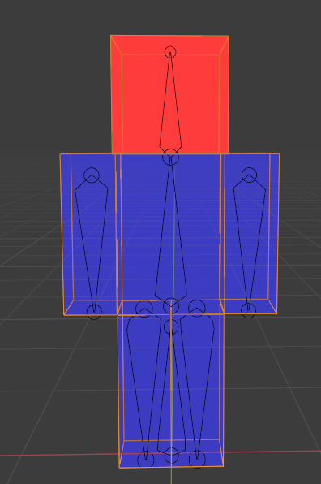

5）FBX输出设置

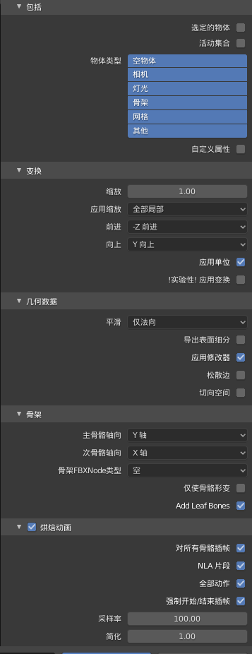

## 2.制作流程

下面以大天狗制作流程为例说明骨骼模型的制作过程。

### 2.1 原画概念设计

1）打开人形式神基础模型（基础模型的每个格子单位为1，就是像素单位，不要改变这个大小）

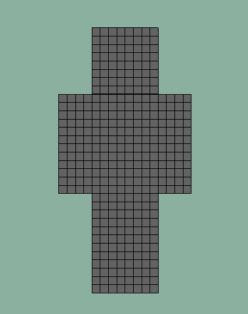

2）利用材质球上色截图或者PS上色均可，正面的效果可以比较快的确定颜色分布

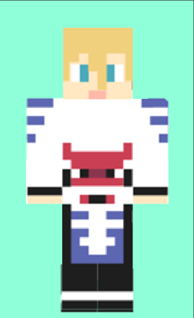

3）增加外轮廓的辨识度，突出的部分尽量归纳，减少细节，这一步使用PS绘制概念图

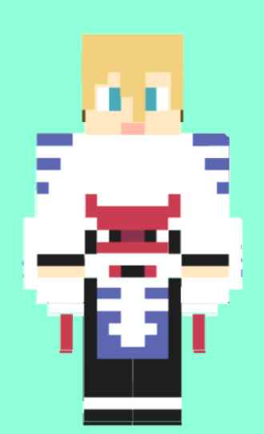

4）进一步增加轮廓的辨识度，注意角色身上最具有特点的部位，一个角色身上只有一到两个特征需要这样强调，比如大天狗的翅膀。这一步同样使用PS绘制示意图，背面也需要有设计，因为风格限制，不强制侧面的效果，但是需要考虑到4分之一侧面的效果

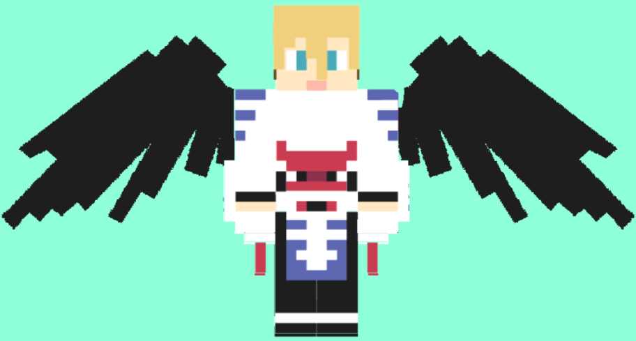

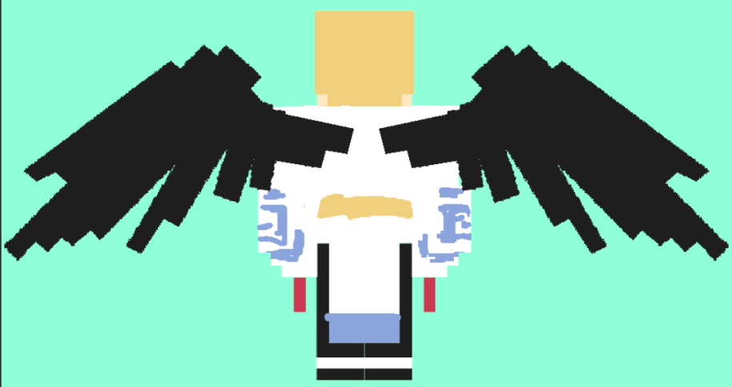

参考：《阴阳师》大天狗设计图，在转换为我的世界模型风格时，需要减少没有代表性的琐碎细节。

鞋子的造型需要直接归纳到腿部

翅膀的3层羽毛层次减少到2层，边缘细节概括处理

**注意：设计归纳的时候注意估算一下顶点数量，小怪300以下，复杂模型700以下，BOSS1000以下，尽量低于最高值，以免制作完成后超过难以修改。**

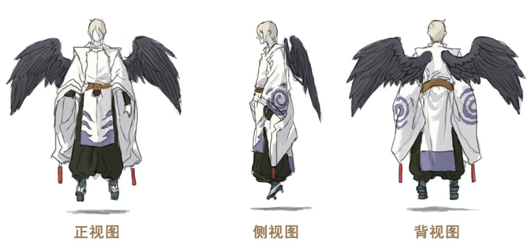

### 2.2 建模和着色

#### 2.2.1 制作模型

根据原画，制作模型，建模部分可以在提供的标模的格子上直接挤出来造型。注意挤出的高度单位也是1。

1：根据游戏中的规范，用头部放大，然后删去不要的部分来建模。（比如大天狗）

2：如果头发造型过于复杂或者有动作，则需要另外建模。（比如酒吞童子）

**注意：关节处的模型体块必须分开制作（胳膊，腿，身体的体块都是要分开的，动物类模型尾巴有转折的话，尾巴的转折处也要分开制作）**

#### 2.2.2 开始上色

​    材质属性面板，选中需要着色的面，赋予不同颜色的材质球，因为颜色会比较多，材质球命名上可以用类似：green_01,green_02这种方便查找对应的颜色。

### 2.3 后处理

#### 2.3.1 UV拆分

所有的uv必须横平竖直，不能有倾斜，否则会出现锯齿

每块uv边界之间要留至少两个像素的距离，贴图要制作扩边

uv摆放时可以导入一张对应贴图像素大小的棋盘格，每一条uv边缘线都必须要和棋盘格的格子对齐

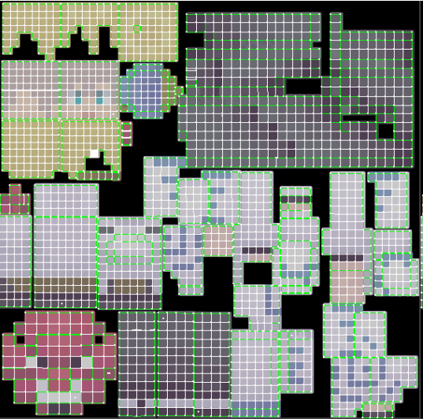

#### 2.3.2 减面

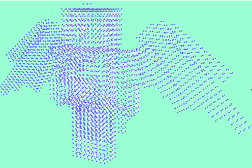

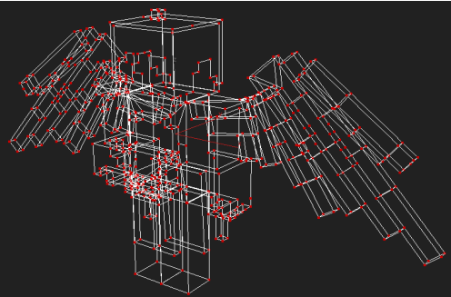

复制一个模型减面，（或拓扑，用拓扑的话，就可以拓扑后再拆分uv，uv摆放的规则一定要重视）只留下轮廓线，多余的线全部删掉。

填色的高模备份一个，后面烘焙颜色用。

#### 2.3.3 烘焙颜色

烘焙类型选择漫射，烘焙颜色的时候可以提高贴图精度，之后再用PS缩小到128像素大小

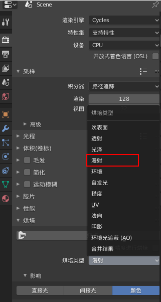

注意缩小图像大小的时候使用邻近（硬边缘），因为都是像素格，不会损失精度。

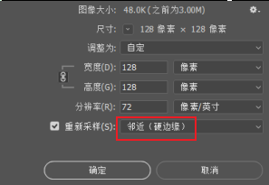

### 2.4 完成

贴上烘焙好的贴图效果截图如下：

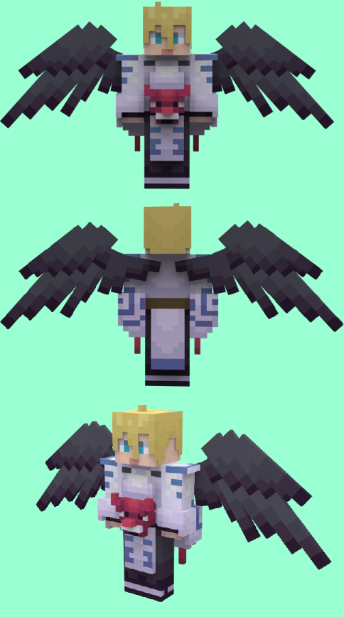

