---
front:
hard: 入门
time: 分钟
---

# 骨骼模型的使用

骨骼模型、骨骼动画的制作请参考[骨骼模型制作指南(3DMAX)](02-骨骼模型制作指南（3DMAX）.html)等相关文档。

通过专业的模型制作软件完成模型后，导出为FBX格式，然后再转换为《我的世界》中的模型格式（JSON格式），相应的方法请查阅[教学中心-编辑器基础-特效编辑器-入门教程01-模型导入与使用](../9-特效/10-模型导入.md#1-导入fbx模型)。

> 如需将已转换为我的世界中国版格式的骨骼模型导入至其他作品中，可以参考[骨骼模型（json）的导入](../9-特效/10-模型导入.md#2-导入骨骼模型json)

在将骨骼模型转换为JSON格式后，我们就可以准备在游戏内使用骨骼模型了。以离线文档中 **示例/6-4 资源制作/工具和示例/fbxRes/xuenv** 资源为例，先在编辑器中导入这个模型，然后按下面的步骤进行。实际上下面的1~3步目前编辑器已经自动完成了，需要手动操作文件时可以参考。


## 1. 填入模型路径信息

在`mod_resource/models/netease_models.json`里面填入模型的骨骼，网格及动作的文件路径（目前编辑器已经自动做好这一步了），如下图所示：

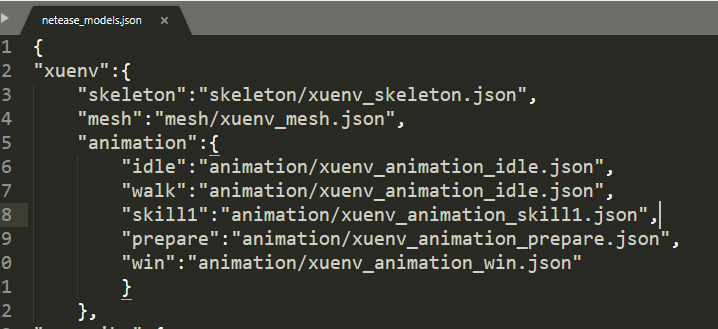

**骨骼模型动画的命名最好使用英文单词/拼音/数字/下划线组成。**

## 2. 将资源放入对应目录

将skeleton、mesh、animation资源放入`mod_resource/models`下对应的文件夹：

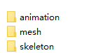

## 3. 指定贴图

mesh文件中会有指定material，如下图所示：

名称对应到`mod_resource/textures/models/xuenv.png`，所以需要在此位置放置贴图资源。

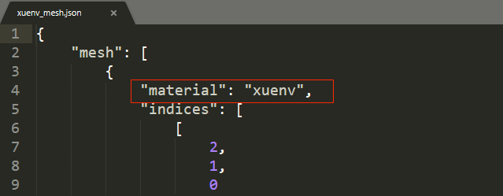

## 4. 代码调用

采用component的结构来创建模型与控制动画播放

创建模型替换原有模型

```python
modelComp = self.CreateComponent(playerId, 'Minecraft', 'model')
# 'xuenv'即为netease_models.json里配置的骨骼模型名称
modelComp.SetModel('xuenv')
```

播放动画

```python
modelComp = self.GetComponent(playerId, 'Minecraft', 'model')
# 播放动画'prepare'，第二个参数设置为True表示循环播放该动画，接口详细信息可以查看modAPI接口文档
modelComp.PlayAnim('prepare', True)
```

## 5. 第一人称模型

上面部分完成了第三人称视角的骨骼模型显示及动画播放，当我们想在游戏中切换到第一人称也有骨骼模型与动作时，需要另外做一套骨骼模型和动作（如下图的steve_fp），并且使动作的名称与第三人称模型的动作一致。然后把他配置为第三人称模型的“arm_model”，例如：

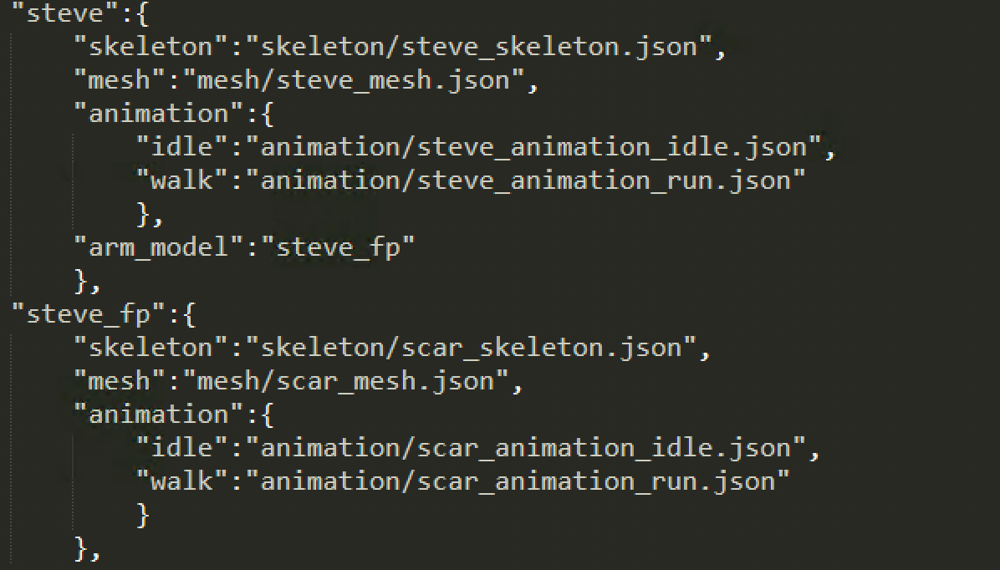

在上图中，我们可以看到steve有骨骼模型动画，这些属于第三人称视角的骨骼模型动画，steve中的”arm_model”属性可关联第一人称视角的骨骼模型。配置第一人称视角骨骼模型之后，当玩家切换到第一人称视角时，如果手上无物品或者手上物品不显示，则会显示第一人称骨骼模型（即这里的“steve_fp”）。

当播放动作时，第一人称视角模型的动作会跟随第三人称模型。例如给本地玩家替换steve模型后，播放walk动作，那么切换到第一人称视角时，显示的steve_fp模型也会播放walk动作。

如果替换的第三人称骨骼模型没配置”arm_model”字段（例如上述的”xuenv”模型），则在第一人称视角下手上无物品或者手上物品不显示时，不会显示任何模型。

## 6. 模型贴图序列帧动画

骨骼模型动画除了支持上述在animation文件夹下放置相应的json文件这一方式外，也支持另一种只是单纯贴图变化的序列帧动画：


制作这种贴图序列帧动画需要两个步骤，我们以上述的雪女为例：

1) 用图片处理工具修改`mod_resource/textures/models/xuenv.png` 路径下的这张贴图：
根据动画需要的帧数横竖方向重复铺开，此例中我们以6行5列总共30帧进行制作，处理每一帧中贴图需要变化的部分，序列帧播放的顺序由贴图的左上角先横再竖播放到贴图的右下角。

原图：
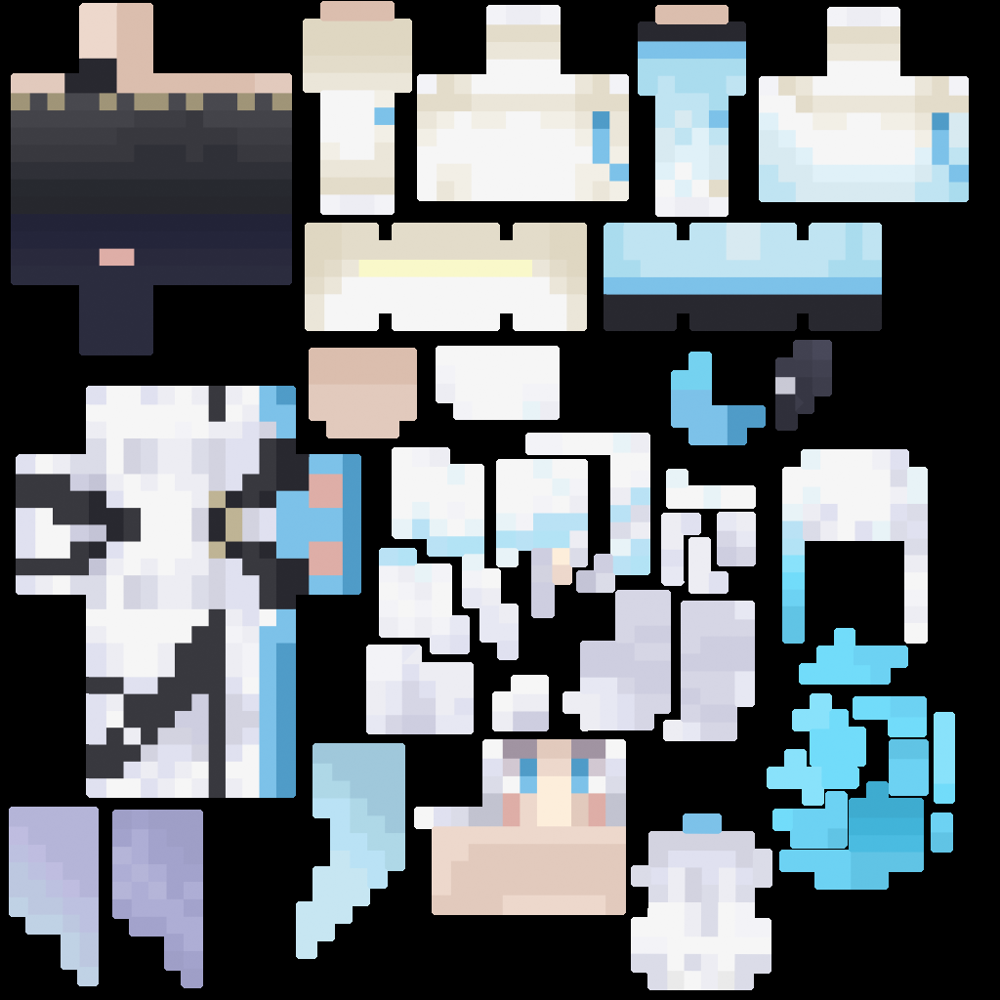

处理后：
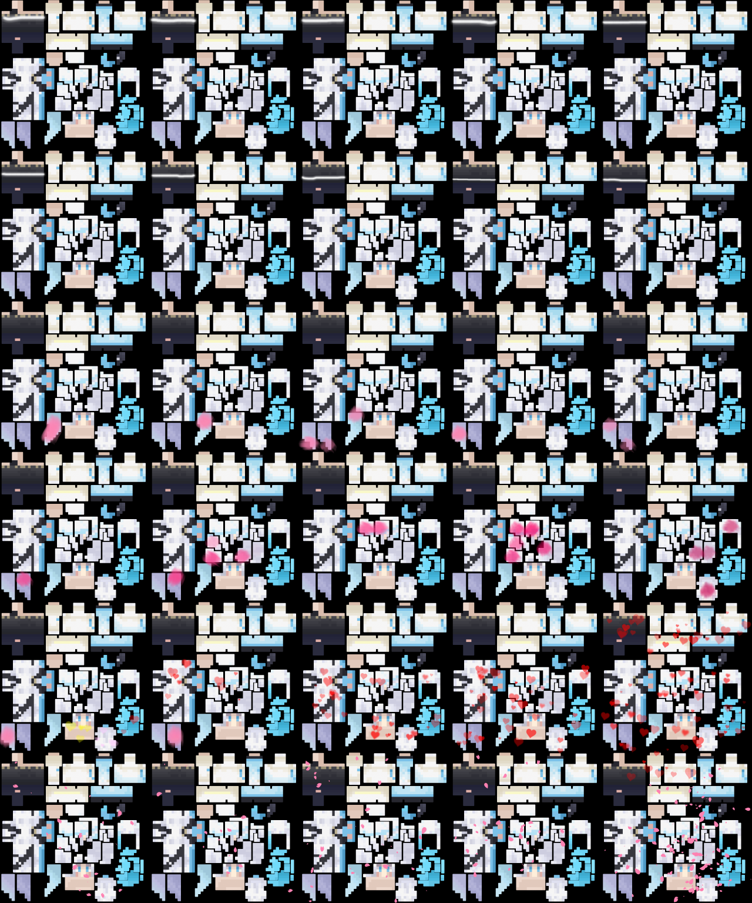

2) 修改`mod_resource/models/netease_models.json`中雪女的json配置，新增frame_anim字段：

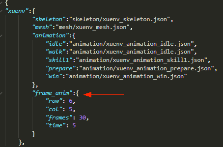

字段中各参数意义如下：
row: 贴图动画中分了多少行，此例中6行5列即6行，所以此处填6
col: 贴图动画中分了多少列，此例中6行5列即5列，所以此处填5
frames: 帧数，此例中为30帧（此数字不一定为row乘col的值，允许贴图留有空白，假如贴图右下角留了一帧的空白区域，此处可填29）
time: 动画总时长，此例中为5秒，代表5秒内播放完30帧，然后开始循环

注意：
为了节省运行时的内存，建议资源制作时尽量秉持宽高最邻近二次幂数相乘最小原则。
所谓最邻近二次幂数，即数字往上寻找最靠近自己的二次幂，二次幂就是1，2，4，8，16，32，64，128，256，512，1024，2048等等。
比如一张贴图为200 * 200的分辨率，200的最邻近二次幂数为256，则加载入内存后即占用256 * 256的大小，此处为了讲解方便，简化了一些计算细节，读者可简单理解为内存占用与宽高成正比。
在此例中，我们雪女单帧的图片大小256 * 256，6行5列排放后为1280 * 1536, 宽高最邻近二次幂数分别为2048和2048，所以占用内存为2048 * 2048。
但假如我们调整一下，用横4，竖8的方式排放，宽高即为1024 * 2048，此方式最高可支持 4 * 8 = 32帧，宽高最邻近二次幂数分别也为1024和2048，占用内存即为1024 * 2048，内存占用可降低到原来的一半！

最后，在代码调用时无须添加额外代码即可生效：
```python
modelComp = self.CreateComponent(playerId, 'Minecraft', 'model')
# 'xuenv'即为netease_models.json里配置的骨骼模型名称
modelComp.SetModel('xuenv')
```


## 7. 模型使用自定义材质及更多贴图

若我们想要实现更为复杂的渲染效果，则可能会需要使用特殊的shader及shader所需要采样的贴图，这时候我们需要修改材质，并配置为使用我们的shader。我们可以在netease_models.json中为模型指定material_cpu和material字段，则骨骼模型将使用指定材质进行渲染。自定义材质都需要先在资源包resource_pack/materials/entity.material中进行定义。

以雪女模型为例：

```json
"xuenv_1": {
        "skeleton": "skeleton/xuenv_skeleton.json",
        "mesh": "mesh/xuenv_mesh_frame.json",
        "animation": {
            "idle": "animation/xuenv_animation_idle.json",
            "walk": "animation/xuenv_animation_idle.json",
            "skill1": "animation/xuenv_animation_skill1.json",
            "behited": "animation/gun_animation_idle.json",
            "prepare": "animation/xuenv_animation_prepare.json",
            "win": "animation/xuenv_animation_win.json"
        },
    	// 定义自己的自定义材质
    	"material": "xuenv_custom",
        // 自定义CPU蒙皮材质，可不进行配置，根据开发者的需要也可配置
        "material_cpu": "xuenv_custom_cpu",
    	// 这个自定义材质所需要的自定义贴图，最多可配置4张
    	"texture": {
            //"tex0": "my_custom_texture0",
			"tex1": "my_custom_texture1",
            "tex2": "my_custom_texture2",
            "tex3": "my_custom_texture3",
		},
        "frame_anim": {
            "row": 6,
            "col": 5,
            "frames": 30,
            "time": 5
        }
}
```

`material`：为GPU骨骼渲染的形式下所使用的材质，会全局存储所有骨骼的变换矩阵列表，顶点着色器中每个顶点只存储对应的骨骼下标，在执行过程中用通过该下标从列表中查询得出变换矩阵，因为会有不同的顶点共用相同的骨骼，相比于后文的CPU骨骼蒙皮渲染形式，使用此方式能更为节省GPU带宽。材质的配置可参考官方骨骼模型材质(data/vanilla_netease/materials/entity.material/entity_for_skeleton)。**几乎所有情况下引擎都会使用该形式的材质**。

`material_cpu`：为传统的CPU骨骼蒙皮渲染形式，顶点着色器中每个顶点存储自己的变换矩阵。**目前引擎只会在部分安卓设备且该设备不支持使用大顶点Uniform变量（large vertex shader uniforms）时才会使用的CPU骨骼蒙皮渲染，其它情况下则使用GPU骨骼渲染的渲染形式**。**因此，开发者如无特别需要，可以不定义该材质，也可以直接指定为GPU骨骼渲染材质。**如开发者有需要，则材质的配置可参考官方骨骼模型材质(data/vanilla_netease/materials/entity.material/entity_for_skeleton_cpu），与GPU所使用的的材质不同的是，该材质没有定义`USE_SKINNING`以及`BoneId0`.

两种材质的差别基本如图所示：

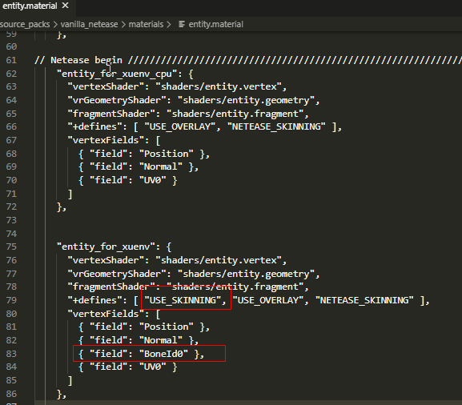

在上面我们为模型配置了自己的材质及shader，接着如果我们的材质及shader需要有更多的自定义贴图，我们就可以增加如下`texture`字段：

```json
    	// 这个自定义材质所需要的自定义贴图，最多可配置4张
    	"texture": {
            //"tex0": "my_custom_texture0",
			"tex1": "my_custom_texture1",
            "tex2": "my_custom_texture2",
            "tex3": "my_custom_texture3",
		},
```

关于自定义贴图，我们一共可以配置且最多配置4张，字段名称分别为`tex0`,`tex1`,`tex2`,`tex3`。 字段的值为贴图的路径，即`textures/models/`路径下的贴图名称，不需要后缀名。

其中`tex0`所配置的贴图会覆盖`mesh`文件中`material`字段所指定的贴图，即上文第3节-指定贴图中所配置的贴图。所以一般不需要额外配置`tex0`。如果`mesh`文件中`material`字段没有配置模型贴图，则可以使用`tex0`来配置。

而`tex1`,`tex2`,`tex3`，则可供开发者按需求进行配置。

在配置了以上贴图后，我们则可以在我们的自定义材质中指定了的fragment shader当中通过声明`LAYOUT_BINDING`使用这些贴图：

```glsl
LAYOUT_BINDING(0) uniform sampler2D TEXTURE_0; // TEXTURE_0对应tex0, 也对应mesh文件中material字段指定的贴图
LAYOUT_BINDING(1) uniform sampler2D TEXTURE_1; // TEXTURE_1对应tex1,
LAYOUT_BINDING(2) uniform sampler2D TEXTURE_2; // TEXTURE_2对应tex2,
LAYOUT_BINDING(3) uniform sampler2D TEXTURE_3; // TEXTURE_3对应tex3,

void main(){
    vec4 base_color = texture( TEXTURE_0, uv );
    vec4 base_color1 = texture( TEXTURE_1, uv );
    vec4 base_color2 = texture( TEXTURE_2, uv );
    vec4 base_color3 = texture( TEXTURE_3, uv );

    // do what you want
    //...
}
```


## 8. 模型使用多个材质及贴图

2.8版本后，可以对同一个骨骼模型的不同骨骼定义不同的材质及所使用的贴图，也可以使用骨骼模型渲染屏蔽接口<a href="../../../mcdocs/1-ModAPI/接口/模型.html#SetModelPartVisible" rel="noopenner"> SetModelPartVisible </a>进行指定骨骼的渲染屏蔽。

想要对骨骼模型配置多个材质以及使用骨骼渲染屏蔽功能，需要在netease_models.json中增加如下字段的配置：

1）`useSplitMeshes`   bool类型字段，决定了骨骼模型在读取时是否按照指定的骨骼来拆分生成多个mesh，值默认为fasle。当设为true时，读取该模型的时候将按来分`splitBonesGroup`中指定的骨骼来分别生成和存储mesh，而不会按过往方法来合成一整个mesh。骨骼模型渲染时也会变成多个mesh一起渲染，因此如果不是要进行骨骼模型按骨骼进行渲染屏蔽，或者并没有使用到骨骼模型多材质功能时，不要设置为true。

2）`splitBonesGroup`  字典类型字段，可以指定拆分的骨骼名称，以及这个骨骼所使用的材质及这个材质所需要的贴图。指定后，骨骼模型将拆分为本体模型以及这些骨骼各自所组成的模型。

以雪女模型为例：

```json
 "xuenv_1": {
        "skeleton": "skeleton/xuenv_skeleton.json",
        "mesh": "mesh/xuenv_mesh_frame.json",
        "animation": {
            "idle": "animation/xuenv_animation_idle.json",
            "walk": "animation/xuenv_animation_idle.json",
            "skill1": "animation/xuenv_animation_skill1.json",
            "behited": "animation/gun_animation_idle.json",
            "prepare": "animation/xuenv_animation_prepare.json",
            "win": "animation/xuenv_animation_win.json"
        },
        // 定义本体模型的自定义材质
    	"material": "xuenv_custom",
        "material_cpu": "xuenv_custom_cpu",
    	"texture": {
            //"tex0": "my_custom_texture0",
			"tex1": "my_custom_texture1",
            "tex2": "my_custom_texture2",
            "tex3": "my_custom_texture3",
		},
        "frame_anim": {
            "row": 6,
            "col": 5,
            "frames": 30,
            "time": 5
        },
     	// 设置useSplitMeshes为true，设置后骨骼模型将按splitBonesGroup中的骨骼来拆分渲染。
        "useSplitMeshes": true,
        // 指定需要分离出来的骨骼名称，指定后，骨骼模型将拆分为本体模型以及这些骨骼各自所组成的模型。
        // 骨骼名称需要与该骨骼模型的"skeleton"所指定的skeleton.json文件中存在的骨骼名称一致，大小写一致，否则无效。
        // 可以对分离出来的骨骼指定自定义材质及所使用的贴图。
        "splitBonesGroup": {
            "Bone007":{
               // material 如果没有定义，则使用本体模型的材质
               // texture 如果没有定义，则该骨骼使用骨骼模型"mesh"字段所指定的mesh.json文件中该骨骼所属的mesh中"material"字段所定义的贴图路径，如果这个也没有，则使用本体模型的贴图
            },
            "Bip001 Head":{
                // 这个骨骼模型的本体模型使用了frame帧动画贴图，如果想要这个骨骼也使用同样的帧动画贴图，为了保证帧动画贴图显示正常，则可以为这个骨骼的贴图tex0指定同样的帧动画贴图，如下：
                "texture": {
                    "tex0": "xuenv-1"
                }
                // 当然也可以不用指定tex0贴图。不指定帧动画贴图的情况下，如果想要这个骨骼也显示跟本体模型同样的帧动画效果，则请保证mesh.json中所有包含这个骨骼的mesh的"material"字段都定义了相同的帧动画贴图。
             },
            // 雪女模型的身躯骨骼，我们为这个骨骼指定自定义的材质
            "Bip001 Spine": {
                // 自定义的材质，材质的定义在资源包/materials/entity.material中定义
                "material": "xuenv_special",
                // 自定义CPU蒙皮材质，可根据需要配置
                "material_cpu": "xuenv_special",
                // 该材质里的shader所使用的到的贴图名称，不需要后缀名，最多为4张。贴图放置于资源包/textures/models中。
                // 如只需使用1张，则定义"tex0"即可，使用2张，则定义"tex0"及"tex1"，如此类推。"tex0"对应shader中的TEXTURE_0, "tex1"对应shader中的TEXTURE_1，如此类推。
                "texture": {
                    "tex0": "special_1",
                    "tex1": "special_2",
                    "tex2": "special_3",
                    "tex3": "special_4"
                }
            }
        }
 }
```

骨骼的材质会按照如下顺序来优先适用：

（1）是否指定了`material`，如果有，则该骨骼优先适用`material`中指定的材质；

（2）如果没有指定`material`，则该骨骼采用与本体模型相同的材质。

骨骼的贴图会按照如下顺序来优先适用：

（1）是否指定了`texture`，如果有，则该骨骼会优先适用`texture`中定义的贴图，至于这些贴图如何被使用，则由自定义材质中的shader来决定。

（2）如果没有指定`texture`，则该骨骼优先适用骨骼模型的mesh.json文件中该骨骼所属的mesh中"material"字段指定的贴图。

（3）如果以上均没有，则使用本体模型的贴图。

经过如上配置后，如果在游戏中实时隐藏某个骨骼，则可以调用<a href="../../../mcdocs/1-ModAPI/接口/模型.html#SetModelPartVisible" rel="noopenner"> SetModelPartVisible </a>：

```python
import mod.client.extraClientApi as clientApi
comp = clientApi.GetEngineCompFactory().CreateModel(entityId)
modelId = comp.SetModel("xuenv_1")
# 屏蔽指定骨骼
print comp.SetModelPartVisible(modelId, "Bip001 Head", False)
```


## 9.骨骼模型自定义多pass


2.8版本开放了自定义多pass的特性，目前开发者可以通过对骨骼模型配置多pass材质，实现更多效果。开发者仅需修改`netease_models.json`中的模型配置，将模型配置中的`material`字段配置成数组即可：

```json
{ // netease_models.json
	"model_example": {
		"dy_load": true,
		"mesh": "mesh/model_example_mesh.json",
		"skeleton": "skeleton/model_example_skeleton.json",
		"material": ["entity_for_skeleton", "netease_drawline_example"] // ****多pass材质数组****
	}
}
```
可以看到模型`model_example`中的`material`字段被配置为了由两个材质组成的数组，第一个材质是网易骨骼模型材质`entity_for_skeleton`，第二个材质是2.8新增的内置描边材质`netease_drawline_example`。
在渲染模型时，引擎会**按顺序**渲染配置中的材质数组，在这个例子中，模型`model_example`会首先使用材质`entity_for_skeleton`渲染一次，再使用材质`netease_drawline_example`渲染一次。

详细示例可参考[多pass演示：描边效果](../7-材质与着色器/4-材质实战.md#自定义多pass)。


## 10.支持半透明渲染的材质

骨骼模型在默认情况下使用不透明材质进行渲染。片段着色器输出中gl_FragColor的第四个参数alpha在不透明渲染中并没有效果，即gl_FragColor.a无论是什么值都不影响最终渲染效果。
开启半透明渲染之后，gl_FragColor.a代表透明度，范围为[0.0, 1.0], 1.0代表完全不透明，0.0代表完全透明看不见。开启方式如下，只需要在材质的定义中声明如下部份即可：

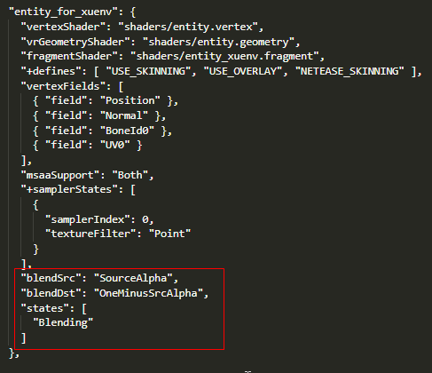

Blending代表使用混合模式进行渲染，blendSrc代表使用SourceAlpha作为混合源因子, blendDst代表使用OneMinusSrcAlpha作为目标混合因子。

关于混合因子说明可看[材质配置说明](../7-材质与着色器/3-材质配置说明.md#材质属性)中关于Blend 半透明对象颜色混合的说明。

接下来，我们尝试修改gl_FragColor.a进行测试，修改为透明度0.5：

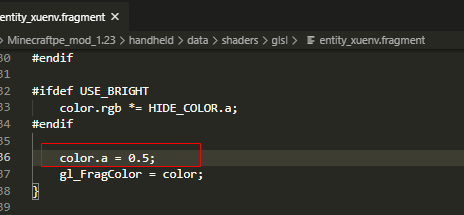

修改完成后游戏中该骨骼模型即会出现半透明效果：

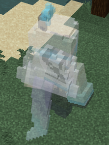

注意：因为半透明材质无法通过深度检测优化性能，所以尽量不要过多使用，不然会造成一定渲染压力。