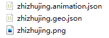
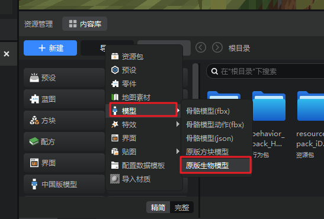
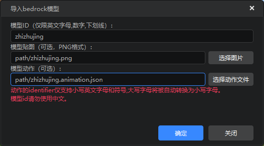
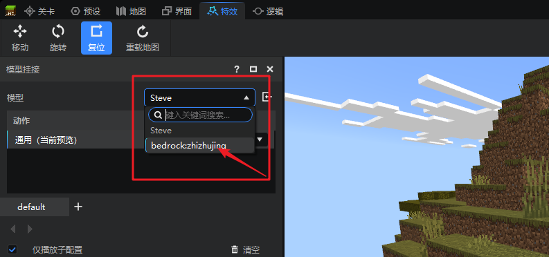
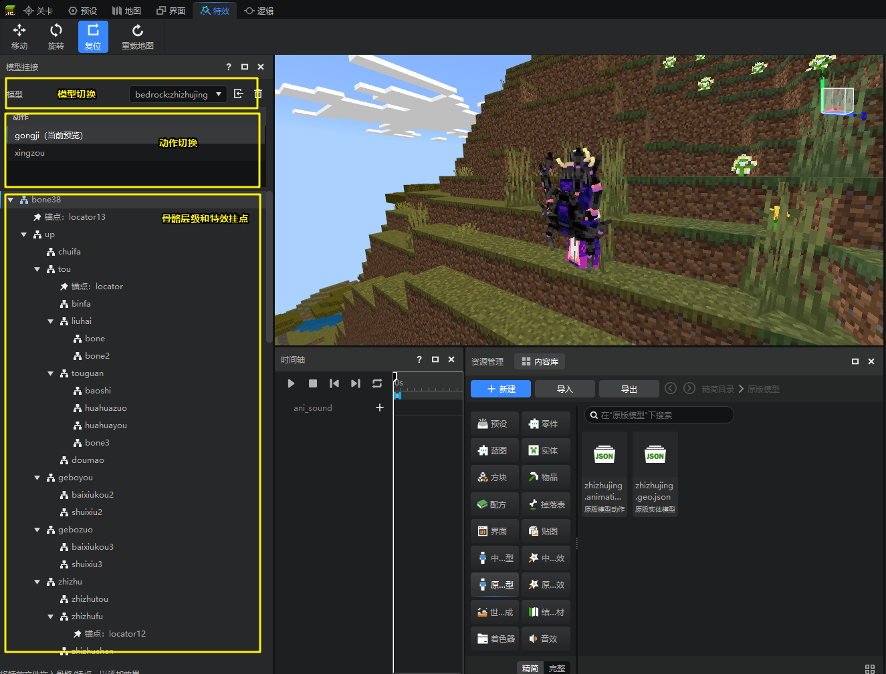
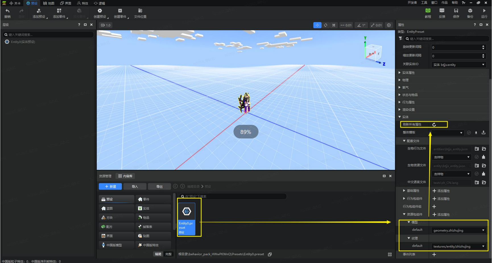

---
front:
hard: 入门
time: 10分钟
---

# 原版模型的使用

## 导入前的准备

原版模型使用Blockbench制作，制作完成后需要导出三个文件：

1. 以.geo.json结尾的模型配置文件
2. 以.animation.json结尾的动画配置文件（可选）
3. 以.png结尾的模型贴图文件（可选）

将这三个文件保存在同一个文件夹中，并且尽量以相同的文件名命名这些文件。例如我们需要导入蜘蛛精的原版模型文件，就需要将它们命名为：

## 将模型导入编辑器

我们点击资源管理器目录上方的资源导入按钮，在下拉菜单中选中【原版生物模型】。

选择刚才保存原版模型的文件夹，即会弹出下面这个窗口：

1. 模型ID：为导入的模型取名，仅限 **小写** 英文字母和数字；
2. 模型贴图：默认会选择当前文件夹下的.png文件作为贴图，可点击【选择图片】按钮更换为其他文件。如果当前模型不需要贴图，则可不填写；
3. 模型动作（可选）：默认会选择当前文件夹下的.animation.json文件。如果当前模型不需要动作文件，则可不填写。
> 注意：动作文件里的动作id请注意不能是中文和大写字符，否则无效。

确认填写无误后，即可点击蓝色【确定】按钮导入模型。导入后，
1. 我们可以在资源包路径下的models/entity路径下找到刚刚导入的zhizhujing.geo.json文件。
2. 其动作文件被放置在资源包路径下的animations文件夹，
3. 贴图文件被放置在资源包路径下的textures/entity文件夹,
4. 同时会在animation_controllers下生成一个动画控制器供在编辑器播放使用。**如果不熟悉mod制作请勿随意修改**，如果不小心修改了导致动画播放不了，**请重新导入**。

> 【注意】
> 1. 导入的动作名称不能包含大写字母，否则编辑器会将其自动改为小写字母再导入。
> 2. 引擎有时会因为缓存资源的问题，导致模型无法正常显示，可点击挂接面板下的刷新按钮，手动刷新下。

## 在特效编辑器中预览模型

我们切换到特效编辑器，将左侧模型挂接面板的主角模型通过下拉菜单替换成我们刚刚导入的蜘蛛精模型，即可看到模型已导入成功。

在特效编辑器中，我们可以看到模型的动作、特效挂点，并通过时间轴控制模型动作的播放。想要原版模型上挂接微软粒子，可参见对应的指南文档。

> 【注意】 当前并不支持在特效编辑器中修改模型的挂点数量、位置等，需要在模型制作的时候在blockbench中为其添加好挂点，调整好挂点位置，再导入到编辑器中使用。

## 将原版模型应用到实体预设

现在，编辑器支持了将原版模型直接应用到实体预设上。

我们在预设编辑器中打开需要修改的实体模型，然后在右侧的属性面板中找到【资源包组件】，把其中的【模型】和【纹理】都替换成先前导入的原版模型，然后点击上方的【刷新所有属性】按钮，即可看到当前实体预设的模型和纹理都被替换成了之前导入的蜘蛛精模型。

