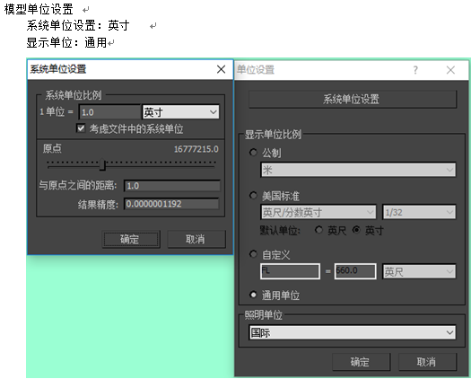
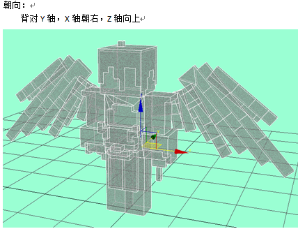
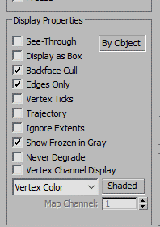
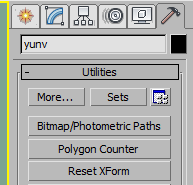
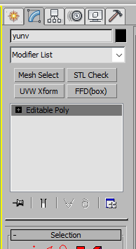
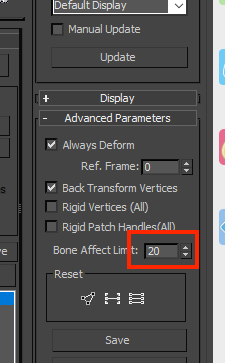
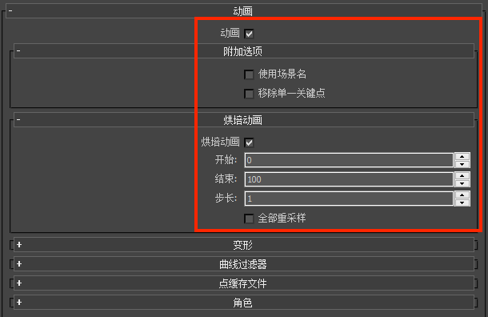
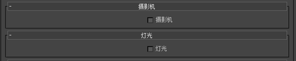
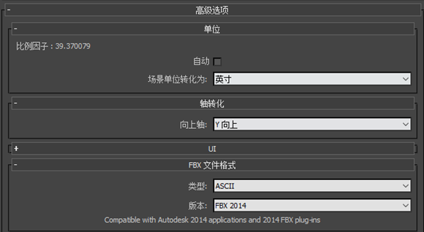

# 我的世界模型导出规范

推荐软件： 3dMax 2014

## 系统单位设置

## 模型朝向

## 贴图

只支持一张贴图，且贴图的名称必须为英文

## 顶点

每个长方体通常是 8 个，整个模型控制在 300 个顶点，特殊复杂模型可以在 1000 以内

## 输出检查

1. 属性中将模型设置为背面消隐，查看模型是否有反面，如果有的话需要反相（flip）。

	
	

2. Reset Xform（多点击几次，然后塌陷）

	

3. Mesh Select（与 4 一起，点击完后，不用操作，直接塌陷）

4. STL Check，最终转化为 Poly 模型输出，此步骤可避免模型在游戏中显示出错
	

## 蒙皮

1. 骨骼架设使用纯bone
2. 骨骼控制在20根以内，最多不能超过50
3. 需要添加 root，up，down 3根骨骼
	- root，是质心的父级，位移旋转都要归于坐标原点（0.0）
	- up，控制上半身，质心的子级，身体的父级
	- down，控制下半身，质心的子级，双脚的父级
4. 所有的骨骼都要有链接，（武器挂件坐骑等都要链接给相应的手，质心等位子，可使用link）
5. 蒙皮选项当中的高级参数中，有个骨骼影响限制,需要调为 1，如图所示

	

## 动作输出

1. 输出文件版本为 MAX2014
2. 输出文件命名为英文，文件需要输出FBX。
3. 输出文件需要塌陷骨骼动画
4. root，up，down骨骼不可以有动画
5. 缩放动画必须用等比缩放，且不能有单轴向缩放

## FBX输出设置

输出设置如下图所示：

## 注意事项

1. 模型制作中，避免使用镜像或者对称！
2. 如果模型出现法线问题，将法线出错的位置选择并反相（flip）即可。
3. 模型当中不能有任何的中文!
