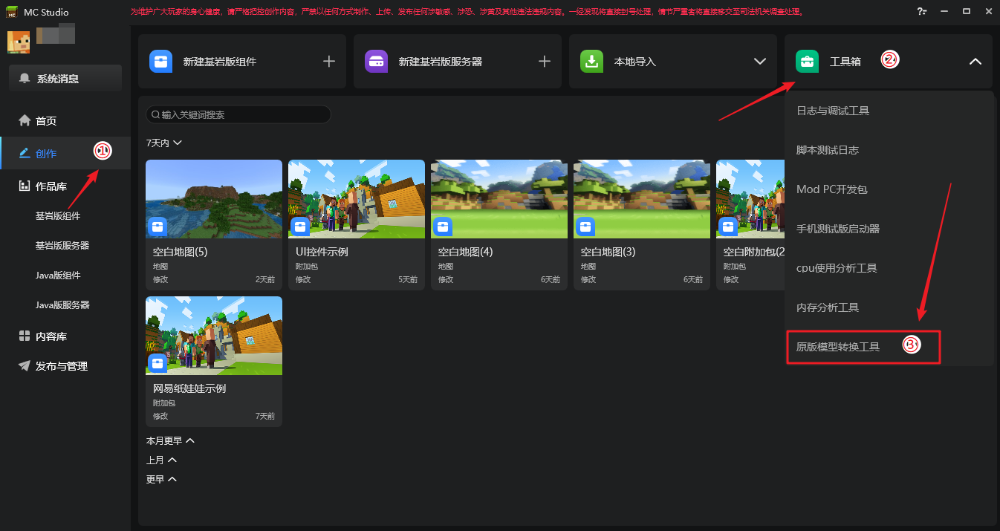
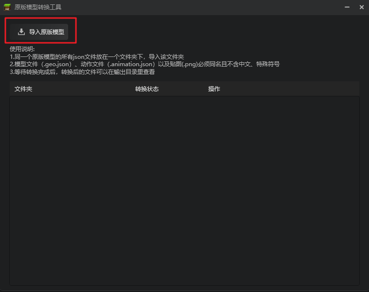
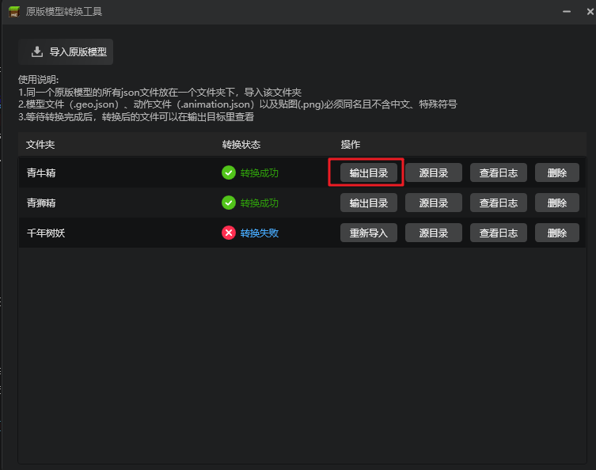
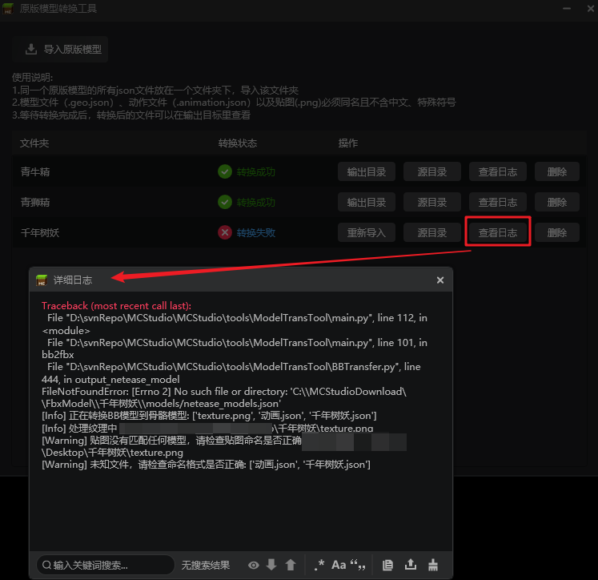
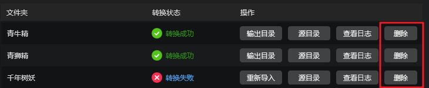
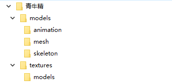
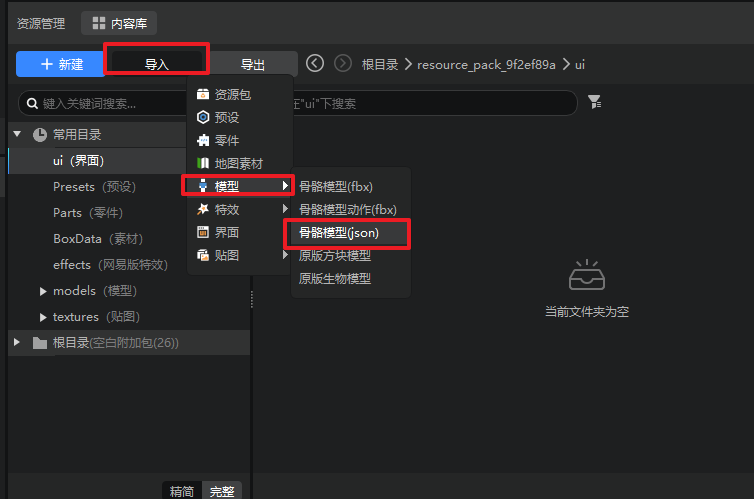
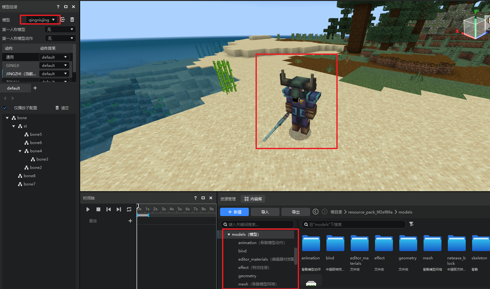

---
front:
time: 15分钟
---

# 原版模型转换工具使用说明
## 工具介绍
经过前面几篇文档的学习，开发者们都了解了原版模型和骨骼模型的区别和制作、使用技巧，原版模型容易上手，制作的模型风格更符合MC的风格，骨骼模型较为复杂，但能通过SDK接口实现更精美的动作表现。

为了降低开发者使用两种模型格式的门槛，提高开发者的开发效率，我的世界开发工作台提供了原版模型转换工具，开发者可通过此工具**将原版模型转换为骨骼模型**，接下来就详细介绍下该工具的使用方法：
1. 登录我的世界开发工作台，依次点击创作→工具箱→原版模型转换工具：

1. 点击**导入原版模型**按钮，在弹出的对话框选择原版模型所在的文件夹。

2. 点击确定后，工具便会自动开始转换，并将转换结果展示到下方的列表中，对于转换成功后的模型，可点击右侧的**输出目录**按钮打开存放转换后的骨骼模型的文件夹。

3. 对于转换失败的模型，你可以点击**查看日志**按钮，查看具体报错日志，调整完模型后，点击**重新导入**按钮重试。

5. 同样，你也可以点击**删除**按钮删除本条转换记录，注意，此操作不会删除源文件和输出文件夹。

## 骨骼模型使用
1. 转换后的骨骼模型会按照下列结构存放：

2. 可以在编辑器中进行导入，如下图点击骨骼模型（json）：

3. 选择输出目录中的`netease_models.json`文件，即可导入转换后的骨骼模型，并在特效编辑器中查看模型。

> 有关骨骼模型使用的更多说明可以参考[这篇文档](./04-骨骼模型的使用.md)

## 注意事项
1. 同一个原版模型的所有json文件需要放在同一个文件夹下，导入时选择该文件夹。
2. 模型文件（.geo.json）、动作文件（.animation.json）以及贴图（.png）必须保证同时满足下列条件：
   1. 名称保持一致
   2. 名称不含中文
   3. 名称不含特殊符号
3. 暂不支持一个模型（.geo.json）对应多个动作文件（.animation.json）和多个贴图的情况。

5.  导出后的模型也需要满足从[模型输出规范](./10-模型输出规范.md)，否则可能会产生异常，例如骨骼数不能超过50。
