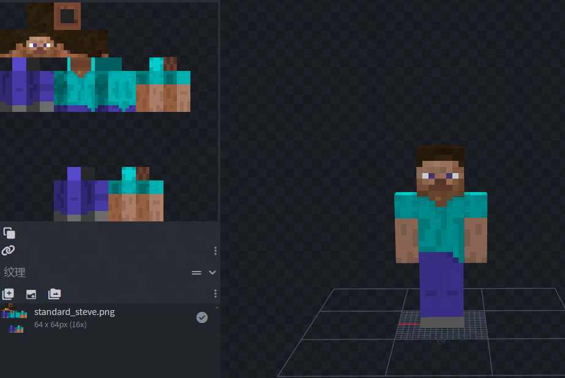
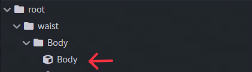

# 模型规范指南
## 前言
在当前模组开发实践中，部分开发者所采用的 Blockbench模型与官方标准模型存在差异。

因此换了BlockBench模型的Mod，会导致官方皮肤时出现贴图错位、模型消失等兼容性问题，影响了玩家的视觉体验。

现已开放官方模型规范，开发者们请参考并遵循。新作品通过规范指南进行UV、动画等的制作。已有作品则可以通过SDK判断是否需要修改Blockbench模型，确保模组能够与官方皮肤良好配合，为玩家带来更加一致、流畅的游戏体验判断是否需要修改Blockbench模型，确保模组能够与官方皮肤良好配合，为玩家带来更加一致、流畅的游戏体验

## 模型模板下载

当前官方提供的“多关节”结构Blockbench模型已经能满足大部分的模组开发者，请开发者下载[官方规范player模型文件](https://g79.gdl.netease.com/official_steve_model.zip)

## 兼容分类

根据模组与官方皮肤的兼容程度，分为：

1. **完全兼容**：未更换bb模型。表现为：皮肤模型贴图，以及穿戴外观，模组动画等表现都正常。
2. **部分兼容**：更换了bb模型，但按照官方规范制作。表现为：皮肤挂件以及穿戴外观正常，但是模型样式改变及贴图错乱。
3. **不兼容**：更换了bb模型，且未按照官方规范制作。表现为：模型样式改变，皮肤挂件错乱，穿戴外观错乱，以及动作异常。

## 规范概要

1. 玩法模组：非必要不改bb模型，如需修改bb模型需遵循动作优化类模组规范
2. 动作优化类模组：
- 人形角色，非必要不修改bb结构，即无需使用AddPlayerGeometry的Api
- 如需修改修改bb结构，则应该按以下优先级进行美术制作
	- 不修改玩家模型为多关节
	- **按规范**修改四肢为多关节模型，但是不修改Body为多关节模型
	- **按规范**砍四肢与body为多关节模型
	- **按规范**命名骨骼/层级，但是玩家骨骼层级随意修改 *（极不推荐）*
3. SDK使用：
- 开发者可以结合以下Mod SDK，判断是否需要更换模型
- 建议穿戴史诗及以上多关节官方4d皮肤，在模组对皮肤兼容度较差的前提下，不进行玩家模型修改
- 其余情况开发者也可以使用接口判断更换模型的必要性
	- [IsOfficialSkin](../../../mcdocs/1-ModAPI-beta/接口/玩家/属性.md#isofficialskin) —— 获取玩家穿戴的皮肤是否为官方4d皮肤
	- [IsHighLevelOfficialSkin](../../../mcdocs/1-ModAPI-beta/接口/玩家/属性.md#ishighlevelofficialskin) —— 获取玩家穿戴的皮肤是否为史诗及以上的官方4d皮肤
	- [IsHighLevelMultiJointOfficialSkin](../../../mcdocs/1-ModAPI-beta/接口/玩家/属性.md#ishighlevelmultijointofficialskin) —— 获取玩家穿戴的皮肤是否为史诗及以上的多关节官方4d皮肤
4. 动画制作：人形角色，必须修改bb模型的，建议使用官方模型并用其进行动画制作
5. 其他：不建议直接修改 player.entity.json 和 player.render_controllers.json，如果改了请务必在官方的规范下进行拓展

## 多关节美术制作参考

### 必要骨骼

1. 常规骨骼（常作为挂件的挂点）：

- root, waist, body, leftArm, **leftArmDown**, rightArm, **rightArmDown**, head,  **bodyDown**, leftLeg, **leftLegDown**, rightLeg, **rightLegDown**, rightLeg, cape

2. 会员盔甲挂点：

- hat, jacket, **jacketDown**, leftSleeve, leftSleeveDown, rightSleeve, **rightSleeveDown**, leftPants, **leftPantsDown**, rightPants, **rightPantsDown**

**【注意】**

* 共计26个骨骼，开发者请不要随意删除
* 必要骨骼中，加粗字体的骨骼为相比原版Steve新增的关节


### 骨骼层级一览

| 节点名称                      |   | 枢轴点            | 备注 |
|---------------------------|---|----------------| --- |
| root                      |   | (0,0,0)        |     |
| —waist                    |   | (0, 12, 0)     |     |
| ——body                    |   | (0, 24, 0)     |     |
| ———head                   |   | (0, 24, 0)     |     |
| —————hat                  |   | (0, 24, 0)     |     |
| ———cape                   |   | (0, 24, 3)     |     |
| ———leftArm                |   | (-5, 22, 0)    |     |
| **—————leftArmDown**      |   | (-5, 18, 0)    | 新增必要骨骼 |
| **———————leftSleeveDown** |   | (-5, 18.25, 0) | 新增盔甲骨骼 |
| ———————leftItem                          |   |  (-6, 15, 1)             |     |
| —————leftSleeve                          |   |  (-5, 22, 0)             |     |
| ———rightArm                          |   |  (5, 22, 0)             |     |
| **—————rightArmDown**                         |   |   (5, 18, 0)             | 新增必要骨骼    |
| **———————rightSleeveDown**                         |   |  (5, 18.25, 0)              | 新增盔甲骨骼    |
| ———————rightItem                          |   |  (6, 15, 1)              |     |
| —————rightSleeve                          |   |  (5, 22, 0)              |     |
| ———jacket                          |   |  (0, 24, 0)              |     |
| **——bodyDown**                          |   |  (0, 16, 0)              | 新增必要骨骼    |
| **———jacketDown**                          |   |  (0, 16.25, 0)              | 新增盔甲骨骼    |
| —leftLeg                          |   |  (-1.9, 12, 0)              |     |
| ——leftPants                          |   |  (-1.9, 12, 0)              |     |
| **——leftLegDown**                          |   |  (-1.9, 6, 0)              | 新增必要骨骼    |
| **————leftPantsDown**                          |   |  (-1.9, 6.25, 0)              | 新增盔甲骨骼    |
| —rightLeg                          |   |  (1.9, 12, 0)              |     |
| ——rightPants                          |   |  (1.9, 12, 0)              |     |
| **——rightLegDown**                          |   |  (1.9, 6, 0)              | 新增必要骨骼    |
| **————rightPantsDown**                        |   |  (1.9, 6.25, 0)              | 新增盔甲骨骼    |

**【注意】**
* 骨骼层级：影响官方动画兼容
* 骨骼命名：影响官方挂件兼容
* 枢轴点影响。比如：body枢轴点24非16的原因是考虑原生鞘翅和胸甲的绑定位置

### 骨骼层级说明
* body 和 bodyDown 层级并列
* 新增的切分关节
  - 5个骨骼节点：`leftArmDown, rightArmDown, bodyDown, leftLegDown, rightLegDown ` 
  - 5个骨骼节点：`jacketDown, leftSleeveDown, rightSleeveDown, leftPantsDown, rightPantsDown`

### UV贴图制作
如下图所示，需要按照Steve规范进行制作


### 其余注意事项

1. 除盔甲骨骼以外，其他骨骼下必须有同名cube。例如：



## 新增支持

### MOD SDK

为了方便开发者们在脚本中判断当前玩家皮肤状态，新增了三个接口和一个事件。
开发者可在事件当中判定**当前皮肤是否是官方，从而决定是否修改模型。**

也请开发者注意[**规范概要**](#规范概要)，**非必要情况不修改模型。如需修改，也遵循照官方模型规范**

**【接口和事件】**
1. IsOfficialSkin 是否为官方皮肤
2. IsHighLevelOfficialSkin 是否为官方史诗级以上皮肤
3. IsHighLevelMultiJointOfficialSkin 是否为官方史诗级以上的多关节皮肤
4. UpdatePlayerSkinClient 更新模型皮肤事件

**【注意】**

上述三个接口在收到 Minecraft:EngineScripts:UpdatePlayerSkinClient 事件后进行调用。更多详细说明，见官网文档

使用示例
```python
# 这里以IsHighLevelMultiJointOfficialSkin为例

self.ListenForEvent('Minecraft', "EngineScripts", "UpdatePlayerSkinClient', self, self onUpdatePlayerSkinClient)
def onUpdatePlayerSkinClient(self,args):
    import mod.client.extraClientApi as clientApi
    comp = clientApi.GetEngineCompFactory().CreateGame(levelId)
    comp.IsHighLevelMultiJointOfficialSkin(args['playerId']) # 返回bool：为官方史诗级以上的多关节皮肤
```

### 测试服测试
为方便开发者测试4D皮肤与模组本身的兼容性，官方在开发者测试服提供了测试用4D皮肤，可通过邮件领取


