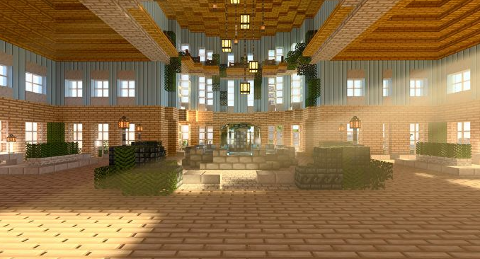
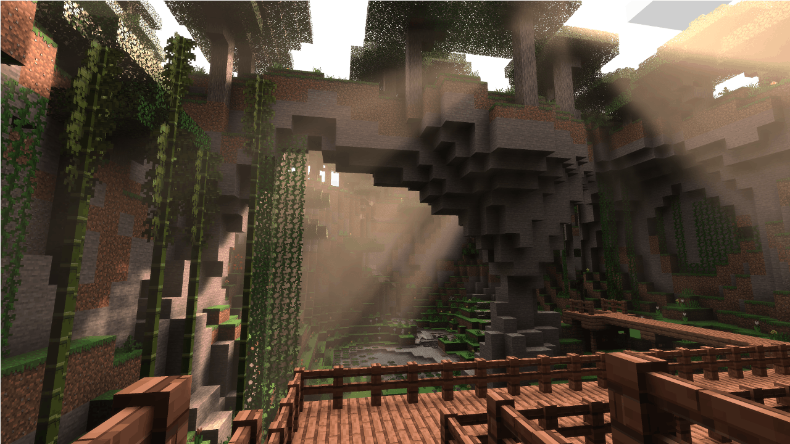
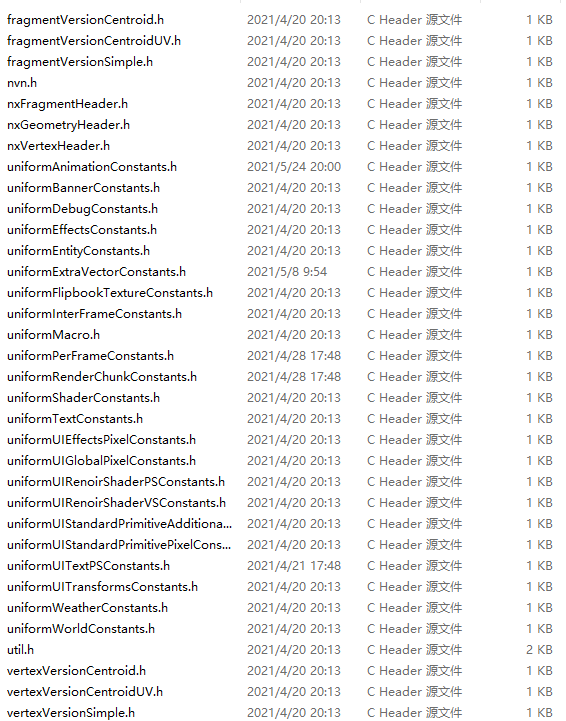

# 材质与着色器介绍

## 前言

本文将介绍游戏材质和着色器的基本概念，以及MC游戏中使用的着色器的基本编写与使用方式


## 材质和着色器

``材质``(material)定义了游戏物体的画面表现，用来描述一个游戏内的物体应该如何被渲染，其中的信息包括物体使用的纹理、**着色器**、采样方式、是否进行透明混合以及面片的剔除模式等。
``着色器``(shader)是一种依附于材质的渲染程序，用于具体实现材质在渲染时的某些逻辑，一般包括动画、着色、发光以及半透明等效果。
例如，一个砖块的材质一般需要定义一个不透明材质，规定这个材质仅使用一张纹理(一般是砖块贴图)，并指定一个着色器用来渲染这个砖块。砖块着色器会根据砖块的模型数据，结合砖块贴图、砖块位置以及场景光照等信息，计算出砖块在屏幕上对应像素的颜色。






## 在MC中定义材质

MC使用json来定义材质信息，这些信息包括使用哪些shader、启用哪些宏定义、启用哪些片元测试等。不同类型的材质会分开存放在不同的材质文件中，例如地形相关的材质会放在terrain.material文件中，实体、骨骼模型相关的材质会放在entity.material文件中，具体的对应关系可以参考[内置材质清单](./2-内置材质清单.md)，具体的材质配置格式可以参考[材质配置说明](./3-材质配置说明.md)或者参照具体的.material文件。

## OpenGL与GLSL

目前MC的渲染(非渲染龙)是基于OpenGL实现的，不同平台的不同设备支持的OpenGL版本各有不同，越高级的OpenGL版本能使用的特性就越多，但因此兼容的设备就越少，开发者应考虑shader所使用的特性是否能够兼容目标设备。

MC中的shader使用glsl进行编写，这是一种较为简单的类C语言，对于C或者C族系语言有所熟悉的开发者可以很快掌握。具体的glsl语法可以在参考[图形管线与GLSL简单入门](./6-图形管线与GLSL简单入门.md)。

## MC材质SDK接口

我的世界中国版允许使用python接口对材质产生运行时影响，涉及模块包括`后处理`、`网易骨骼模型`以及`原版模型`等，具体的使用方式我们将在后面的文档中进行举例介绍，更详细的说明可以在API文档页面中进行查询。后续我们会开发并开放更多有关材质的SDK接口给开发者使用。

## 材质中的宏

开发者可以自定义shader宏，可以通过在材质定义的`defines`字段中进行添加：
```json
"terrain_blend_far:terrain_blend": {
	"+defines": [ "FOG" ]
}
```
这里为`terrain_blend_far`材质增加了宏定义`FOG`，类似于C语言，我们可以在shader中使用`ifdef`或者`ifndef`针对`FOG`进行宏判断并做一些特殊逻辑处理：
```opengl
#ifndef FOG
	color.rgb += FOG_COLOR.rgb * 0.000001;
#endif
```

## 头文件

MC中的shader允许使用头文件，只要将头文件拓展名改为`.h`并放在`shaders/glsl`目录下，shader代码就可以引用这个头文件:
```opengl
#include "uniformWorldConstants.h"
```



## Uniform

在shader中除了使用顶点属性以外，引擎还会通过uniform变量向shader中传递很多有用的数据，大部份shader都依赖一些uniform变量进行计算。同时，开发者可以利用<a href="../../../mcdocs/1-ModAPI/接口/模型.html#setextrauniformvalue" rel="noopenner">SetExtraUniformValue接口</a>设置我们预留的Uniform变量值来实现效果。引擎内置的uniform变量定义在各个.h头文件中，下面将对常用的头文件及其中的uniform变量进行说明。

### uniformWorldConstants.h

生效时机：在渲染场景对象的shader中可以使用,里面包含当前场景相机对应的变换矩阵
```opengl
MAT4 WORLDVIEWPROJ : mvp矩阵乘积，用于把模型空间的坐标转化为裁剪空间坐标
MAT4 WORLD ： 世界矩阵，用于把模型空间的坐标转化为世界坐标
MAT4 WORLDVIEW ： mv矩阵乘积，用于把模型空间的坐标转化为视口空间的坐标
MAT4 PROJ ： 投影矩阵，用于把视口空间的坐标转化为裁剪空间坐标
```

### uniformPerFrameConstants.h

生效时机：每帧更新，所有shader中都可以使用
```opengl
vec3 VIEW_POS : 相机位置
float TIME ： 游戏启动到现在经过的时间，可以用于做一些动画，为了避免无限增长带来较大浮点误差，会取模210，处理数值边界的时候需要注意
vec4 FOG_COLOR : 雾的颜色
vec2 FOG_CONTROL ： 雾生效的距离，FOG_CONTROL.x为最短距离，FOG_CONTROL.y为最远距离
float RENDER_DISTANCE ： 可渲染的最远距离
float FAR_CHUNKS_DISTANCE : 区块渲染的最远距离（水下和雾会影响区块渲染的最远距离）
```

### uniformRenderChunkConstants.h

生效时机：渲染地形
```opengl
POS4 CHUNK_ORIGIN_AND_SCALE ： 基于玩家视角的Chunk的局部位置
POS4 CHUNK_WORLD_POS_MOD_VALUE ： 基于世界坐标的Chunk的世界位置，但由于MC地图很大，所以这里数值会取模128
float RENDER_CHUNK_FOG_ALPHA ： Chunk雾效的透明度
```

### uniformShaderConstants.h

生效时机：所有shader中都可以使用
```opengl
vec4 CURRENT_COLOR : 受群系等因素影响，场景中渲染的对象会对应的明亮两种颜色，这个为明亮的颜色。其它系统也可能复用此值作一些颜色传递
vec4 DARKEN : 受群系等因素影响，场景中渲染的对象会对应的明亮两种颜色，这个为暗的颜色。其它系统也可能复用此值作一些颜色传递
vec3 TEXTURE_DIMENSIONS ：当前渲染使用的第一张贴图的尺寸，常为图集贴图，x,y,z分别为宽，高，当前所处在mipmap的哪一级。常用于做抗锯齿处理
float HUD_OPACITY ： 一些ui渲染的透明度会变化，使用此值进行控制
```

### uniformWeatherConstants.h

生效时机：渲染天气元素的时候生效
```opengl
vec4 POSITION_OFFSET ： 当前天气渲染用的面片的坐标偏移
vec4 VELOCITY : 风速
vec4 ALPHA ： 存储当前的光照缩放值
vec4 VIEW_POSITION ： 相对于相机的位置
vec4 SIZE_SCALE ： 粒子大小的缩放值，粒子会根据投影，速度进行一定缩放
vec4 FORWARD ：当前视角的前向位置，一般用于把粒子往前放推一点，保证在相机前面
vec4 UV_INFO : 渲染时候的贴图的uv
vec4 PARTICLE_BOX : 播放粒子的区域大小
```

### uniformEntityConstants.h

生效时机：渲染实体的时候生效
```opengl
vec4 OVERLAY_COLOR ：覆盖该实体的颜色，例如生物被火烧、受到伤害或者苦力怕膨胀时的颜色。
vec4 TILE_LIGHT_COLOR : xyz代表光照强度，w代表光照方向。
vec4 GLINT_COLOR ： 附魔颜色
vec2 UV_OFFSET : 附魔纹理UV偏移
vec2 UV_ROTATION ： 附魔纹理UV旋转
vec2 GLINT_UV_SCALE ： 附魔纹理UV缩放值
```

### uniformFrameConstants.h

生效时机：每帧更新，所有shader中都可以使用
```opengl
float TOTAL_REAL_WORLD_TIME ：现实世界的时间流逝，单位为秒，范围为[0, 3600]。
```

### util.h

封装了抗锯齿的采样函数texture2D_AA
