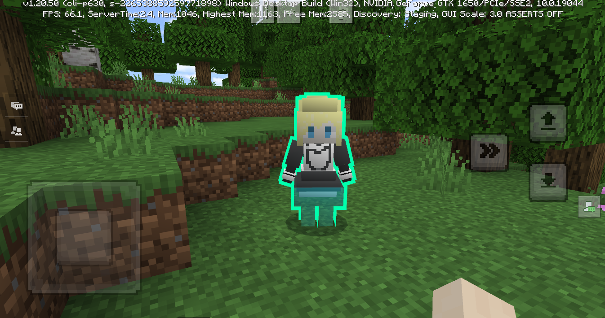
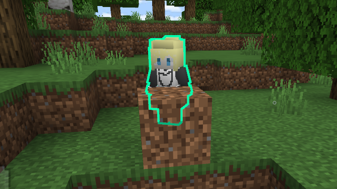

---
front:
hard: 入门
time: 分钟
---

# MC内置材质清单

## 前言

本文列出了MC游戏中常用的内置材质，若开发者需要修改使用某些材质，则可参考此文。

## 天空

### sky.material 材质文件

#### sun_moon

太阳和月亮

#### stars

星星

#### cubemap

用于渲染天空的六个面组成的天空盒

#### skyplane

用于渲染上方天空的颜色。游戏里面最上方会放置一个超大圆型网格，平行于地面

#### end_sky

用于渲染末地上方天空的颜色与贴图。游戏里面最上方会放置一个超大圆型网格，平行于地面

### fancy.material 、 sad.material 材质文件

#### clouds

云

## 地形方块(放置在地上的方块)

### terrain.material 材质文件

#### terrain_opaque

不透明地形方块

##### terrain_far

不透明地形方块在远处的时候会使用该材质进行渲染

#### terrain_blend

半透明地形方块材质，例如水，玻璃等

##### terrain_blend_far

半透明方块在远处的时候会使用该材质进行渲染

#### terrain_alpha

一些局部有全透明区域，而且正反面都需要渲染的方块材质，引擎中用到的有铁砧，竹子，铁轨，药水，仙人掌，珊瑚，农作物等等。

##### terrain_alpha_single_side

一些局部有全透明区域，但开启了背面裁剪只渲染一个面的材质，引擎中用到的有信标，胡萝卜，红石比较器，堆肥箱，门，蘑菇等等。

#### terrain_doubleside

目前用于渲染床

#### terrain_opaque_seasons

目前用于渲染上面覆盖有雪的不透明树叶

##### terrain_seasons_far

目前用于渲染远处上面覆盖有雪的不透明树叶

#### terrain_alpha_seasons

目前用于渲染上面覆盖有雪的半透明树叶

##### terrain_seasons_far_alpha

目前用于渲染渲染上面覆盖有雪的半透明树叶

### barrier.material 材质文件

#### barrier

屏障方块

### portal.material 材质文件

#### portal_base

末地传送门

## 非地形方块与实体（手持或者独立在场景中的）

### entity.material 材质文件

#### entity_static

静态实体

#### entity_flat_color_line

用于渲染钓鱼竿的线

#### entity_loyalty_rope

用于渲染拴绳

#### opaque_block 、 opaque_block_color 、 opaque_block_color_uv2

不透明方块渲染

#### alpha_block 、 alpha_block_color

带透明区域的方块

#### map

地图渲染

#### entity_alphablend 、 entity_alphablend_nocolor

带透明度混合的实体对象

#### item_in_hand 、 item_in_hand_multicolor_tint 、 item_in_hand_entity_alphatest_color 、 item_in_hand_glint

用于各种手持物品的渲染

#### moving_block 、 moving_block_seasons 、 moving_block_alpha_seasons 、 moving_block_alpha_single_side 、 moving_block_alpha 、 moving_block_double_side 、 moving_block_blend

用于渲染会动态变化的方块

### 网易扩展 entity.material 材质文件内容

文件位于data、resource_packs、vanilla_netease、materials目录下，主要是添加了骨骼模型渲染用的材质

#### 原版实体附加材质

这类材质为网易添加，可为对着色器了解比较少的开发者提供直接可用的特殊效果材质

**(1) 实体描边材质**

名称：

**netease_entity_outline，**

**netease_entity_alphatest_outline，**

**netease_entity_alphablend_outline**

效果：

为实体添加描边效果。

使用方法：

首先在想要添加该效果的实体的entity.json里声明相应的材质和添加对应的渲染控制器，例如在resource_pack/entity/myEntity.json：

```json
{
	"format_version": "1.8.0",
	"minecraft:client_entity": {
	  "description": {
		"identifier": "custom:my_entity",
		"materials": {
            // 实体默认的材质
			"default": "custom_entity",
            // 声明描边材质
			"outline": "netease_entity_outline"
		},
		// 忽略其他组件
		// ...
        // ...
		"render_controllers": [
            // 实体原本的渲染控制器
			"controller.render.default",
            // 添加对应描边渲染控制器，名称可由开发者自定决定
		    "controller.render.outline"],
         ]
        // 忽略其他组件
		// ...
        // ...
	  }
	}
 }
```

接着在渲染控制器文件里添加对应的描边渲染控制器描述，在描边渲染控制器中，我们需要使用**overlay_color**来控制描边颜色及宽度，以及使用**smooth_normal**来为模型添加平滑法向。例如在resource_pack/render_controllers/myEntity.render_controllers.json：

```json
{
	"format_version": "1.8.0",
	"render_controllers": {
		"controller.render.default": {
            "geometry": "Geometry.default",
            "materials": [ { "*": "Material.default" } ],
            "textures": [ "Texture.default" ]
		},
        // 添加在entity.json声明的描边渲染控制器
		"controller.render.outline": {
			"geometry": "Geometry.default",
			// 指定材质为entity.json中的"outline"
			"materials": [ { "*": "Material.outline" } ],
			"textures": [ "Texture.default" ],
            // 使用overlay_color来控制描边颜色和描边宽度
            // rgb为描边颜色，a为描边宽度，取值范围为[0, 1.0]
			"overlay_color": {
				"r": "1.0",
				"g": "1.0",
				"b": "0.5",
				"a": "0.25"
			},
            // 为了保持描边不受环境光影响，我们加上忽略环境光照的语句
			"ignore_lighting": true,
            // 为了使描边接缝处连续，我们在渲染模型时添加平滑法向
            "smooth_normal":true
		}
	}
}
```

**注意**：描边选用的材质需与实体本身的材质相对应。例如，实体本身材质使用了带alphatest材质（例如，entity_alphatest，针对带有透明贴图的实体），则描边材质需要选择对应的netease_entity_alphatest_outline。若使用了带alphablend材质（例如，entity_alphablend，针对带有半透明贴图的实体），则描边材质需要选择对应的netease_entity_alphablend_outline。否则实体的透明或者半透明部分描边可能显示不正确。

**可选**：若开发者们想要让模型始终保持渲染在描边的上层，不希望让描边穿插在模型上的话，我们可以使用蒙版测试(stencil test)来保证本体模型渲染在描边上层，这需要开发者在实体的材质上添加蒙版测试语句。为了让开发者使用方便，我们提供了添加蒙版测试的实体渲染材质示例：

**netease_entity_emissive_alpha_outline_base**

**netease_entity_alphatest_outline_base**

以上两种材质均可直接使用。

下面我们给出**netease_entity_emissive_alpha_outline_base**的详细定义，开发者可以参考这两种材质的实现来为自己的实体材质添加上蒙版测试：

```json
"netease_entity_emissive_alpha_outline_base:entity_emissive_alpha":{
    // 添加蒙版测试
    "+states": [
        "EnableStencilTest"
    ],
    // 添加蒙版前面配置策略
    "frontFace": {
        "stencilFunc": "Always",
        "stencilFailOp": "Keep",
        "stencilDepthFailOp": "Replace",
        "stencilPassOp": "Replace"
    },
    // 添加蒙版后面配置策略
    "backFace": {
        "stencilFunc": "Always",
        "stencilFailOp": "Keep",
        "stencilDepthFailOp": "Replace",
        "stencilPassOp": "Replace"
    },
    // 控制模板测试时从模板缓冲区中读取的哪些位会被使用及如何更新模板缓冲区中的值
    // 我们定义为117，这是由于描边材质中使用的mask值也是117
    "stencilRef": 117,
    "stencilReadMask": 117,
    "stencilWriteMask":117
}
```

以上两种材质使用方法如下：我们以上方的"custom:my_entity"为例，这个自定义实体使用的默认实体材质为"default": "custom_entity",我们找到这个实体定义文件（resource_pack/entity/myEntity.json)，在里面找到实体默认材质，将其改为**netease_entity_alphatest_outline_base**：

```json
{
	"format_version": "1.8.0",
	"minecraft:client_entity": {
	  "description": {
		"identifier": "custom:my_entity",
		"materials": {
            // 实体默认的材质，更改为配置了蒙版测试的实体材质
			"default": "netease_entity_alphatest_outline_base",
            // 声明描边材质，使用对应的alphatest描边材质
			"outline": "netease_entity_alphatest_outline"
		},
		// 忽略其他组件
		// ...
        // ...
		"render_controllers": [
            // 实体原本的渲染控制器
			"controller.render.default",
            // 添加对应描边渲染控制器，名称可由开发者自定决定
		    "controller.render.outline"],
         ]
        // 忽略其他组件
		// ...
        // ...
	  }
	}
 }
```

配置正确的话，获得描边效果如下图所示：



**可选**：部分开发者可能希望他们的描边能够不受阻挡物影响，始终能够穿透阻挡物显示出来。这时候我们可以为描边材质添加深度检测功能。这需要开发者首先自定义自己的描边材质，这个自定义的描边材质需要继承上述的网易描边材质。例如，我们在resource_pack/materials/entity.material自定义一个my_entity_alphablend_outline_with_depth_test:

```json
 // 继承网易描边材质netease_entity_outline, netease_entity_alphatest_outline或netease_entity_alphablend_outline
 // 这里我们继承了netease_entity_outline
 "my_entity_alphablend_outline_with_depth_test:netease_entity_outline":{
            // 为描边添加深度检测，always表示总是检测通过
			"depthFunc": "Always",
			// z-fighting 问题修复，防止边缘闪烁
			"depthBias": 0.0,
			"slopeScaledDepthBias": 0.1,
			"depthBiasOGL": 0.0,
			"slopeScaledDepthBiasOGL": 0.5
}
```

配置完成后可以有如下效果，可以看到描边穿透了前方的土方块显示了出来：



**(2) 实体发光材质**

名称:

**netease_entity_unlit，**

**netease_entity_alphatest_unlit，**

**netease_entity_alphablend_unlit**

效果：

让实体不受环境光效果影响，保持最大亮度。另外，这三个实体发光材质带有模版测试(stencil test)配置，因此可以直接与描边材质配合使用。

使用方法：

首先在想要添加该效果的实体的entity.json里声明该材质，例如在resource_pack/entity/myEntity.json：

```json
{
	"format_version": "1.8.0",
	"minecraft:client_entity": {
	  "description": {
		"identifier": "custom:my_entity",
		"materials": {
            // 指定实体使用发光材质
			"default": "netease_entity_unlit"
		},
		// 忽略其他组件
		// ...
        // ...
		"render_controllers": [
            // 实体原本的渲染控制器
			"controller.render.default"],
         ]
        // 忽略其他组件
		// ...
        // ...
	  }
	}
 }
```

接着还需要在渲染控制器文件里添加忽略光照描述，例如在

resource_pack/render_controllers/myEntity.render_controllers.json：

```json
{
	"format_version": "1.8.0",
	"render_controllers": {
		"controller.render.default": {
            "geometry": "Geometry.default",
            "materials": [ { "*": "Material.default" } ],
            "textures": [ "Texture.default" ],
            // 忽略环境光照
			"ignore_lighting": true
		}
	}
}
```

**（3) 实体金属光泽材质**

名称:

**netease_entity_metallic**，

**netease_entity_alphatest_metallic，**

**netease_entity_alphablend_metallic**

效果：

让实体带有金属光泽。另外，这三个实体金属光泽材质带有模版测试(stencil test)配置，因此可以直接与描边材质配合使用。

使用方法：

首先在想要添加该效果的实体的entity.json里声明该材质即可，例如在resource_pack/entity/myEntity.json：

```json
{
	"format_version": "1.8.0",
	"minecraft:client_entity": {
	  "description": {
		"identifier": "custom:my_entity",
		"materials": {
            // 指定实体使用金属光泽材质
			"default": "netease_entity_metallic"
		},
		// 忽略其他组件
		// ...
        // ...
	  }
	}
 }
```


#### 带有vip字眼的资源

通常为会员材质中使用到的资源，一般效果较好，Shader实现较复杂，可供学习参考

#### entity_for_skeleton 、 entity_for_skeleton_cpu

用于渲染普通的不透明骨骼模型

#### entity_for_skeleton_hide_cpu 、 entity_for_skeleton_hide

用于表现实体隐藏状态，效果是渲染纯色的半透明模型

#### entity_for_skeleton_alpha_cpu 、 entity_for_skeleton_alpha

用于渲染带透明度的骨骼模型

#### entity_for_skeleton_bright 、 entity_for_skeleton_bloom 、 entity_for_skeleton_glint 、 entity_for_skeleton_bloom_glint

某些骨骼模型会使用到各种特殊效果，例如高光，辉光，扫光效果。

#### entity_for_skeleton_frame_ani

用于实现骨骼模型序列帧动画

#### entity_for_skeleton_particle 、 entity_for_skeleton_alpha_particle 、 entity_for_skeleton_bloom_particle 、 entity_for_skeleton_bloom_glint_particle 、 entity_for_skeleton_bright_particle 、 entity_for_skeleton_frame_ani_particle 、 entity_for_skeleton_glint_particle 、 entity_for_skeleton_hide_particle

在上诉5种类型的材质下增加了用于粒子系统的Shader宏定义，可以让粒子系统发射出带有该材质的骨骼模型。

## 粒子

### particles.material 材质文件

#### particles_opaque

引擎原生的不透明粒子

#### particles_alpha

引擎原生的开启了透明度裁剪的粒子

#### particles_blend

引擎原生的带透明度的粒子

#### particles_effects

引擎原生带有特效UV变动效果的开启了透明度裁剪的粒子

#### common_particle、common_particle_add、common_particle_add_texture、common_particle_blend、common_particle_blend_texture

网易粒子系统，自定义粒子特效基本都是使用这些，功能与上述原生粒子相对应。

## 阴影

### shadows.material 材质文件

阴影的渲染使用了Stencil蒙版技术

#### shadow_front 、 shadow_back

在蒙板标记阴影的位置，未进行实际渲染

### shadow_overlay

对蒙板中被标记的位置进行真正的渲染

## UI

### ui3D.material 材质文件

包含场景中对象相关的一些特殊UI，或者天气相关UI的材质

#### selection_XXX

带有selection字眼的基本上都是选中方块或者实体后这个选中效果的渲染

#### selection_box

开启轮廓选择后指向某个对象会显示线框

#### name_tag、name_tag_depth_tested

实体头顶名字背景

#### sign_text、name_text_depth_tested

实体头顶名字文字

#### rain

雨

#### snow

雪

#### lightning

闪电

### ui.material 材质文件

UI界面上使用的UI材质

由于很多UI会使用相同的材质，每个材质可能会在多处进行使用，这里不一一列举每一处地方，这里只举例几个常见UI界面对象使用到的材质

#### 物品快捷栏

ui_textured_and_glcolor

#### 摇杆，上方的菜单按钮，右上方的移动，潜行，飞行等按钮，右下角的跳跃按钮

ui_texture_and_color

#### 背包或物品快捷栏中的物品图标

ui_item

#### 屏幕中心的十字光标

ui_crosshair

#### 加载场景的背景图

ui_cubemap

#### UI上的文字

ui_text

