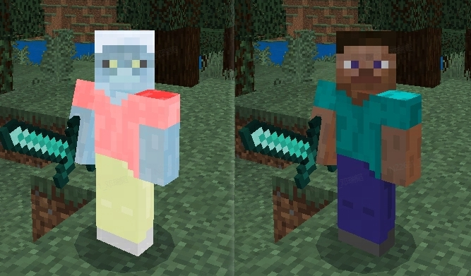
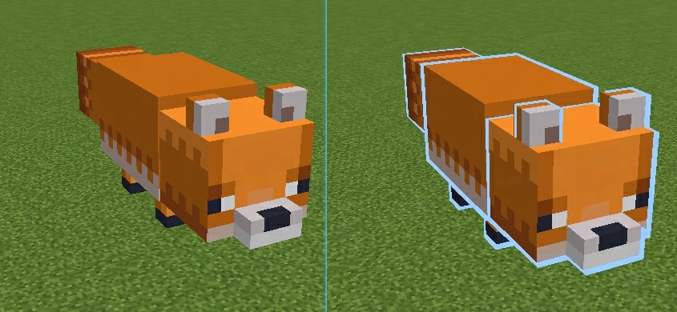

# 材质实战

## 前言

本文将举例介绍在《我的世界》中如何自定义材质。

## 自定义模型材质
MC支持自定义模型材质，包括原版实体材质以及网易骨骼模型材质，开发者可以参考之前的文档说明，结合已有的材质开发出自定义的材质效果。
* 原版实体材质可以参考`vanilla/materials/entity.material`下的`entity_static`材质族配置以及shader实现
* 网易骨骼模型材质可以参考`vanilla_netease/materials/entity.material`下的`entity_for_skeleton`材质族配置与shader实现

### 原版模型材质示例 - 玩家反色
本节将讨论如何一步步实现并使用玩家角色的反色材质，其效果大致如下：

图左是反色后的史蒂夫，图右是原史蒂夫。

#### 材质定义与配置流程<a name="matdef0"></a>
我们在`vanilla_netease/entity/player.entity.json`中可以看到玩家实体的相关配置，其中就包含了材质的引用信息：
```json
{
	"format_version": "1.10.0",
	"minecraft:client_entity": {
		"description": {
			"identifier": "minecraft:player",
			"materials": {
				"default": "entity_alphatest_netease", // 玩家默认材质名
				... // 其他材质属性
			},
			... // 其他属性
		}
	}
}
```
一般而言，玩家实体使用`default`字段值中的材质来进行渲染，也就是`entity_alphatest_netease`，我们可以在`vanilla_netease/materials/entity.material`文件中找到该材质：
```json
"entity_alphatest_netease:entity_nocull_netease": {
	"+defines": [
		"ALPHA_TEST"
	],
	"+samplerStates": [
		{
			"samplerIndex": 1,
			"textureWrap": "Repeat"
		}
	],
	"msaaSupport": "Both"
}
```
第一行表示`entity_alphatest_netease`材质继承自`entity_nocull_netease`材质。我们希望自定义一个反色材质，可以考虑复用现有材质的大部分属性，仅修改片元着色器的颜色输出，因此可以在`entity.material`中新增这样的材质定义：
```json
"entity_alphatest_netease_reverse:entity_alphatest_netease": {
	"fragmentShader": "shaders/glsl/entity_reverse.fragment"
}
```
它表示我们新增了一个名为`entity_alphatest_netease_reverse`的材质，并且复用了`entity_alphatest_netease`材质的属性，其中的片元着色器路径被我们自定义为我们将要实现的片元着色器文件路径。
回到玩家实体定义的文件`vanilla_netease/entity/player.entity.json`，我们还需要将刚才的玩家默认材质改为我们自定义的材质：
```json
"materials": {
	"default": "entity_alphatest_netease_reverse",
	... // 其他材质
}
```
这样一来，在材质文件中定义，在玩家实体配置中引用，就完成了玩家材质自定义相关的配置与使用流程，其他非玩家的原版材质也可以使用类似的思路来进行自定义。
>如果希望在游戏内动态修改玩家或者实体材质，我们可以使用AddPlayerRenderMaterial接口或者AddActorRenderMaterial接口，具体可以参考我们的API接口文档。

#### 顶点着色器实现
我们仅需要使玩家表现为反色，因此顶点着色器可以直接复用父材质的顶点着色器(entity.vertex)，不需要进行任何修改。

#### 片元着色器实现
找到`vanilla_netease\shaders\glsl\entity.fragment`文件，它是游戏内大多数实体材质所使用的片元着色器文件。将它复制一份，重命名为我们在材质定义中所写的名称`entity_reverse.fragment`，然后在最后的颜色输出代码处修改如下：
```glsl
color.rgb = vec3(1.0) - color.rgb; // 将颜色RGB通道取反色
gl_FragColor = color;
```
运行游戏进入存档，就可以看到类似开头示例图中的景象，玩家实体颜色被替换为了相反色。

### 骨骼模型材质示例 - Blinn-Phong光照

我们可以考虑给网易骨骼模型加上Blinn-Phong光照，该光照的具体实现原理可以参考[这里](https://learnopengl-cn.github.io/05%20Advanced%20Lighting/01%20Advanced%20Lighting/#blinn-phong)，效果如下：


#### 材质定义与配置流程
在骨骼模型配置文件`vanilla_netease\models\netease_models.json`中可以看到各个骨骼模型的配置，假设开发者拥有一个骨骼模型，其在`netease_models.json`中的配置如下：
```json
"model_example": {
	"dy_load": true,
	"mesh": "mesh/model_example_mesh.json",
	"skeleton": "skeleton/model_example_skeleton.json"
}
```
我们希望这个模型能够使用自定义的Blinn-Phong材质，因此我们在这个模型配置中加入对材质的引用信息，表示我们需要让这个骨骼模型使用自定义材质`my_blinn_phong`：
```json
"model_example": {
	"dy_load": true,
	"mesh": "mesh/model_example_mesh.json",
	"skeleton": "skeleton/model_example_skeleton.json",
	"material": "my_blinn_phong" // ***添加材质引用信息***
}
```
此时我们还需要定义材质，找到`vanilla_netease/materials/entity.material`文件，加入以下材质定义到`materials`字段内：
```json
"my_blinn_phong:entity_for_skeleton": {
	"fragmentShader": "shaders/glsl/my_blinn_phong.fragment",
	"vertexShader": "shaders/glsl/my_blinn_phong.vertex"
}
```
与[原版材质配置的材质定义](#matdef0)中的例子类似，我们定义一个名为`my_blinn_phong`的材质，继承自`entity_for_skeleton`材质，并且覆盖它的顶点着色器与片元着色器路径。至此，骨骼模型的材质定义与引用就完成了，接下来将讨论如何实现这个材质。
>同样地，骨骼模型也有动态替换材质的接口：SetModelMaterial，具体可以参考API文档中的说明。

#### 顶点着色器实现
* 复制一份`netease_entity_skeleton.vertex`代码并重命名，得到待修改的代码模板。
* 在main函数以外的地方定义`positionWS`与`normalWS`两个varying，用于做后面的片元着色计算:
```glsl
varying vec3 positionWS; // 模型世界位置
varying vec3 normalWS; // 模型世界法线
```
* 不同设备的默认精度不同，为了保证计算结果精确可控，我们在开头声明浮点数的精度为`highp`:
```glsl
precision highp float;
```
* 在main函数中计算`positionWS`与`normalWS`这2个变量的值:
```glsl
positionWS = (WORLD * entitySpacePosition).xyz;
normalWS = normalize((WORLD * entitySpaceNormal).xyz);
```
完整代码：
```glsl
// __multiversion__
// This signals the loading code to prepend either #version 100 or #version 300 es as apropriate.
precision highp float;

#include "neteaseModelVertexUtil.h"
#line 6

varying vec4 fogColor; // 雾色与雾强度 vec4(r, g, b, 雾强度)
varying vec3 positionWS; // 模型世界位置
varying vec3 normalWS; // 模型世界法线

void main() {
	POS4 entitySpacePosition, entitySpaceNormal;
	// 计算顶点动画 得到模型空间位置与法线
	getEntitySpacePositionAndNormal(entitySpacePosition, entitySpaceNormal);

	calculateOverlayColor(); // 受伤变红等效果
	calculateGlint(); // 计算附魔效果相关变量

	// 包含其他内置宏相关的varying计算
	neteaseModelCommonVert();

	// 变量uv已经在头文件中预先声明 这里使用TEXCOORD_0作为uv值
	uv = TEXCOORD_0;
	// 计算顶点uv 包括MC支持的UV序列帧效果
	applyUVAnim(uv);

	// 变换到投影空间
	POS4 projSpacePos = WORLDVIEWPROJ * entitySpacePosition;
	gl_Position = projSpacePos;

	positionWS = (WORLD * entitySpacePosition).xyz;
	normalWS = normalize((WORLD * entitySpaceNormal).xyz);

	// 根据投影位置 计算雾的效果
	fogColor = getFogColor(projSpacePos);
}
```

#### 片元着色器实现

* 复制一份`netease_entity_skeleton.fragment`代码并重命名，得到待修改的代码模板。
* 与顶点着色器对应，在main函数以外的地方定义`positionWS`与`normalWS`两个varying:
```glsl
varying vec3 positionWS; // 世界空间位置
varying vec3 normalWS; // 世界空间法线
```
* 根据`Blinn-Phong`着色模型进行计算，将光照结果与贴图颜色相乘，具体代码见下方完整版
* 由于MC并没有真正的实时光源，因此在着色器中假设了一个处于较高处(200.0, 1000.0, 200.0)的纯白色光源

完整代码：
```glsl
// __multiversion__
// This signals the loading code to prepend either #version 100 or #version 300 es as apropriate.
precision highp float;

#include "neteaseModelFragmentUtil.h"
#include "uniformPerFrameConstants.h"
#line 7

LAYOUT_BINDING(0) uniform sampler2D TEXTURE_0;
LAYOUT_BINDING(1) uniform sampler2D TEXTURE_1;

varying vec4 fogColor; // 雾色与雾强度 vec4(r, g, b, 雾强度)
varying vec3 positionWS; // 世界空间位置
varying vec3 normalWS; // 世界空间法线

void main() {
	// 根据uv获取纹理色 如果是用了NO_TEXTURE宏则会返回 1.0
	vec4 color = getSampledColor(TEXTURE_0, uv);

	// 杂项的内置宏功能
	neteaseModelCommonFrag(color);

	// 加入受击变红等效果
	applyOverlayColor(color);

	// 附魔变色效果 使用TEXTURE_1
	applyGlint(TEXTURE_1, color);

	// 雾效果
	applyFog(color, fogColor);

	// 光照计算
	// 高处白光
	vec3 lightColor = vec3(1.0, 1.0, 1.0);
	vec3 lightPos = vec3(200.0, 1000.0, 200.0);
	// 环境光
	vec3 ambient = vec3(0.2) * lightColor;
	// 漫反射光
	vec3 lightDir = normalize(lightPos - positionWS);
	float diff = max(dot(normalWS, lightDir), 0.0);
	vec3 diffuse = diff * lightColor;
	// 镜面反射光
	vec3 viewDir = normalize(VIEW_POS.xyz - positionWS);
	// Blinn-Phong 反射光
	vec3 halfwayDir = normalize(lightDir + viewDir);
	float spec = pow(max(dot(normalWS, halfwayDir), 0.0), 32.0);
	vec3 specular = lightColor * spec;
	color.rgb *= clamp(diffuse + specular + ambient, 0.3, 1.0);

	gl_FragColor = color;
}
```
#### 调出模型
打开游戏，使用python脚本执行以下代码，将玩家模型变为引用了自定义材质的自定义模型，即可看到开头所示的效果：
```python
import mod.client.extraClientApi as clientApi
comp = clientApi.GetEngineCompFactory().CreateModel(playerId) # playerId为玩家实体ID
comp.SetModel("model_example")
```

## 自定义多pass
### 配置说明
2.8版本开放了自定义多pass的特性，目前开发者可以通过对骨骼模型配置多pass材质，实现更多效果。开发者仅需修改`netease_models.json`中的模型配置，将模型配置中的`material`字段配置成数组即可：
```json
{ // netease_models.json
	"model_example": {
		"dy_load": true,
		"mesh": "mesh/model_example_mesh.json",
		"skeleton": "skeleton/model_example_skeleton.json",
		"material": ["entity_for_skeleton", "netease_drawline_example"] // ****多pass材质数组****
	}
}
```
可以看到模型`model_example`中的`material`字段被配置为了由两个材质组成的数组，第一个材质是网易骨骼模型材质`entity_for_skeleton`，第二个材质是2.8新增的内置描边材质`netease_drawline_example`。
在渲染模型时，引擎会**按顺序**渲染配置中的材质数组，在这个例子中，模型`model_example`会首先使用材质`entity_for_skeleton`渲染一次，再使用材质`netease_drawline_example`渲染一次。
### 示例 - 描边效果
描边效果一般用来表示玩家被选中，或者提供高亮效果，可以使用多pass的特性来实现。

#### 描边材质定义
开发者可以在`vanilla_netease/materials/entity.material`中找到新增的内置描边材质`netease_drawline_example`定义:
```json
"netease_drawline_example:entity_for_skeleton": {
	"+states": [
		"InvertCulling"
	],
	"vertexShader": "shaders/tutorial/glsl/netease_drawline.vertex",
	"fragmentShader": "shaders/tutorial/glsl/netease_drawline.fragment"
}
```
材质首先启用了逆(invert)反向剔除，也就是`正向剔除`，然后重新指定了描边shader代码路径。
```
反向剔除(Back-face Culling)是一种节省渲染开销的技术，其原理是将没有面朝相机的三角面抛弃，不进行渲染
```
#### 顶点着色器实现
描边材质的着色器比较简单，可以删除多余的计算节省开销，一般只要将顶点沿法线方向外扩，让描边部分超出模型范围一点点即可。在这里我们可以使用 `模型中心(0.0, 0.5, 0.0)` 到 `顶点位置(entitySpacePosition.xyz)` 的方向作为外扩方向:
```glsl
// __multiversion__
// This signals the loading code to prepend either #version 100 or #version 300 es as apropriate.
#include "neteaseModelVertexUtil.h"
#line 4

const vec4 DRAWLINE_PARAM = vec4(0.6, 0.8, 1.0, 0.025); // (描边颜色RGB, 描边宽度倍率)
varying vec4 fogColor; // 雾色与雾强度 vec4(r, g, b, 雾强度)

void main() {
	POS4 entitySpacePosition, entitySpaceNormal;
	// 计算顶点动画 得到模型空间位置与法线
	getEntitySpacePositionAndNormal(entitySpacePosition, entitySpaceNormal);

	// 放大轮廓
	vec3 vertexDir = normalize(entitySpacePosition.xyz - vec3(0.0, 0.5, 0.0));
	entitySpacePosition.xyz += vertexDir * DRAWLINE_PARAM.a;

	// 变换到投影空间
	POS4 projSpacePos = WORLDVIEWPROJ * entitySpacePosition;
	gl_Position = projSpacePos;

	// 根据投影位置 计算雾的效果
	fogColor = getFogColor(projSpacePos);
}
```
#### 片元着色器实现
在片元着色阶段，我们可以只输出一个纯色：
```glsl
// __multiversion__
// This signals the loading code to prepend either #version 100 or #version 300 es as apropriate.
#include "neteaseModelFragmentUtil.h"
#line 4

const vec4 DRAWLINE_PARAM = vec4(0.6, 0.8, 1.0, 0.025); // (描边颜色RGB, 描边宽度倍率)
varying vec4 fogColor;

void main() {
	vec4 color = vec4(DRAWLINE_PARAM.rgb, 1.0);

	// 雾效果
	applyFog(color, fogColor);

	gl_FragColor = color;
}
```
>代码中的`DRAWLINE_PARAM`可以改为`EXTRA_VECTOR`，并使用`SetExtraUniformValue`接口动态实现动态修改描边颜色

## 自定义后处理
### 介绍
2.8新增了自定义后处理特性，开发者可以参考文档说明，结合已有的内置后处理实现，增加自定义后处理效果。
后处理是在场景渲染完毕后额外的全屏渲染流程，通常需要根据当前的渲染结果(深度、颜色以及法线等)，额外增加特殊的渲染处理，例如景深、滤镜、bloom、色调映射等效果。
### 配置说明
要新增自定义的后处理效果，就需要定义后处理所使用的材质。在`postprocess.materal`中，可以自定义后处理专属的材质，其定义方式与其他材质类似，也可以仿照内置的后处理材质配置来实现。在graphics_settings文件夹下的`post_process.json`内，我们可以配置自定义后处理，大致格式如下：
```json
{ // post_process.json
	"render_order": [ // 后处理渲染顺序
		... // 其他内置后处理效果

		// 开发者自定义后处理效果名称
		"my_post"
	],
	"process_array": [ // 后处理定义列表
		... // 其他内置后处理定义

		// 开发者自定义后处理配置
		{
			"name": "my_post",
			"enable": false,
			"paras": [
				{ "name": "param0", "value": 0.1, "range": [0.0, 1.0] },
				{ "name": "param1", "value": [1.0, 2.0], "range": [0.0, 1.0] },
				{ "name": "param2", "value": [1.0, 2.0], "range": [0.5, 16.0] }
			],
			"pass_array":[
				{
					"render_target":{"width":1.0, "height":1.0},
					"material":"my_post_material",
					"depth_enable": false,
					"bindTexture": [
                        {
                            "texture": "textures/postprocess/my_post_texture0"
                        },
                        {
                            "texture": "textures/postprocess/my_post_texture1"
                        }
                     ]
				}
			]
		}
	]
}
```
以下是对于这个配置的解读：
* `render_order`是后处理渲染顺序表，表示各个后处理效果的先后渲染顺序。
* `process_array`包含了各个后处理效果的定义，其中`name`表示后处理名称，与`render_order`字段中的名称对应，`enable`表示游戏内是否默认开启。
* `paras`定义了后处理shader中使用到的自定义参数名称、值以及值的范围。自定义参数可以是`float` `vec2` `vec3` `vec4`四种类型，这取决于它们的`value`字段值。例如，`param0`是`float`类型，因为它的`value`字段值是一个数，而`param1`和`param2`是`vec2`类型，因为它们的`value`字段值都是长度为2的数组。
* pass_array：后处理pass数组，每个pass包含一个`material`以及`render_target`字段。
* 渲染自定义后处理效果时，`paras`字段的自定义参数会按照顺序排列，并通过名为`EXTRA_VECTORx`的四维向量传递给shader使用(末尾的x是1到4的整数)。在本例中，自定义参数的总长度为1+2+2=5，因此游戏会使用两个vec4参数传递给shader：
```glsl
uniform vec4 EXTRA_VECTOR1; // vec4(param0, param1.x, param1.y, param2.x)
uniform vec4 EXTRA_VECTOR2; // vec4(param2.y, ?, ?, ?) // 问号表示冗余 不确定值
```
于是开发者就可以通过`EXTRA_VECTOR`编写参数相关的逻辑。关于`EXTRA_VECTOR`与`SetExtraUniformValue`接口的使用可以参考开发指南或MODSDK的其他文档。
* 自定义后处理pass额外支持了`bindTexture`字段，用于更灵活的使用外部纹理信息。配置的贴图按照顺序依次绑定至纹理单元槽。
绑定的纹理单元槽位分为两种情况：
（1）`depth_enable`为false时，依次绑定至`[2-7]`号纹理单元槽位。
（2）`depth_enable`为true时，依次绑定至`[3-7]`号纹理单元槽位。
`depth_enable`默认为false。这么做的原因是深度纹理会占据2号纹理单元槽位，避免引起冲突。

### 自定义后处理中可使用的Shader宏变量

目前我们设置了多个可在自定义后处理中使用的shader宏变量，他们包含了多种游戏中的环境参数。如下表所示。

| 宏变量名称         | 格式                      | 包含参数                                           | 备注                                                                                                                                                                                                                                                                                                                                                                           |
| ------------------ | ------------------------- | -------------------------------------------------- | ------------------------------------------------------------------------------------------------------------------------------------------------------------------------------------------------------------------------------------------------------------------------------------------------------------------------------------------------------------------------------ |
| WORLD_PARAMETERS   | vec3(int, float, float)   | 玩家所在维度id，星星亮度，环境光亮度               | 1. 玩家所在维度id。id=0(主世界)，id=1(下界)，id=2(末地)，id>=3(自定义维度)。<br />2. 星星亮度。该值与<a href="./../../../mcdocs/1-ModAPI/接口/世界/渲染.html#GetStarBrightness">GetStarBrightness接口</a>所返回的值一致。<br />3. 环境光亮度。该值与<a href="./../../../mcdocs/1-ModAPI/接口/世界/渲染.html#GetAmbientBrightness">GetAmbientBrightness接口</a>所返回的值一致。 |
| TIME_PARAMETERS    | vec2(float, float)        | 自当天日出后流逝的游戏刻数，世界总共流逝的游戏刻数 | 1. 自当天日出后流逝的游戏刻数，与`/time query daytime`指令所得出值一致。<br />2. 世界总共流逝的游戏刻数，与`/time query worldtime`指令所得出的值一致。                                                                                                                                                                                                                         |
| WEATHER_PARAMETERS | vec3(int, float, float)   | 天气类型，降雨等级，打雷等级                       | 1. 天气类型。值为0表示晴天，值为1时表示下雨，值为2时表示雷暴。<br />2. 降雨等级。目前世界的降雨强度，值范围为[0,1]。<br />3. 打雷等级。目前世界的打雷强度，值范围为[0,1]。                                                                                                                                                                                                     |
| CAMERA_POSITION    | vec3(float, float, float) | 相机位置                                           | 玩家相机的位置。                                                                                                                                                                                                                                                                                                                                                               |
| PLAYER_POSITION    | vec3(float, float, float) | 玩家位置                                           | 玩家的世界位置。                                                                                                                                                                                                                                                                                                                                                               |
| SKY_COLOR          | vec3(float, float, float) | 天空颜色                                           | 天空盒的颜色。只有开启了精美天空选项时该值才有效，否则该值为0。                                                                                                                                                                                                                                                                                                                |

以上宏变量均可在fragment shader或者vertex shader中使用。下面我们使用fragment shader作为示例：

```glsl
// ... 忽略其他shader代码 ...

uniform vec3 WORLD_PARAMETERS; // (玩家所在维度id，星星亮度，环境光亮度)
uniform vec3 PLAYER_POSITION;  // (玩家位置)

void main(){
	vec4 base_color = texture( TEXTURE_0, uv );
    if(WORLD_PARAMETERS.x == 1) { // 如果维度是下界，则增加亮度
    	base_color *= 2.0;
    }
    if(PLAYER_POSITION.y <= 16) { // 如果玩家位置高度低于16，则改变颜色
        base_color.r *= 2.0;
    }
    gl_FragColor = base_color;
}
```


### 示例 - 老电视机滤镜
该效果名为`oldtv`，是2.8版本新增的内置后处理效果，开发者可以使用IMGUI查看，或者使用后处理的`SetEnableByName`接口开启查看。


#### 后处理定义
开发者可以直接参考包体内的`graphics_settings/post_process.json`以及`materials/postprocess.material`中的`old_tv`材质，查看具体的后处理配置以及后处理材质定义。
#### 顶点着色器实现
直接复用内置的顶点着色器`shaders/glsl/uv_fullscreen.vertex`，是用于全屏渲染的简单顶点着色器：
```glsl
// __multiversion__
// This signals the loading code to prepend either #version 100 or #version 300 es as apropriate.

#include "vertexVersionCentroidUV.h"
#include "uniformWorldConstants.h"

attribute POS4 POSITION;
attribute vec2 TEXCOORD_0;

void main()
{
    gl_Position = vec4(POSITION.xyz, 1.0);
    uv = TEXCOORD_0;
}
```
#### 片元着色器实现
具体思路是各种效果的叠加，包括噪声、划痕、色调映射以及黑边等，可以参考包体内的`shaders/tutorial/glsl/old_tv.fragment`代码，在此仅贴出部分实现：
```glsl
uniform vec4 EXTRA_VECTOR1; // (density 雪花密度, strength 雪花强度, snow_size 雪花大小, noise_fps 噪声频率)
uniform vec4 EXTRA_VECTOR2; // (black_zone 黑边占屏幕比率, ?, ?, ?)

void main(){
	vec4 base_color = texture( TEXTURE_0, uv );
	float time_flow = floor(TIME * EXTRA_VECTOR1.a) / EXTRA_VECTOR1.a;

	// 白噪声
	vec2 snow_uv = floor(uv * vec2(1.6, 0.9) * (2048.0 / EXTRA_VECTOR1.b)) * EXTRA_VECTOR1.b;
	float r = rand(snow_uv + time_flow);
	r = step(1.0 - EXTRA_VECTOR1.r, r);

	// 纵向的随机划痕 增加陈旧的观感
	float glitch = rand(uv.xx * 1024.0 + time_flow);
	glitch = step(0.999, glitch);

	// 颜色滤镜 叠加灰度感 让画面发旧
	float gray = dot(base_color.rgb, vec3(0.2126729, 0.7151522, 0.0721750));
	base_color.rgb = vec3(gray * 0.4) + base_color.rgb * vec3(0.6, 0.55, 0.5);

	// 中心的噪声需要淡出 防止遮挡视野
	float dist_to_center = length(uv - vec2(0.5, 0.5));
	dist_to_center *= dist_to_center;

	vec3 final_color = base_color.rgb + vec3((r + glitch) * EXTRA_VECTOR1.g * dist_to_center);

	// 电影黑边
	float black_zone = step(min(uv.y, 1.0 - uv.y), EXTRA_VECTOR2.r * 0.5);
	final_color = (1.0 - black_zone) * final_color.rgb;

	gl_FragColor = vec4(final_color, 1.0);
}
```

### 示例 - 地形扫描效果

介绍基于MC后处理框架的扫描效果的实现，效果如图。另外，目前在部分移动端受限于精度问题，表现异常。


#### scan_map.fragment
如下为MC自定义后处理框架下扫描效果的配置。render_order表示渲染顺序，其中的值对应process_array.name的值，process_array.enable表示是否开启，process_array.paras表示可调参数，最后以uniform变量EXTRA_VECTOR1的形式传进片元着色器中。process_array.pass_array.render_target表示渲染范围，此处表示全屏幕，process_array.pass_array.material表示使用的材质，process_array.pass_array.depth_enable表示是否需要深度图，开启后可以在片元着色器中的TEXTURE_2拿到深度图。
```json
{
	"render_order": [
		"scanmap"
	],
	"process_array": [
		{
			"name": "scanmap",
			"enable": false,
			"paras": [
				{ "name": "color", "value": [1.0, 1.0, 1.0], "range": [0.0, 1.0] },
				{ "name": "freq", "value": 2.0, "range": [0.0, 10.0] }
			],
			"pass_array":[
				{
					"render_target":{
						"width":1.0,
						"height":1.0
					},
					"material":"scan_map",
					"depth_enable": true
				}
			]
		}
	]
}
```
如下为MC后处理框架下扫描效果的片元着色器。引入fragmentVersionCentroidUV.h头文件是为了拿到纹理对应的uv坐标，引入uniformPerFrameConstants.h头文件是为了其中的TIME变量，引入uniformWorldConstants.h头文件是为了其中的PROJ和WORLDVIEW变量，引入uniformRenderChunkConstants.h头文件是为了其中的CHUNK_ORIGIN_AND_SCALE变量，具体每个uniform变量的作用详见[材质介绍与入门](./1-材质介绍与着色器入门.md)。

扫描效果大致是根据各点与相机的距离，由近到远地让一定距离范围内的点提高亮度，同时在提亮的区域内划分出格子。其中，各点与相机的距离可以从深度图恢复出线性深度以便计算，由于MC的shader中的坐标系是基于相机为原点的，所以还需要利用CHUNK_ORIGIN_AND_SCALE才能保证网格不随玩家的移动而移动。然后划分格子就是根据世界坐标做一些取余操作，提取出靠近0的部分进行高亮。最后，做一些边缘淡出效果即可。

```glsl
// __multiversion__
// This signals the loading code to prepend either #version 100 or #version 300 es as apropriate.
#include "fragmentVersionCentroidUV.h"
#include "uniformPerFrameConstants.h"
#include "uniformWorldConstants.h"
#include "uniformRenderChunkConstants.h"
#line 7

LAYOUT_BINDING(0) uniform sampler2D TEXTURE_0;
LAYOUT_BINDING(1) uniform sampler2D TEXTURE_1;
LAYOUT_BINDING(2) uniform sampler2D TEXTURE_2;

uniform vec4 EXTRA_VECTOR1; // (red 扫描颜色r, green 扫描颜色g, blue 扫描颜色b, freq 频率)

highp vec3 get_world_position(vec2 uv, float z) {
	highp vec4 pos_clip = vec4(uv, z, 1.0) * 2.0 - 1.0;
	highp vec4 pos_world = inverse(PROJ*WORLDVIEW) * pos_clip;
	return pos_world.xyz / pos_world.w;
}

void main() {
	vec4 color = texture2D(TEXTURE_0, uv);
	float depth = texture2D(TEXTURE_2, uv).r;

	highp vec3 world_pos = get_world_position(uv, depth);
	world_pos -= mod(CHUNK_ORIGIN_AND_SCALE.xyz, 1.0);
	float dist = length(world_pos);

	float peak = mod(TIME * EXTRA_VECTOR1.a * 10.0, 100.0);
	float fade = 1.0 - clamp((peak - 90.0) / (100.0 - 90.0), 0.0, 1.0);
	float highlight_area = clamp(1.0 - (abs(dist - peak) * 0.1), 0.0, 1.0) * fade;

	vec3 grid = 1.0 - abs(mod(world_pos, 1.0) * 20.0 - 1.0);
	float border_area = clamp(max(grid.r, max(grid.g, grid.b)), 0.0, 1.0);

	color.rgb = mix(color.rgb, vec3(EXTRA_VECTOR1.r, EXTRA_VECTOR1.g, EXTRA_VECTOR1.b), highlight_area * border_area);
	gl_FragColor = color;
}
```

## 材质使用示例

我们提供了一些材质配置使用示例给开发者参考，开发者可到MC Studio的内容库中进行搜索。

（1）CustomEntityMaterialMod

​           该模组演示了如何配置和使用自定义生物的自定义材质的功能。

（2）CustomPlayerMaterialMod

​           该模组演示了如何配置和使用玩家自身（BB模型）的自定义材质的功能。

（3）CustomSkeletonMaterialMod

​           该模组演示了如何配置和使用骨骼模型的自定义材质的功能。

（4）CustomNeteaseParticlesMod

​           该模组演示了如何配置和使用网易版粒子特效的自定义材质的功能。

（5）CustomPostprocessMod

​           该模组演示了如何配置和使用自定义后处理的功能。