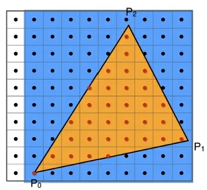
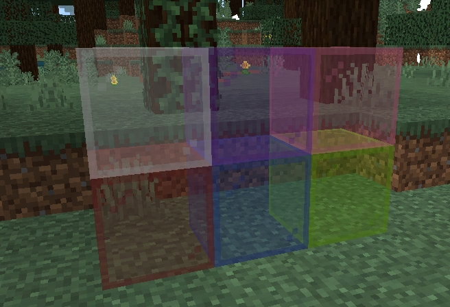
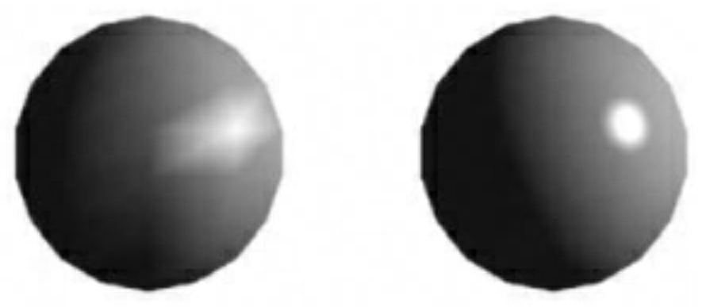

---
front:
hard: 入门
time: 20分钟
---

# 图形管线与GLSL简单入门

## 前言
本文将简单介绍图形管线、shader与glsl相关内容，并提供一些相关的学习建议。

## 图形管线与着色器
### 什么是图形管线
图形管线也叫渲染管线，是将渲染数据（例如模型、材质、贴图等内容）进行整合、运算并最终显示到屏幕的流程。渲染管线将渲染的整个流程划分为了若干个阶段，每一个阶段的计算过程都依赖上一个阶段的计算结果，就像工厂内的生产流水线，每一个环节都有专门的步骤来对原材料进行加工，这就是它被称为渲染管线或渲染流水线的原因。

### 图形管线阶段
图形管线简单而言可以分为`程序阶段`、`几何阶段`以及`光栅化阶段`三大阶段，每一大阶段又由若干个小阶段或者细节构成。
#### 程序阶段
程序阶段又称为应用阶段，这个阶段是由CPU负责完成的。在这个阶段中，CPU需要处理待渲染的数据，包括加载资源，物理计算，计算相机、光源、场景模型以及人物等对象的位置与动画帧，剔除冗余的渲染数据（可能会使用到**动态加载**、**遮挡剔除**以及**可见性剔除**等技术），并最终将这些数据整理成GPU可理解的形式（位置、法线、uv坐标、切线以及颜色值等），提交给GPU来进行下一个阶段的计算。

#### 几何阶段
程序阶段的数据提交到GPU之后，几何阶段就开始了。渲染数据在几何阶段中主要以几何图形数据的形式存在，在这个阶段中，开发者可以定义用于几何阶段的着色器（顶点着色器、曲面细分着色器、几何着色器等），并且配置几何阶段的相关操作。
一般而言，渲染数据在几何阶段会经过**顶点着色**、**曲面细分**、**几何着色**、**裁剪**、**屏幕映射**等过程。
`顶点着色`：开发者可以开发**顶点着色器**来自定义这一阶段，一般用于计算顶点动画（skinning）、空间变换、顶点光照以及完成其他逐顶点计算操作。
`曲面细分与几何着色`：开发者可以编写曲面细分着色器以及几何着色器来自定义这两个阶段，它们一般用来实现LOD、模型平滑与毛发等涉及顶点增删的操作。
`裁剪`：这个阶段用来将相机看不见的渲染数据剔除掉，以节省接下来的运算性能。例如，完全超出屏幕可见范围、没有面向相机或者距离相机极远的三角形都会被直接抛弃，无法进入下一个渲染管线阶段。在默认情况下，渲染管线会开启`背面剔除`，也就是将没有面朝相机的三角形抛弃，仅保留面朝相机的部分，这一操作可以节省后续阶段大约一半的渲染开销。当然，裁剪模式也可以配置为`前面剔除`，也就是保留背对相机的三角形，抛弃面向相机的三角形。
`屏幕映射`：在完成了裁剪操作后，GPU会将剩余三角形的各个顶点坐标，转化为屏幕坐标，然后交由接下来的光栅化阶段进行计算。

#### 光栅化阶段
光栅化阶段负责将几何阶段传递过来的几何信息，转换为屏幕上的颜色信息。具体而言，光栅化可以包括这些阶段：
`图元组装和三角形遍历`：这两个过程负责处理几何阶段传入的几何数据，整理并计算每一个三角形在屏幕上占据哪些像素，并根据像素位置与三角形顶点的位置关系进行插值，生成**片元**。
> 片元是顶点数据经过三角形遍历后的插值结果，同时还额外包含了一些着色器内部定义的信息，可以理解为候选像素。


`片元着色`：开发者可以编写**片元着色器**来自定义这一阶段，片元着色通过结合片元数据（屏幕坐标、uv值、深度值等）和程序给定的数据（例如游戏时间、纹理、光照信息等），并依照一定规则来计算**片元**的颜色与透明度等信息。
`片元测试`：在完成片元着色后，所有片元都将经过深度测试、透明度测试、模板测试等测试操作，这些测试分别检查片元深度、片元透明度、片元模板值是否能够满足某个比较条件（大于、等于、小于或者不等于）。如果片元没有通过其中一种测试，那么这个片元会被丢弃，例如透明度为0的片元一般不能够通过透明度测试，因为这个片元会被认为是看不见的。
`混合`：完成片元测试之后，管线会根据由远及近的顺序，对单个像素下的所有剩余片元进行透明度混合。透明度混合的计算方式（例如背景色与前景色的权重等）可以由开发者配置。通过透明度混合，我们才能看到常见的水面遮蔽河床，或者有色玻璃覆盖后方的景象:


### 着色器
着色器是一系列可以在GPU图形管线上运行的程序的总称，《我的世界》允许使用`顶点着色器`与`片元着色器`进行材质开发，它们分别在**顶点着色阶段**和**片元着色阶段**起作用。

***顶点着色器***(Vertex Shader)是基于三角形顶点进行计算的。在顶点着色器中，开发者可以拿到一个顶点的位置、法线以及uv等信息，并采用逐顶点的算法，例如顶点动画计算以及逐顶点光照等，最后输出顶点的位置信息以及其他自定义的变量信息。由于游戏中的顶点数量往往都比片元要少得多，因此如果将片元着色器中的耗时计算操作迁移至顶点着色器来进行（例如计算玩家视线方向、计算变换矩阵等），一般都能够使材质的性能得到显著提升，但是涉及表现力的部分会大打折扣。

上图中，左边为逐顶点光照，右边为逐像素（逐片元）光照，可以看到逐顶点光照的效果不均匀而且粗糙，逐片元光照的效果更为细腻而且均匀。
**片元着色器**(Fragment Shader)是基于片元进行计算的。在片元着色器中，开发者可以获取由顶点着色器传递下来的插值信息（uv值、位置信息、颜色值等），并进行逐片元/像素的计算。片元可以视为经过插值之后的候选像素，单次渲染的数量一般比顶点数更高，因此逐顶点的算法能够带来更细致且精确的效果，但是性能开销也比逐顶点计算更高。

上图为基于片元着色器的法线贴图效果，方块模型本身仅有简单的六个面，但是使用了逐片元的法线贴图，可以使方块表面在视觉上呈现凹凸不平的效果。

## GLSL入门
### 什么是GLSL
GLSL全称是OpenGL Shading Language，是基于OpenGL的类C着色语言。开发者可以使用GLSL来编写包括顶点着色器、几何着色器、片元着色器等在内的各种着色器，实现对材质渲染过程的高度定制化。OpenGL目前受到市面上绝大多数的GPU支持，因此使用GLSL进行着色器开发有着跨平台的优势。

目前MC的渲染(非渲染龙)是基于OpenGL实现的，不同平台的不同设备支持的OpenGL版本各有不同，越高级的OpenGL版本能使用的特性就越多，但因此兼容的设备就越少，开发者应考虑shader所使用的特性是否能够兼容目标设备。

### GLSL语法基础
本节默认开发者对C语言语法有基本的了解，或者有一定的编程基础。
#### 类型
GLSL的类型以向量、矩阵、纹理为主，常见类型如下：
```glsl
float | int | void: 与C语言对应的浮点数、整型与空类型
vec2 | vec3 | vec4: N维浮点数向量
mat2 | mat3 | mat4: NxN浮点数矩阵
sampler2D | samplerCube: 2D纹理与立方体纹理
```
GLSL的类型定义与C语言没有太大的差别:
```glsl
vec3 v3 = vec3(1.0); // 定义一个全为1.0的三维向量
```
GLSL允许定义一维数组，但是数组长度应为常量：
```glsl
float myFloats[3] = float[3](1.0, 2.0, 3.0);
```
还可以使用结构体，增加代码可读性：
```glsl
struct MyFloatType{
    float x;
};

MyFloatType num;
```
#### 运算
在GLSL中，对向量访问的支持有多种方式，比较自由：
```glsl
vec3 v3;
// 以下三个语句都是合法且等价的
v3 = vec3(0.0);
v3.rgb = vec3(0.0);
v3.xyz = vec3(0.0);
// 允许对单个分量进行修改和访问
v3.x = 1.0;
v3.z = v3.x;
v3[1] = 7.0; // 数组下标访问 v3[1] == v3.y == v3.g
v3.xyz = v3.xxx; // 分量访问 case 0
v3.rgb = v3.zyz; // 分量访问 case 1
```
GLSL支持一些基础的运算：
```glsl
vec3 a = vec3(0.5);
vec3 b = vec3(1.0, 2.0, 3.0);
vec3 c = a * b; // vec3(0.5, 1.0, 1.5)
vec3 d = b - a; // vec3(0.5, 1.5, 2.5)
vec2 e = a.rg * b.xx + c.gr; // 分量访问混搭计算

// 矩阵计算
mat3 ma = ...
mat3 mb = ...
mat3 mc = ma * mb; // 矩阵相乘
vec3 myVector = vec3(1.0);
vec3 result = mc * myVector; // 3x3矩阵乘以3x1向量，得到3x1向量
```
除此之外，GLSL还支持C语言中的比较、逻辑与或非等运算，开发者可以参考网络上的其他教程与文档进行学习。
#### 特殊变量
GLSL定义了一些内置变量，这些内置变量在顶点着色器和片元着色器中有所不同，以下是常见的内置变量：
```glsl
// 顶点着色器常见内置变量
gl_Position: 顶点着色器的输出变量，开发者需要将顶点坐标的计算结果赋给该变量

// 片元着色器常见内置变量
gl_FragCoord: 记录当前片元的帧缓冲坐标，一般表示屏幕上的像素坐标
gl_FragColor: 片元着色器的输出变量，开发者需要将片元着色的颜色结果赋给该变量
```
GLSL还允许定义`varying`、`uniform`和`attribute`变量，这些变量分别使用对应的关键词来修饰。
`varying`变量是用于着色器内部传递数据的变量，一般用于将顶点着色器中的计算结果传递给片元着色器：
```glsl
// vertex示例
varying float intensity; // 顶点着色器开头的varying变量定义
intensity = uv.x; // 将uv值的x分量赋给intensity
```
在片元着色器中就可以拿到这个值：
```glsl
varying float intensity; // 片元着色器中同样需要定义这个varying变量
float myResult = intensity * 2.0; // 利用varying值进行计算
```
`uniform`变量可以理解为着色器中的全局变量，这类变量一旦被定义，在整个渲染管线中的着色器中都可以被使用。uniform变量的值是CPU通过OpenGL提供的接口设置的，一般用于从CPU传递MVP矩阵、光源信息、时间以及纹理等具有通用性或全局性，且不依赖材质计算结果的数据。
```glsl
uniform mat4 WORLDVIEWPROJ; // MC中的uniform变量之一，用于将顶点从模型空间变换为透视投影空间
gl_Position = WORLDVIEWPROJ * vPos;
```
`attribute`用于修饰顶点信息变量，只能在顶点着色器中使用，`attribute`变量用于接收从CPU传递而来的顶点信息：
```glsl
attribute vec4 vPos; // 表示顶点位置信息
attribute vec3 vNormal; // 顶点法线信息
```
> `attribute`与`uniform`的不同在于，`attribute`变量记录的是单个顶点的具体信息，而`uniform`变量记录的信息是全局共享的，与具体顶点无关。
#### 函数与内置函数
GLSL允许我们自定义函数，自定义函数可以在着色器内部使用：
```glsl
float myMix(float a, float b, float alpha){
    // 根据alpha提供的比例来混合a和b
    return a + (b - a) * alpha;
}
```
我们还可以使用关键字`in` `out` `inout`，来修改函数参数的使用性质：
```glsl
void sum1(in float a, in float b, out float result){
    // a和b作为输入参数，result作为输出参数
    result = a + b;
}
void sum2(inout float a, in float b){
    // a同时作为输出和输出参数，b仅作为输入参数
    a = a + b;
}
```
GLSL还内置了一些函数，可以方便我们的着色器开发：
```glsl
max与min: 取最大和最小值
mix: 按照给定的alpha值来混合给定的两个值或向量
normalize: 求向量的标准化
length: 求向量长度
step: 比较给定两个数的大小，返回1.0或者0.0
dot：求向量点乘结果
cross：求向量叉乘结果
```
其他的内置函数还有很多，开发者可以参考网络上的相关文档。
### 着色器结构示例
不同游戏由于实现方案不同，着色器的具体细节也不相同，在此仅提供一份glsl着色器的基本框架以供参考，具体到《我的世界》，开发者可以参考官方现有的材质进行熟悉。
```glsl
// 顶点着色器示例
uniform mat4 MVP; // CPU设定的MVP矩阵
attribute vec4 vPos; // 顶点属性 - 顶点坐标
attribute vec4 vColor; // 顶点属性 - 顶点色

varying vec4 outColor; // varying变量 用于传递给片元着色器

void main(){
    outColor = vColor;
    gl_Position = MVP * vPos; // 将变换后的顶点坐标赋值给内置变量
}
```
```glsl
// 片元着色器示例
varying vec4 outColor; // 接收来自顶点着色器的varying

void main(){
    gl_FragColor = vec4(outColor.rgb, 1.0); // 利用分量访问将outColor的rgb信息输出，透明度使用常量1.0
}
```
## 学习建议
本文仅负责简单的入门教学，开发者如果希望深入学习，可以考虑参考其他网络资料：
+ [零基础如何学习计算机图形学](https://www.zhihu.com/question/41468803/answer/1040420856)
+ [GAMES101-现代计算机图形学入门](https://www.bilibili.com/video/BV1X7411F744)

如果开发者希望进一步学习OpenGL，可以参考相关资料：
+ [LearnOpenGL](https://learnopengl-cn.github.io/)
+ [GLSL中文手册](https://github.com/wshxbqq/GLSL-Card)
