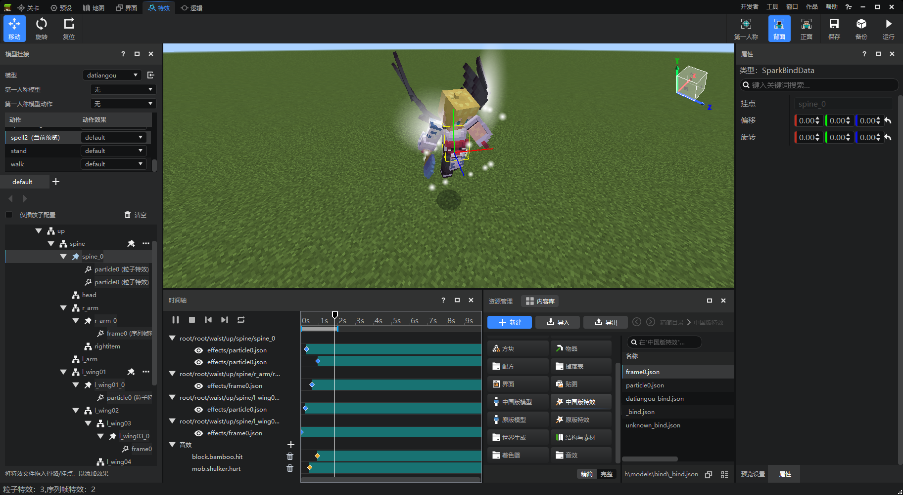

# 特效编辑器简介

特效编辑器是一个用于编辑特效、挂接特效到模型的编辑器。同时在最新版本也引入了部分原生音效的挂接。

它支持：
1. 编辑中国版粒子、序列帧特效，将其挂接至骨骼模型，并在内嵌游戏中预览；
2. 挂接微软粒子到原版模型，并在内嵌游戏中预览；
3. 挂接原生游戏音效到骨骼模型、原版模型。
4. 配置骨骼模型所使用的材质，并实时重载刷新材质效果。
主界面模块如下图所示：

包含以下重要模块：

1. **属性面板**，用于显示或者修改所选项的属性，包含：① 显示/修改粒子特效及序列帧特效的属性；② 显示模型骨骼属性；③ 显示时间轴轨道属性（如播放延迟等）。

2. **时间轴面板**，用于控制特效和人物动画的播放，包含：① 模型动作的播放、停止、逐帧播放；② 控制模型动作是单次播放还是循环播放；③ 控制单次播放的预览时间区间；④ 拖动拖柄控制时间轴上的特效、音效开始播放时点。

3. **资源管理器面板**，用于显示和管理当前拥有的资源，与其他编辑器的资源管理器相同。

4. **模型挂接面板**，用于挂接特效到模型骨骼挂点/锚点上。通过调整挂点、锚点的位置，就能够控制不同特效播放的位置。同时也可以用于将模型挂接到模型上。

5. **预览设置面板**，用于设置模型动作预览的选项，同时也能通过场景模型、场景特效功能支持多个不同的模型及特效在指定的位置进行播放。
6. **工具栏**，位于界面顶部，左侧的移动、旋转、复位用于对挂点进行可视化操作，右侧按钮用于调整当前相机视角和项目的存储、运行。

这几个面板组成了特效编辑器的主体功能，各个部分的详细使用说明请参考后续文档。
