# 模型导入与配置

**本文主要介绍以下内容：**

1. 特效编辑器里支持的模型种类有哪些。
2. 特效编辑器里如何导入外部模型。
3. 特效编辑器里如何使用模型。

## 模型支持

在我的世界中国版中，模型的支持主要有3种格式：

1. **原版生物模型**：以 .json 为后缀的原版生物模型文件。

2. **原版方块模型**: 以 .bbmodel 为后缀的原版方块模型文件。

3. **FBX通用模型**: 以 .fbx 为后缀格式的模型文件。这是一种通用的模型格式，目前几乎所有主流的三维软件中都可以支持 fbx 模型的导出，内部包含信息很丰富，当前特效编辑器主要支持骨骼模型贴图和骨骼动画。

## 常用目录介绍

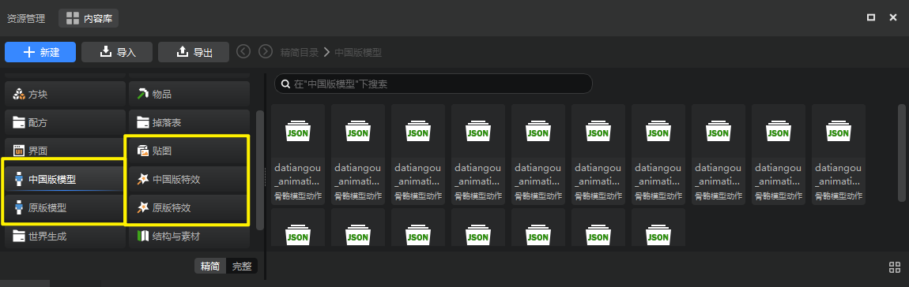

如上图所示，在特效编辑器中，我们可以轻松地通过资源管理器的**精简模式**找到常用的模型、特效、贴图文件。善用资源管理器右侧的搜索功能，即可通过文件名称 关键词精准定位文件。

如果你更习惯使用资源管理器的**完整模式**，你可以关注以下目录来定位你需要的资源（它们也被收编在完整模式默认的常用目录中）：

1. **资源包 effects 目录**：中国版自定义特效目录，包括创建和导入的自定义特效文件都存放在这里目录里。

2. **资源包 models 目录**：模型相关目录，导入的模型骨骼、骨骼动作、骨骼模型网格、原版方块模型、原版生物模型和对应各个模型的特效挂接文件都存放在这个目录的对应文件夹下。

3. **资源包 textures 目录**：贴图目录，特效贴图、骨骼贴图和动画序列帧文件都存放在这个目录的对应文件夹下。

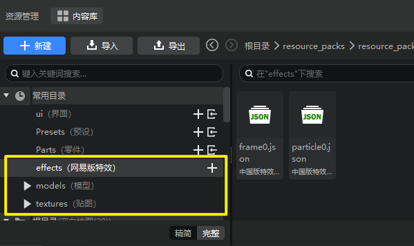

## 模型的导入

如下图所示，点击资源管理器【导入】按钮，展开【模型】子菜单，即可发现有4个主要选项：
1. 骨骼模型（fbx）
2. 骨骼模型（json）
3. 原版方块模型
4. 原版生物模型

> “骨骼模型动作（fbx）”选项用于单独导入骨骼模型动作文件，不属于我们这里介绍的导入模型操作。

下面将分别介绍这些资源的导入方式：

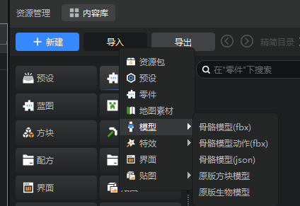

### 1. 导入fbx模型

我们这里以一个名为`datiangou`的fbx模型导入流程为例。

在导入之前，可以先观察`datiangou`模型有哪些东西，打开文件夹，可以看到里面包含了一张`datiangou.png`的**贴图**和若干个 .fbx 文件，为什么有这么多 .fbx 文件呢？

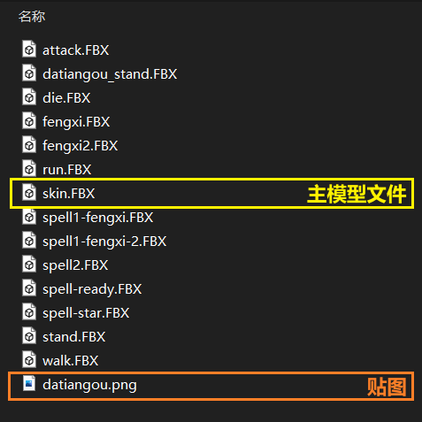

通常在制作骨骼模型的同时，也会制作相应的骨骼动画（即模型的动作），每个骨骼动画都会导出成单独的 .fbx 文件。使用 [Autodesk FBX Review](https://www.autodesk.com/products/fbx/fbx-review) 可以预览 fbx 模型和播放相应的动作。在这些 fbx 模型中，有一个是**主模型文件**，即其他的动画都是基于这个主模型为基准导出的，这个和具体的导出配置有关，这里不做详细介绍，只要了解到有**主模型文件**这个概念即可。

接下来就开始正式导入 fbx 模型了，在资源管理器左上角点击【导入】-【模型】-【骨骼模型】，会出现文件夹选择界面，选择模型所在文件夹，点击确定，出现界面如下：

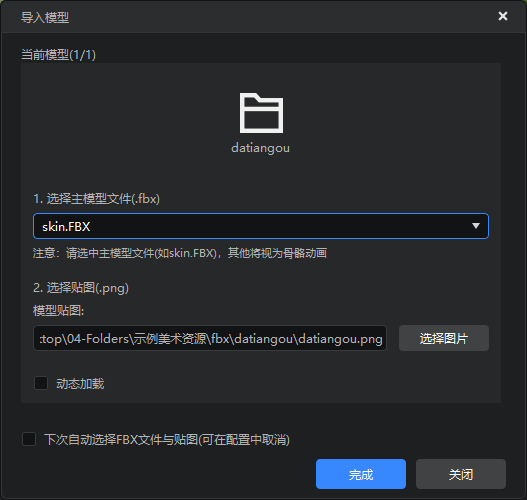

各个选项的含义如下：

- **选择主模型**，整个文件夹下的其他以此模型为基准的骨骼动画都会被自动导入，如果主模型选择错误，可能会导致其他骨骼动画导入异常。

- **选择贴图**，有些模型可能包含多个贴图文件，这里仅支持单个贴图，所以要选择好相应的贴图文件。如果模型需要明度贴图，也可在“明度贴图”一栏选择相应的贴图文件。

- **动态加载**，该选项用于控制模型在游戏中的加载方式，动态加载是指在游戏中使用到该模型时才会去加载对应的模型资源。因为游戏默认启动时全部加载，当包含模型较多时，建议使用动态加载，控制加载数量。

- **下次自动选择FBX文件和贴图**，勾选此项下次会默认选择该文件夹下的贴图文件和模型文件（可在编辑器右上角【作品】-【设置】-【其他】- 【导入FBX资源时自动选择文件与贴图】停用该功能）。

当模型导入完成后，会弹出提示导入成功的弹窗，这样fbx模型的导入工作就结束了。

导入后文件将被自动归类放置，贴图文件会被存放至资源包 textures 文件夹下，模型的骨骼、动作等将被解析成编辑器使用的文件格式，并移动至资源包 models 文件夹下的各个对应文件夹内。

### 2. 导入骨骼模型（json）

json格式的骨骼模型实际上就是fbx模型导入后在编辑中的文件结构，为了方便开发者们复用已有作品的模型，特地支持了json格式的骨骼模型导入：
1. 转换后的骨骼模型会按照下列结构存放：

1. 点击导入骨骼模型（json）：

3. 选择目录中的`netease_models.json`文件，即可导入转换后的骨骼模型，并在特效编辑器中查看模型。

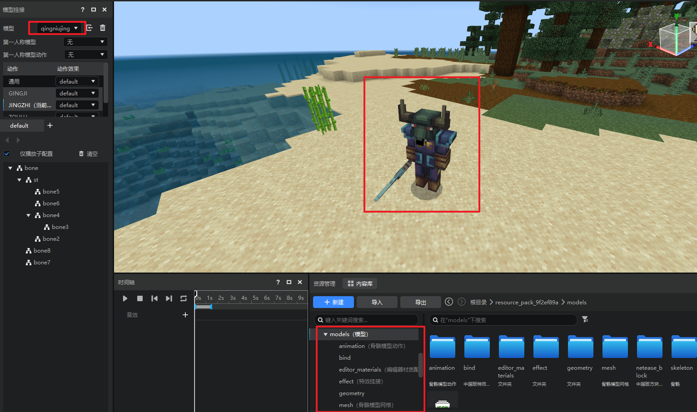

### 3. 导入原版生物模型

下面我们将导入一个原版生物模型。我们以一个名为`zhizhujing`的原版生物模型为例。

原版生物模型通常使用Blockbenck软件制作而成，需要进行原版生物模型制作的开发者可以通过[Blockbench官方网站](https://www.blockbench.net/)下载软件。制作完模型后，我们将模型、动作文件、贴图统一保存在一个文件夹中，然后开始导入工作。

在标准命名规则下，这三个文件分别为：
- `xxxx.geo.json`：模型文件
- `xxxx.animation.json`：动作文件
- `xxxx.png`：贴图文件

在资源管理器左上角点击【导入】-【模型】-【原版生物模型】，找到模型所在的文件夹，然后选中`zhizhujing.geo.json`。点击确认后，会弹出如下所示的窗口：

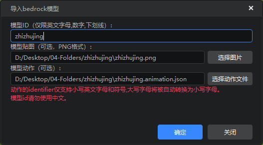

编辑器会自动识别模型的动作文件和贴图位置，如果开发者希望使用其他的文件替换自动识别的结果，可以直接在上面修改。确认无误后，即可点击【确认】按钮。

当模型导入完成后，会弹出提示导入成功的弹窗，这样原版生物模型的导入工作就结束了。

### 4. 导入原版方块模型

接下来尝试导入原版方块 bbmodel 模型，同样点击【导入】-【模型】，并选择【原版方块模型】，出现文件选择界面，选择下载的demo/bbmodel/decoration文件夹下的bbmodel文件，选择完成后出现如下导入界面：

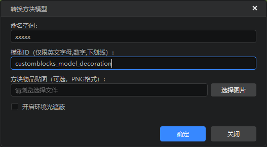

各个选项的含义如下：

- **命名空间**，允许开发者在导入时自定义模型的命名空间，方便后续操作。
- **模型ID**，导入模型的唯一ID。
- **方块物品贴图**，一般 bbmodel 中会内置贴图，如果需要引入外部贴图可以在这里进行选择。
- **开启环境光遮蔽**，用于提高模型对光线的处理。

bbmodel模型将被解析为编辑器使用的文件格式，并存放在 models/netease_block 文件夹（模型）和 textures/blocks 文件夹（贴图）下，具体的使用方法可以参考 [自定义方块模型](../../20-玩法开发/15-自定义游戏内容/2-自定义方块/5-自定义方块模型.md)。

## 模型的使用和预览

导入模型完成后，我们在特效编辑器【模型挂接】窗口的顶部通过下拉框可以将主角模型切换为我们导入的模型，以便进行特效挂接等后续工作。

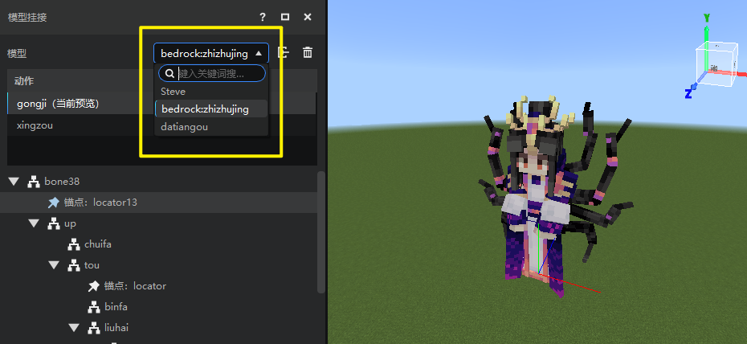

### 1. 第一人称模型修改

第一人称模型是指位于第一人称视角下的模型，对于 Steve 来说，即相当于 Steve 的手臂，但是第一人称模型可以不仅仅是手臂，例如将第一人称模型设置为大天狗，即大天狗的第一视角下仍然会再渲染一个大天狗出来。

> 仅当模型为骨骼模型时，才支持第一人称模型，且第一人称模型也需要为骨骼模型。所以默认的 Steve 不支持第一人称模型。

**修改第一人称模型的步骤如下：**

1. 在模型挂接面板将模型修改为导入的骨骼模型
2. 修改挂点面板的第一人称模型，修改该项改为导入的第一人称模型(手臂模型)
3. 修改挂点面板的第一人称模型动作，修改该项为对应的（挥舞）动作
4. 切换视角到第一人称查看该模型

### 2. 骨骼模型材质配置
当所编辑的模型是骨骼模型时，模型挂接面板相比原版模型会增加几个选项，如下图所示：

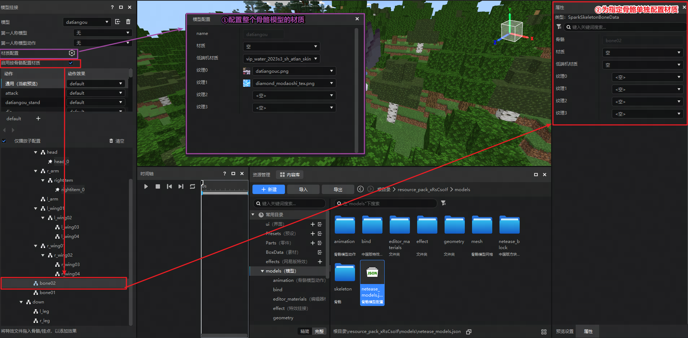

#### 配置本体模型的材质
如[骨骼模型自定义材质和贴图](../6-模型和动作/04-骨骼模型的使用.md#_7-模型使用自定义材质及更多贴图)所描述，我们可以在netease_models.json中定义骨骼模型的材质和贴图。
在特效编辑器，也对应支持了上述字段的可视化配置，如上图中的紫色部分所示，点击齿轮按钮即可打开材质配置的弹窗，进行整个骨骼本体模型的材质和贴图配置。

#### 配置指定骨骼的材质
如[骨骼模型自定义多个材质和贴图](../6-模型和动作/04-骨骼模型的使用.md#_8-模型使用多个材质及贴图)所述，我们可以在netease_models.json通过useSplitMeshes和splitBonesGroup字段对模型的其中一部分骨骼配置自定义材质和贴图。
在特效编辑器也对应支持了上述字段的可视化配置，如上图中红色框选部分，通过勾选【启用按骨骼配置材质】选项，再在下方的骨骼层级中选中任意骨骼，即可在右侧的属性栏查看和配置该骨骼的材质和贴图。

#### 配置多pass材质
如[骨骼模型自定义多Pass材质](../6-模型和动作/04-骨骼模型的使用.md#9骨骼模型自定义多pass)所述，我们可以在netease_models.json将material属性改写成一个列表，按照顺序配置多个材质，则引擎加载时会按照列表顺序一次加载每一个pass的材质。
在特效编辑器也对应支持了上述内容的可视化配置，如下图所示，无论是配置指定骨骼还是配置本体模型的材质，材质和低端机材质均为可自定义长度的材质列表，开发者可以根据需要自行添加和设置多pass材质。

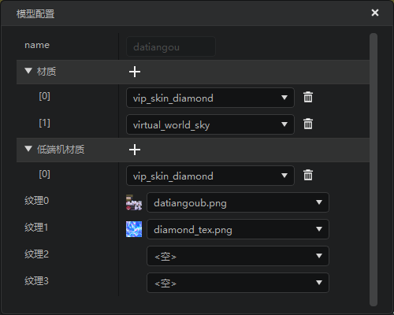

### 3. 重载材质
当我们在配置和调试材质时，难免会有修改材质和着色器（shader）代码的需求，在以往这些修改一般需要重启游戏引擎才能生效，现在，特效编辑器的顶部工具栏新增了【重载材质】按钮，点击后，可以直接实时重载引擎内的材质效果，实现“热更”的效果，提升开发者调试材质shader代码的效率，如下图：

### 4.骨骼模型挂点偏移
当所选择的模型是骨骼模型时，在任意骨骼创建一个挂点，即可在挂点的属性面板看到一系列快捷偏移的属性，点击属性右侧的偏移按钮，即可快速将该挂点偏移到对应面或者模型的中心。
> 外部建模软件和MC引擎的坐标系可能不一致，因此快捷偏移所标注的面（上下左右前后）和开发者实际感知的面可能会出现没有一一对应的情况。

### 5.删除单个模型动作
若您导入模型后希望删除指定动作，可在模型挂接面板的动作列表选中指定动作，并右键，点击删除按钮后可将该模型动作完全删除，如下图所示。

