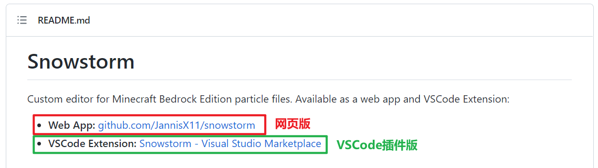
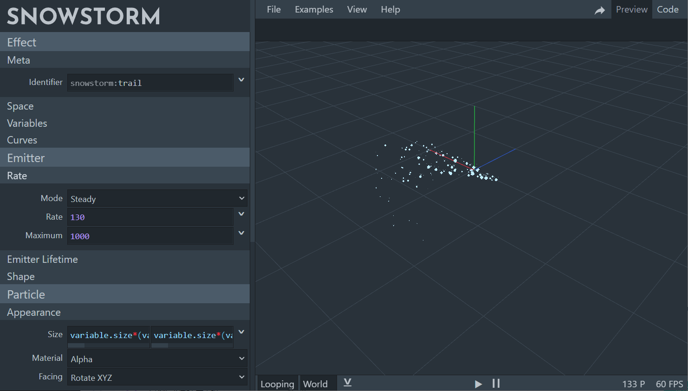
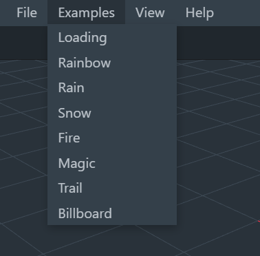
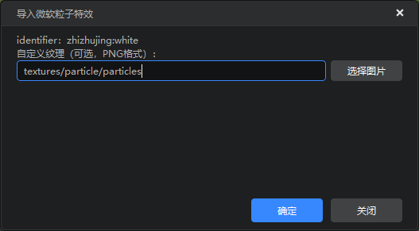
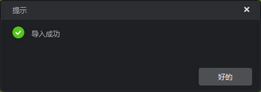

# 原版特效创建与导入

本篇文档主要介绍以下内容：

1. 如何创建一个原版粒子特效。
2. 如何将创建好的原版粒子特效导入特效编辑器。

## 原版粒子特效的创建

### 使用编辑器创建、编辑原版粒子

**原版粒子特效**有时也被称作**微软粒子特效**，它可以被用来挂接到**原版生物模型**上，增加美术表现力。我们可以在特效编辑器中直接创建特效并对其进行编辑，具体操作详见[这篇文档](./21-原版特效属性详细说明.md#创建原版粒子特效配置)。

### 使用Snowstorm创建原版粒子特效

部分开发者也习惯使用Snowstorm软件来创建。你可以通过它的[官方Github页面](https://github.com/JannisX11/snowstorm)找到并使用其[网页版](https://snowstorm.app/)或[VSCode插件版](https://marketplace.visualstudio.com/items?itemName=JannisX11.snowstorm)。

这两个版本的界面是相似的，如下图。

我们可以在左侧修改粒子的属性字段，然后在右侧进行效果预览。Snowstorm也提供了若干模板供用户学习参考，大家可以在顶部【Examples】标签下点击应用。

在这篇文档中，我们不会对每个字段详细的书写方式进行逐一介绍，已有第三方教程对原版粒子的编写方式进行了较为详细的介绍（例如知名创作者McHorse拍摄的 **《如何使用 Snowstorm(雪暴) 创建粒子特效》** 视频教程），大家可以自行搜索学习。

在制作原版粒子的时候请注意以下两点：

1. 导入原版粒子特效时，一定要注意特效文件的identifier不能与已有的特效相同，否则后导入的特效会直接覆盖先前导入的特效。

2. 原版粒子特效配置文件中有一项【**Emitter Lifetime**】，用于控制粒子特效的播放是单次还是循环播放。如果选用循环播放（looping）并绑定在实体动作上，则会在实体执行该动作后持续存在于挂点位置，不会自动消失，且类似行走、跑步、攻击等高频重复的动作将会反复产生循环播放的粒子特效导致较为严重的卡顿问题。所以如果希望特效在动作播放后能消失而不是持续驻留，需要将【Emitter Lifetime】的**模式（Mode）** 选为 **单次（once）** 而不是 **循环（looping）**。

## 原版粒子特效的导入

如果你使用了Snowstorm创建原版粒子，那么在创建完毕后，就需要将其导入编辑器作品中。我们在编辑器的资源管理器中点击【导入】-【特效】-【原版粒子特效】，然后选择刚刚编辑好的原版粒子特效文件。

> 原版粒子标准命名格式为 `xxxx.particles.json`。

选择好粒子文件后，即会弹出下面的弹窗，用于指定特效的纹理贴图。这里默认使用的是引擎内置的贴图，如果开发者希望使用其他的纹理，需要再此手动更换。确认无误后，即可点击【确定】按钮进行导入。

当粒子导入完成后，会弹出提示导入成功的弹窗，这样原版粒子特效的导入工作就结束了。

> 如果你又在Snowstorm中编辑了该粒子特效的本地源文件，也没有关系，只需要点击属性面板的【热更新】按钮，即可将修改同步到编辑器中。

