# 原版特效属性详细说明

本文围绕原版粒子特效的属性面板进行说明和演示原版粒子是如何制作的。主要内容有：

1. 创建原版粒子特效配置
2. 基础知识
3. 发射器属性组
4. 粒子属性组
5. molang 变量
6. 发射骨骼模型

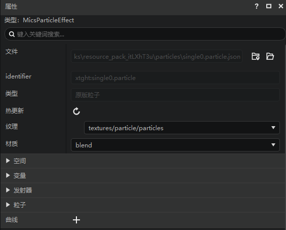

## 创建原版粒子特效配置

原版粒子特效配置（下文简称粒子配置）可以通过snowstorm进行创建并导入(具体参考上一篇文章); 还可以通过编辑器的新建文件向导进行创建。本文使用的是第二种方法创建，然后通过资源管理器，鼠标右键配置文件->快速预览 可以看到一个红色心形的粒子。已有的粒子配置可以通过属性栏的“使用模板”,快速生成各种样式的配置。

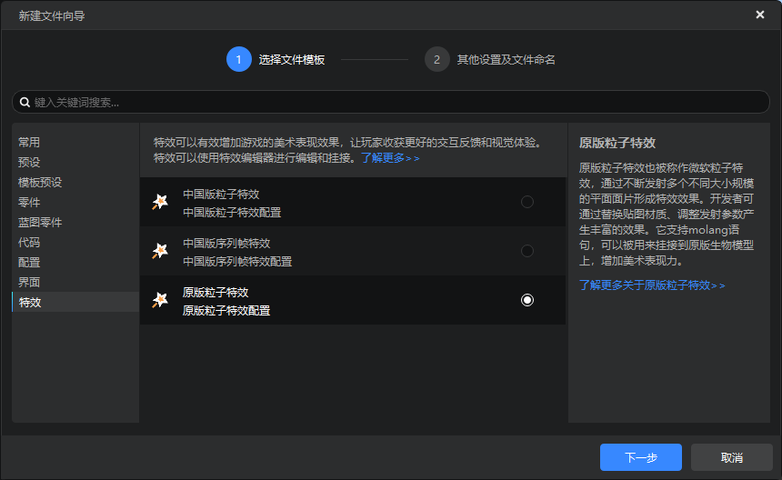
快速预览使用新建文件先导创建的粒子特效：
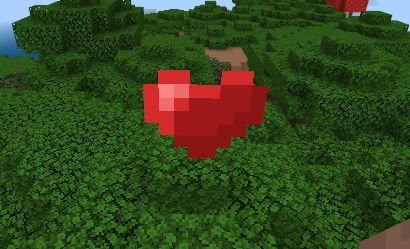

## 原版粒子模板

在特效编辑器中，我们内置了若干原版粒子配置模板，供开发者学习研究。如果想使用这些配置模板，只需要在粒子json文件的属性窗口找到蓝色的【**使用模板**】按钮，点击后在弹出的窗口中通过下拉框选择想要应用的配置模板即可。

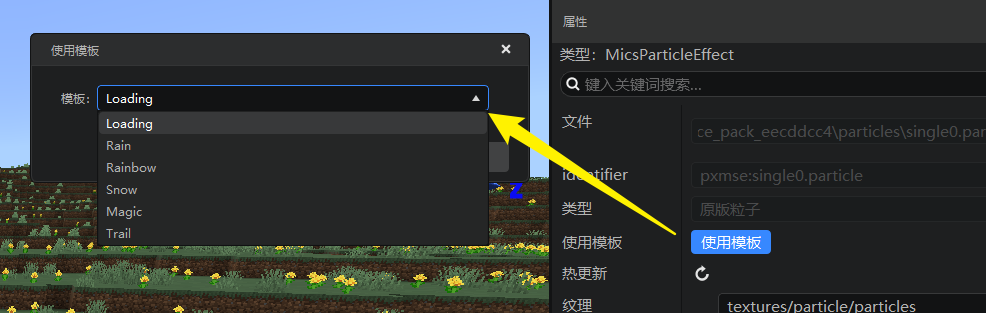

## 原版粒子特效的制作基础知识

一个完整原版粒子特效配置是由一个json文件和对应的纹理文件构成的。每一个配置都有一个唯一的标识：identifier，如果有两个相同identifier的原版粒子特效，那么后面加载的会覆盖前面加载的配置。

很多时候，开发者需要使用第三方编辑器如snowstorm对粒子配置进行修改，因此属性面板提供一个热更新的按钮，点击后会让编辑器重新加载这个粒子配置。

组件的概念：一个系统性的功能，可以拆分成多个相互独立的小功能，这些小功能我们称为组件。原版粒子特效就是根据这种思想进行设计的，例如粒子的生命周期可以是一个组件，粒子的运动可以是另一个组件。原版粒子特效配置拆分的组件及具体含义可以查阅[官方文档](https://learn.microsoft.com/en-us/minecraft/creator/reference/content/particlesreference/particlecomponentlist)。

组件与属性面板里属性的关系：大部分情况下是一个或同一类组件对应一个属性, 例如Emitter Rate Components这个类型的组件对应"发射器->速率"这个属性。

纹理：除了可以选择当前存档里的图片作为纹理外，编辑器还提过一个默认粒子纹理图片的选项：textures/particle/particles,这个图片存在于引擎自带资源里。纹理的具体使用放在后面的粒子部分进行讲解。

材质：现提供三种基本材质供开发者选择，每种材质作用如下：

	alpha : 使用了alpha测试，单面
	blend : 使用颜色混合，多用于半透明的纹理，双面
	opaque: 不透明，单面

一个原版粒子特效实例（下称特效实例）是指使用某一个粒子特效配置在游戏引擎里生成一个正在播放的特效实例。一个特效实例由发射器和发射器发射的粒子构成，一般情况下发射器的所在的位置就是这个特效实例的本地空间坐标原点。

mc里的特效实例有两种承载方式，一种是在世界空间单独存在，如快速预览的特效实例；一种是挂接在其他实体节点上的，如挂接在原版模型的锚点上，需要原版模型动作进行驱动播放。不同承载方式粒子所使用的坐标系也不同。属性面板中的“空间”属性共同控制所使用的坐标系，规则如下：

- 本地坐标：当勾选时，且特效挂在实体上，则粒子位置是相对实体空间进行模拟的。
- 本地旋转：当勾选时，且特效挂在实体上，则粒子旋转是相对实体空间进行模拟的；只当'本地坐标'选中时，该选项才有效。
- 本地速度：当勾选时，且特效挂在实体上，则粒子速度是相对实体空间进行模拟的；只当'本地坐标'不选中时，该选项才有效。

例如一个绑定在实体上的粒子特效，如果没有勾选本地坐标，则实体移动时，特效实例不会跟着移动。


## 发射器属性组

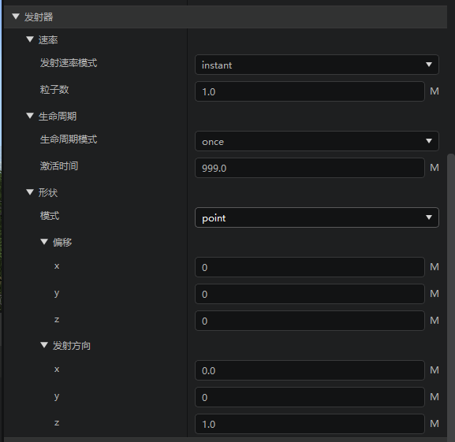

从属性面板可以看出发射器由速率、生命周期、形状三种类型组件构成。下面分别讲解他们的用法：

* 速率
  控制粒子发射数量及速率，目前支持有两种发射模式：1.instant 固定一次性发出多少粒子，2.steady 可指定生成效率，单位为（个/秒），即每秒钟平均发射多少个粒子，如果当前特效实例存在的粒子数等于“最大粒子数”，就不会再发射了。

* 生命周期
  这个组件是管理发射器是否激活的，可以认为发射器有三种状态：激活，睡眠和过期, 只有激活的发射器才会发射粒子，过期的发射器无法激活，会等待其发射的粒子全部销毁后，该特效实例会被引擎销毁。生命周期的三种模式：

  1. once
	只激活一次，可指定激活时间（时长，单位s）。

  2. loop
	可循环激活，一个循环周期是激活时间+睡眠时间。注：该模式只对挂接的特效实例生效，非挂接的只会循环一次。

  3. expression
      使用molang表达式控制激活也销毁：
		> 激活表达式：表达式计算结果为真(非0)时，即激活
		> 过期表达式：表达式计算结果为真(非0)时，即过期

* 形状
  实体有多种形状可以选择，其中point是最简单的一种, dics 是圆盘形状，entity bounding box 用绑定实体包裹盒。下面对组件的主要属性进行讲解。
  1. 偏移：当前发射器相对于特效实例本地空间的原点的偏移量。
  2. 方向类型：inwards 由当前发射形状由外向内发射，outward 由当前发射形状由内向外发射，Custom使用发射方向属性自定义
  3. 发射方向：一个三维向量表示发射粒子的运动方向，这个属性会被引擎归一化。如果粒子的运动模式是动态的，且有初始速度时，粒子就会向这个方向运动。
  4. 仅表面：仅在当前形状表面生成粒子。

## 粒子属性组

该属性组用于控制特效实例中所发射粒子的行为及表现。

* 表现
  这个属组要用于控制粒子大小和朝向。首先需要知道的是每个特效实例里面的粒子都有速度，方向的属性，速度的方向并不等于方向。下面介绍的朝向模式中 direction_* 形的模式依赖方向属性进行计算。

  方向：

  我们有两种方式确定我们的粒子的方向，即属性"direction->方向模型"的选项：
  > 使用速度方向：会使用速度方向作为粒子的方向：这里有一个"最小速度"的阈值,只有当速度大于这个值时才会更新粒子方向。
  > 自定义：自定义粒子的方向, 这时粒子速度方向就不等于粒子方向。

  朝向模式：

  这个属性决定了一个粒子本地空间坐标系的朝向。最基本的，粒子正对着的方向就本地空间坐标系Z轴方向。 举个例子说明朝向的原理：假设你的朋友让你用手机帮她拍张个证件照，那么你首先要让手机的镜头取对准你的朋友，记住是用镜头，不是其他部位，然后你需要摆正你的手机，因为斜着拍或者倒着拍的效果都不是想要的。想想这过程本质就是：1.对准 2.摆正。怎么才算摆正呢？就要有个一个叫“上方”的方向，把手机的某个部位对准这个方向就是摆正。再看 lookat_xyz这个模式的实现：1.用粒子的轴方向对着摄像机，实现面向摄像机 2.旋转粒子使y轴尽可能朝向上方（世界空间的y轴方向）实现摆正。direction_*模式也可以按照这个过程去理解。一般没有特别说明的情况下，这个“上方”指的是世界坐标y轴的方向。

  &#8195;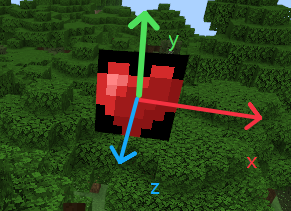

  1. rotate_xyz:
  对齐摄像机,使粒子本地空间坐标系Z轴方向于摄像机镜头方向相反。

  1. rotate_y:
  对齐摄像机但是只能绕世界空间y轴旋转

  1. lookat_xyz：
      面向摄像机,以世界坐标y轴的的方向为上方（即粒子的y轴尽可能朝向世界空间的y轴方向）。

  2. lookat_y：
      面向摄像机,但只能围绕世界空间y轴旋转


  5. direction_x:

    粒子的x轴对着粒子的"方向"属性所指方向,粒子y轴朝上（即粒子的y轴尽可能朝向世界空间的y轴方向）。

  6. direction_y:

    粒子的y轴对着粒子的"方向"属性所指方向,粒子z轴朝上

  7. direction_z:

    粒子的z轴对着粒子的"方向"属性所指方向,粒子y轴朝上

  8. emitter_transform_xy

    粒子面片平面平行发射器的xy平面

  9. emitter_transform_xz

    粒子面片平面平行发射器的xz平面

  10. emitter_transform_yz

    粒子面片平面平行发射器的yz平面


* 纹理UV
  - 纹理宽/纹理高
    这两个属性的含义是把纹理图片的宽高按这个取值来对待，那么后面UV相关属性的取值就按照这个大小进行衡量，例如有一个uv属性取值是(x, y),那么它实际在纹理图片的位置是(纹理实际宽\*x/纹理宽, 纹理实际高\*x/纹理高)

  - UV开始/UV大小
    这两个属性决定了粒子使用到纹理的那个位置。

  - 动画配置
    开启动画配置后，引擎会按照设置的FPS这个频率来更新"UV开始"属性，每次更新都会增加"UV步长"的值，从而达到动画效果，这种动画叫 flipbook 动画。
    * UV开始
      粒子使用纹理坐标起始值
    * UV大小
      粒子使用纹理的宽高
    * UV步长
      每次更新对"UV开始"增长值
    * FPS
      更新动画的频率
    * 最大帧数
      最多更新多少帧，初始值算第一帧
    * 延迟至生命周期
      如果勾选这个选项，FPS将被赋值为：最大帧数/粒子生命周期，即在粒子的生命周期里播的帧数为"最大帧数"
    * 循环
      如果选中，则播完全部的帧数后，再从第一帧开始播放；如果没有选中，则播完全部帧数后停在最后一帧。

- 颜色&灯光
  粒子某个像素点的最终颜色是 纹理颜色*该属性设置的颜色 的计算结果

  * static: 静态颜色模式，颜色取值是固定的

  * gredient: 梯度表模式，"插值函数"是一个molang表达式，运算结果作为时间变量,再从"颜色表"上，按照时间变量取插值，获得最终的颜色。如:"插值函数"设置为 v.particle_age 就是根据当前粒子存在的时间进行取颜色值。

  * 启用环境光: 启用后颜色会受当前环境光的影响，即在夜晚看起来较暗。

- 运动
  粒子的运动包括位移和旋转两个方面。首先我们需要知道一些运动的基本规则：
  1. 只有在动态的运动模式是才会根据速度产生位移（位移 = 速度*时间）,如果是静态运动模式是看不到粒子运动的，对于旋转也是如此。
  2. 位移 = 速度* 时间
  3. 速度 = 速度 + 加速度*时间
  4. 初始速度 = 速度初始方向 * 初始速度大小
  5. 旋转角度 = 旋转速度 * 时间
  6. 旋转速度 = 旋转速度 + 旋转加速度 * 时间

  速度初始方向是粒子的发射方向（发射器->形状->发射方向）决定的，下面是各个属性的说明：
  * 初始速度: 即初始速度大小
    注：如果设置为0, 方向模式使用速度方向，会导致粒子无法显示。
  * 初始旋转角度：逆时针方向，单位-度
  * 初始旋转速度
  * 逐帧计算参数
    - 动态位置开关
      打开后位置将不是通过"基本规则"算得, 而是同过"动态位置"设置。
    - 动态位置
      这是一组molang表达式,每帧都会运算一次，计算结果作为粒子的位置。
    - 动态速度开关
      打开后，忽略"基本规则"规则对速度的运算，使用"动态速度"属性的运算结果。
    - 动态速度
      这是一组molang表达式,每帧都会运算一次，计算结果作为粒子的速度。
    - 动态旋转开关
      打开后，忽略"基本规则"规则对旋转角度的运算，使用"动态旋转角度"属性计算结果作为旋转角度。
    - 动态旋转角度
      这是一组molang表达式,每帧都会运算一次，计算结果作为粒子的旋转角度。

  * 运动模式： 静态/动态

  * 动态运动
    * 加速度: 见开头“基本规则”
    * 速度阻力系数： 可以对粒子位移运动产生阻力
    * 旋转加速度： 见开头“基本规则”
    * 旋转阻力系数： 可以对粒子旋转运动产生阻力

- 粒子生命周期
  销毁表达式：该表达式返回结果为true时销毁粒子。
  无限生命周期： 没有最大生命周期的限制。
  最大生命周期表达式： 计算结果为float类型，作为最大生命周期，粒子到达这个时间就会销毁。
  销毁平面：当粒子穿过这个平面是会被销毁，平面表达式为： A*x + B*y + C*z + D = 0
  如果想限制粒子只能在某些地方活动，可以设置“在这些方块上则销毁”或“不在这些方块上则销毁”属性, 例如在把“minecraft:water”设置在“不在这些方块上则销毁”，则离开水的粒子就销毁，水里的气泡就可以这么做。

- 碰撞
  - 启用表达式
    如果表达式计算结果为true 则启用碰撞功能。
  - 阻挡系数
    当粒子碰撞时改变粒子的速度，用于模拟碰撞时的摩擦/阻力，值越大阻力越大
  - 反弹系数
    设置为0时，不反弹，设置为1时，反弹至原来高度，以此类推。
  - 碰撞半径
    用于减少颗粒与环境的相互渗透，注意这必须小于或等于0.5单位
  - 碰撞后销毁

## molang 变量
  Molang是一种简单的基于表达式的语言，用于在运行时进行快速、数据驱动的值计算，并与游戏内的值和系统直接连接。【[详见](https://learn.microsoft.com/en-us/minecraft/creator/reference/content/molangreference/examples/molangconcepts/molangintroduction)】。

  在MC配置里经常使用到Molang表达式，粒子特效也不例外。Molang很简单，只要会加减乘除和函数调用就能写Molang表达式。但首先必须知道的是，在Molang里的值类型只有float(浮点形)，如果在一个语境下需要表达true或false，则0.0 表示 false， 其他情况表示true。
  编辑器里如果一个属性值可以是molang表达式，则在输入框后面会有一个大写M。
  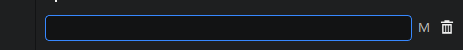

  粒子特效里的molang变量有两种，一种是内置变量，一种是自定义变量。
  - 内置变量
    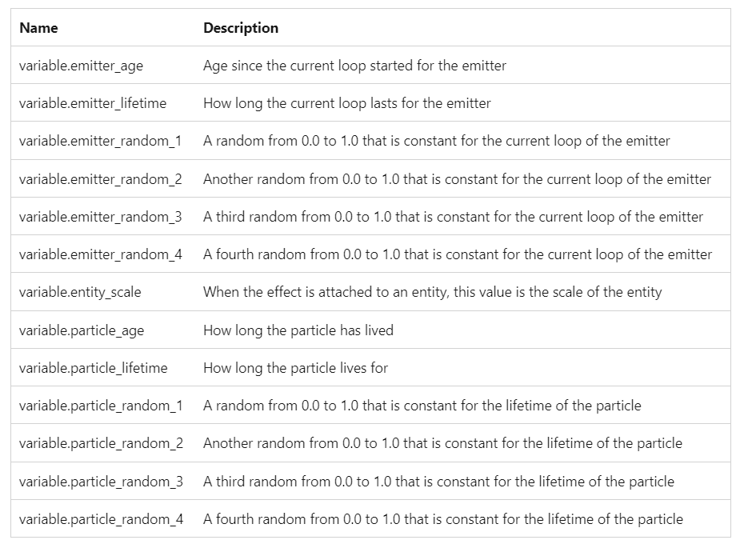
    可以看到，所用变量都是以"variable."开头的，我们在写表达时也可以使用简写形式“v.”。需要注意变量的作用域问题，这里有两个作用域，分别是发射器和粒子，粒子作用域的变量无法在发射器作用域使用，但是发射器作用域的变量可以在粒子作用域使用。例如 variable.particle_age表示当前粒子的寿命，只能在粒子作用域使用，在发射器作用域使用是无意义的。

    如下图制作一个沿着y轴移动的粒子：v.particle_age表示粒子当前的寿命，随着时间的推移而增加，所以可以看到粒子延y轴方向移动。
    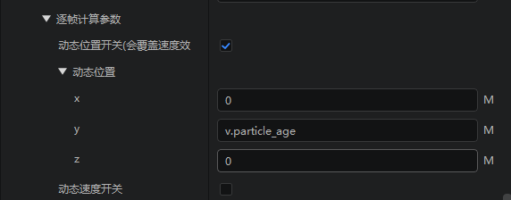

  - 自定义变量

     molang变量需要先定义(声明)才能使用，例如:
      - “v.a = v.a + 1;” 这个表达式会有运行时报错，因为v.a 是一个未定义的变量。

      - “v.a = 0; v.a = v.a + 1;” 这个表达式是正确的，
      第一个语句定义了v.a变量，第二个使用了v.a的变量。

    所以有必要了解自定义变量的运行时机。
     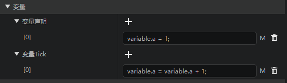

     这里有四个地方可以填molang表达式，他们运行时机如下：

      - 变量声明
        在粒子发射器生成时（即特效实例生成时）运行一次。一般用来定义变量，如：v.a = 0;

      - 发射器Tick
        发射器每一帧更新都会运行一次。

      - 粒子更新Tick
        每个粒子更新时都会运行一次，这里是在粒子作用域里运行的，所以可以使用像v.particle_age的变量。

      - 粒子渲染Tick
        每个粒子渲染时都会运行一次，这里是在粒子作用域里运行的，所以可以使用像v.particle_age的变量。

        与“粒子更新Tick”区别：当调用mod.client.component.particleSystemCompClient.ParticleSystemCompClient.Pause 接口时特效停止更新但是依然有渲染，所以“粒子更新Tick”会停止运行，但“粒子渲染Tick”依然运行。

    另一种声明自定义变量的方式是使用曲线。mc提供了4种曲线的支持：linear（线性），bezier（贝塞尔），catmull-rom， bezier-chain（贝塞尔链）

      - 计算结果变量
        这里输入就是要声明的自定义变量的名字。粒子每一次渲染前都会根据当前曲线重新计算出变量的值。
      - 曲线类型
        有4种类型的曲线，可以把每一种曲线都认为是一种函数方程。
      - 输入变量
        作为曲线函数方程的输入参数
      - 水平范围
        我们的曲线方程都规定输入参数的取值范围是是[0,1], 但是大部分时候我们的输入参数是超出这个范围的，这个值就是用来对输入变量做归一化处理，即输入到曲线方程的参数其实是：输入变量/水平范围

       - nodes

    当前曲线视图，可以点击右边按钮进行编辑。

      下面展示如何使用曲线自定义变量，让粒子在xy平面上做一个曲线运动：
      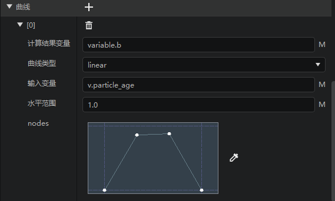
      这里输入变量是粒子的当前生命长度，水平范围取值为1，表明这个曲线运动会在1秒钟完成。
      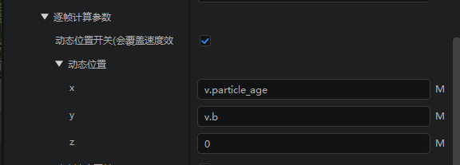
      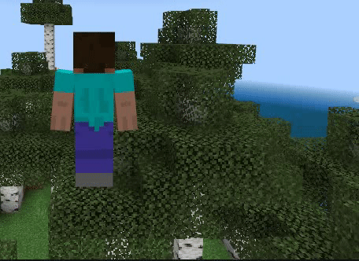
      可以看到粒子在第一秒的轨迹是和我们在nodes属性里设置的曲线是相吻合的，因为粒子的x坐标取了曲线的输入值，y坐标取出了曲线的输出值。

## 发射骨骼模型
  从2.6版本开始，可以使用原版粒子系统发射骨骼模型，该功能暂时不支持使用编辑器编辑，只能通过手动修改json文件实现，完整Demo链接可以点击 [这里](../../20-玩法开发/13-模组SDK编程/60-Demo示例.md#NeteaseModelParticleDemo)下载。

  - 定义发射的模型

    在发射骨骼模型之前需要先在开发包中定义好需要使用的骨骼模型，具体步骤参考[骨骼模型的使用](../6-模型和动作/04-骨骼模型的使用.md)，将骨骼模型加入开发包后可以尝试在游戏中调用骨骼模型相关的接口验证资源是否正确。需要注意的是，引擎内置了[几种常用的材质](../7-材质与着色器/2-内置材质清单.md#网易扩展-entity-material-材质文件内容)，能够覆盖大多数情况下粒子系统中骨骼模型的渲染，若需要使用自定义材质，需要参考内置材质的做法。

    打开json文件，在description属性中添加`basic_model_render_parameters`，然后使用`model_identifier`引用刚刚添加的骨骼模型，由于发射的骨骼模型已经定义好了贴图、纹理、材质，所以这里不需要再填写`basic_render_parameters`了，当`basic_render_parameters`与`basic_model_render_parameters`同时存在时，引擎会忽略掉`basic_render_parameters`并按骨骼模型粒子来处理：

    ```json
    "description": {
      "identifier": "netease:model_demo",
      "basic_model_render_parameters": {
        "model_identifier": "pet_model"
      }
    }
    ```

    添加完后就能在游戏中使用该粒子特效了。

    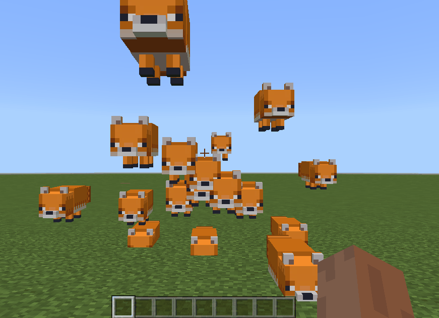


     若模型需要使用自定义材质或Shader，则需要对该材质添加USE_INSTANCE的定义。例如，定义如下使用自定义材质的骨骼模型：

    ```json
      "entity_for_skeleton_customized": {
    			"+defines": [
    				"USE_SKINNING",
    				"USE_OVERLAY",
    				"NETEASE_SKINNING",

                    // 微软粒子发射骨骼模型，当该模型使用自定义材质及shader时，需要在材质define中加上USE_INSTANCE的定义
    				"USE_INSTANCE"
    			],
    			"+samplerStates": [
    				{
    					"samplerIndex": 0,
    					"textureFilter": "Point"
    				}
    			],
    			"fragmentShader": "shaders/glsl/netease_entity_skeleton_customized.fragment",
    			"msaaSupport": "Both",
    			"vertexFields": [
    				{
    					"field": "Position"
    				},
    				{
    					"field": "Normal"
    				},
    				{
    					"field": "BoneId0"
    				},
    				{
    					"field": "UV0"
    				}
    			],
    			"vertexShader": "shaders/glsl/netease_entity_skeleton_customized.vertex",
    			"vrGeometryShader": "shaders/entity.geometry"
    	},
    ```

    对于USE_INSTANCE的使用，可参考官方内置材质中的entity_for_skeleton_particle材质中使用的vertex shader。


  - 定义模型使用的动作

    此外粒子特效发射的骨骼模型还支持动作，同样，也需要先在netease_models.json中定义好相关的模型动画，并导入资源。

    然后在json文件中的components内添加`netease:particle_appearance_FBX`，该component中包含三个属性：

      - `play_animation`
        每个粒子播放的动画，该动画需要预先在models/netease_models.json中定义好。
      - `loop`
        动画是否循环播放，如果设置为false，则会在每个发射器的生命周期开始时重新播放动画。
      - `size`
        设置发射出来的骨骼模型的大小，支持molang表达式。

    ```json
    "components": {
      "netease:particle_appearance_FBX": {
        "play_animation": "happy",
        "loop": true,
        "size": [1, 1, 1]
      },
      ...
    }
    ```

    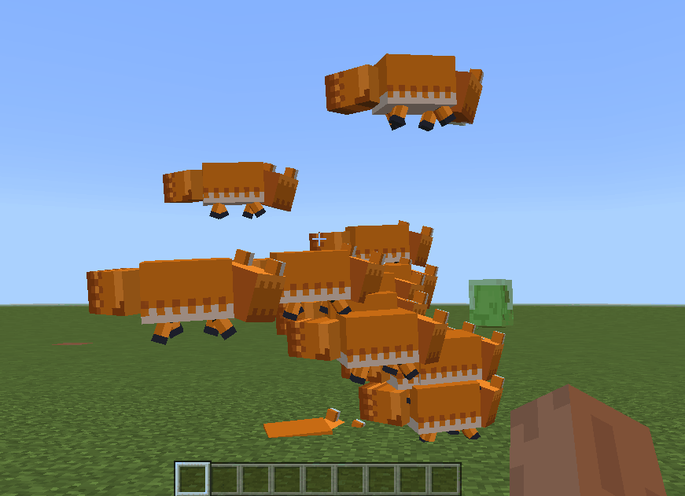

    **注意**: 骨骼模型的粒子特效会屏蔽掉原有二维粒子特效的一些属性定义，比如`minecraft:particle_appearance_billboard`中的`size`，`uv`

    **注意**: 每个粒子发射器内的所有粒子会保持同一动画，不同粒子发射器的动画则表现相对独立。

  - 出于性能考虑，建议以下几点

    - 每个粒子发射器能发射的最大数量控制在**50**个以内。
    - 用于粒子系统的骨骼模型不宜太复杂，将顶点数控制在**1000**以内。
    - 同一场景内不应创建过多的粒子发射器。