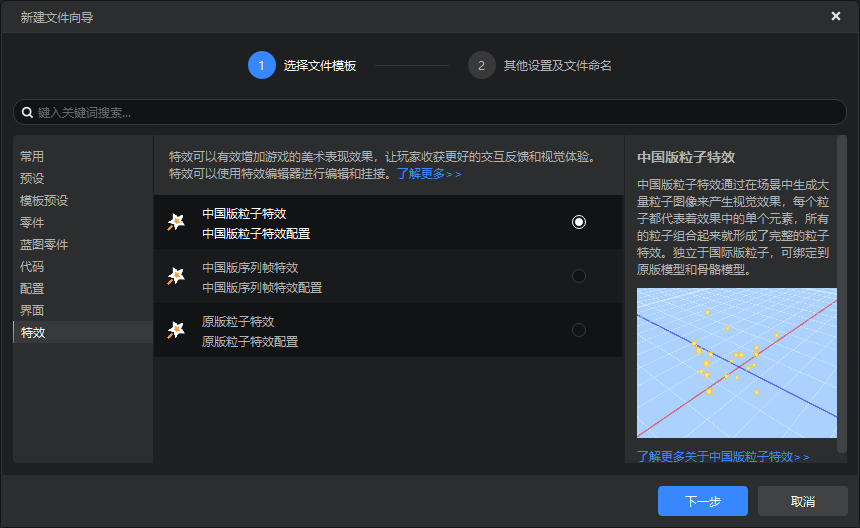
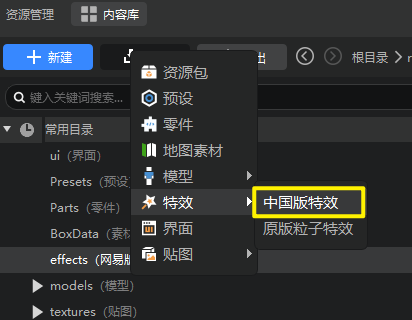
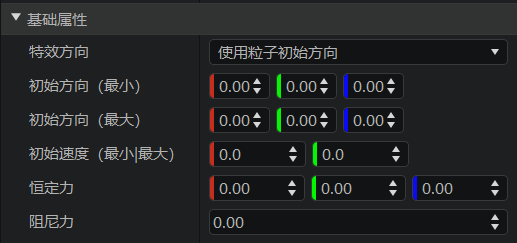
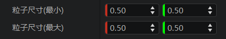
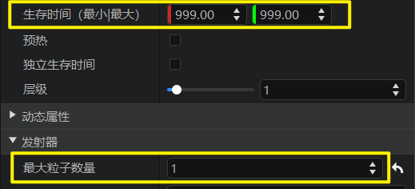

# 中国版特效创建与使用

本篇文档主要介绍以下内容：

1. 粒子特效和序列帧特效的区别。
2. 如何创建/导入特效。
3. 制作第一个粒子特效和序列帧特效。

## 粒子特效和序列帧特效的区别

中国版特效可以用来挂接到中国版骨骼模型上。中国版特效又分为**中国版粒子特效**和**中国版序列帧特效**两种类型。

1. **粒子特效** 是通过在场景中生成大量粒子图像来产生视觉效果，每个粒子都代表着效果中的单个元素，所有的粒子组合起来就形成了完整的粒子特效。

2. **序列帧特效** 是通过在场景中绘制一张单面片的贴图，在这个贴图上不断的更换新的图片，这个过程形成完整的序列帧特效。

## 创建/导入中国版特效

在资源管理器点击【新建】-【特效】-【中国版特效】可以新建中国版粒子特效或序列帧特效。

所有中国版特效都存放在 effects 文件夹下，通过在资源管理器点击特效文件，可在右侧属性窗口中查看并修改相应的属性，具体属性细节可以参考[特效属性说明](./70-中国版特效属性详细说明.md)。

> 由于特效属性皆已支持可视化编辑操作，不建议开发者手动修改特效源文件，以免造成特效文件损坏。

如果开发者有现成的中国版特效文件需要导入编辑器，可以在资源管理器中点击【导入】-【特效】-【中国版特效】。

## 制作一个中国版粒子特效

首先来制作一个红色buff粒子特效，步骤如下：

1. 点击通过资源管理器新建文件向导创建中国版特效，选择粒子，输入名称fire_buff，这样在资源管理器的 effects 文件夹下会创建一个名为 fire_buff.json 的文件，点击该文件即可在属性面板查看粒子属性。特效在创建后会自动选中，这样属性栏会显示该特效的相关属性。

2. 在基础属性下，将初始方向（最大），初始方向（最小），初始速度都设置为 0，这样即可创建一个不会移动的粒子。

    

3. 将粒子尺寸（最大），粒子尺寸（最小）都设置为 0.5，这样创建了一个固定大小为 0.5 的粒子。

    

4. 在发射器下，将最大粒子数量修改为1，这样同时只会有一个粒子出现，但是由于生存时间默认为 1，即粒子存在 1 秒后就会被销毁，所以粒子会每秒闪烁一次，为了防止这种情况，将粒子的生存时间改为 999 ，会经过999秒才会被销毁。

    

5. 修改完粒子后，可以开始预览粒子，首先将effects文件夹中的的 fire_buff.json 拖拽到挂机面板下的挂点结构中，这里我们拖拽到left_arm结构中，也就是Steve的左臂上，拖拽完成后，点击选中挂接结构中left_arm，再点击时间轴上的播放按钮，即可在预览窗口中看到粒子特效了。

    > 挂接特效绑定会在第三节详细介绍，这里只用跟着动图操作即可，如果现在就感兴趣，可以去[《特效挂接到模型》](./40-特效挂接到模型.md)查看更加详细的说明和演示。

    

下面我们将这个buff特效修改为红色。如下图所示，在属性面板展开动态属性，点击动态颜色按钮，进行修改。

> 当没有任何设定时，粒子默认颜色是白色；点击了粒子颜色后，可以看到默认的粒子颜色被修改为从白色到黄色的渐变。横坐标表示粒子生命周期百分比，由于我们把粒子生命周期改为了999，即粒子在产生时为白色，逐渐变黄，然后在999秒的时候变成黄色。

为了把粒子变红，所以只用把粒子的整个周期的颜色改成红色即可。改掉后关掉动态颜色属性设置，点击时间轴的播放，可以看到粒子已经变成了红色。

这样，我们就成功地制作了第一个粒子特效，如果有希望了解更多的粒子属性可以参考[中国版特效属性说明](./70-中国版特效属性详细说明.md)。

## 制作一个中国版序列帧特效

用与之前相同的方法，我们可以使用资源管理器的新建文件向导创建一个名为snow的中国版序列帧特效。

创建完后观察属性面板，可以发现中国版序列帧特效的属性相对于中国版粒子特效来说少了很多。这是因为自定义序列帧特效的主要是通过Texture Packer软件生成的序列帧贴图和序列帧配置文件来控制，在编辑器内能控制得属性较少。

> **序列帧贴图(.png)和序列帧配置文件(.json)**
>
> 序列帧贴图是将多个贴图以某种规律拼接在一起后输出成一张单个的图片，其中合在一起的规律就写在序列帧配置文件里。更加具体的分析可以查看[序列帧配置文件解析](./90-中国版序列帧配置文件解析.md)。

我们使用Texture Packer生成了序列帧贴图和配置文件后，直接将贴图从外部文件夹拖动到编辑器内序列帧属性窗口的【贴图】字段即可。如下图所示，将外部文件夹下的 `snow_3.png` 文件拖动到序列帧属性栏的贴图上，即可看到贴图的文字变成 `textures/sfxs/snow_3.png`，拖动完成后，序列帧特效的贴图就已经改变并生效了。

> 拖动序列帧贴图时，特效编辑器会自动将序列帧贴图对应的序列帧配置文件也一并复制过去。被拖动的文件存放在 `textures/sfxs` 文件夹下。

通过修改属性将序列帧特效制作完毕后，同样再将特效文件拖动到挂接结构对应的节点上，选中节点后，点击时间轴上的播放按钮，即可看到该序列帧特效。

目前我们制作出来的效果还比较基础，在后续文档中我们将进一步了解如何调整中国版特效在模型上的挂接位置，及如何控制特效播放时间。
