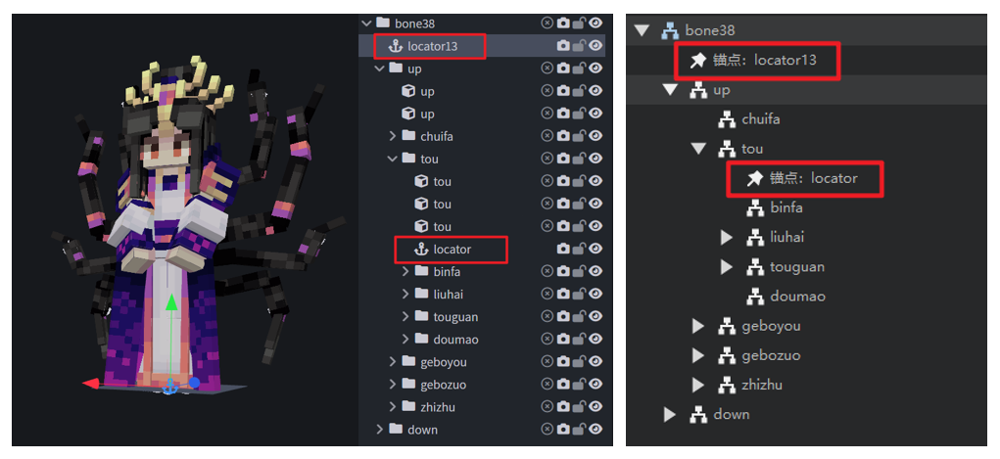
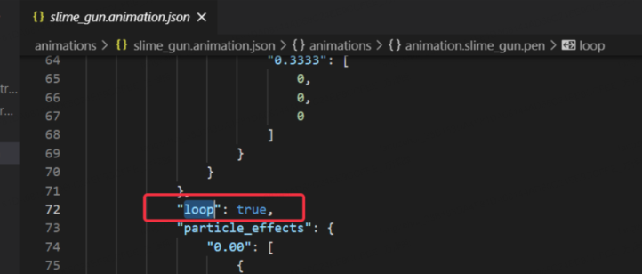
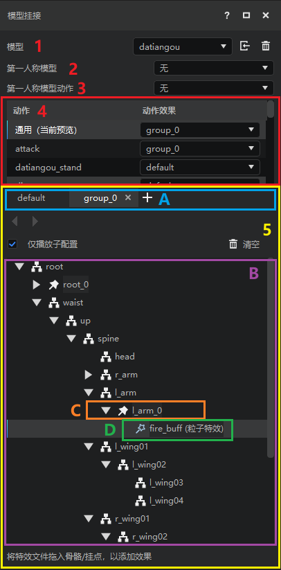
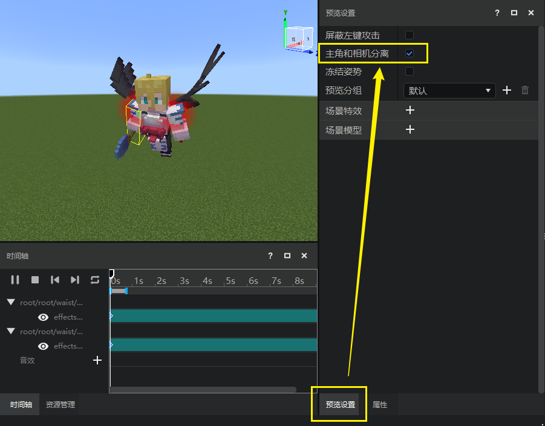

# 特效挂接到模型

本篇教程主要介绍以下内容：

1. 原版粒子特效挂接到原版Blockbench模型。
2. 中国版特效挂接到中国版骨骼模型。

> **注意：**
>
> 上面两套挂接关系是不能相互交叉的（例：不支持将原版粒子特效挂接到中国版骨骼模型上）。

## 原版粒子特效挂接到原版模型

原版生物模型是由Blockbench软件制作的，而原版粒子特效是有Snowstorm软件制作的。关于原版模型的制作，请参考[原版模型制作指南](../6-模型和动作/01-原版模型制作指南.md)。

接下来我们将介绍原版模型、原版粒子的相关知识，及其挂接操作。

### 1. 原版模型结构介绍

原版Blockbench模型是由一个有一个立方体组成，而多个立方体可以合并为一个 **组（group）** 结构。换句话说，一个组是单个或多个立方体的集合。它的作用就类似于骨骼模型中的骨骼。

> **注：**
>
> 在其他文档中，“Group”也被翻译为原版模型的“骨骼”。这并没有实质性的错误，但是为了和后文骨骼模型做区分，本文还是译作“组”。

组在Blockbench的结构列表中显示为文件夹的形式，可以展开查看组内的立方体；而在特效编辑器中只能查看到“组”这一层，看不到内部包含的立方体。

原版粒子想要挂接到原版模型上，是不能直接挂接到立方体或者组上的，因为它们的位置是相对固定的，我们不可能为了调整特效的位置而去改边模型本身的形状。因此，原版模型引入了**锚点（locator）**，来辅助粒子特效挂接。

原版粒子特效必须挂接在锚点上，而锚点必须要创建在组下面（如下图，左边是锚点在Blockbench中的展示，右边是锚点在特效编辑器挂接面板结构列表中的展示）。在模型播放动作时，锚点会跟随组移动，但是开发者可以自由调整锚点对组的位置、旋转来控制特效生成的相对位置和旋转角度。

如果导入的模型本身自带锚点，则这些锚点会在结构列表中显示出来。同样，开发者也可以在模型的组上右键，选择【新建锚点】并且为其命名，即可创建一个新的锚点，用来挂接原版粒子特效。

### 2. 原版模型的挂接面板

原版模型的挂接面板如下图所示：

|序号|模块名称|模块介绍|
|---|---|---|
| ①|模型|通过下拉框选择要挂接的是哪个模型。在这里选择一个原版模型，下面其他内容显示的就是原版模型的格式。|
|②|动作 |指定需要挂接特效到哪一个模型动作上。受限于原生游戏设定，原版特效的挂接信息是绑定到原版模型的动作上的，一个动作对应一套特效挂接。如果你需要在B动作上使用与A动作完全一样的特效，则需要在B动作上重新挂接一遍，无法直接复用。|
| ③|结构列表 |用于展示原版模型的组结构、组内的锚点，以及锚点上挂接的特效。|

### 3. 原版粒子特效的挂接至锚点

想要将原版粒子特效挂接到原版模型上，只需要从资源管理器窗口，将特效json文件拖至希望挂接的锚点上，即可完成挂接。

如果需要修改当前锚点位置、旋转角度，只需要选中锚点后，点击左上角的【移动】或【旋转】按钮，即可在预览窗中显示对应的变换拖柄，方便我们进行可视化拖拽调整。调整完毕后如果需要隐藏拖柄，点击【复位】按钮即可。

挂接完毕后，我们切换至时间轴窗口，可以看到时间轴显示出了刚才挂接的特效，及其所在的锚点名称。点击左上角的【播放】按钮，即可预览动作播放时的特效效果。

> 常见问题：
> 1. 如果微软粒子特效挂接的bb模型动作时长为0，则在编辑器中可能会出现同时多次发射该粒子的情况。
> 2. 如果bb模型动作时长不为0，但是仍然出现了动作播放时仍然出现了两次播放该粒子的情况，请检查下所挂接的动作json文件中是否存在“loop”字段，如果存在，将其删除。
> 

## 中国版特效挂接到中国版骨骼模型

接下来我们将介绍原版模型、原版粒子的相关知识，及其挂接操作。

### 1. 中国版骨骼模型的挂接面板

中国版骨骼模型的挂接面板如下图所示：

|序号|模块名称|模块介绍|
|---|---|---|
|①|模型|用于显示和修改当前挂接模型名称。|
|②|第一人称模型|用于显示和修改当前挂接模型的第一人称模型。具体用法可参考[第一人称模型修改](./10-模型导入.md#第一人称模型修改)|
|③|第一人称模型动作|用于显示和修改当前挂接模型的第一人称视角播放的模型动作|
|④|动作列表|用于显示和修改和预览当前挂接模型的骨骼动画，并为每个动作提供了单独的分组选择下拉框，开发者可以在此选择每个动作使用不同的分组，点击某一动作并在时间轴窗口点击播放按钮，可以在预览窗中查看动作播放效果（如下图）。 另外特效编辑器为每个模型都默认添加了一个空动画“通用”，在“通用”下，模型不会播放任何动画。 |
|⑤|挂点列表|用于显示和管理骨骼模型当前的骨骼节点和特效挂接结构。挂点列表包含挂接分组、挂点结构、挂接点和挂接资源（如图中ABCD所示）。|

> **注：**
>
> Steve **不算骨骼模型**，所有没有骨骼动画。Steve 身上的head、body、left_arm等结构我们统称为**部件**。

中国版模型的**挂点列表**相对复复杂，下面我们进行详细说明。

**A. 挂接分组：**

存放一系列挂接信息，通过创建多个不同的分组可以有效管理同个模型不同状态下的挂接信息，当前挂接分组主要用于第④点中的动作列表，可为每一个动作选择不同分组下的挂点信息以达到切换特效的功能。

挂点分组右侧的 【+】按钮可以新增挂点分组，每个分组右侧的【×】可以删除当前挂点（default分组只能清空挂接信息，不可删除）。

**B. 挂点结构：**

通过列表或树结构实时展示当前挂接模型的骨骼/部件结构以及挂点、特效信息。

**C. 挂点：**

用于挂接特效资源等，与原版模型中的“锚点”功能相同。挂点可以调整特效相对于骨骼的位置、旋转等。

**D. 挂接资源：**

中国版粒子特效、序列帧特效、骨骼模型等我们需要挂接到当前模型身上的资源。可以直接挂接到骨骼模型、部件（无法挂接模型）或挂点上。

**E. 右键快捷操作：**

在挂点列表的任意节点右键可触发快捷操作，对于不同类型节点支持的快捷操作如下：

|右键点击对象|可进行的快捷操作|
|---|---|
|骨骼|新建挂点、绑定模型、复制分组（挂点信息）、粘贴分组（挂点信息）、复制（当前节点挂点信息），粘贴（当前剪贴板的特效信息），粘贴信息（当前节点挂点信息）|
|部件|新建挂点、复制分组（挂点信息）、粘贴分组（挂点信息）、复制（当前节点挂点信息），粘贴（当前剪贴板的特效信息），粘贴信息（当前节点挂点信息）|
|挂点|删除、重命名、复制分组（挂点信息）、粘贴分组（挂点信息）、复制（当前节点），粘贴信息（当前节点挂点信息）、粘贴（节点）、创建副本|
|特效|删除、复制分组（挂点信息）、粘贴分组（挂点信息）、复制（当前节点）|

### 2. 中国版特效挂接至挂点

首先点击挂接模型，将 Steve 切换到 datiangou，即可看到人物变成了大天狗的模型。我们将把名为`fire_buff`的特效挂接到大天狗的左手。

创建挂接分组，点击【+】按钮新建挂点分组，输入`buff`，即可创建`buff`分组，然后在该分组选中挂点结构中的`l_arm`，点击【新建挂点】按钮，创建挂点`fire01`：

> 注意:模型的具体挂接位置是由模型本身确定的

点击资源管理器，将里面的 `fire_buff.json` 拖入到`fire01`挂接点中，点击时间轴的播放，即可看到模型的左肩部产生红色buff特效。

同样地，我们在大天狗右臂(`r_arm`)新增一个挂点`fire02`，并挂接一个`fire_buff`特效。

修改了 `fire02` 后，为什么已经在左肩和右肩都挂了粒子特效，仍然只有右肩在播放呢？这是因为我们开启了【仅播放子配置】选项。我们可以按照自己的需求，采用以下两个方法恢复`fire01`下的特效显示：

- 从挂点结构修改，当点击某个挂接点时，仅仅会显示该挂接点的包含特效，所以我们只需点击 `root`根节点 挂接分组即可全部显示。如图所示：
- 取消勾选仅播放子配置：取消勾选后会播放当前挂接模型分组下的所有特效，与选中root根节点效果一致，如图所示:
  

挂接粒子特效之后，接下来开始挂接序列帧特效。由于序列帧特效是一个光圈，期望是将其挂接到两个位置：一个是人物的背后，另一个是人物头顶。

我们新建 `snow01` 挂接点，选择挂机位置为 `spine`，可以看到序列帧特效正好在人物的身上，如果觉得看不清，可以点击【预览设置】，选择【主角和相机分离】，这样可以360°查看人物。

如果我们需要调整特效挂点的位置，需要使用到【位移】、【旋转】变换拖柄，它们的操作与上文中原版模型锚点的变换拖柄操作方法相同。

> **注意：**
>
> 【位移】仅可在模型为骨骼模型并且**选中了一个挂点**时才可用（如果是默认的Steve模型无法使用位移功能）。

另外，我们也可以选中挂点后，在右侧属性面板对其【偏移】、【旋转】参数进行精细调整。

例如我们可以使用变换拖柄将`snow01`的特效调整到模型背后。

