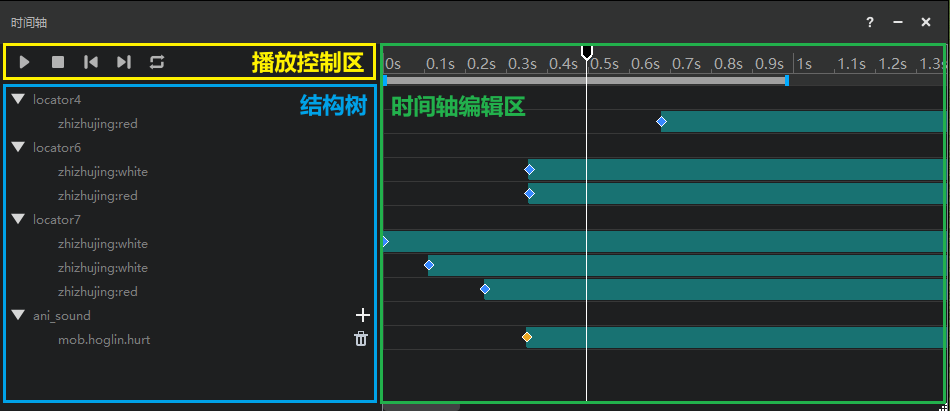
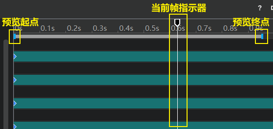
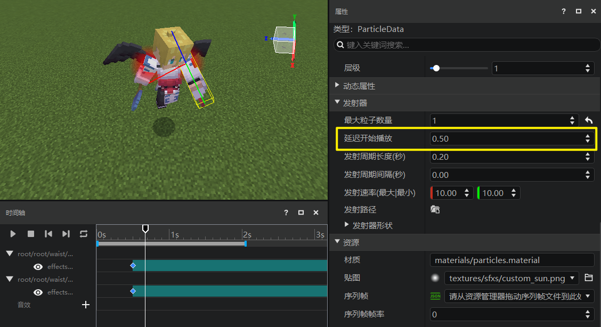

# 时间轴功能

将特效挂接到模型，只能帮我们实现特效在某个位置播放，但是并不能控制特效具体在模型动作的哪个时点开始播放。想要控制特效播放的时机，就需要用到特效编辑器的**时间轴功能**。

除了控制特效播放时点外，时间轴还支持音效挂接和播放控制。

## 时间轴界面划分

时间轴窗口的界面主要分为3个模块：

## 时间轴功能简介

下面我们将按模块依次介绍时间轴的功能：

### 1. 播放控制区

用于控制模型动作的播放。包含5个功能按钮，从左至右依次为：
- 播放/暂停
- 停止
- 跳转到前一帧
- 跳转到后一帧
- 循环播放、单次播放切换

### 2. 结构树

结构树的功能包括：

**1）展示特效挂接**

结构树会按顺序依次展示当前模型结构中，挂接了特效的挂点或锚点，及它们下面挂接的特效。

点击挂点/锚点左侧的三角形按钮，可以折叠其下方的特效。

**2）控制特效显隐**（仅中国版骨骼模型可用）

对于中国版骨骼模型，如果开发者仅希望查看当前已挂接的特效中的部分特效效果，可以点击特效前面的小眼睛按钮，来隐藏多余的特效显示。

**3）挂接音效**

结构树下方还有【音效】标签，点击右侧的【+】号可以为动作添加音效。选中已添加的特效，可以在右侧属性窗口通过下拉框修改具体的音效种类。

> 目前时间轴只支持添加原版游戏自带的音效。

- 如果想删除已挂接在中国版骨骼模型上的音效，点击其右侧的【垃圾桶】按钮即可。
- 如果想删除已挂接在原版模型上的音效，需要右键点击后选择【删除音效】。

### 3. 时间轴编辑区

时间轴编辑区的主要功能为控制已挂接的各个特效和音效的播放开始时点。

**1）预览功能**

提供动作的预览功能是时间轴的最基础任务。当我们在左侧挂接面板选择了一个动作，时间轴顶部就会显示出两个蓝色的小拖柄，它们分别位于动作的第一帧和最后一帧，用于指示动作预览的起点和终点。我们点击播放按钮后，动作就会从预览起点开始播放，到达预览终点后停止。播放过程中，会有一个当前帧指示器标出播放进度，指示器走到预览终点，即代表播放结束。

预览起点和终点是可以手动调整的。当我们只需要观察动作的一部分时，拖动预览起点和终点拖柄来限制预览范围。

**2）特效播放时点控制**

特效挂接到模型动作后，默认都是从动作的0s处开始播放的。有时，我们希望他在动作的中间某个时点开始播放，这就需要用到特效拖柄来调整它的播放时间。

拖动特效时间轴上的拖柄，我们可以让特效在动作时间范围内的任意时点开始播放。如果你需要更加精确地调整特效播放的时机，可以点击某个特效的时间轴后，在右侧时间轴属性面板直接调整它的延迟数值。

> **注意：**
>
> **本段说明仅针对中国版特效，原版粒子特效不受影响**
> 中国版特效（粒子和序列帧）自带“延迟开始播放”属性。初次挂接到骨骼模型时，中国版特效在时间轴上的播放起点将读取其配置中“延迟开始播放”字段的值。此时如果我们拖动了时间轴上的拖柄，相当于放弃了粒子配置中的“延迟开始播放”字段，而采用时间轴上新的延迟设置。我们更推荐使用时间轴延迟（因为修改配置中的延迟无法做到实时预览，只能删除特效后重新挂接），但如果您希望保留并使用原本配置中的设置，请勿调整时间轴拖柄。
>
> 

> **提示：**
>
> 特效拖柄可以拖至模型动作结束时点之后，即代表在动作播放完之后一段时间播放该特效。但需要注意的是，特效编辑器只能播放预览起点和终点以内的时间。如果你的特效播放时点晚于预览终点时间，则需要在开发包中自行测试调整。

**3）音效播放时间控制**

与特效播放控制相同，可以通过拖柄调整或在右侧属性菜单精确调整。在此不再赘述。
