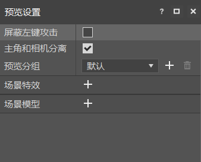
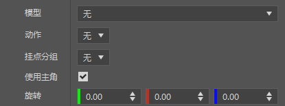
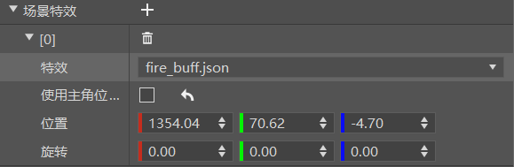
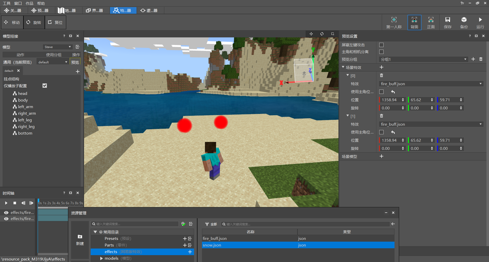
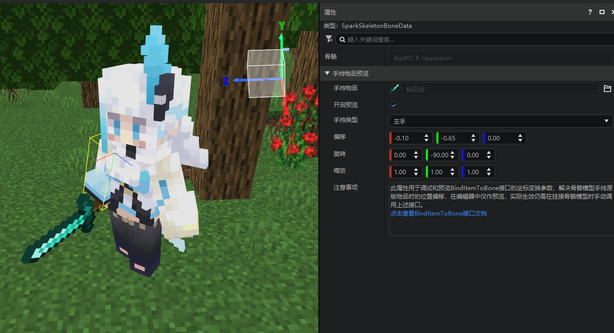
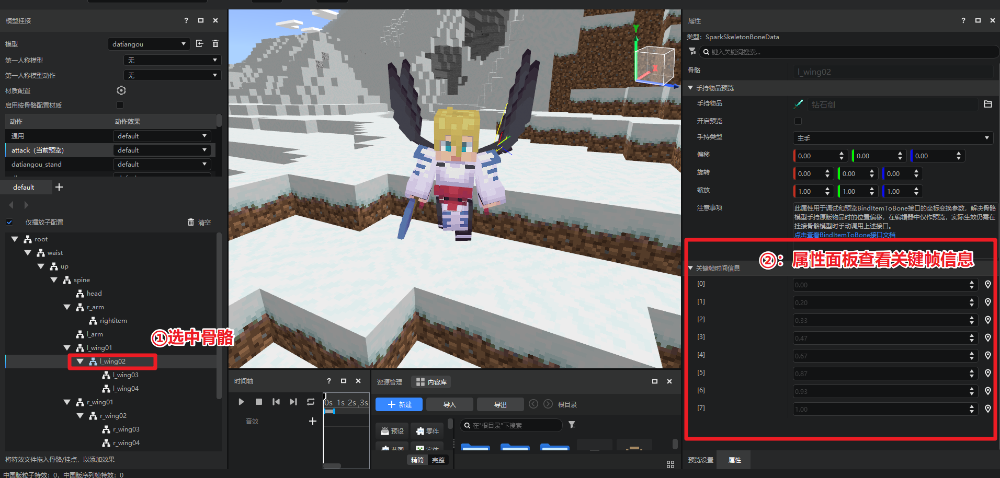
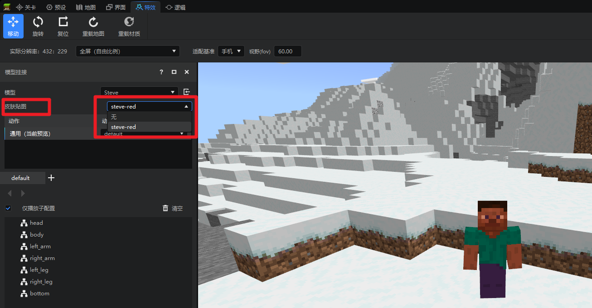
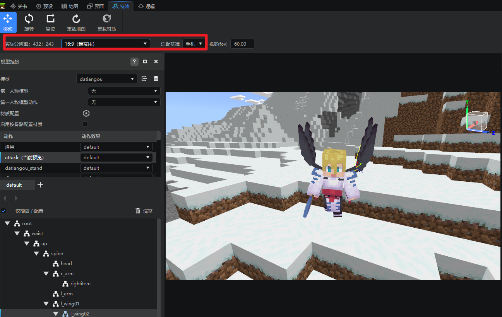

# 预览功能

本篇教程主要介绍以下内容：

1. 预览面板功能。

2. 使用预览面板预览模型和特效。

## 预览面板功能

默认的预览面板如图所示：

特效模型预览用于快速的预览指定模型和挂在其身上的特效，不仅如此，也可以在场景中添加其他模型和特效。

其中各个参数说明如下：
- **屏蔽左键攻击**：用于开关是否屏蔽Steve左键攻击的动作。
- **主角和相机分离**，用于开关是否让相机可以360°查看模型视角，默认的游戏视角仅能查看主角的正面或者背面，而且视角固定，通过打开视角分离，可以更为方便的查看模型。

    

- **预览分组**：保存和管理预览设置的一系列设置和特效模型的挂接信息，通过切换分组可以快速切换预览多种配置的场景特效和模型。

- **场景模型**，用于在场景中批量显示任意模型，其配置项如下：

    

  - 模型：用于选择显示的模型(仅支持骨骼模型)。

  - 动作：模型预览时播放的骨骼动画。

  - 挂接分组：模型预览时选择特效的挂接分组。

  - 使用主角位置：勾选起来会默认使用当前主角位置，如果取消勾选，则可以将模型放置于指定坐标中。

  - 旋转：用于修改模型的旋转角度。

- **场景特效**：用于在场景中任意地点显示自定义特效，其配置项如下：
-
  
  - 特效：用于选择要播放的特效，仅支持位于 effects 文件夹下的网易自定义特效。

  - 使用主角位置：勾选起来会默认使用当前主角位置，如果取消勾选，则可以将特效放置于指定坐标中。

  - 旋转：用于修改特效的旋转角度。

## 预览模型和特效

了解了以上预览功能后，可以直接在场景中添加模型和特效了，首先来添加特效，点击场景特效上的 + 号，选择已有的 fire_buff.json，点击播放，即可看到特效在场景中被渲染。

> 为了显示方便，这里将模型修改为不带任何特效的 Steve。

如图为演示预览场景特效：

如图为演示预览场景模型：

预览功能整体来说比较简单，主要是为了让玩家能够更加方便的预览多个模型和多个特效。
## 预览手持物品绑定位置
当开发者希望用骨骼模型作为玩家模型时，此时玩家如果手持一些原版的物品，则会有可能出现手持物品位置与骨骼模型无法匹配和对应的情况，如下图：

为了解决上述问题，在2.8新增了<a href="../../../mcdocs/1-ModAPI/接口/模型.html#binditemtobone" rel="noopenner">BindItemToBone接口</a>，该接口可以将玩家主副手手持物品的位置绑定到骨骼模型的某个骨骼中，并且支持偏移、旋转和缩放。

开发者可以在制作骨骼模型时单独为玩家手持物品的位置增加一个透明骨骼，再调用上述接口，即可将手持物的位置设置到对应位置，再根据表现调整偏移、旋转和缩放参数。

为了简化上述来回修改接口调整参数值的过程，在特效编辑器新增了手持物品预览的功能，具体使用方法如下：

1. 进入特效编辑器，切换到对应的骨骼模型
2. 选中任意想要绑定的骨骼

1. 点击属性面板，找到手持物品预览相关属性
2. 调整参数，勾选预览，即可在预览窗观察玩家手持的物品被绑定到当前选中的骨骼的效果。

> 注意：该功能仅供开发者调试最佳的绑定参数，无法直接生效到作品，请自行在挂在骨骼模型到玩家身上后调用BindItemToBone接口设置对应的参数。

## 预览模型动画关键帧信息
当挂接特效时，经常会出现开发者希望特效的出现和持续时间与某个关键帧的时间完全一致，但无法确切知道关键帧的时间，难以匹配，现在，当你选用某个骨骼时，属性面板会显示出该骨骼的所有关键信息，如下图所示。

## 修改和预览steve皮肤贴图

当您未制作模型，仅希望修改和测试一张玩家皮肤贴图时，您可以将皮肤贴图导入`resource_pack_xxx/textures/models`目录下,在特效编辑器选择steve默认模型时，其下方会出现【皮肤贴图属性】，此时开发者可以修改和预览皮肤贴图，如下图所示。

## 调整预览窗口的分辨率
如您特别关注某个分辨率下特效的效果是否准确，您可以调整工具栏上的分辨率预设类型和适配基准，帮助您更好观察指定分辨率的效果，如下图所示：

