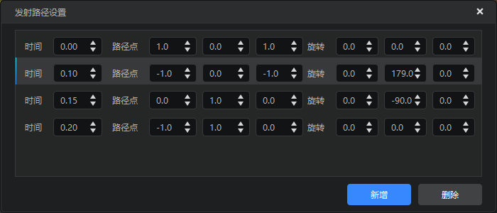
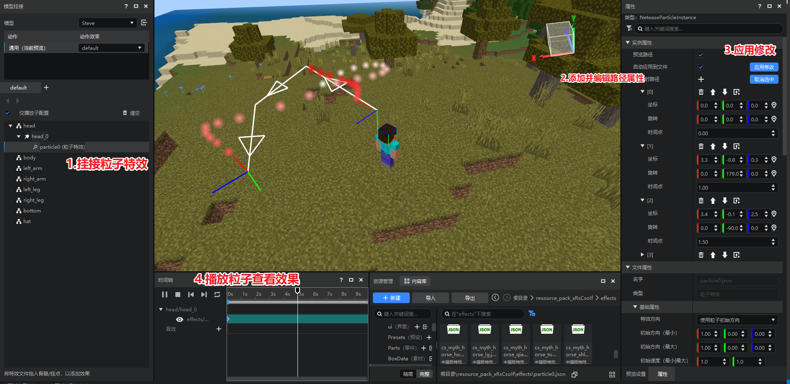
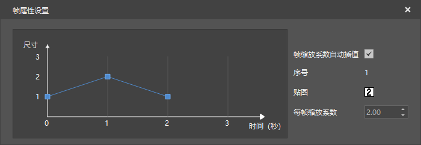
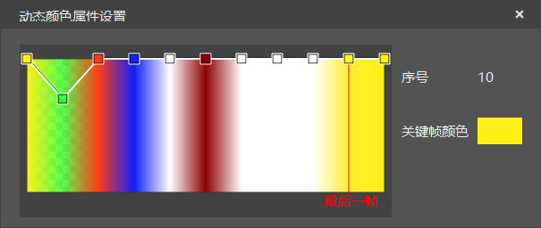

# 中国版特效属性详细说明

## 粒子特效基本属性说明

### 特效方向direction

#### direction

属性   | 说明
---- | ----------------------------------
描述   | 设置粒子方向
默认值  | `Inwards`
参数范围 | `Inwards`, `Outwards`, `Direction`

- Direction, 使用粒子初始方向方向（每个方向在 `directionMin` 和 `directionMax` 之间随机）


- Inwards, 使用发射器形状的向心方向


- Outwards, 使用发射器形状的离心方向


#### directionMin

属性   | 说明
---- | -------------------------------------
描述   | 设置粒子随机方向的最小值, 分别为 x, y, z 轴方向, 负值代表反向
默认值  | `-1.0 -1.0 -1.0`
参数范围 | -1.0 ~ 1.0
提示   | 该参数仅在方向为`Direction`时有效

#### directionMax

属性   | 说明
---- | ------------------------------------------------------------
描述   | 设置粒子随机方向的最大值, 分别为 x, y, z 轴方向, 负值代表反向
默认值  | `1.0 1.0 1.0`
参数范围 | -1.0 ~ 1.0
提示   | 该参数仅在方向为`Direction`时有效, directionMax各个方向需要大于directionMin的相应值

```json
{
  "direction": {
    "value": "Inwards",
    "min": "-1.0 -1.0 -1.0",
    "max": "1.0 1.0 1.0"
  }
}
```

### 初始速度velocity

属性   | 说明
---- | -----------------------
描述   | 粒子的初始速度, 矢量, 分别为最小值和最大值
默认值  | `1.0 1.0`
参数范围 | -100000.0 ~ 100000.0

```json
{
  "velocity": {
    "value": "1.0 1.0"
  }
}
```

### 恒定力constantforce

属性   | 说明
---- | -------------------------
描述   | 粒子在 x, y, z 轴上所受恒定力, 相当于粒子运动过程中的加速度
默认值  | `0.0 0.0 0.0`
参数范围 | -100000.0 ~ 100000.0

```json
{
  "constantforce": {
    "value": "0.0 0.0 0.0"
  }
}
```

### 阻尼力dampingforce

属性   | 说明
---- | --------------------
描述   | 方向与粒子速度方向相反的加速度
默认值  | `0.0`
参数范围 | -100000.0 ~ 100000.0
提示   | 当为负数时, 为加速度
说明   | v 为粒子当前速度  则计算为 `v = v - dampingforce * v`

```json
{
  "constantforce": {
    "value": "0.0 0.0 0.0"
  }
}
```

### 初始尺寸particlesize

属性   | 说明
---- | ------------------------
描述   | 面向摄像机的二维平面(x, y)上的粒子初始尺寸
默认值  | `0.1 0.1`
参数范围 | -100000.0 ~ 100000.0
提示   | max 各个方向需要大于 min 的相应值

```json
{
  "particlesize": {
    "min": "0.1 0.1",
    "max": "0.1 0.1"
  }
}
```

### 初始旋转rotation

属性   | 说明
---- | --------------------------
描述   | 面向摄像机的二维平面(x, y)上的粒子的初始旋转量，即绕z轴的旋转的角度
默认值  | `0.0`
参数范围 | -999999.0 ~ 999999.0
提示   | 正数为逆时针, 负数为顺时针
提示   | 粒子的初始旋转介于min与max之间

```json
{
  "rotation": {
    "min": "0.0",
    "max": "0.0"
  }
}
```

### 旋转速度rotationspeed

属性   | 说明
---- | ------------------------
描述   | 面向摄像机的二维平面(x, y)上的粒子旋转速度
默认值  | `0.0`
参数范围 | -999999.0 ~ 999999.0
提示   | 正数为逆时针, 负数为顺时针
提示   | 粒子的实际旋转速度介于min与max之间

```json
{
  "rotationSpeed": {
    "min": "0.0",
    "max": "0.0"
  }
}
```

### 生存时间timetolive

属性   | 说明
---- | --------------------
描述   | 粒子的生存时间
默认值  | `1.0`
参数范围 | 0.0 ~ 100000.0
提示   | 粒子的实际生存时间介于min与max之间，例如下列参数则设定粒子的存在时间为 1 - 2 秒

```json
{
  "timetolive": {
    "min": "1.0",
    "max": "2.0"
  }
}
```
### 预热prewarm
属性   | 说明
---- | --------------------
描述   | 开启后粒子发射器在游戏初始就开始发射粒子
默认值  | 不开启
```json
{
   "prewarm": true
}
```
### 独立生存时间independent
属性   | 说明
---- | --------------------
描述   | 开启后每个粒子的生命周期都会独立计算，关闭发射器粒子不会立即消失，而是会按照自身的生命周期逐渐消散
默认值  | `false`
参数范围 | `false`,`true`
```json
{
    "independent": false
}
```
### 层级layer

属性   | 说明
---- | --------------------------
描述   | 支持粒子前后层级效果，当数值越大，渲染越晚，显示越靠前
默认值  | `1`
参数范围 | 0 ~ 15

```json
{
  "layer": 1
}
```

## 粒子特效动态属性说明

### 动态尺寸sizedelta

属性   | 说明
---- | --------------------
描述   | 用来控制粒子尺寸在不同时间的大小变化
默认值  | 不开启
提示   | 包含相对时间和绝对时间两种形式


```json
"sizedelta": [
	{
		"scale": "1.000 1.000",
		"time": "27%"
	},
	{
		"scale": "3.000 3.000",
		"time": "57%"
	}
	{
		"scale": "1.000 1.000",
		"time": "89%"
	}
]
```

### 动态颜色colorfade

属性   | 说明
---- | --------------------
描述   | 用来控制粒子尺寸在不同时期的颜色变化
默认值  | 不开启
提示 | 颜色值在不同的点之间是按照线性变化，支持透明度设置


```json
"colorfade": [
	{
		"color": "1.00 1.00 1.00 1.00",
		"time": "0.0"
	},
	{
		"color": "0.67 0.00 0.00 0.44",
		"time": "0.48"
	},
	{
		"color": "1.00 1.00 0.24 1.00",
		"time": "1.0"
	}
]
```


### 粒子扰动disorder


属性        | 说明
--------- | ----------------------
描述        | 支持粒子能够在 x, y, z 轴上随机扰动
min       | 粒子在 x, y, z 轴上的最小扰动幅度
max       | 粒子在 x, y, z 轴上的最大扰动幅度
interval  | 粒子扰动时间间隔(秒)
increment | 每次扰动后递增幅，多用于实现散开效果
提示        | 粒子的实际扰动介于min与max之间

```json
{
  "disorder": {
    "min": "0.0 0.0 0.0",
    "max": "0.0 0.0 0.0",
    "interval": "0.0",
    "increment": "0.0"
  }
}
```

## 粒子发射器属性说明

### 最大粒子数量numparticles


属性   | 说明
---- | -----------
描述   | 粒子同时存在的最大数量
默认值  | `10`
参数范围 | 0 ~ 100000
提示   | 同屏显示的粒子数量还会受到发射速率的限制

```json
{
  "numparticles": {
    "value": "10"
  }
}
```

### 发射周期长度activetime

属性   | 说明
---- | ----------------------------
描述   | 粒子发射器连续发射粒子的时间，此期间会一直连续发射粒子
默认值  | `0.0`
参数范围 | 0.0 ~ 100000.0
提示   | 需要配合发射冷却时间 inactivetime 联合使用
说明  | 可将其可以视为发射器生命周期，方便调试有时间限制的效果。如果设置为 0，粒子发射器会一直发射, 不会停歇

```json
{
  "activetime": {
    "value": "0.0"
  }
}
```

### 发射周期间隔inactivetime

属性   | 说明
---- | ----------------------------
描述   | 两个发射周期之间的间隔
默认值  | `0.0`
参数范围 | 0.0 ~ 100000.0
提示   | 需要配合连续发射时间 activetime 联合使用
说明  | 可将其视为发射器冷却时间

```json
{
  "inactivetime": {
    "value": "0.0"
  }
}
```

### 发射速率emissionrate

属性   | 说明
---- | -------------------------------
描述   | 发射周期内粒子发射器每秒发射粒子数
默认值  | `10.0`
参数范围 | 0.0 ~ 100000.0
提示   | 该速率仅会在发射周期长度内生效，当处于发射间隔时，将停止发射
提示   | 粒子的实际发射速率介于min与max之间

```json
{
  "emissionrate": {
    "min": "10.0",
    "max": "10.0"
  }
}
```

### 发射路径emitterpath


属性   | 说明
---- | -----------------------------
描述   | 粒子发射器发射的路径，多用于配置爆炸等效果
参数范围 | 偏移 offset 无限制，旋转 rotation，取值为-180°~180°（旋转顺序为xyz），时间 time 需要在粒子生存周期的最大值里


注意：rotation参数使用的四元数进行旋转插值，取值范围为-180°~180°，使用时需要有一个time为0的初始关键帧，旋转时会选择最短路径。下面是一个粒子发射器绕y轴旋转360°的例子，需要玩家插入4个关键帧才能实现预期效果。

```json
{
  "emitterpath": [
  {"offset": "1.0 0.0 1.0", "rotation": "0.0 0.0 0.0","time": "0.0"},
  {"offset": "-1.0 0.0 -1.0", "rotation": "0.0 179.0 0.0","time": "0.1"},
  {"offset": "0.0 1.0 0.0", "rotation": "0.0 -90.0 0.0","time": "0.15"},
  {"offset": "0.0 1.0 0.0", "rotation": "0.0 0.0 0.0","time": "0.2"},
  ]
}
```


#### tips：如何可视化编辑发射路径
除了在上图的窗口设置发射路径，现在你还可以在已挂接在模型上的**特效实例**上进行发射路径的可视化编辑，如下图：


> 0. 挂接到模型上的特效是特效实例，其属性是实例属性，存储在引擎内存中，与粒子文件里的属性无对应关系。

> 1. 在实例属性的编辑只会针对当前选中的粒子特效实例生效，必须点击【应用修改】后才会同步到文件。
> 2. 可以勾选图中的【自动应用到文件】选项，将实时将实例属性同步应用到粒子特效的文件内。
> 3. 可以勾选【预览路径】在场景中查看由箭头构成的发射路径。
> 4. 每个路径点和旋转角度属性均有删除、向上移动，向下移动，在上面添加，定位当前路径点功能。
> 5. 通过定位到当前路径点或旋转角度，可在场景中通过对应的拖柄直接拖拽修改该路径点的相对位置和旋转角度，如下图：


### 发射器形状emittertype

属性   | 说明
---- | -----------------------------------------
描述   | 粒子发射器的形状
默认值  | `Spere`
参数范围 | `Sphere`, `Hemisphere`, `Cylinder`, `Box`,`Cone`

- Sphere, 球形
- Hemisphere, 半球形
- Cylinder, 柱面(圆柱形)
- Box, 方形
- Cone, 锥形

```json
{
  "emittertype": {
    "value": "Spere"
  }
}
```

### 发射器尺寸emittersize

属性   | 说明
---- | --------------
描述   | 粒子发射器包围盒的尺寸，分别对应 x, y, z 轴
默认值  | `0.0` `0.0` `0.0`
参数范围 | 0.0 ~ 100000.0

```json
{
  "emittersize": {
    "value": "0.0 0.0 0.0"
  }
}
```

### 发射器尺寸缩放系数emitterscale

属性   | 说明
---- | ---------------------------
描述   | 粒子发射器在不同时间的缩放系数，用于扩展发射器的大小
默认值  | 不开启
参数范围 | `value` 无限制，`time` 需要在粒子最大生存时间内
说明 | 该参数对已发射的粒子无影响


```json
{
  "emitterscale": [
    {"time": "0.26", "value": "0.9"},
    {"time": "1.41", "value": "3.0"},
    {"time": "2.11", "value": "0.9"}
  ]
}
```

### 发射器表层厚度比例thickness

属性   | 说明
---- | ----------------------------------------
描述   | 发射器表层厚度比例, 当为 0 时,发射器仅包含表面形状, 当为 1 时, 发射器为实心
默认值  | `0.0`
参数范围 | 0.0 ~ 1.0

```json
{
  "thickness": {
    "value": "0.0"
  }
}
```

## 粒子特效资源属性说明

### 材质material

属性  | 说明
--- | ------------------------------
描述  | 粒子材质
默认值 | `"materials/particles.material"`

```json
{
  "material": {
    "name": "materials/particles.material"
  }
}
```
### 自定义材质materialname

属性  | 说明
--- | ------------------------------
描述  | 指定特效使用自定义名称的材质，默认情况不配置，若配置则会使深度测试、混合模式、点滤波功能和纹理颜色乘动态颜色功能失效（因为上述功能均是依靠切换材质实现），如有需要，请自行编写材质文件实现失效的功能。
默认值 | 不配置

```json
{
   "materialname": {
     "value": "my_material"
  },
}
```
### 贴图texture

属性   | 说明
---- | -----------------------
描述   | 粒子贴图，仅支持显示整张贴图
默认值  | `"textures/particle/sun"`
参数范围 | 无

```json
{
  "texture": {
    "name": "textures/particle/sun"
  }
}
```

### 序列帧ani

属性   | 说明
---- | -------------
描述   | 粒子特效里使用的序列帧贴图
默认值  | ""
参数范围 | 无

```json
"texture": {
  "ani": {
    "fps": "1",
    "name": "textures/particle/my123_2"
  },
  "name": "textures/particle/my123_2"
}
```

### 序列帧帧率fps

属性   | 说明
---- | ----------------
描述   | 粒子特效里携带的序列帧的播放速度，每秒播放帧数
默认值  | `0`

```json
"texture": {
  "ani": {
    "fps": "1",
    "name": "textures/particle/my123_2"
  },
  "name": "textures/particle/my123_2"
}
```

### 序列帧随机播放shuffle

属性   | 说明
---- | ----------------
描述   | 粒子特效里携带的序列帧是否随机播放各个帧，如果选择打开则播放序列帧是乱序的，关闭则是按顺序播放
默认值  | false

```json
"texture": {
  "ani": {
    "fps": "1",
    "name": "textures/particle/my123_2",
    "shuffle": true
  },
  "name": "textures/particle/my123_2"
}
```

## 粒子特效渲染属性说明

### 序列帧循环enableloop

属性   | 说明
---- | ---------------
描述   | 当粒子的生命周期大于所携带的序列帧的时间时，用于控制序列帧是否循环播放
默认值  | `true`
参数范围 | `false`, `true`

```json
{
  "enableloop": {
    "enable": "true"
  }
}
```

### 相对挂点运动relative

属性   | 说明
---- | --------------------
描述   | 用于控制粒子特效的运行轨迹是否相对于挂点
默认值  | `true`
参数范围 | `true`, `false`

```json
{
  "relative": {
    "value": "true"
  }
}
```

### 混合模式blend

属性   | 说明
---- | --------------
描述   | 用于控制不同粒子特效混合效果
默认值  | `blend`
参数范围 | `blend`, `add`, `Opaque`

- blend, 透明度混合, 能保证两个颜色显示正常
- add, 颜色值累加
- Opaque, 不透明

```json
{
  "blend": {
    "name": "blend"
  }
}
```


### 粒子朝向模式faceCameraMode

属性   | 说明
---- | ---------------------------------------------------
描述   | 用于控制粒子的朝向
默认值  | `Rotate XYZ`
参数范围 | `Rotate XYZ`, `Rotate Y`, `Horizontal`, `Direction`，`Direction Horizontal`

- Rotate XYZ, 粒子朝向相机
- Rotate Y, 粒子朝向地面
- Horizontal, 粒子朝向水平方向
- Direction, 粒子朝向为速度方向
- Direction Horizontal，粒子朝向水平速度方向

```json
{
  "faceCameraMode": {
    "value": "Rotate XYZ"
  }
}
```

### 深度测试depthtest

属性   | 说明
---- | -----------------
描述   | 用于控制粒子特效是否开启深度检测
默认值  | `false`
参数范围 | `true`, `false`
说明 | 如果关闭深度检测，粒子特效会遮盖所在的屏幕平面渲染的东西，如果开启，则会依据深度进行相关渲染

- 关闭深度检测


- 打开深度检测


```json
{
  "depthtest": {
            "enable": "false"
        }
}
```

## 粒子拖尾效果属性说明
粒子拖尾(轨迹)效果配置需要放在trail字段的字典下，具体示例:
```
{
  "particleeffect": {
    ... // 粒子的各种原有属性
    "trail": {
      "lifetime": 3.0,
      "maxnum": 512,
      "mindistance": 0.01,
      "useparticlecolor": false,
      "useparticlewidth": true,
      "facemode": 0,
      "texmode": 0,
      "textile": "2.0 2.0",
      "worldspace": true,
      "colorfade": [
        {
          "color": "1.0 1.0 1.0 0.5",
          "time": "0.0%"
        },
        {
          "color": "1.0 1.0 1.0 1.0",
          "time": "20.0%"
        },
        {
          "color": "1.0 1.0 1.0 0.0",
          "time": "100.0%"
        }
      ],
      "widthfade": [
        {
          "value": "1.0",
          "time": "0.0%"
        },
        {
          "value": "1.0",
          "time": "30.0%"
        },
        {
          "value": "0.5",
          "time": "100.0%"
        }
      ]
    }
  }
}
```
### 生命周期 lifetime
属性   | 说明
---- | ---------------
描述   | 单节轨迹的存在时间 单位秒
默认值  | `0`
参数范围 | `0.0 ~ 30000.0`
```json
{
  "trail": {
    "lifetime": 2.0
  }
}
```

### 最大轨迹段数 maxnum
属性   | 说明
---- | ---------------
描述   | 表示粒子轨迹包含最大段数 用于约束特效开销以及进行某些优化
默认值  | `32`
参数范围 | `1 ~ 4096`
```json
{
  "trail": {
    "maxnum": 128
  }
}
```

### 最小轨迹段长度 mindistance
属性   | 说明
---- | ---------------
描述   | 表示单个轨迹段的的最小长度 防止过于频繁地生成轨迹段导致性能问题
默认值  | `0.01`
参数范围 | `0.01 ~ 1000.0`
```json
{
  "trail": {
    "mindistance": 0.02
  }
}
```

### 朝向模式 facemode
属性   | 说明
---- | ---------------
描述   | 轨迹的朝向模式 0表示世界朝向 1表示面向相机
默认值  | `0`
参数范围 | `0`, `1`
```json
{
  "trail": {
    "facemode": 0
  }
}
```

### 是否使用粒子颜色 useparticlecolor
属性   | 说明
---- | ---------------
描述   | 表示是否使用粒子颜色作为轨迹段的初始颜色
默认值  | `false`
参数范围 | `true`, `false`
说明 |  为true时 轨迹将在被生成的时刻使用所属粒子的颜色作为初始颜色 否则使用白色
```json
{
  "trail": {
    "useparticlecolor": true
  }
}
```

### 轨迹段动态颜色 colorfade(可选)
属性   | 说明
---- | ---------------
描述   | 轨迹颜色曲线 用来表示轨迹段在生命周期内的颜色变化
默认值  | 全程静态纯白色
说明 | color值以RGBA顺序排列 可以参考粒子特效的动态属性
```json
{
  "trail": {
    "colorfade": [
      {
        "color": "1.0 1.0 1.0 1.0",
        "time": "0%"
      },
      {
        "color": "0.5 0.5 0.5 0.0",
        "time": "100%"
      }
    ]
  }
}
```

### 是否使用粒子宽度 useparticlewidth
属性   | 说明
---- | ---------------
描述   | 表示粒子是否使用粒子宽度作为轨迹段的初始宽度
默认值  | `true`
参数范围 | `true`, `false`
说明 | 值为true时 轨迹将使用所属粒子的x缩放值作为初始宽度 否则为1.0
```json
{
  "trail": {
    "useparticlewidth": true
  }
}
```

### 轨迹段动态宽度 widthfade(可选)
属性   | 说明
---- | ---------------
描述   | 轨迹宽度曲线 用来表示轨迹段在生命周期内的宽度缩放倍率变化
默认值 | 1.0
说明 | 格式参考粒子特效的动态属性格式 value中的值表示宽度倍数 而不是宽度值本身
```json
{
  "trail": {
    "widthfade": [
      {
        "value": "1.0",
        "time": "0%"
      },
      {
        "value": "0.2",
        "time": "100%"
      }
    ]
  }
}
```

### 是否参照世界空间 worldspace
属性   | 说明
---- | ---------------
描述   | 表示轨迹段是否在世界空间下生成
默认值  | `true`
参数范围 | `true`, `false`
说明 | 为true时 会根据粒子的世界位置变化来生成轨迹 否则只会按照粒子相对于发射器的位置变化来生成轨迹 当粒子本身就处于世界空间时 true或false的效果相同
```json
{
  "trail": {
    "worldspace": true
  }
}
```

### 纹理模式 texmode
属性   | 说明
---- | ---------------
描述   | 表示轨迹的贴图模式 决定轨迹的贴图如何采样
默认值  | `0`
参数范围 | `0 ~ 3`
* Stretch(0): 横向拉伸贴图 来适配整条路径 不支持textile 支持纹理动画(使用粒子的纹理动画信息)
* Tile(1): 在整条轨迹上重复平铺贴图 支持textile 不支持纹理动画
* DistributePerSegment(2): 将贴图平分成n块 并分配给n段轨迹进行拉伸 不支持textile 支持纹理动画(使用粒子的纹理动画信息)
* RepeatPerSegment(3): 对每一个轨迹段进行单独的平铺操作 支持textile 不支持纹理动画
```json
{
  "trail": {
    "texmode": 2
  }
}
```

### 纹理平铺率 textile
属性   | 说明
---- | ---------------
描述   | 表示轨迹纹理的uv平铺率
默认值  | `"1.0 1.0"`
说明 | 目前仅Tile模式与RepeatPerSegment模式支持该属性 其他纹理模式平铺率均为1.0
```json
{
  "trail": {
    "texmode": 1,
    "textile": "2.0 1.5"
  }
}
```

## 序列帧特效播放属性说明

### 循环播放loop

属性   | 说明
---- | ---------------
描述   | 用于控制序列帧特效是否循环播放
默认值  | `true`
参数范围 | `true`, `false`

```json
{
  "loop": true
}
```

### 帧随机播放shuffle

属性   | 说明
---- | ---------------
描述   | 用于控制序列帧特效是否随机播放，即序列帧的播放顺序不是按照固定顺序
默认值  | `false`
参数范围 | `true`, `false`
提示  | 序列帧数量越多效果越明显

```json
{
  "shuffle": false
}
```

### 播放帧率fps

属性   | 说明
---- | ----------------
描述   | 用于控制序列帧特效每秒的播放数量
默认值  | `30`
参数范围 | [1 - 100]
提示 | 受限于屏幕/游戏刷新率，建议序列帧的播放帧率不要超过30

```json
{
  "fps": 30
}
```

### 延迟开始播放

属性   | 说明
---- | ----------------
描述   | 用于控制序列帧特效是否延迟指定时间（秒）播放
默认值  | `0.0`
参数范围|[0-999999]

```json
{
   "delay": 10.0
}
```

### 始终面向摄像机face_camera

属性   | 说明
---- | ------------------
描述   | 用于控制序列帧特效是否始终正向于屏幕
默认值  | `false`
参数范围 | `true`, `false`

```json
{
  "face_camera": false
}
```

### 深度检测depth_test

属性   | 说明
---- | -----------------
描述   | 用于控制序列帧特效是否开启深度检测
默认值  | `false`
参数范围 | `true`, `false`
说明 | 如果关闭深度检测，序列帧一直会遮盖所在的屏幕平面渲染的东西，如果开启，则会依据深度进行相关渲染

- 关闭深度检测


- 打开深度检测


```json
{
  "depth_test": false
}
```

### 混合模式blend_mode

属性   | 说明
---- | --------------
描述   | 用于控制不同序列帧特效混合效果
默认值  | `1`
参数范围 | `1`, `2`

- 1, 透明度混合, 能保证两个颜色显示正常
- 2, 颜色值累加，仅单纯累加对应颜色值

```json
{
   "blend_mode": 1
}
```
### 淡出距离

属性   | 说明
---- | --------------------------
描述   | 序列帧与摄像机之间的距离小于该值时会自动调整序列帧的透明度
默认值  | `0.0`
提示  |距离摄像机越近，序列帧越透明

```json
{
      "fade_distance": 10.0,
}
```
### 层级layer

属性   | 说明
---- | --------------------------
描述   | 支持序列帧前后层级效果，当数值越大，渲染越晚，显示越靠前
默认值  | `1`
参数范围 | 0 ~ 15

```json
{
  "layer": 1
}
```
## 序列帧特效贴图属性说明

### 贴图texture

属性   | 说明
---- | -----------------------------------------------
描述   | 序列帧的贴图路径
默认值  | ``
提示   | 贴图仅支持 .png 格式，在使用时需要忽略后缀名
提示   | 序列帧 .png 贴图在同一目录下需要同名的 .json 配置文件，否则仅作为一个单帧图片显示，具体参考[序列帧配置](./90-中国版序列帧配置文件解析.md)


```json
{
  "texture": "textures/sfxs/my123"
}
```

### 贴图总缩放系数scale

属性  | 说明
--- | --------------------------------
描述  | 序列帧贴图的总缩放参数，分别表示 x, y, z 方向的缩放系数
默认值 | `1.0 1.0 1.0`
提示  | 总缩放系数与序列帧的每帧系数叠加

```json
{
  "scale": [1.0, 1.0, 1.0]
}
```

### 贴图重复次数tex_repeat_num

属性   | 说明
---- | ----------
描述   | 序列帧分别在 x, y 上的重复参数
默认值  | `[1, 1]`

```json
{
  "tex_repeat_num": [1, 1]
}
```

- 使用 [1, 1] 效果


- 使用 [5, 2] 效果


### 旋转速度rot_speed

属性  | 说明
--- | -----------------------
描述  | 序列帧贴图的沿 x, y, z 方向的旋转速度
默认值 | `[0.0, 0.0, 0.0]`

```json
{
  "rot_speed": [-1.0, 0.0, 1.0]
}
```

## 序列帧特效动态属性说明
### 每帧缩放scale
属性 | 说明
-- | ----------------------------------
描述 | 用于设置序列帧每帧图片的缩放系数
提示 | 该属性位在序列帧贴图配置文件的对应帧数里
提示 | 如果修改该值，所有使用该序列帧贴图的特效都会受到影响

```json
{
  "scale":
  {
     "x": 3.04,
     "y": 3.04,
     "z": 3.04
  }
}
```




### 动态颜色frame_color

属性   | 说明
---- | --------------------
描述   | 用来控制序列帧特效在不同时期的颜色变化
默认值  | `不开启`
提示 | 颜色值在不同的点之间是按照线性变化，支持透明度设置

```json
{
 "frame_color":
    [
      [
          1.0,
          0.9411764705882353,
          0.09411764705882353,
          1.0
      ],
      [
          0.06666666666666667,
          1.0,
          0.0196078431372549,
          0.7
      ],
      [
          1.0,
          0.23921568627450981,
          0.09019607843137255,
          1.0
      ]
    ]
}
```



## 序列帧特效环状序列帧属性说明

### 是否环状序列帧cylinder_enable

属性   | 说明
---- | --------------------
描述   | 用于控制序列帧特效是否开启环状序列帧属性
默认值  | `false`
参数范围 | `true`, `false`

- 关闭环状序列帧


- 打开环状序列帧


```json
{
  "cylinder_enable": false
}
```

### 顶部半径cylinder_radius_up

属性   | 说明
---- | ------------------------
描述   | 当开启环状序列帧属性后，用于控制序列帧的顶部半径
默认值  | `0.0`
参数范围 | 0.0 - 100000.0

```json
{
  "cylinder_radius_up": 1.0
}
```

### 底部半径cylinder_radius_down

属性   | 说明
---- | ------------------------
描述   | 当开启环状序列帧属性后，用于控制序列帧的底部半径
默认值  | `0.0`
参数范围 | 0.0 - 100000.0

```json
{
  "cylinder_radius_down": 1.0
}
```

### 近似多边形数cylinder_frac_num

属性   | 说明
---- | --------------------------
描述   | 当开启环状序列帧属性后，用于控制序列帧近似多边形数量
默认值  | `8`
参数范围 | 1 - 100000
提示   | 参数越大则效果越好，当低于 3 时，该参数基本无效果

```json
{
  "cylinder_frac_num": 10
}
```

### 高度cylinder_height

属性   | 说明
---- | ----------------------
描述   | 当开启环状序列帧属性后，用于控制序列帧的高度
默认值  | `0.0`
参数范围 | 0.0 - 100000.0

```json
{
  "cylinder_height": 1.0
}
```