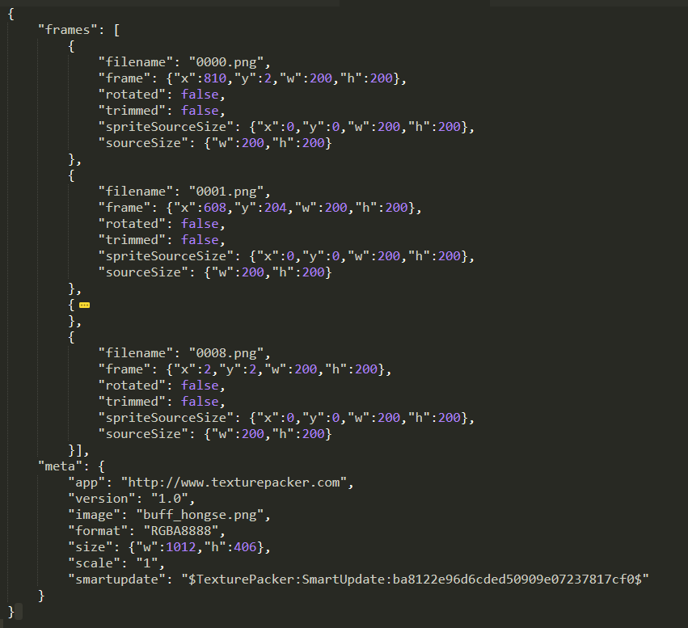
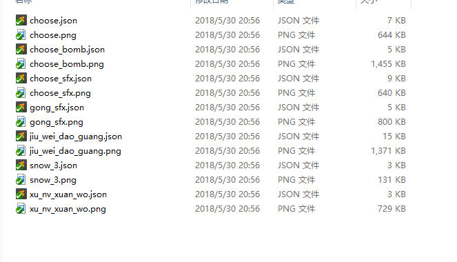
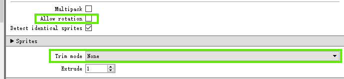

# 中国版序列帧配置文件解析

## 1. 序列帧简介

《我的世界》中提供了序列帧类型的特效，序列帧本质上即为一个单面片的贴图，如果未设置始终面向摄像头，当观察角度位于序列帧的侧面时可以看出为一片面片

	

当序列帧的贴图不断变化时，即可以形成视觉上的动画效果，因此可以用来实现序列帧动画特效。在游戏中一般需要将单个特效的所有贴图合在一起变成一幅大图，上述中的特效包含9幅贴图，将9幅图用合图工具（Texture Packer）合图如下所示：

## 2. 序列帧json参数说明

序列帧动画主要包含一个json文件与一个贴图，这两者由Texture Packer生成

其中json文件内容如下：

其中包含frames和meta两个字段：

- **"frames"** 表示每帧动画的贴图信息
- **"meta"** 字段包含合图软件相关的信息

开发者对此文件基本可以不用关注，其中在frames字段中可以自己手动加入字段 **”scale”** ，表示对该帧进行缩放，没写默认为1倍缩放，即为：

另外该缩放功能支持插值，即在不同帧之间大小倍数不同时会进行平滑过渡，如果需要关掉插值则需要关掉插值开关（下文提到的[**"lerp_scale"**](#lerpScale)字段）

如果使用编辑器生成序列帧动画，则会在此基础上多一个编辑器对应的json，如下图所示：

其中cylinder开头的配置为环状序列帧的功能：

- **"cylinder_enable"** 表示是否为环状序列帧

- **"cylinder_frac_num"** 表示近似多边形的个数，即环状体由几个多边形组成

- **"cylinder_height"** 表示环状序列帧高度

- **"cylinder_radius_down"** 和 **"cylinder_radius_up"** 表示底部和顶部的环状半径
- **"face_camera"** 表示帧动画是否始终面向摄像机
- **"fps"** 表示帧动画的播放帧率，即一秒播放多少帧动画
- **"shuffle"** 表示是否开启随机播放帧动画
- **"layer"** 表示设置渲染层级，默认设置为1，设置范围为0-15,，层级为1表示不开启渲染层级的功能，开启后，渲染层级高的会遮挡层级低的，并且同一层级的特效会根据位置存在遮挡关系
-  **"lerp_scale"** 表示是否开启帧之间的插值
- **"loop"** 表示帧动画是否循环
- **"rot_speed"** 表示帧动画的旋转速度
- **"scale"** 表示帧动画的整体缩放
- **"tex_repeat_num"** 表示在x轴和y轴两个方向上重复的特效个数
- **"texture"** 为上述由texture packer生成的具体json特效路径

## 3. 序列帧贴图生成指南

序列帧贴图资源需要使用Texture Packer生成，打包格式见下文[Texture Packer使用配置](#TexturePacker)

Texture Packer导出大图和json文件，放置在`textures/picture/sfxs`下

如下图所示，序列帧贴图与普通贴图唯一的不同就是多了一个同文件名的json文件，该贴图和json文件都是由Texture Packer导出

## 4. Texture Packer使用配置

Texture Packer主要用来打包序列帧文件，需要注意的配置如下：

- Allow rotation不要勾选

- Trim mode选择为None

这样导出的大图中每一幅小图都一样大，**当前我们的序列帧绘制只支持大小相同的子图**

## 5. 序列帧贴图规范

- 贴图格式为 png

- 单张贴图大小不超过512 * 512

- 总像素数不要超过512 * 512 * 5