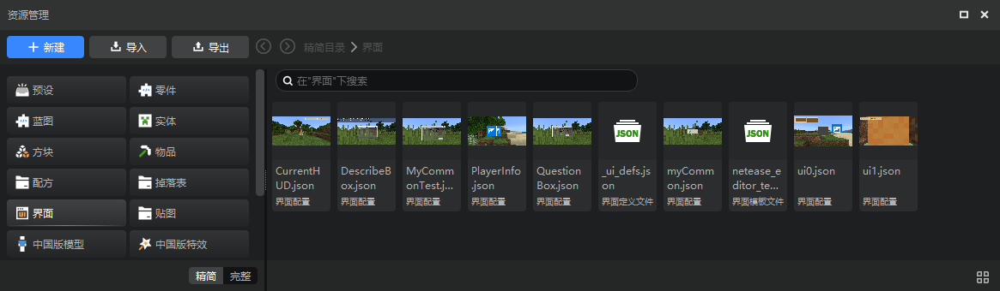
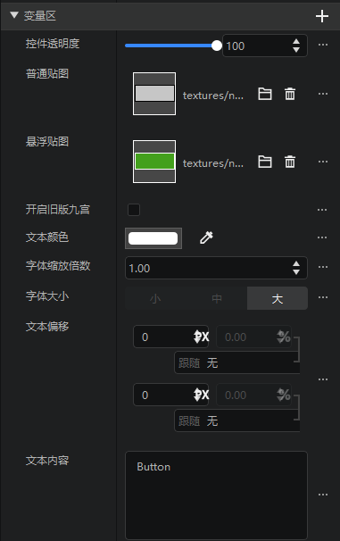
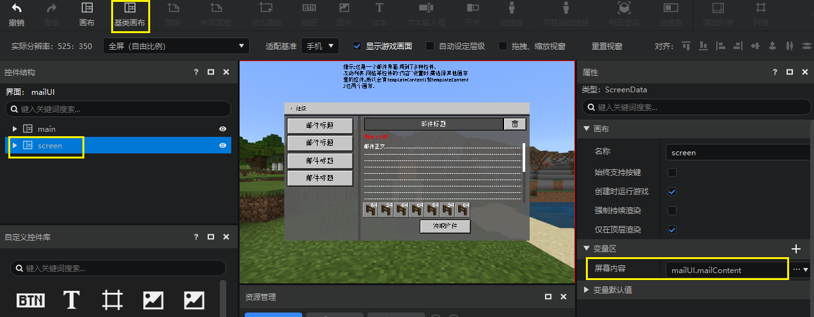

# 界面编辑器改版说明

改版时间：2022.5.10

如果你之前没有重度使用过界面编辑器，可以跳过这篇文档，直接从[界面编辑器使用说明](./1-界面编辑器使用说明.md)开始阅读。

本次界面编辑器改动的主要内容为：

1. 界面文件的解析能力和兼容性提高

可以解析几乎所有合法的界面Json，不会再出现因为不符合编辑器默认的写法而被覆盖的情况，可以放心大胆的导入手写的界面Json文件使用。

即使界面文件不合法，或者有一些比较罕见但是正确的写法，编辑器也会以控件破损的形式表现，而不是尝试对你的界面文件进行自动修改。

并且界面Json中的继承，变量，属性引用，控件引用等特殊写法在改版后的界面编辑器中都得到了准确的体现。

2. 所有继承控件在编辑器内都可以展开显示完整的控件结构

例如下图是编辑器内置的“开关”控件，你现在可以展开这个控件，学习它的构造。

> 如果你对我的世界原版的界面Json不够了解，你暂时不需要使用这个功能。建议按顺序阅读文档进行进一步的学习。

3. 移除界面文件和图片的两个资源管理窗口，替换为通用的资源管理器。

资源管理器也较之前的版本有较大优化，详见[新版资源管理器](../15-资源管理/2.5-资源管理器.md)。现在资源管理器的精简模式功能已覆盖旧版的两个资源管理窗口。

- 通过“新建”来新建界面文件
- 在精简模式的界面标签下查看和打开界面文件
- 在精简模式的贴图里查看所有的贴图

资源管理器中的界面文件现在支持截图了。

详见[界面编辑器使用说明](./1-界面编辑器使用说明.md#新建界面文件)

4. 移除旧版的继承控件功能，修改为“继承原版控件”

旧版的继承控件功能的使用场景广泛，但在每个使用场景下都不是很好用。新增的“继承原版控件”功能聚焦于在当前编辑的界面文件的控件结构中添加继承自原版控件的控件，详见[添加原生控件](./18-添加原生控件.md)。通过这种方式添加的控件也是可以展开的，如下图就是原生的物品容器。

“继承原版控件”仍然包含旧版的继承控件的全部功能，但是我们建议除了“继承原版控件”之外的需求使用下面我们推出的新功能。

5. 新增自定义控件功能

如果你希望用继承的方式复用自己的控件，可以使用新的自定义控件的功能。你可以将某个控件（和子控件）添加至控件库。自定义控件库里会显示所有的自定义控件。

你可以通过简单的拖拽从控件库里复用你的自定义控件。自定义控件在控件结构中显示为青色。详见[继承和自定义控件](./13-继承和自定义控件.md)。

6. 新增变量和属性引用功能

随着控件层级增加，自定义控件的数量增加，界面会变得越来越复杂，并且自定义控件（继承的控件）在使用时不能修改子控件的属性。

我们经常需要在某个控件中修改其他控件的属性值，我的世界的界面Json里支持的这种写法现在在编辑器中也支持了，即属性引用功能。

例如下面这两个控件其实来源是同一个自定义控件，通过属性引用的方式修改成了不同的样子。

控件属性面板新增了变量区，里面的所有变量都可以通过界面编辑器添加/管理。如果你的界面Json里包含这样的写法，现在也可以正确的解析到属性面板中了。详见[属性变量引用](./15-变量引用和万用控件.md#属性变量引用)。

旧版的很多编辑器自带的控件的属性实际上都是通过属性引用实现的，现在也统一解析到变量区中，下图是按钮的变量区。

7. 新增控件引用

控件引用其实是大家的老朋友，编辑器自带的“滚动列表”控件的滚动内容属性就是控件引用。此外“网格”控件的内容也是控件引用。

现在控件引用会提供一个下拉框，可选择的范围变更为所有的自定义控件（都展示在自定义控件库中），不再是“其他画布下的控件”。

现在你可以在编辑器中创建自己的万用控件引用来实现类似下图的效果。下图的两个弹窗控件实际上都继承自同一个自定义控件，弹窗的内容以万用控件引用的形式开放为变量，和上面的“滚动内容”属性非常类似，只需要在这个属性里指定不同的自定义控件，弹窗里就可以显示不同的内容，详见[控件引用和万用控件](./15-变量引用和万用控件.md#控件引用和万用控件)。

8. 基类画布功能修改

原有的基类画布功能无法正常生效，我们优化了这一功能。现在在创建画布的时候可以直接选择基类画布，详见[异形屏适配和基类画布](./20-界面适配预览和方法.md#异形屏适配和基类画布)。

