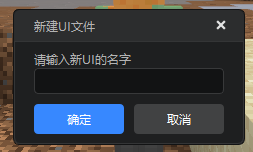
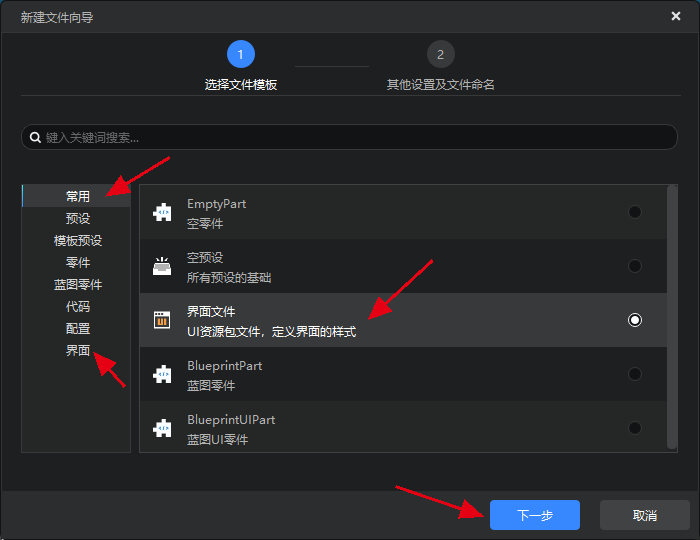
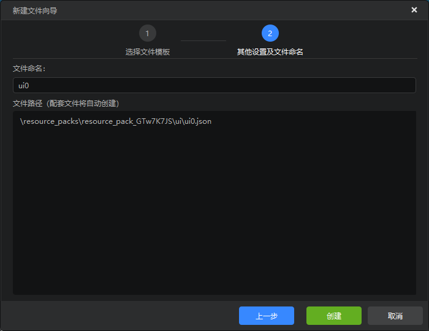
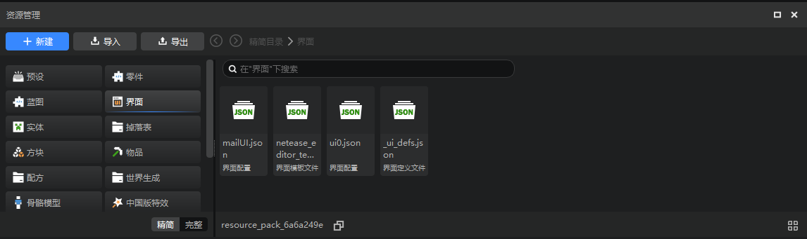
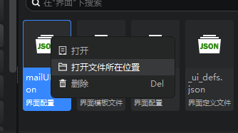

# 界面编辑器入门

## 基本介绍

界面编辑器用于可视化的编辑《我的世界》游戏内的界面。

进入编辑器后，如果当前显示的不是界面编辑器，那么需要在顶部页签中，点击“界面”进行切换。如下图：

界面编辑器的界面构成如下：

下面简单介绍各个界面的作用：

1. **控件库-原生控件**：将①“控件类型”区域的控件拖拽到③“控件结构”中某个控件，可以为其添加一个子控件。或者直接拖拽到中间的预览窗中，可以直接在屏幕的指定位置创建控件。其中画布比较特殊，画布用于挂载各种非画布控件，不能作为其他控件的子控件。注意，不是所有的控件都可以挂接子控件，自定义控件/继承控件的实例是不能添加子控件的，详见[继承和自定义控件](./13-继承和自定义控件.md)（建议按顺序阅读文档，不需要提前关注）。
2. **新建变量**：新功能，用于添加变量引用和控件引用，详见后。
3. **控件结构**：当前选中工程的界面控件树状结构，在这里可以对控件进行选中、隐藏/显示等操作，右键控件，可进行添加子控件、删除、复制等操作。
4. **快捷选项**：可以在这里调整分辨率，是否显示游戏画面，是否自动设定层级等选项。
5. **对齐操作**：在界面结构中，按住Ctrl键后多选控件，然后点击对齐按钮，可对齐选中的控件。
6. **控件库-自定义控件**：①里的控件是《我的世界》基岩版原生的，或者网易提供的，而这里的控件是开发者自定义的，详见[继承和自定义控件](./13-继承和自定义控件.md)。
7. **资源管理**：展示所有的文件资源。在界面编辑中，我们主要关注界面文件（Json）和贴图，详见[界面资源管理](#界面资源管理)。
8. **控件属性**：选中控件时，这里会显示该控件可编辑的属性。
9. **编辑区域**：编辑区域会实时显示界面编辑效果，也可选中、移动、缩放控件。

## 新建界面文件

如果你新建了一个空白作品（地图，附加包均可），或者打开了一个没有界面的作品，你的界面编辑器将与下图类似。

你有两种方式来新建一个界面文件。

1. 点击控件结构里的新建（只在没有界面文件时可以）

2. 点击资源管理器的新建，通过新建文件向导创建

在新建文件向导的常用，或者界面页签里选择界面文件，点击下一步

输入界面文件的文件命名，并点击下一步以完成创建。

## 界面资源管理

界面编辑器现在使用通用的资源管理器进行文件管理，以精简模式为例，我们在编辑界面时主要关注界面和贴图，界面和贴图在资源管理器左侧的精简模式中点击按钮进行切换。

- 界面

在界面文件夹里可以看到3种文件。

1. 界面配置：即界面文件（Json），双击可以在编辑器中打开这个界面。

右键界面配置，在弹出的菜单中点击打开文件所在位置，然后可以在windows的文件夹中打开这个json文件。

2. 界面模板文件：固定命名为 netease_editor_template_namespace.json，里面保存有一些网易提供的控件模板，无需关心。
3. 界面定义文件：固定命名为 _ui_defs.json，里面保存这个作品中使用到的界面的文件名称，无需关心。

> 请勿修改或者删除界面模板文件和界面定义文件。

- 贴图

下拉资源管理器左侧的精简模式的滚动条，或者在这里滚动滚轮，点击贴图，可以将目录切换到贴图目录，这里会显示有所有的贴图。

> 这里所有的贴图都是可以直接使用的，并非只有“界面贴图”可以用于界面。

## 组装控件

《我的世界》的界面和大部分其他游戏的一样，都可以简单的理解为控件的组合。

下图的这些就是界面编辑器中可以直接添加的控件，关于这些控件的介绍，请参考[控件和控件属性](./10-控件和控件属性.md#控件简介)。

《我的世界》中还有大量可以直接继承的控件，我们将在后续逐步添加。

有两种方式在界面中添加控件：

- 拖拽控件库中的控件到控件结构，或者拖拽到预览窗；
- 在控件结构中的控件上右键，依次选择添加对象->控件。添加控件后，编辑区域会实时显示添加的控件。

除了编辑器提供的控件之外，你现在还可以在控件结构中添加自定义的控件。详见[自定义控件](./13-继承和自定义控件.md)。

## 编辑控件属性

在控件列表或者编辑区域中选择控件后，被选中的控件会显示一个红框，其父控件会显示一个蓝框。

在右侧属性面板中会显示被选中控件的属性，不同的控件有不同的属性，你可以通过修改属性来调整控件的显示效果，详见[控件和控件属性](./10-控件和控件属性.md#控件简介)。

> 如果控件是自定义控件的实例，将显示青色的框，详见[继承和自定义控件](./13-继承和自定义控件.md)。
>
>  

下图是文本控件的属性，可以看到我们提供了诸多属性供你修改。

