# 控件和控件属性

## 控件简介

- **画布**：画布是一个完整的界面，画布下可以挂除了画布以外的子控件。一个界面工程文件中可以有多个画布。新建的界面工程文件会自带一个名字为main的画布。例如下图，这些都是画布。

- **面板**：面板本身并没有可视元素，把归属一个模块的控件挂在一个面板下，能够让界面结构更加清晰，调整起来也更加方便。

- **图片**：图片控件用于显示图片。图片会在不变形的情况下尽量撑满控件的尺寸。

- **按钮**：按钮是重要的交互控件。可设置按钮上的文本、文本颜色、文本字号、文本偏移。按钮的贴图分为普通、按下、悬浮三种情况。“普通”即为正常状态下的贴图，“按下”为按钮被按下时的贴图，“悬浮”为在PC中，鼠标移动到按钮上时的按钮贴图。设置贴图的方式：在资源管理窗口中，左键按住贴图拖动到贴图框中，待鼠标变为带“+”号的样式时，松开鼠标，即可完成贴图设置。

  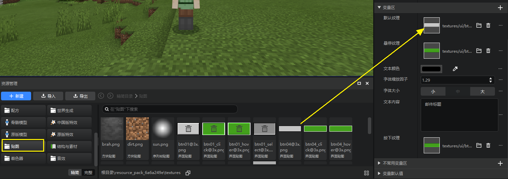

- **文本**：文本控件用于显示文本，可设置字号和颜色。

- **滚动列表**：滚动的内容可在属性面板的变量区的“滚动内容”配置项中选择。“滚动内容”的下拉列表中，会出现你的自定义控件可供选择。下图中，mailUI是界面文件名称，buttonMail、panelMailBody、gridMailList等是自定义控件名称。如果你想了解更多，可以查看[自定义控件](./13-继承和自定义控件.md)。如果你想深入了解“滚动内容”的原理，可以查看[万用控件](./15-变量引用和万用控件.md)，当然我们建议您按顺序查看文档。

  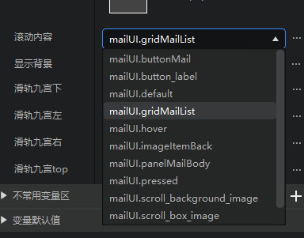

  并不是所有控件都能够作为滚动列表的内容，目前仅限于面板、按钮、网格三种类型可作为滚动列表的内容。如果想在滚动面板里显示文本控件，可将文本控件放在面板下，然后将面板作为滚动列表内容。不过并不支持将滚动列表挂在面板下，再将面板作为另外一个滚动列表的内容。

- **网格**：网格用于需要规律排布的界面，如背包界面。其中内容的配置方式类似滚动列表中的内容。网格规模用于配置网格的行列数。网格会自动将内容均匀的显示在各个格子内。

  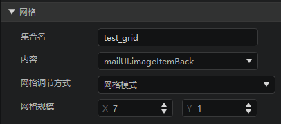

  需要注意的是，我的世界游戏引擎中，对网格的尺寸和内容的尺寸有一定要求，否则显示会不符合预期。具体的要求为：

  - 内容的尺寸为固定像素时:
    - 网格的宽度应大于等于内容的宽度乘以列数，小于内容的宽度乘以（列数+1）；
    - 网格的高度应大于等于内容的高度乘以行数；
  - 内容的尺寸为百分比时：
    - 内容的宽度乘以列数需小于等于100%，内容的宽度乘以（列数+1）需大于100%；
    - 内容的高度乘以行数需大于等于100%。

  集合名在代码中绑定UI控件时会用到，具体可参考[UI说明文档](./30-UI说明文档.md)。

- **轮盘**：轮盘主要用于内容列表中进行选择的场景，比如选择某个表情展示或者抽奖等。在编辑器中创建轮盘控件后，需要填好想设定的切片数量、内直径、外直径系数，然后通过生成模板按钮，生成出对应预览的模板控件样式。 轮盘的本质是引用自定义控件，其中的内容配置主要通过选择各索引对应的控件，这里选择的控件其实就是引用的自定义控件的各个子控件（生成了模板后，开发者可以自行在对应引用的自定义控件中修改样式和属性等）。另外，轮盘也可以通过content变量来切换引用的自定义控件。更多内容可参考[UI说明文档](./30-UI说明文档.md)。

  

  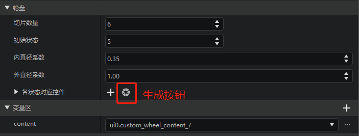

## 控件属性的结构/分组

这里主要介绍控件的属性在编辑器里的分组。

由于控件的属性较多，并且可以自己增加减少，我们将控件的属性进行了默认分组。

以文本（Label）为例：

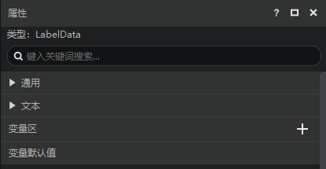

可以看到总共有4个分组，分别为

- 通用：所有控件都有的属性
- 文本：文本控件特有的属性，如果是其他控件，可能也会有自己特有的属性。
- 变量区：作为变量使用的属性，详见[变量引用和万用控件](./15-变量引用和万用控件.md)。
- 变量默认值：指已为某个属性分配了变量名，但是该属性/变量没有被引用，详见[变量引用和万用控件](./15-变量引用和万用控件.md)。

我们以另一个控件滚动列表（Scroll View）为例：

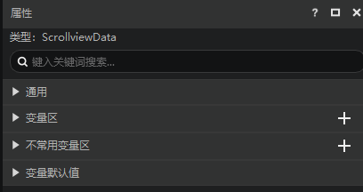

可以看到还有一个不常用变量区，这个分组与变量区的含义是一样的，区别在于这个分组里的属性很少被用到，所以我们将其划分到这个分组中。

## 通用控件属性

下面这些是每种控件都有的属性。

- **锚点**：每个控件有9个定位点，包括四个角、四边的中点、中心点，锚点可以设定子控件的哪个定位点和父控件的哪个定位点重合，下图中左侧对应父控件、右侧对应子控件。

  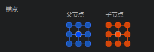

  下图为子控件中心和父控件上边中点重合的情况。

  

  下图为子控件右下角和父控件左上角重合的情况。

  

- **名称**：控件的名字，只能是字母和数字的组合。

- **隐藏控件**：勾选后会隐藏控件。在控件列表中，点击控件右侧的眼睛也能够实现类似效果。

  

- **层级**：层级用于控制控件的上下关系。层级高的显示在上面。

- **位移XY**：控制控件相对于锚点位置的偏移，在下面的红框中，可以直接填写数值，单位是像素。除了直接填像素外，还有更高级的用法，详见[位移尺寸高级用法](#位移尺寸属性的高级用法)。

- **尺寸XY**：尺寸XY，最大尺寸XY，最小尺寸XY，3组数据的含义类似，都是对控件尺寸（宽高）的描述。与位移XY相似，也支持直接填写像素和[更高级的用法](#位移尺寸属性的高级用法)。如果最大尺寸XY，最小尺寸XY，填写0，那么默认不启用这几个属性。如果勾选了适应，比如尺寸X，那么尺寸X的实际数值会保持为父控件的尺寸X的100%。

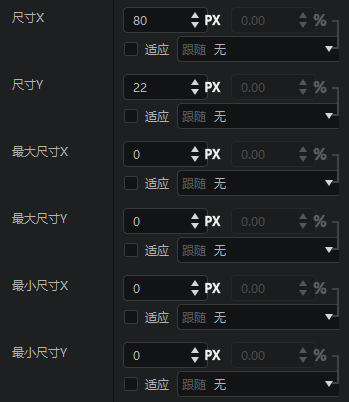

> 界面编辑器提供了众多属性，学习这些属性的最好方式就是调整他，并观察效果。

## 位移尺寸属性的高级用法

以位移X为例。

位移用于控制该控件相对于锚点位置的偏移。形式为Px+%。Px表示像素，%表示跟随某个尺寸的百分比。

如位移X配置（如下图）为：跟随父控件尺寸X的10Px+10%，如果父控件的宽度（尺寸X）为100像素，那么子控件的偏移X就为10Px + 10% * 100Px = 20Px。

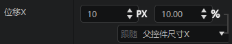

除了跟随父控件尺寸X之外，我们还提供了其他的跟随方式。如果想知道其他跟随项的效果，除了通过字面含义理解之外，我们非常建议你实地尝试一下这些跟随项的用法，这会大幅加深你对这个选项的用法。

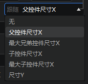

如果你直接在vscode等文本编辑器中打开这个界面文件时，可以发现，offset字段的第一个值就与编辑器中的配置非常类似。

%和Px是按钮，可点击，点击后会按照目前的设置，将位移X的设置由Px+%的形式转为Px，或者%形式。

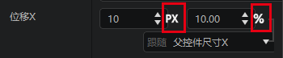

- 点击Px，如下图所示，转为20Px

- 点击%，如下图所示，转为20%，因为父控件的尺寸X是100Px，20% × 100Px = 20Px

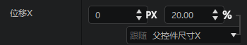

## 位移尺寸高级用法的实际应用

下图是一个弹窗，有一个content用作万用控件（如果你感兴趣，可以参考[万用控件](./15-变量引用和万用控件.md)，但是我们建议你按顺序阅读文档）。

messageBoxPanel是一个panel，然后下面挂接了一个background图片，图片的尺寸XY均勾选了适应，这样可以保证图片始终填满父控件panel。

我们希望实现的效果是，无论外层控件（messageBoxPanel）怎么放大缩小，content都能占满红框内的区域。

按照下图调整content的位移和尺寸即可：

- 位移X，因为content始终是在X方向（水平方向）的中心，所以填0即可
- 位移Y，因为content会偏下一点（标题栏有一定的高度），所以我们在这里填7
- 尺寸X，因为content的宽度是跟随父控件的宽度发生变化的，父控件宽，他也宽，所以这里我们选择跟随100%的父控件尺寸X。又因为这个弹窗左右边框也有宽度，所以我们需要减去这个宽度（-10）
- 尺寸Y，因为content的高度是跟随父控件的高度发生变化的，父控件高，他也高，所以这里我们选择跟随100%的父控件尺寸Y。又因为这个弹窗的底部边框和标题栏也有高度，所以我们需要减去这个高度（-25）

