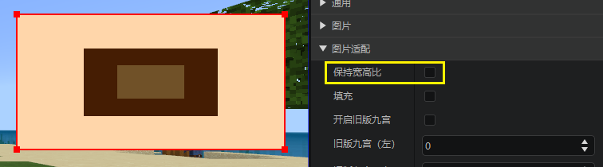
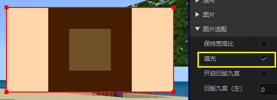
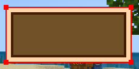
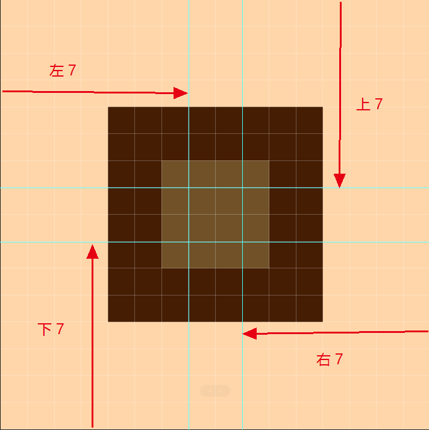
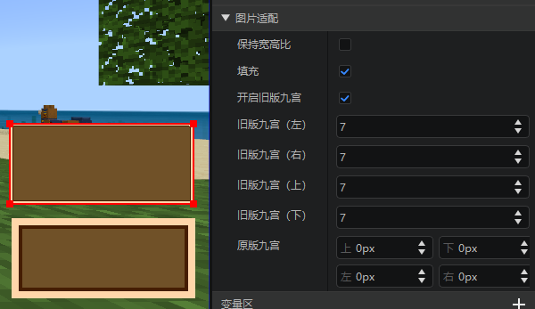
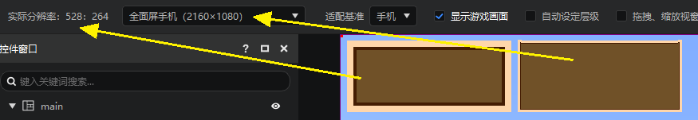

# 图片缩放适配与九宫切图

## 图片缩放和宽高比

下图是我们需要的示例图片，你可以在浏览器中下载，或者点击这个[地址](https://g79.gdl.netease.com/goods_print02.png)下载，并导入编辑器中备用。

这是一张很小的图片，我的世界中使用的图片通常来说也比较小。

这张图片的尺寸为16*16，将鼠标悬停在资源管理器的图片文件上，你可以在弹出的悬浮提示中看到这一数据。

我们放大这张图片，可以看到这张图片具体每个色块的像素信息，这张图片被分成3个部分，外环的直径为4个像素，中环的直径为2个像素，内部正方形的边长为4。

我们在编辑器中放置一张图片，并将其使用贴图指定为这张图片，然后在预览窗中对这张图片进行拉伸，可以看到，默认状态下，这张图片只是有一个方向（水平或竖直）抵住了红色外框，显示的图片并没有变形。

在图片适配中关闭“保持宽高比”后，这张图片就可以填满整个红色外框了。

如果我们希望这张图片尽可能的放大，不惜裁剪掉一部分，可以选择填充，填充的示例效果如下，可以看到，图片的在水平方向填满了红框，竖直方向则被红框裁剪了。

> “填充”的优先级高于“保持宽高比”，一旦勾选填充之后，就不会再保持宽高比。

## 九宫切图

可以看到，在不确定图片的长宽比的情况下，无论上面的哪一种适配方法，都不够美观。能不能有一种适配方法实现下面这种既填满红框，又能在视觉上保持宽高比的效果呢？这就需要用到九宫切图了。

### 原理

游戏制作中经常会有上述这样的需求，我们拿到下面这张图片时，会发现我们可以将下面这张图按照下图青色线的方法切成9份（即九宫切图），其中

- 1是不可以进行缩放的，会导致长宽比发生变化
- 2可以进行任意的水平缩放
- 3可以进行任意的竖直缩放
- 4可以进行任意的缩放（反正是纯色了，怎么缩放都可以）

九宫切图后

- 如果我们想要水平拉伸这张图片，那么1,3两种图块是不会动的，只有2,4会水平拉伸
- 如果我们想要竖直拉伸这张图片，那么1,2两种图块是不会动的，只有3,4会竖直拉伸

九宫切图的数据就是这4条青色的线与图片4边的距离，可以看到

- 左侧竖直的青色线距离左边的距离为7
- 右侧竖直的青色线距离右边的距离为7
- 上方竖直的青色线距离上边的距离为7
- 下方竖直的青色线距离下边的距离为7

### 原版九宫

我们调整“原版九宫”的数值，即可在这个图片控件上完成九宫适配。

### 新版九宫

除了原版九宫外，还有另外一种九宫规则（新版九宫）。

我们按照下图的方式，开启旧版九宫，并同样按照四边都是7的方式进行九宫切割，可以看到不同的结果。

这是因为两种九宫对屏幕分辨率的适配方法不同。

- 原版九宫适配的是缩放后的实际游戏分辨率，参考[界面适配预览和方法](./20-界面适配预览和方法.md)。
- 新版九宫适配的是屏幕中的游戏分辨率

你可以根据自己的使用场景使用不同的九宫方法。

更多信息可以参考[MC九宫格使用与贴图规范](../16-美术/50-贴图规范及九宫格使用.md)。
