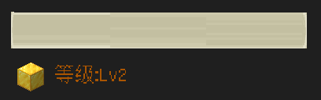
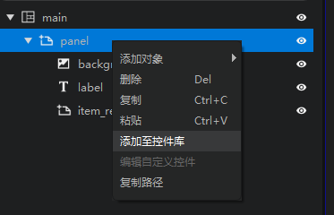
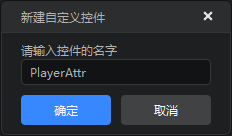
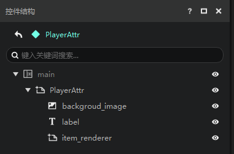
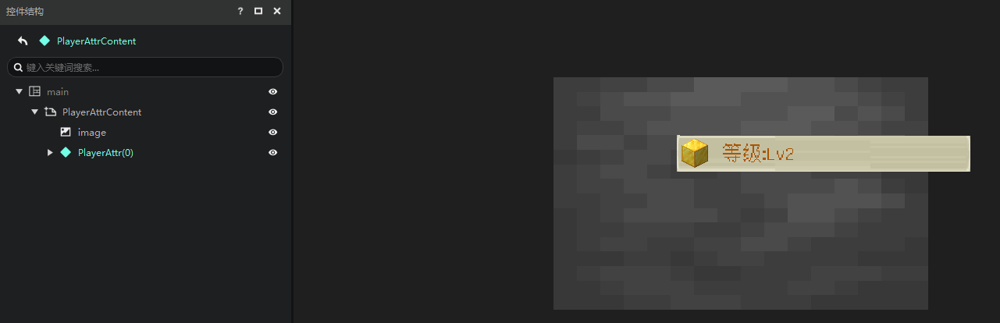
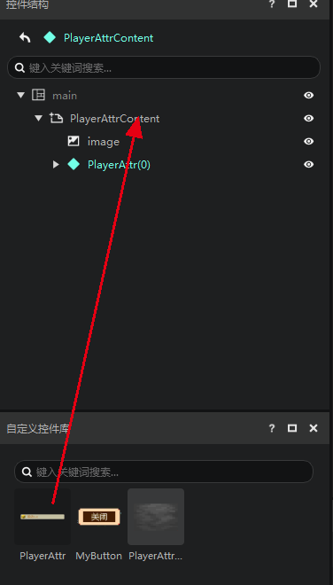
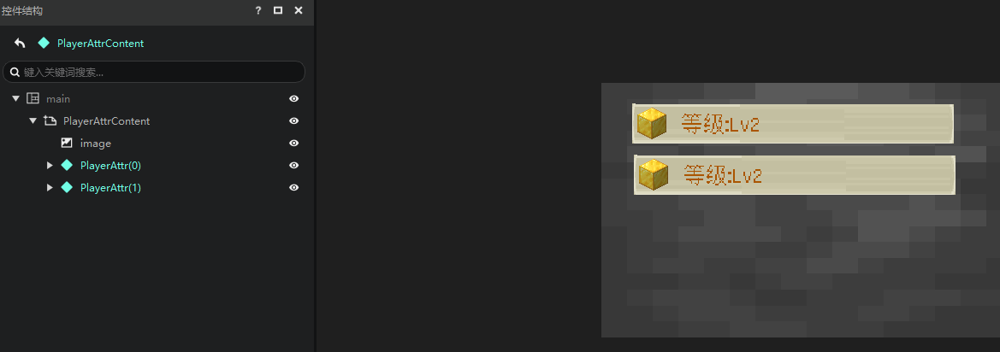
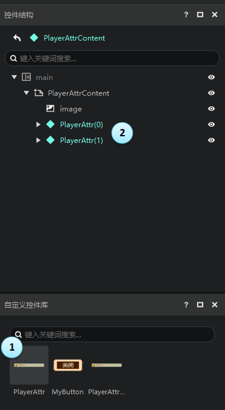
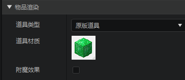
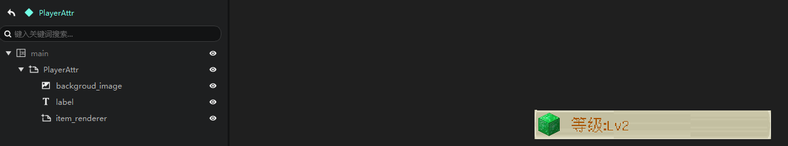

# 继承和自定义控件

## 创建自定义控件

例如我们想实现如下这样的玩家属性界面。

可以看到，这个界面中包含4个属性，每个属性长的都很类似。

都是由一个图片，一个物品渲染，和一个文本组成的

- 图片：作为背景
- 物品渲染：作为图标使用（我们这里只是借用我的世界原版的一些素材，更好的做法当然是使用自己绘制的图片）
- 文本：用于属性的说明和数值

他的控件结构如下。这里我们使用了一个面板（panel）来组织这些控件。

那么有没有复用的方法呢？

有，我们提供了一种方法，可以让你将这个结构作为一个自定义的控件保存起来。

右键这个面板（panel），在菜单里选择添加至控件库。

在弹出的窗口中，输入名称，然后点击确定，即可在自定义控件库中添加这个控件。

> 注意不要填写与选择的节点相同的名称。以上图的情况为例，请不要使用“panel”作为控件名称。

可以看到，在控件库中多了一个你自己的自定义控件。

右键这个自定义控件，选择编辑控件本体，可以在控件结构中打开这个自定义控件进行编辑。你也可以简单的通过在自定义控件库中双击一个控件来编辑它。

界面编辑器中使用青色表示自定义控件。

## 使用自定义控件

创建了自定义控件后，接下来是如何使用自定义控件。

1. 在控件结构面板，选中希望挂接自定义控件的节点
2. 在自定义控件库中，右键想要挂接的自定义控件
3. 在菜单中选择创建实例

可以看到，我们成功的在PlayerAttrContent下添加了一个PlayerAttr控件。

还有一种更为简单直接的方式可以添加自定义控件，你可以像下图这样，直接将自定义控件拖拽至想要挂接的节点。

简单调整一下位置，我们将得到如下的效果。

## 继承（自定义控件的原理）

### 本体和实例

自定义控件实际上就是《我的世界》基岩版的UI继承。

我们在这里不关注Json层面的继承写法，只关注继承本身的特性。

编辑器中

- 我们将自定义控件库中的控件称为“**本体**”，即下图的①
- 我们将自定义控件在控件结构中的实际使用称为“**实例**”，即下图中的②

注意，在没有使用变量引用时，实例控件的子控件是无法修改的。

因此，如果我们尝试展开一个自定义控件的实例时，我们会提醒你。

当你展开自定义控件的实例后，你会发现，除了自定义控件的根节点之外，其他节点（子节点）是灰色的，他们的属性的修改也都被禁用了。

即，**对于自定义控件的实例来说，你能修改的只有这个控件的根节点的属性**。

### 修改本体

如果你修改了本体，比如下图中，我们将item_renderer的道具材质修改为绿宝石块。

你会发现，所有他的实例都“**继承**”了这一改变。

这是一个非常好用的特性，能够帮助你快速修改大量的界面。所以如果你的界面中有复用的话，我们强烈建议你使用自定义控件库（即继承）的方式来组装界面。

到这里，你可能有疑惑，如果不能修改子控件的属性的话，那我如何实现最开始这种效果，因为文本是Lable子控件的属性。

这就需要用到变量了，变量和自定义控件组合使用将发挥**继承**真正的实力，详见[变量引用和万用控件](./15-变量引用和万用控件.md)。

关于继承的更多底层知识，请参阅[继承控件](./30-UI说明文档.md#继承控件)。
