---
front:
hard: 入门
time: 10分钟
---

# 变量引用和万用控件

## 属性变量引用

下图的4个控件是同一个自定义控件的实例。如果要实现类似下面这种各不相同的效果，需要用到属性引用功能。

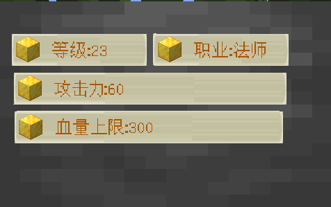

自定义控件的实例，只能修改根节点的属性。所以我们要想办法，在PlayerAttr这个节点直接控制Label节点的内容属性。

即，在PlayerAttr节点增加一个变量，绑定Label节点的内容。

需要执行如下的操作：

1. 选中自定义控件的根节点（如图，这里是PlayerAttr）
2. 点击功能区的新建变量
3. 在菜单中选择：新增属性变量

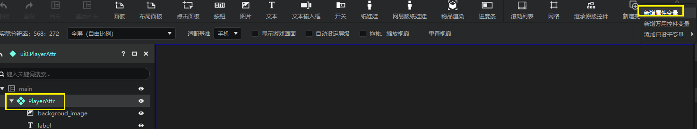

这将打开一个新的面板——新建属性变量面板。

我们是选中PlayerAttr节点打开的

- 你在这个面板中可以选择**PlayerAttr**节点和**其子控件**的所有属性
- 并将这些属性作为**变量**开放到**PlayerAttr**的变量区

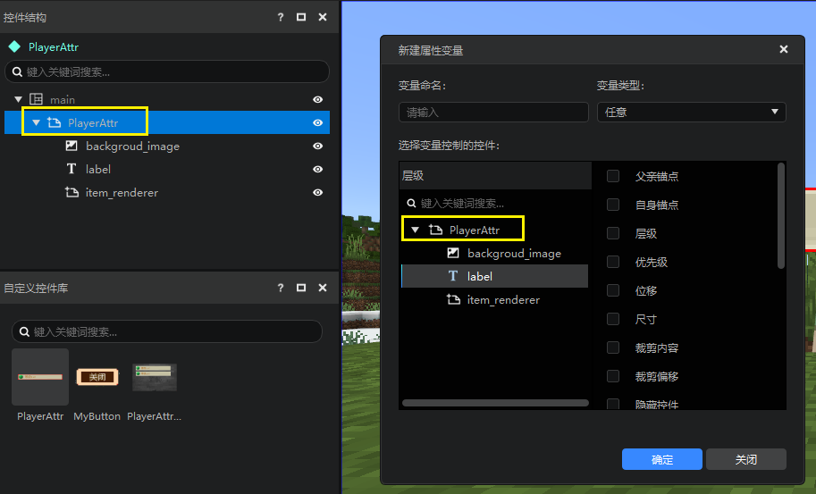

我们选择**label**，并选中**内容**属性。

可以看到，当你选中内容时，变量类型也自动选择了文本内容。

这是因为你可以一次性绑定多个类型相同的属性，我们在这里自动帮你做了筛选。

填写好变量命名后（比如AttrText），点击确定。

现在，我们就在PlayerAttr的变量区成功创建了AttrText属性，并且这个属性绑定的label控件的内容属性。

我们在这里把值修改为200，可以看到，预览窗里显示的值也变成了200。

### 属性引用示例

现在让我们使用这一自定义控件快速实现一个货币展示HUD。

由于物品渲染的属性暂时不支持属性变量引用，我们使用一个图片控件来代替，并将这个图片控件命名为icon。

接下来为PlayerAttr添加一个新的变量（icon_texture），并绑定icon控件的贴图属性。

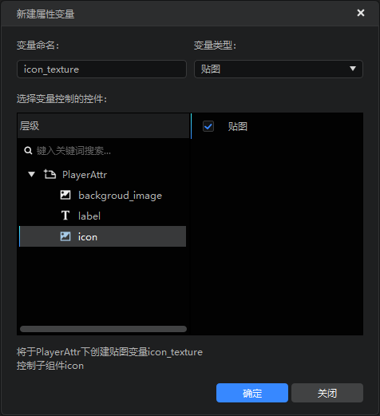

可以看到这个图片“消失”了。

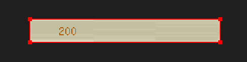

这是因为在PlayerAttr的变量区中，这个新创建的变量（icon_texture）还没有赋值。

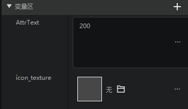

接下来，我们通过windows的文件夹在工作台的下载路径中，找到编辑器的下载路径，在这里可以找到物品的贴图文件夹。

然后找到绿宝石和钻石，两张贴图，并将其导入编辑器的贴图中。

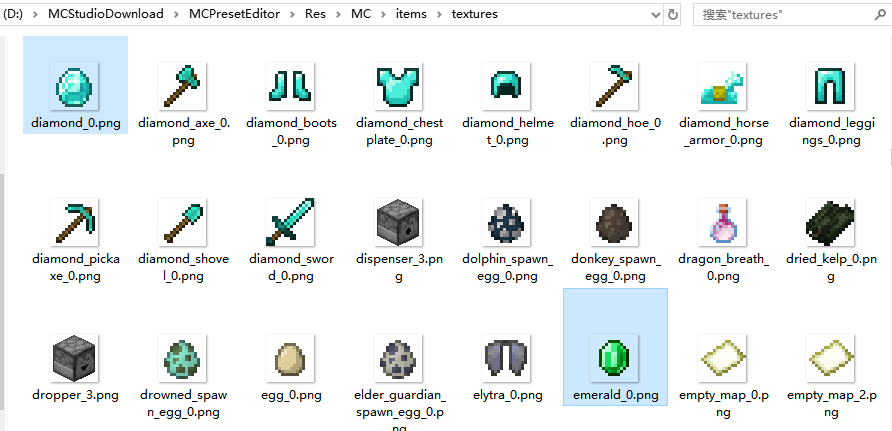

准备工作到此为止，接下来我们创建一个新的界面文件。并在main画布下创建2个PlayerAttr的实例。

然后分别设置两个实例的变量区的icon_texture变量为钻石贴图和绿宝石贴图。

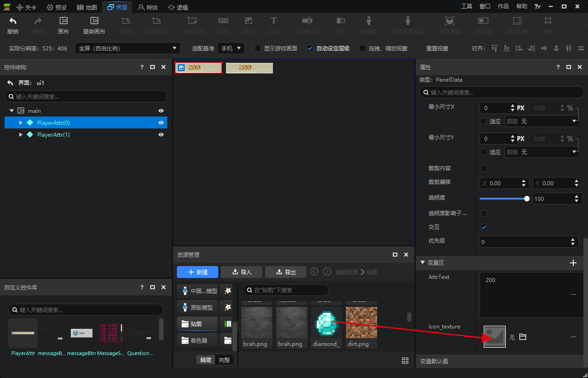

效果如下。

感觉icon有点小。我们打开这个自定义控件，调整一下icon控件的尺寸，然后返回界面文件，可以看到这两个自定义控件实例的样式都被正常修改了。

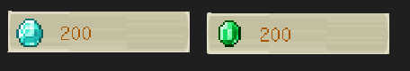

## 控件引用和万用控件

### 简介

下图是两个弹窗，他们的外框非常相似，但是内容不同。

事实上他们使用的是同一个外框，你可以使用控件引用来实现这样的效果。

### 制作内容物

我们先制作两个内容物。

- 内容1

综合[界面编辑器入门](./1-界面编辑器使用说明.md)，[控件和控件属性](10-控件和控件属性.md)两篇文档，我们可以很轻松的实现这个控件。制作完毕之后，我们需要将其添加到控件库，详见[继承和自定义控件](13-继承和自定义控件.md)，这里我们命名为QuestionContent。

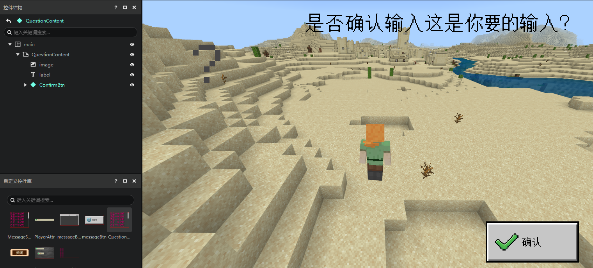

- 内容2

内容2是一个滚动列表，想要实现上述形式的滚动列表，我们需要先创建一个文本控件，并将其添加到控件库，比如命名为myLbl。

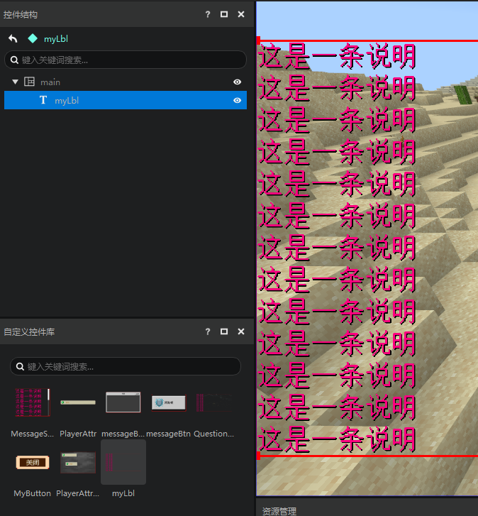

然后，我们创建一个滚动列表，在属性“滚动内容”里选择刚才的自定义控件myLbl。并取消勾选下面的“显示背景”。然后，将这个滚动列表添加到控件库，这里我们将其命名为MessageScrollView。

>  其实“滚动内容”就是一个万用控件变量。

### 制作外框

接下来我们实现一个外框。

外框非常简单，由下面3个控件组成

- 一个图片作为背景图（background节点）
- 一个文本作为标题（title节点）
- 一个按钮作为关闭按钮（closeBtn节点）

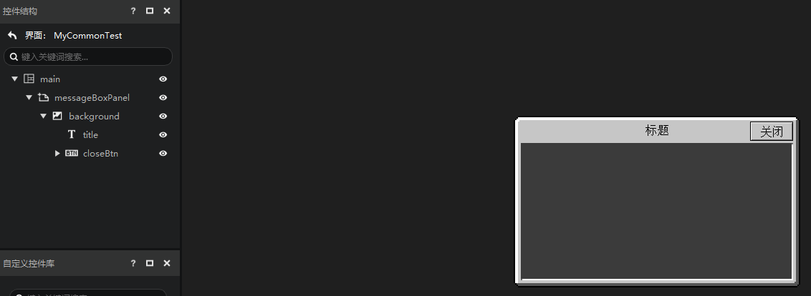

值得一提的是，background图片控件的贴图使用的是原生贴图。

贴图的路径如下，这张贴图在我的世界中自动支持九宫，无需在界面编辑器的属性中填写，是制作弹窗类控件的好资源。

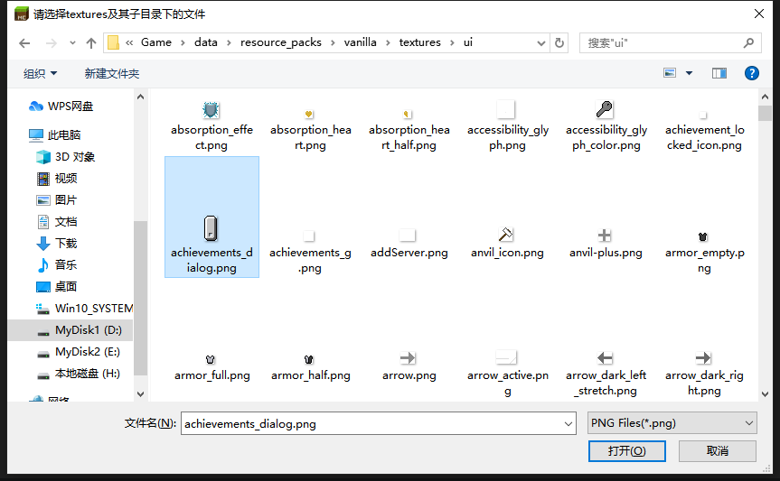

### 添加万用控件变量

接下来，我们要在background节点下添加一个万用控件，并将其作为变量开放到messageBoxPanel节点。这个功能很难理解，我们推荐你跟着做完，然后我们再做解释。

与属性变量的操作步骤类似：

1. 选中messageBoxPanel节点
2. 点击新增万用控件变量

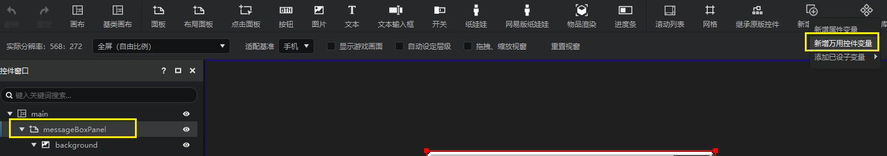

在弹出的菜单中

1. 选中background节点，我们要把万用控件挂接为这个节点的子节点
2. 填写万用控件命名
3. 填写变量命名
4. 可以看到按照上述填写信息之后，编辑器将帮我们实现的操作，点击确定

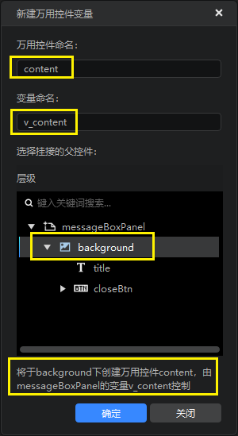

观察一下结果，可以发现

1. 在messageBoxPanel节点增加了一个v_content变量
2. 在background节点下增加了一个content控件

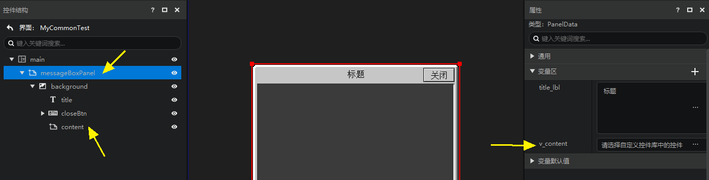

3. 你可以在v_content中选择一个自定义控件库里的控件

在修改v_content的属性值之前，我们先调整一下content控件的尺寸，使其可以始终填满外框视觉上的内容部分，具体方法请参考[控件和控件属性](./10-控件和控件属性.md#位移尺寸高级用法的实际应用)。

我们在之前已经做好了两个内容物控件，QuestionContent 和 MessageScrollView。

这里我们选择QuestionContent ，可以看到，我们的万用控件看起来和QuestionContent完全相同。

### 控件引用总结

即，控件引用变量和万用控件可以实现的效果就是：**可以在属性面板中通过修改变量的值，将子控件的万用控件转变为某个自定义控件**。

理解了这些之后，我们再看一下滚动列表这个控件。

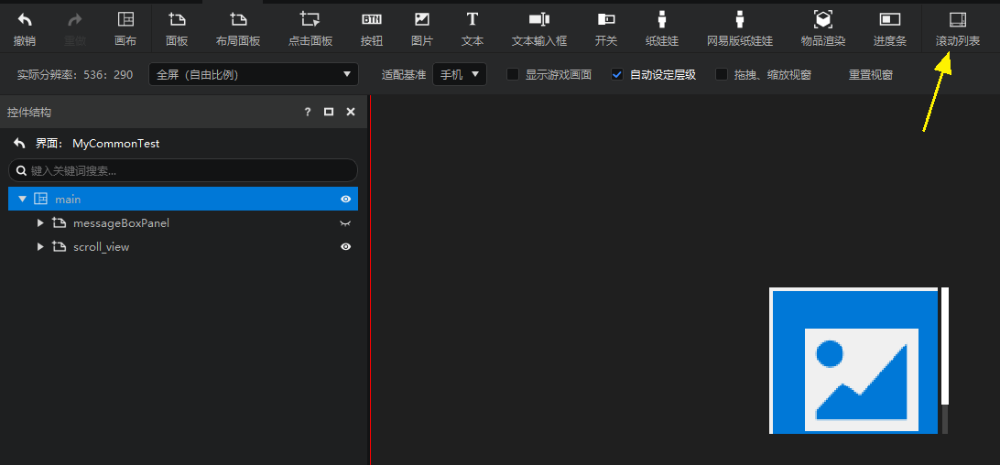

我们在编辑器中强行把他展开，你会发现，滚动列表就是使用了一个万用控件（scrolling_content）。

并且这个万用控件的值被开放到了根节点（scroll_view）的属性面板的变量区的“滚动内容”属性。使你可以直接在最外层（scroll_view）修改滚动列表的内容物控件。

