---
front:
hard: 入门
time: 10分钟
---

# 示例：开关与标签切换

## 开关

这个是编辑器里内置的开关（继承自我的世界原版的开关），开关可以理解为包含两种状态的按钮，每次点击会在两种状态中切换。

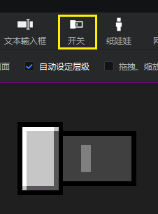

开关可以定义的主要就是这6种状态的贴图：

- 对应开关开启的状态：选中锁定贴图，悬浮贴图，按下悬浮贴图
- 对应开关关闭的状态（开关默认是关闭的）：普通贴图（即默认的样子），按下贴图，未选中锁定贴图

锁定就是开关不可用的状态，无法点击。

## 复杂的开关效果

下图也是一种开关的开启/关闭状态，常用于制作页签。两种状态除了贴图不一样之外，还有文字的区别。

这就导致我们需要对编辑器自带的开关做一些改动，以适应我们的需求。

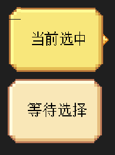

上图的UI只用到了下面这两张图片，图一为按钮本体图片，图二为按钮右侧的尖角图片。

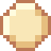

## 复杂开关的制作步骤

### 控件结构

首先，我们创建一个界面文件，然后创建下图的控件结构。其中，main - panel(0)下的两个panel（面板）分别是

- panel：对应右侧上方的选中（checked）状态的开关，下面的两张贴图分别对应按钮底板和尖角
- panel(0)：对应右侧下方的未选中（unchecked）状态的开关

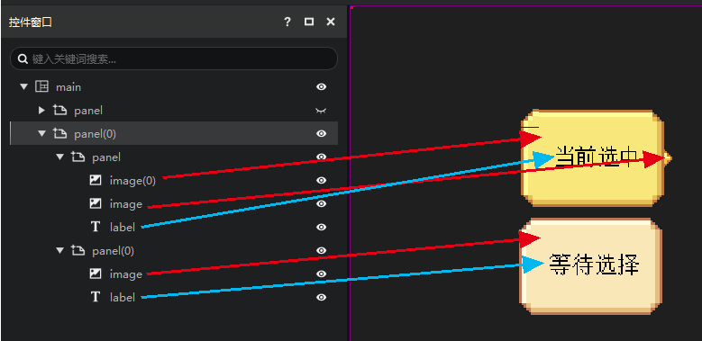

### 贴图设置

上述两个panel（面板）控件的底板图片的图片均使用下图。

两个控件的颜色看起来有些许差别，是因为我们在panel下的底板图片里调整了颜色属性。属性值见下图。

这个颜色是对原有图片颜色的叠加，能实现的效果受图片原有的色彩影响很大，原有图片的色彩越浅，效果越明显。

适配设置见下图，这里我们使用旧版九宫，可以实现较为精细的效果。

关于九宫的更多用法参考[图片缩放适配与九宫切图](./11-图片缩放适配与九宫切图.md)。

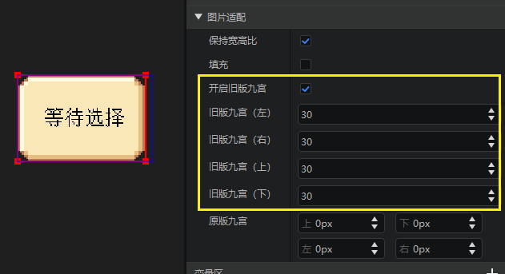

尖角图片的设置较为简单，不再赘述。

### 尺寸设置

尖角图片的锚点和尺寸XY的数据如下。

按钮底板的锚点和尺寸XY的数据如下图。

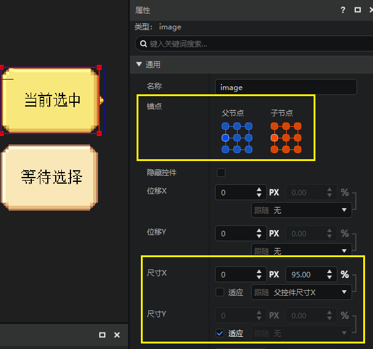

这样设置可以保证当父节点的尺寸在一定范围内变化时，控件的视觉效果始终保持一个底板+一个尖角的形状，且相对位置不发生太多变化。

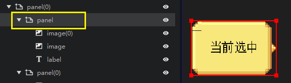

### 开放属性引用并删除变量

我们对panel新增两个属性引用变量，关于属性引用请参考[属性变量引用](./15-变量引用和万用控件.md#属性变量引用)：

- 开放panel的尺寸属性到panel，命名为my_toggle_size
- 开放label的内容属性到panel，命名为my_toggle_text

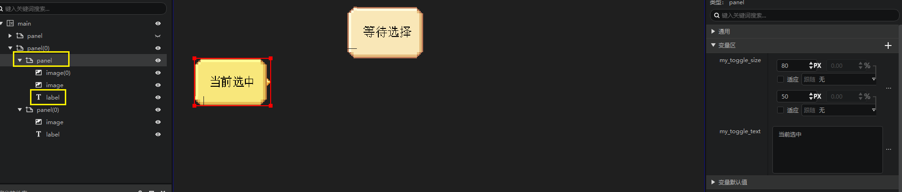

找到panel的尺寸XY，可以看到这个属性现在处于不可编辑的状态，你只能通过编辑my_toggle_size的值来影响这个值。

在尺寸X的右侧有一个引用按钮，将鼠标放在上面会显示悬浮提示，内容为这个引用这个属性的变量。

我们在变量区里找到my_toggle_size，然后通过“···”按钮，点击删除，将这个变量删除。

我们会发现这个变量被删除了，但是在变量默认值的分组中可以找到这个变量（这里我们填写一个80,50的默认值）。

这是因为panel的尺寸仍然绑定了my_toggle_size变量，只是这个变量没有被正式启用。

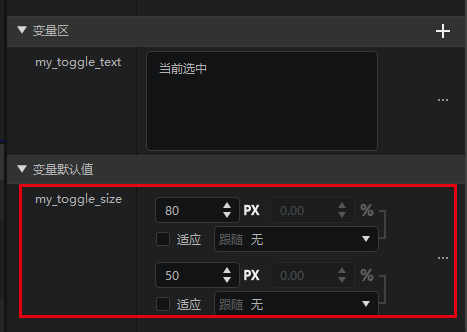

接下来我们删除变量区的my_toggle_text变量，可以发现label控件的变量默认值分组内同样出现了my_toggle_text属性（这里我们填写“当前选中”作为默认值）。

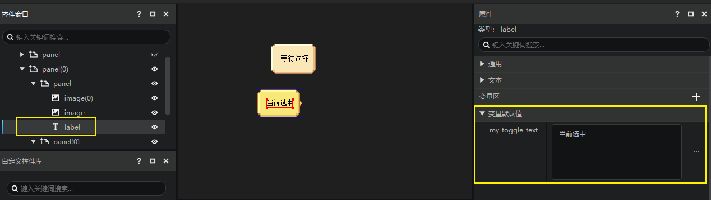

接下来我们对panel(0)如法炮制，请务必保证这里开放的2个属性引用的变量名称和之前的一样，必须还是my_toggle_size和my_toggle_text。

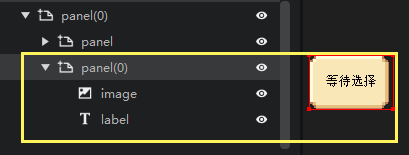

### 添加到控件库

我们将panel和panel(0)都添加到控件库，并分别命名为：

- panel：MyToggleChecked
- panel(0)：MyToggleUnchecked

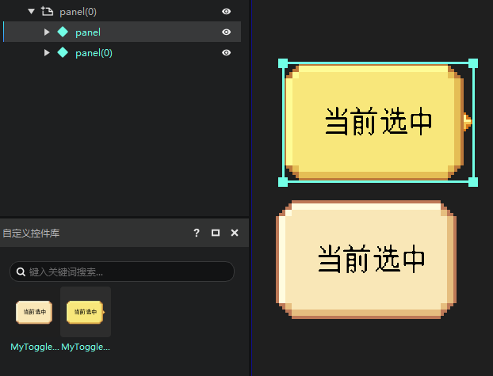

记得双击打开这两个自定义控件，将这两个控件的根节点的位移XY归零。

完事就绪，我们可以在控件窗口中删除panel和panel(0)了。

### 在开关中应用自定义控件

在控件窗口里新建一个开关。

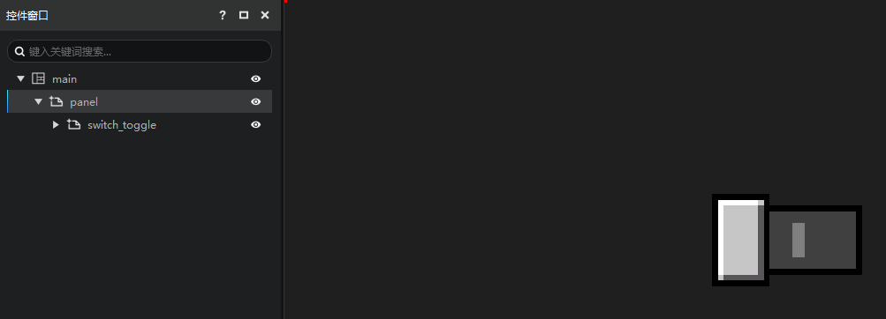

如果我们在控件窗口里强行展开开关，可以看到开关就是由8个万用控件组成的，在开关的不同状态，显示不同的控件。

这里我们不关注变量区，而是打开“不常用变量区”，在这里可以看到大量的控件引用，关于控件引用详情可以参考[这里](./15-变量引用和万用控件.md#控件引用和万用控件)。

我们不制作太精细的效果，暂时将其分为两组：

- 所有的选中……属性：使用MyToggleChecked控件
- 所有的未选中……属性：使用MyToggleUnchecked控件

即当开关开启（选中）时，我们的开关将显示MyToggleChecked的样子。

当开关关闭（未选中）时，我们的开关将显示MyToggleUnchecked的样子。

### 在开关中引用自定义控件的属性

我们在“[开放属性引用并删除变量](#开放属性引用并删除变量)”这一步中曾经创建过my_toggle_size和my_toggle_text两个属性，我们将在开关中使用。

我们选择switch_toggle变量区的“+”，选择添加已设变量。

这里可以看到熟悉的my_toggle_size和my_toggle_text两个变量，把他们都添加一下。

效果如下图，可以看到在开关的变量区增加了这两个变量，并且他们可以控制开关下面所有的万用控件的同名属性。属性引用就是以变量名作为匹配的，即：

- switch_toggle的my_toggle_size变量，控制所有红框的子节点的my_toggle_size属性（面板的尺寸属性）
- switch_toggle的my_toggle_text变量，控制所有黄框的子节点的my_toggle_text属性（文本的内容属性）

可以在这里调整数值查看效果。

如果你想直接在预览窗中通过拖拽switch_toggle的红色外框调整各万用控件的尺寸，你可以勾上my_toggle_size的两个“适应”属性。

## 测试复杂开关

使用资源管理器的“新建”创建一个界面预设，参考下图。

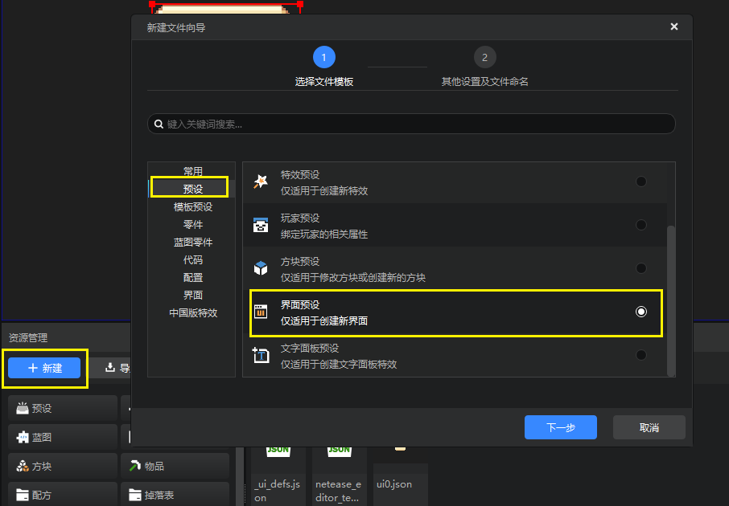

在新建文件向导的第二页，我们无需修改，直接点击创建即可。

编辑器会自动打开我们刚创建好的界面预设，并跳转到预设编辑器，选中界面预设。
我们在界面预设的属性面板中，勾选预加载，并且保证绑定的界面画布为刚才包含switch_togggle的画布。

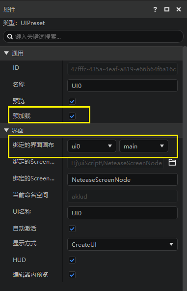

然后点击编辑器右上角的运行按钮，选择当前最新的稳定版开发包，等待开发包打开。

然后按下F11切换为模拟触屏模式，就可以点击这个开关进行切换了。

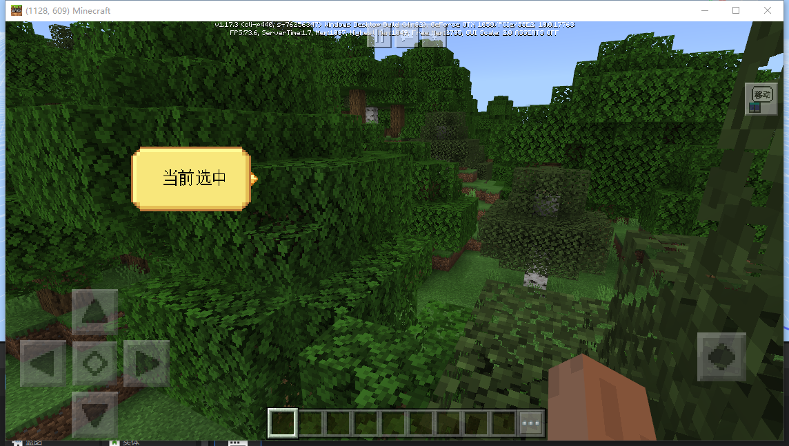

以上是一个简单的自定义开关的例子，更复杂使用这种开关来实现一套页签切换的例子可以参考[UI数据绑定](./70-UI数据绑定.md)。
