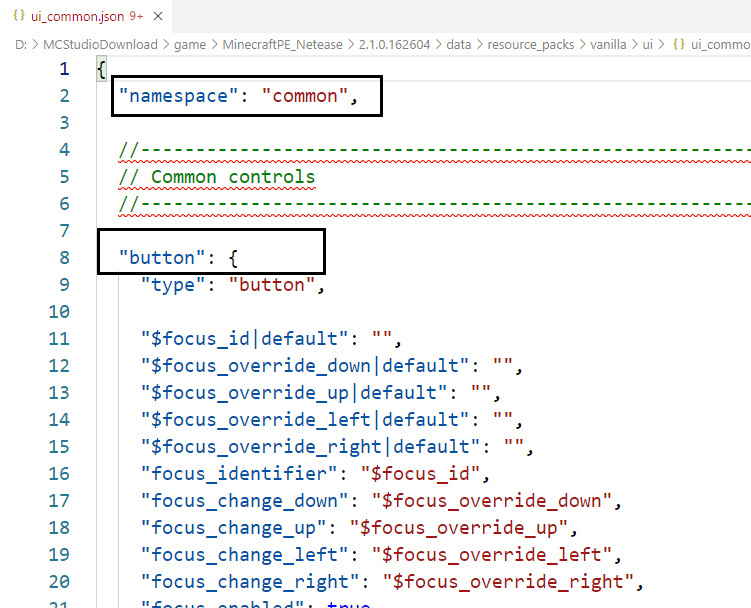
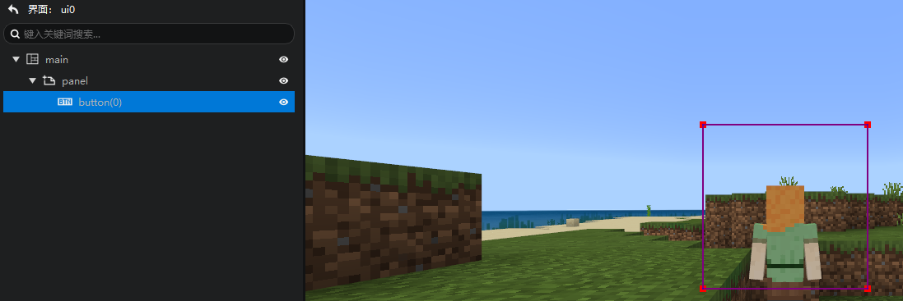

# 添加原生控件

《我的世界》中大量使用了继承控件，我们找到工作台的下载路径，并找到资源包里面的ui目录，里面可以看到我的世界原生的大量的界面文件。

我们最熟悉的按钮其实就是ui_common.json中定义的一个自定义控件。

我们打开ui_common，映入眼帘的即是button——我的世界中使用的按钮。

这里我们主要关注两个信息：

- ui_common.json的namespace（命名空间）：common
- 按钮控件的名称：button

接下来会用到。

那么，如何在你的界面中直接使用原生的控件呢？

1. 我们先创建一个界面文件，并在main画布下挂接一个面板（panel）
2. 选中面板，点击功能区的“添加原生控件”按钮

3. 在弹出的弹窗里按照下图填写。（命名空间填写json文件里的common，控件名称填写json文件里的button）

4. 点击确定，这样你就在你的界面中添加了一个原生的button

当然，原生的按钮显得不那么好用，我们还是推荐你使用编辑器提供的按钮。

我们尝试下另一个常用的控件：container_item，这个就是广泛用在各种原生界面中的物品容器。

我们在编辑器中尝试对其进行展开，可以看到这个控件的内部结构。

善用添加原生控件可以帮助你快速搭建与原生界面类似的界面，以及学习原生界面的写法。

