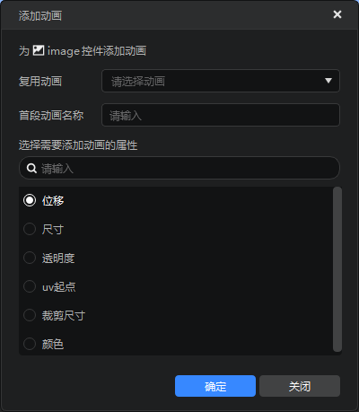
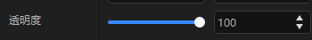
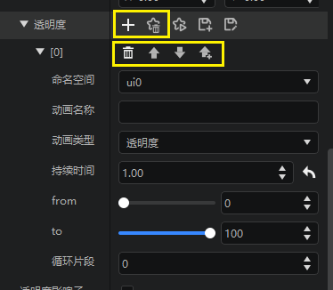
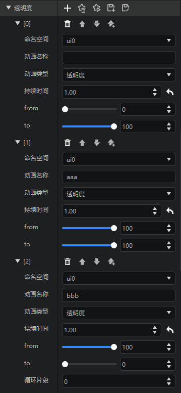
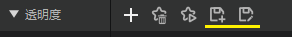
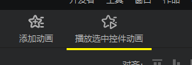
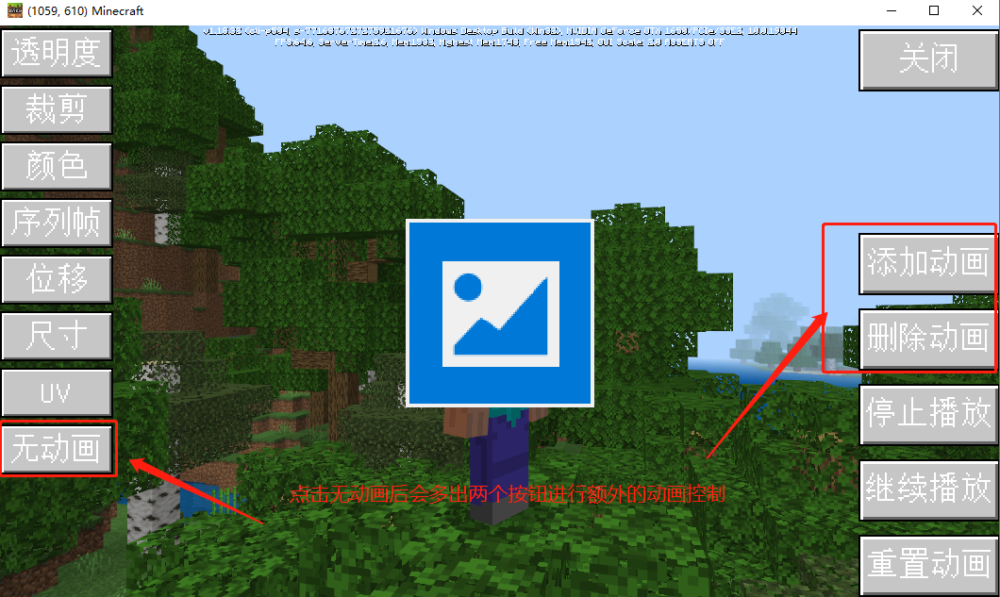

# 控件属性动画

MC为部分UI控件属性提供了一套属性动画逻辑，活用他们，可以让你的界面更加精美绚丽。

一言以蔽之，界面属性动画，就是使界面的某一控件的某个属性值跟随时间发生变化，并以此产生动画效果，例如下图中的效果就是一个uv属性的动画。


以下所有属性动画的示例均可参考 UIDemoModUI 动画演示，demo的下载位置见[这里](../20-玩法开发/13-模组SDK编程/60-Demo示例.md)。

另外，这里还会介绍如何通过接口去控制你的动画。

## Demo介绍

将上述的 UIDemoModUI 导入Studio，并使用编辑器打开。

> 默认会使用旧版编辑器打开，第一打开时需要点击升级按钮。旧版编辑器不包含属性动画相关功能。

双击打开UIAnimationScreen界面文件。

本质上来说，属性动画与自定义控件非常类似，由于属性动画主要用于某一具体的控件的动画，没有单独展示的意义，目前并不会出现在自定义控件库中。

### 支持的属性动画类型

并非所有的控件属性都支持动画，当前支持的属性有：

- 位移和尺寸
- 透明度
- 裁剪
- 颜色
- 序列帧
- UV动画

同一个控件，可以有多个属性同时设置属性动画，所有的属性动画都会在界面创建后自动播放。

可以看到当前支持的所有属性都存在于图片控件中，我们接下来的所有示例都会以图片为准。

### 创建属性动画

新建一个界面文件，并创建一个面板和一个图片，如下图。


选中需要添加动画的控件，这里是image，然后在功能区点击“添加动画”按钮。


弹出一个添加动画的弹窗，如下图。

- 复用动画：在这里可以选择自定义控件库里的动画，也可以留空，表示创建一个新动画。
- 首段动画名称：创建的动画在自定义控件库里的名称。
- 属性动画的属性类型选框

> 如果复用动画，那么首段动画名称将不可修改，显示的就是复用的动画的名称。
> 首段动画名称可以留空，表示动画不加入自定义控件库。需要注意的是，如果留空，首段动画就不能被其他属性动画复用，也不能循环播放。



填写好必要信息后，点击确定即可，这里我们选择透明度。

### 编辑属性动画

如下图，可以发现image控件的属性面板中，透明度属性从一个数值变为了一个列表。

这个列表展示的就是透明度属性动画的细节信息。
属性动画在编辑器中的形式是列表，列表的每一个元素表示一个动画片段，当动画播放时，会从列表的第一个元素顺次播放到最后一个元素。





上图黄框内的6个按钮，其作用分别为：

- 添加元素：为动画添加一个新的动画片段
- 取消动画：取消这个属性的动画，并将其恢复为固定值的形式
- 删除元素：删除一个动画片段
- 向上移动：与上方的动画片段调换位置
- 向下移动：与下方的动画片段调换位置
- 上方新建元素：在上方插入一个动画片段

> 对于取消动画/删除动画，如果你的动画保存在自定义控件库中，那么这并不会导致动画片段的信息丢失，你仍然可以从自定义控件库中复用。

除了增删动画片段之外，修改属性是最常见的编辑属性动画的方法，每个动画片段的属性基本相同，他们的含义分别为：

- 命名空间：该动画所在的界面文件的命名空间，你可以在下拉框中选择其他的界面文件以切换动画信息保存的文件，一般情况下无需在意这个属性
- 动画名称：动画片段在自定义控件库中的名称
- 动画类型：一般与属性的类型相同
- 持续时间：此动画片段持续的时间，经过这段时间后，动画片段播放完毕，开始播放下一段动画
- from：动画的起始帧，即刚开始播放此动画时的属性值
- to：动画的最终帧，即此动画将要播放完毕时的属性值
- 循环片段：控制动画的最后几个片段循环播放

> 除了首段动画外，动画名称不能为空，即除了首段动画外，后续的动画片段必须保存在自定义动画库中。
> 同一个属性动画中，不能出现2个相同的动画名称的动画片段。

如下图我们额外添加2个动画片段，并调整数值如下。



### 保存和另存动画

由于有复用逻辑，对于属性动画的保存，我们提供了2种方式

- 创建副本，相当于另存为新的动画，会在自定义控件库里创建一系列新的动画
- 应用修改，修改当前使用的动画，会影响所有复用这个动画的自定义控件



> 你必须先保存才能播放动画，或者切换到其他控件，其他编辑器

### 播放动画

保存完毕后，可以播放动画，对编辑的效果进行预览。我们提供了2种预览方式。

1. 点击属性动画的播放按钮，可以对这个属性动画进行单独预览


2. 点击功能区的“播放选中控件动画”按钮，可以对这个控件的所有属性动画同时进行预览



例如我们为这个控件再添加一个尺寸动画，那么使用方式2预览的表现如下图：


### 动画循环

属性动画支持循环，且可以自己定义参与循环的片段，你可以通过下图中的循环片段属性调整，循环的规则如下：

- 一个属性动画，只有最后的动画片段有“循环片段”这个属性
- 只能让最后几段动画循环
- “循环片段” = 0表示没有循环
- 例如你填写了5个动画片段，按顺序分别是A→B→C→D→E，且“循环片段” = 3，那么实际的播放顺序是A→B→C→D→E→C→D……（CDE循环）
- “循环片段”不能超过属性动画的动画片段数
- 如果首段动画没有名称，那么它不能参与循环
- 序列帧动画不能循环


### 取消属性动画

点击属性动画的取消按钮，可以取消该属性动画，并且将其恢复到固定数值的状态。


> 如果动画已经保存到自定义控件库中，那么取消动画并不会删除这个动画

### uv动画和序列帧动画

uv动画和序列帧动画都是uv起点属性的动画，不同于其他属性动画只能使用固定的动画片段类型，比较特殊。

我们新建一张图片，并使用my_eating_apple.png作为图片资源。然后添加一个属性动画，动画的类型选择“uv起点”，如下图，可以看到2种动画（通过动画类型的下拉框切换）。

1. 序列帧

序列帧属性动画与序列帧特效类似，都是通过切换图片的显示区域达到动画的效果，序列帧动画主要关注下列属性：

- 播放帧数：代表序列帧贴图资源总共包含的总帧数，例如我们使用的图片中总共包含了苹果的36个状态，所以这个值填写36
- 起始帧：表示第一帧播放第几张图
- 帧率：每秒播放的帧数，10表示每秒切换10张图，总共是36张图，播放一次需要的时间为3.6秒
- 是否可逆：勾选时序列帧播放完毕后倒放回第一帧


使用序列帧动画时，图片的uv尺寸不能填写[0,0]，这里填写的是序列帧的每一帧的尺寸大小。

> 序列帧动画使用的图片，想要实现正常的效果，每个子图的大小必须一致
> 序列帧动画会自我循环，所以没有循环的属性。因为会自我循环，所以序列帧动画后面的动画片段是不会被读取到的

2. uv动画

动画类型从“序列帧”切换到“uv”，可以制作uv动画。uv动画与其他动画类似，按照下图的信息填写，保存并播放，可以查看uv动画的效果。


## 属性动画Json写法简介

属性动画依然是以Json数据的形式写在UI文件中，格式和控件类似。

要表现一个属性动画，需要先写一个Json数据块，透明度动画举例如下（相关参数会在下文详细描述）：

```json 
{
    "anim_type" : "alpha",
    "duration" : 1.0,
    "from" : 0.0,
    "to" : 1.0
}
```

这段代码块代表一个控件在1秒钟内alpha值从0线性变化到1的属性动画，为了将这个动画绑定到控件上，一共有两种写法。

一种是将Json数据块直接赋给alpha属性：

```json 
{
    "alphaImg" : {
        "alpha" : {
            "anim_type" : "alpha",
            "duration" : 0.30,
            "from" : 0.0,
            "to" : 1.0
        },
        "texture" : "textures/netease/common/image/default",
        "type" : "image",
        "visible" : true
    }
}
```

另一种则是将属性动画写成自定义控件的形式写在UIjson文件的最外层，在alpha属性值以 “@”+动画名 的形式进行赋值：

```json 
{
    "alphaImg" : {
        "alpha" : "@show_alpha_ani",
        "texture" : "textures/netease/common/image/default",
        "type" : "image",
        "visible" : true
    },
    "show_alpha_ani": {
        "anim_type" : "alpha",
        "duration" : 0.30,
        "from" : 0.0,
        "to" : 1.0
    }
}
```

两种写法都能达成相同的效果，不同的是第二种写法能够被复用。

目前UI编辑器还不支持属性动画的创建和编辑，但通过修改UIJson定义的属性动画可在UI编辑器播放，此时挂载了属性动画的属性在编辑器内修改对应属性无法生效。

## 属性动画类型与Json配置

### 通用属性

通用属性是每种属性动画都支持的属性

| <div style="width:150px">变量</div> | 解释                                                         |
| :------------: | ----------------------------------------------------------- |
|     anim_type      | 动画类型，取值["alpha", "clip", "color", "flip_book", "offset", "size", "uv"]，不同的动画类型只能赋给对应的属性。 |
|   duration    | 动画持续时间，单位为秒。|
|   from    | 动画起始数据，根据动画类型的不同，支持写入的数据类型也不同，控件初始化时会用该值初始化对应属性  |
|     to     | 动画结束数据，根据动画类型的不同，支持写入的数据类型也不同   |
|      next      | 当前动画播放完毕后接着播放的动画，**注2**举了一个使图片控件的alpha值从0到1再到0的渐变动画的例子。  |

* 注1

填写属性动画属性值时请注意不同的动画所需要的属性值类型或取值范围均可能不同，填写错误会导致动画无法生效或表现异常。

* 注2

```json
{
    "alphaImg" : {
        "alpha" : "@show_alpha_ani",
        "texture" : "textures/netease/common/image/default",
        "type" : "image",
        "visible" : true
    },
    "show_alpha_ani": {
        "anim_type" : "alpha",
        "duration" : 0.30,
        "from" : 0.0,
        "next" : "@hold_alpha_ani",
        "to" : 1.0
    },
    "hold_alpha_ani" : {
        "anim_type" : "alpha",
        "duration" : 1,
        "from" : 1.0,
        "next" : "@hide_alpha_ani",
        "to" : 1.0
    },
    "hide_alpha_ani" : {
        "anim_type" : "alpha",
        "duration" : 0.30,
        "from" : 1.0,
        "to" : 0.0
    }
}
```

### 透明度动画

控件透明度动画，需要挂载在"alpha"属性值上

| <div style="width:150px">变量</div> | 解释                                                         |
| :------------: | ----------------------------------------------------------- |
|     anim_type      | "alpha" |
|   from    | 透明度起始值，取值0-1.0。  |
|     to     | 透明度结束值，取值0-1.0。  |


```json
{
    "alphaImg" : {
        "alpha" : "@show_alpha_ani",
        "texture" : "textures/netease/common/image/default",
        "type" : "image",
        "visible" : true
    },
    "show_alpha_ani": {
        "anim_type" : "alpha",
        "duration" : 0.30,
        "from" : 0.0,
        "next" : "@hold_alpha_ani",
        "to" : 1.0
    },
    "hold_alpha_ani" : {
        "anim_type" : "alpha",
        "duration" : 1,
        "from" : 1.0,
        "next" : "@hide_alpha_ani",
        "to" : 1.0
    },
    "hide_alpha_ani" : {
        "anim_type" : "alpha",
        "duration" : 0.30,
        "from" : 1.0,
        "to" : 0.0
    }
}
```

### 裁剪动画

控件裁剪动画，需要挂载在图片控件的"clip_ratio"属性值上

| <div style="width:150px">变量</div> | 解释                                                         |
| :------------: | ----------------------------------------------------------- |
|     anim_type      | "clip" |
|   from    | 裁剪程度起始值，取值0-1.0。0表示不裁剪，1表示完全裁剪，即该控件不渲染  |
|     to     | 裁剪程度结束值，取值0-1.0。 |


```json
{
    "clipImg" : {
        "clip_ratio" : {
              "anim_type" : "clip",
              "duration" : 1.0,
              "from" : 0.0,
              "to" : 1.0
           },
        "texture" : "textures/netease/common/image/default",
        "type" : "image",
        "visible" : true
    }
}
```

### 颜色动画

控件颜色动画，需要挂载在图片控件的"color"属性值上

| <div style="width:150px">变量</div> | 解释                                                         |
| :------------: | ----------------------------------------------------------- |
|     anim_type      | "color" |
|   from    | 颜色起始值，颜色（r , g, b）取值范围[0 , 1]，不支持alpha值属性设置或参与动画  |
|     to     | 颜色结束值  |


```json
{
    "colorImg" : {
        "color": "@color_ani",
        "texture" : "textures/netease/common/image/default",
        "type" : "image",
        "visible" : true
    },
    "color_ani": {
        "anim_type" : "color",
        "duration" : 1.0,
        "from" : [1,0,0],
        "to" : [0,0,1]
    }
}
```

### 序列帧动画

控件序列帧动画，需要挂载在图片控件的"uv"属性值上.

序列帧动画，又称逐帧动画，其原理是在“连续的关键帧”中分解动画动作，也就是在时间轴的每帧上逐帧绘制不同的内容，使其连续播放而成动画。通过一张序列帧动画资源图，以及一些自定义的设置，可以在图片控件上展示序列帧动画。

| <div style="width:150px">变量</div>   | 解释                                         |
| :-----------------: | -------------------------------------------- |
|     anim_type      | "flip_book" |
|       initial_frame       | uv动画起始帧 |
|       frame_count       | 帧数，代表序列帧贴图资源总共包含的总帧数 |
|       fps       | 帧率，每秒播放的帧数 |
|       reversible       | 是否可逆，默认值为false，为true时序列帧播放完毕后倒放回第一帧 |


```json
{
    "flipbookImg" : {
        "texture" : "textures/ui/my_eating_apple",
        "type" : "image",
        "uv" : "@flipbook_ani",
        "uv_size" : [ 64.0, 64.0 ],
        "visible" : true
    },
    "flipbook_ani": {
        "anim_type": "flip_book",
        "initial_frame": 10,
        "frame_count": 36,
        "fps": 10,
        "reversible": false
    }
}
```

当一个图片控件被用作序列帧的载体时，该控件的属性配置有以下规则需要遵守：

| <div style="width:150px">变量</div>   | 解释                                         |
| :-----------------: | -------------------------------------------- |
|    texture     | 贴图的路径，贴图需要符合序列帧样式，如下图 |
|       uv       | 序列帧本质上就是一种特殊的uv动画。 |
|       uv_size       | uv尺寸表示需要显示的尺寸，要和序列帧贴图中的一帧大小相同 |


### 位移动画

控件位移动画，需要挂载在控件的"offset"属性值上

| <div style="width:150px">变量</div> | 解释                                                         |
| :------------: | ----------------------------------------------------------- |
|     anim_type      | "offset" |
|   from    | 位移起始值，自身相对父节点的偏移，详见[通用属性](./30-UI说明文档.md#通用属性) |
|     to     | 位移结束值 |


```json
{
    "offsetImg" : {
        "offset" : "@offset_ani",
        "texture" : "textures/netease/common/image/default",
        "type" : "image",
        "visible" : true
    },
    "offset_ani": {
        "anim_type" : "offset",
        "duration" : 1.0,
        "from" : [0, 0],
        "to" : [0, 50]
    }
}
```

**注**

位移动画需要起始值和结束值的偏移类型相同，例如起始值为["50%", 0],结束值则需要为["100%", 50]，即变化的类型需保持一致。

如果有需要调用接口动态修改该控件的尺寸，请避免使用<a href="../../mcdocs/1-ModAPI/接口/自定义UI/UI控件.html#SetSize">SetSize</a>，改为使用<a href="../../mcdocs/1-ModAPI/接口/自定义UI/UI控件.html#SetFullSize">SetFullSize</a>。

如果有需要调用接口动态修改该控件的偏移属性，请避免使用<a href="../../mcdocs/1-ModAPI/接口/自定义UI/UI控件.html#SetPosition">SetPosition</a>，改为使用<a href="../../mcdocs/1-ModAPI/接口/自定义UI/UI控件.html#SetFullPosition">SetFullPosition</a>。

### 尺寸动画

控件尺寸动画，需要挂载在控件的"size"属性值上

| <div style="width:150px">变量</div> | 解释                                                         |
| :------------: | ----------------------------------------------------------- |
|     anim_type      | "size" |
|   from    | 尺寸起始值，控件大小，详见[通用属性](./30-UI说明文档.md#通用属性) |
|     to     | 尺寸结束值 |


```json
{
    "sizeImg" : {
        "size" : "@size_ani",
        "texture" : "textures/netease/common/image/default",
        "type" : "image",
        "visible" : true
    },
    "size_ani": {
        "anim_type" : "size",
        "duration" : 1.0,
        "from" : [100, 100],
        "to" : [150, 150]
    }
}
```

**注**

尺寸动画需要起始值和结束值的偏移类型相同，例如起始值为["50%", 0],结束值则需要为["100%", 50]，即变化的类型需保持一致。

如果有需要调用接口动态修改该控件的尺寸，请避免使用<a href="../../mcdocs/1-ModAPI/接口/自定义UI/UI控件.html#SetSize">SetSize</a>，改为使用<a href="../../mcdocs/1-ModAPI/接口/自定义UI/UI控件.html#SetFullSize">SetFullSize</a>。

如果有需要调用接口动态修改该控件的偏移属性，请避免使用<a href="../../mcdocs/1-ModAPI/接口/自定义UI/UI控件.html#SetPosition">SetPosition</a>，改为使用<a href="../../mcdocs/1-ModAPI/接口/自定义UI/UI控件.html#SetFullPosition">SetFullPosition</a>。

### UV动画

控件UV动画，需要挂载在图片控件的"uv"属性值上

| <div style="width:150px">变量</div> | 解释                                                         |
| :------------: | ----------------------------------------------------------- |
|     anim_type      | "uv" |
|   from    | uv坐标初始值。uv坐标为[x,y]表示图片控件以所选图片左上角为原点，偏移(x,y)像素开始截取图片。 |
|     to     | uv坐标结束值 |


```json
{
    "sizeImg" : {
        "uv" : "@uv_ani",
        "texture" : "textures/netease/common/image/default",
        "type" : "image",
        "visible" : true
    },
    "uv_ani": {
        "anim_type" : "uv",
        "duration" : 5,
        "from" : [0, 0],
        "to" : [2240, 0]
    }
}
```


## 控制动画


目前的SDK接口支持注册动画，给属性添加动画，移除属性的动画，暂停播放单一（或者全部）属性动画等等，开发者可以参考以下的接口：

注册动画： <a href="../../mcdocs/1-ModAPI/接口/自定义UI/通用.html#registeruianimations">RegisterUIAnimations</a>

取消注册动画： <a href="../../mcdocs/1-ModAPI/接口/自定义UI/通用.html#unregisteruianimation">UnregisterUIAnimation</a>


暂停动画： <a href="../../mcdocs/1-ModAPI/接口/自定义UI/UI控件.html#pauseanimation">PauseAnimation</a>

播放动画： <a href="../../mcdocs/1-ModAPI/接口/自定义UI/UI控件.html#playanimation">PlayAnimation</a>

停止播放动画： <a href="../../mcdocs/1-ModAPI/接口/自定义UI/UI控件.html#stopanimation">StopAnimation</a>


给单一属性设置动画： <a href="../../mcdocs/1-ModAPI/接口/自定义UI/UI控件.html#setanimation">SetAnimation</a>


给单一属性移除动画： <a href="../../mcdocs/1-ModAPI/接口/自定义UI/UI控件.html#removeanimation">RemoveAnimation</a>


设置动画播放结束后的回调： <a href="../../mcdocs/1-ModAPI/接口/自定义UI/UI控件.html#setanimendcallback">SetAnimEndCallback</a>


删除回调： <a href="../../mcdocs/1-ModAPI/接口/自定义UI/UI控件.html#removeanimendcallback">RemoveAnimEndCallback</a>


这些接口在 UIDemoModUI 中部分使用（注册和添加动画请点击 "无动画按钮"）

