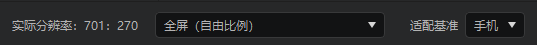
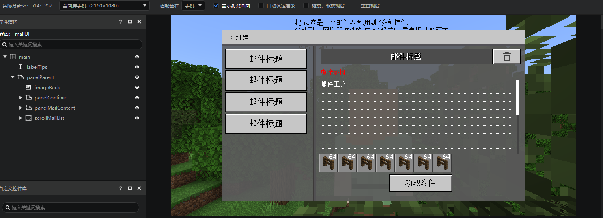
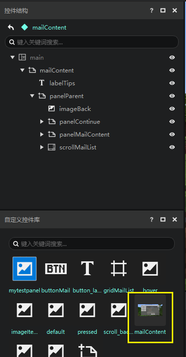
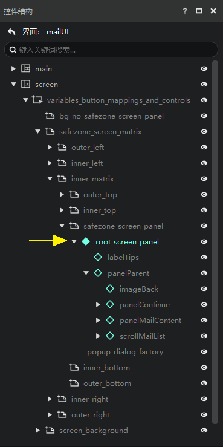

# 不同分辨率界面适配

## 预览不同分辨率下的效果

在界面编辑器可以发现如下图的一系列分辨率相关的选项

我们在界面编辑器里提供了各种常见分辨率的模拟，你可以选择你希望适配的分辨率来查看效果。

如下图，可以看到当前选择的是全面屏手机（2160×1080）的分辨率。左侧还有一个实际分辨率，显示的是当前预览窗的《我的世界》的实际分辨率是540:270，这是由《我的世界》本身的适配规则决定的，见下面的[适配原理](#适配原理)。

需要注意的，游戏里的所有像素都是按照实际分辨率计算的，而实际分辨率通常比手机或者电脑的屏幕小得多，所以当你在设置位移尺寸的时候，如果需要直接填写像素，需要格外注意适配问题。

## 适配原理

手机的分辨率是多种多样的，想尽量的适配更多的分辨率，就需要了解《我的世界》中界面适配的方法。适配界面时涉及的尺寸如下：

其中画布一般和屏幕大小相同，少数情况会小于屏幕，由系统和玩家设置决定。

前面我们已经知道，控件的尺寸为百分比加一个固定像素值的形式。系统在计算控件实际的显示尺寸时，会对所有固定像素乘以一个比例a。举例如下：

|        | **画布尺寸** | **父控件尺寸** | **子控件设定尺寸** | **子控件实际显示尺寸** |
| ------ | ------------ | -------------- | ------------------ | ---------------------- |
| **宽** | 900Px        | 800Px          | 10%+50Px           | 80Px+50Px\*a           |
| **高** | 750Px        | 750Px          | 20%+100Px          | 150Px+100Px\*a         |

那么比例a是怎么确定的呢？系统会按如下步骤计算这个比例：

1. **计算画布的宽除以320、画布的高除以210的值**。上面的例子中，这两个值为900/320=2.81,750/210=3.57。
2. **计算a的最大值**。在1)中计算的两个比例分别取整，然后再取最小值，作为a的最大值。在上面的例子两个比例取整后分别为2和3，最小值就是2。
3. **计算a的最终值**。根据某些的规则得到一个比2)中小的值，作为a最终的值。这个规则开发者无需关心。一般来说最终值和2)里计算的最大值是一样的。

在上面的例子中，a的值为2，那么控件显示的宽为80Px+50Px\*a=180Px，高为150Px+100Px\*a=350Px。

通俗一点来说，游戏里有一个320Px\*210Px的适配区域（下图中紫色实线部分），游戏把这个适配区域按整数倍膨胀，直到再膨胀就会超出画布为止。然后将这个整数比例乘以控件尺寸中的固定像素，再加上比例部分计算得到的像素，作为最终的控件显示尺寸。

因此，如果我们想UI在各种分辨率的屏幕下都不会超出屏幕边界，可以把决定显示范围的父控件（比如顶层的面板控件）的尺寸设为固定尺寸，且数值在320\*210以下。需要注意的是，贴图并不需要受限于这个尺寸，可以适当扩大贴图尺寸，以在大分辨率的屏幕里获得更好的效果。

此外，在PC基岩版中，适配的基准值为376x250，略大于手机适配的320x210，如果想一份界面资源同时适配手机和PC基岩版，那么需要以手机的标准来制作。

## 异形屏适配和基类画布

如果你制作的是手机模组，可能会遇到玩家的屏幕是异形屏的情况，例如挖孔屏，刘海屏等。

有一个简单的方法来进行适配，就是使用基类画布。如果你打算对异形屏进行适配，最好一开始就使用基类画布，如果你已经做了一半，那你可以这样做（我们以界面模板这个邮件界面为例）：

1. 在main画布下新建一个panel（面板），并且将panel的尺寸XY的适应勾上。
2. 将原来main画布下的其他控件拖拽到panel（面

1. 右键panel添加到控件库，这里我们命名为mailContent，结果如下图

> 这个操作是为了让main画布下的所有内容可以塞到同一个自定义控件中。如果你的main画布下面本来就是只有一个自定义控件的实例，那么你可以跳过这一步，或者main画布下面本来就只有一个直接的子节点（不关注孙节点等），那么直接把这个唯一的子节点创建为自定义控件即可。

1. 创建一个基类画布，在画布的属性面板的变量区里选择刚刚创建的mailContent，这样就完成了基类画布的使用。

> 如果你之前在画布上创建了变量，很遗憾，你必须再手动创建一次。

你可能注意到了，如果你使用基类画布的话，你不能直接在基类画布下对控件进行编辑，而是需要编辑这个自定义控件。

基类画布实际上使用了[控件引用](./15-变量引用和万用控件.md#控件引用和万用控件)。

展开screen画布，然后继续按照下图的方式展开，你可以看到这个root_screen_panel实际上是一个万用控件。

继续展开，就是我们熟悉的mailContent控件的内容。

你可以在这里很方便的复制路径，复制到的路径可以直接使用在模组的SDK代码中。

可以看到，启用基类画布之后，路径发生了较大的变化，所以我们强烈建议你在制作UI之前先想要是否要使用基类画布。

