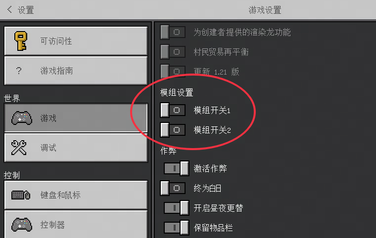
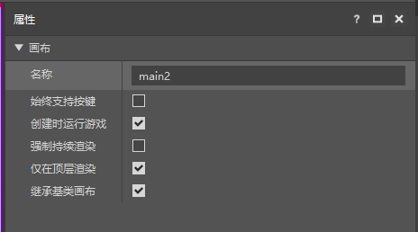
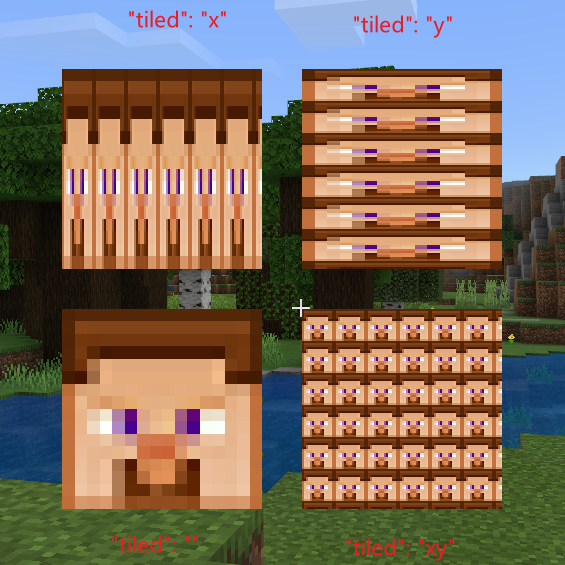
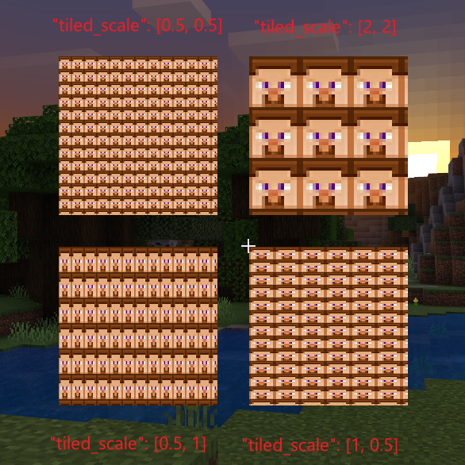
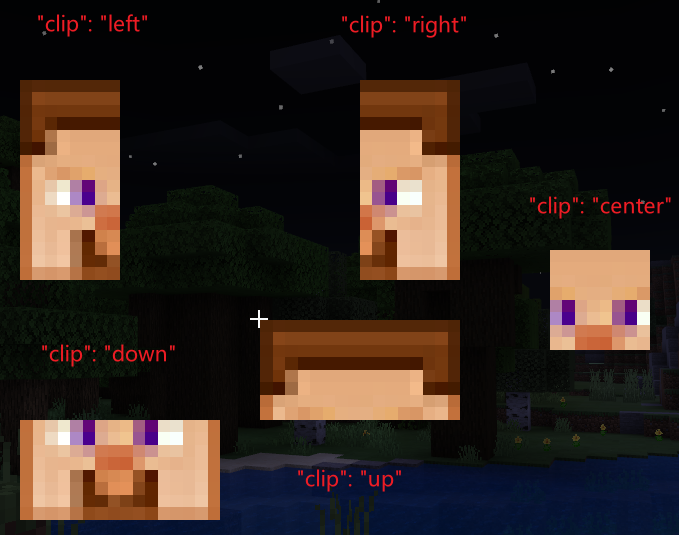
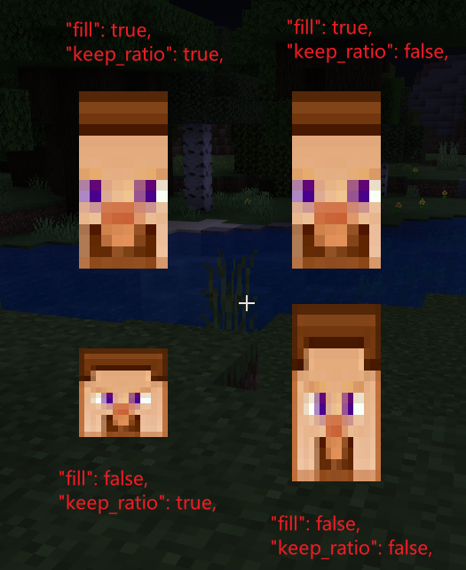
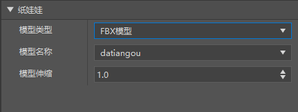
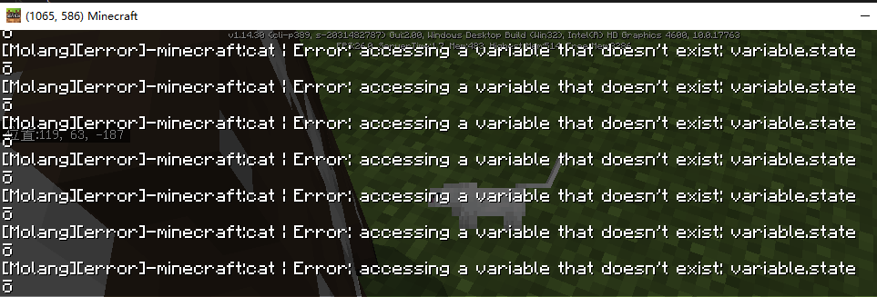
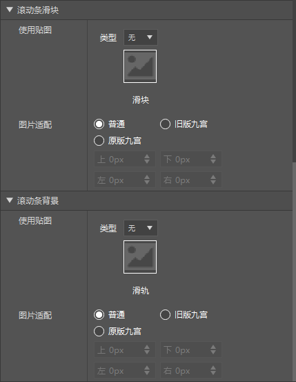
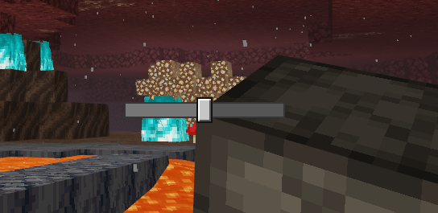

---
front:
hard: 困难
time: 120分钟
---

# UI说明文档

本文介绍了关于UI编写和使用的一切。

目前MCStudio已提供UI编辑器，开发者可以在UI编辑器内对界面进行可视化编辑，并导出可以使用的JSON文件。各个控件在UI编辑器中的使用方法将在下文中详细介绍。

## 文件目录

我的世界基岩版的UI采用数据驱动，游戏会扫描所有定义在`_ui_defs.json`中的JSON文件，根据里面的树状组织节点生成对应的控件对象，在需要的时候显示到游戏中。

所有的UI文件都应该放到资源包的ui文件夹中，JSON UI系统包含以下文件：

### 系统文件

这些是 JSON UI 中使用的内置文件：

- `_global_variables.json` - 用于定义默认变量以供后续使用
- `_ui_defs.json` - 用于定义要使用的UI界面文件

### 界面文件

这些是定义游戏中使用的界面的文件：

- `hud_screen.json` - 主界面，包括快捷栏、生命值、暂停按钮等
- `inventory_screen.json` - 玩家的背包界面
- 更多界面文件可自行打开游戏根目录的`data/resource_packs/vanilla/ui`探索

### 模板文件

这些是存储 JSON UI 控件的文件，以供其他界面使用：

- `ui_common.json` - 包含大量可复用的控件（如按钮）
- `ui_template_*.json` - 包含特定类型的可复用控件模板

## \_ui\_defs的用法

`_ui_defs.json` 文件以列表形式引用所有 JSON UI 文件。如果你编写的UI文件没有定义在这里，那么游戏将无法找到你的UI文件。

例如我们添加了 `RP/ui/button.json` 和 `RP/my_ui/main_menu.json`。在`_ui_defs.json`文件中，要这样写：

RP/ui/_ui_defs.json

```json
{
	"ui_defs": ["ui/button.json", "my_ui/main_menu.json"]
}
```

- 路径从资源包根目录开始，包括文件扩展名（例如 \*.json）。
- 只需引用新添加的 UI 文件，无需引用原版UI文件或第三方UI文件，因为所有资源包中的_ui_defs会自动合并。

## 全局变量

`_global_variables.json`定义了在所有界面文件中可以使用的变量，例如我们可以在 `_global_variables.json` 文件中定义变量 `$info_text_color` 及其值 [0.8, 0.8, 0.8]，如下所示：

RP/ui/_global_variables.json

```json
{
	"$info_text_color": [0.8, 0.8, 0.8]
}
```

在其他 JSON UI 文件中的其他控件可以使用此变量：

RP/my_ui/file1.json

```json
{
	"some_info": {
		...
		"text": "Hey",
		"color": "$info_text_color"
	}
}
```

RP/my_ui/file2.json

```json
{
	"info": {
		...
		"text": "Information",
		"color": "$info_text_color"
	}
}
```

您可以在 `_global_variables.json` 文件中添加更多变量，变量之间用逗号分隔，所有资源包中的_global_variables会自动合并。

存储在此文件中的变量是固定且单向的。因此，您不能在一个界面文件中修改默认变量以供另一个界面文件使用。

## 命名空间

命名空间是 UI 文件的标识符，可用于在所有其他文件中继承某些文件中的控件。**命名空间必须全局唯一**，我们建议JSON文件名和namespace一致。

RP/my_ui/myUIName.json
```json
	"namespace" : "myUIName"
```

例如，我们在命名空间 one 中有一个控件 foobar：

RP/ui/file_a.json

```json
{
	"namespace": "one",
	"foobar": {...}
}
```
然后我们可以在另一个命名空间 two 中继承上述相同的控件：

RP/ui/file_b.json

```json
{
	"namespace": "two",
	"fizzbuzz@one.foobar": {...}
}
```

从不同命名空间继承控件时，必须使用以下格式：

`[控件名称]@[要引用的命名空间].[引用文件中的控件]`

例如：`mybutton@common.button`

从相同命名空间继承时，格式可以为`[控件名称]@[当前文件中的控件]`

## 继承控件

继承控件允许开发者选择并继承目标控件，继承成功后该控件拥有目标控件的所有属性，并可以重写其中任何一个属性的数据。

### 继承写法简述

在界面JSON文件所有的编写技巧中，最为好用和灵活的功能当属继承写法。当界面中有一个需求，需要将若干个相同的控件按序排列，除了可以通过复制粘贴出若干个控件副本外，继承模板控件并只修改我们所需要修改的属性，其他的属性依然沿用模板控件的数据才是最便捷，也是最漂亮的写法。下面我们从一个简单的例子入手熟悉继承的写法，从例子中我们可以快速熟悉继承技巧。

```json
{
	"namespace": "myInherit",
	"main": {
		"type": "screen",
		"controls": [
			{
				"label0@label0": {}
			},
			{
				"inheritor0@label0": {
					"offset": [10.0, 0.0]
				}
			},
			{
				"inheritor1@label0": {
					"offset": [20.0, 0.0]
				}
			}
		]
	},
	"label0": {
		"text": "Hello World!",
		"type": "label"
	}
}
```

该段JSON描述了在main画布中创建了一个文本控件label0，并使继承控件inherit0和inherit1均继承了label0控件，并重写了offset属性，在场景中就得到了三个文本控件，这三个文本控件除了在场景中的位置因为重写而不同外，其他的属性一模一样。但是要注意的是，可以被继承的控件必须写在JSON文件的最外层，和main处在同一层级，即一个命名空间下有且仅有一个该名称的控件，满足该条件的控件才可以被继承。

### 命名空间的转移

如下方代码所示，如果一个控件继承了其他界面的控件，那么它的controls里的默认命名空间也会转移。

```json
{
	"namespace": "myInherit",
	"main": {
		"type": "screen",
		"controls": [
			{//这里可以直接写继承label0
				"inheritor0@label0": {
					"offset": [20.0, 0.0]
				}
			},
			{//从继承common.button开始，下方controls的默认空间都变成了common
				"myButton@common.button": {
					"size": [100, 100],
					"controls": [
						{//必须指定为myInherit.label0，否则游戏会认为你想继承common.label0，找不到控件而报错
							"inheritor1@myInherit.label0": {
								"offset": [10.0, 0.0]
							}
						}
					]
				}
			}
		]
	},
	"label0": {
		"text": "Hello World!",
		"type": "label"
	}
}
```

### UI编辑器中的继承

新版的UI编辑器对继承提供了更可视化的方法，请参考[继承和自定义控件](./13-继承和自定义控件.md)。

## 控件变量

变量不仅限于`_global_variables.json`文件。它还可以在其他控件中直接使用和表示，以便将数据从一个控件传递到另一个控件。

在键的开头添加符号 $ 以表示它是一个变量。变量可以存储整数、浮点数、布尔值、字符串和列表。

RP/ui/example_file.json

```json
{
	"test_element": {
		...
		// 定义变量
		"$array_variable": [10, 10],
		"$string_variable": "foobar",
		"$float_variable": 1.0,
		"$string_variable2": "my_button.template_button",

		// 使用变量
		"size": "$array_variable",
		"text": "$string_variable",
		"alpha": "$float_variable",

		// 您还可以使用变量将某个控件继承为子控件
		"controls": [{
			"foobar@$string_variable2": {}
		}]
	}
}
```

您还可以从一个控件继承另一个控件的变量并使用，如下所示：

RP/ui/example_file.json

```json
{
	"foobar": {
		...
		"$cool_variable": 1,
		"$rad_variable": false
	},

	// 控件 "fizzbuzz" 继承了 "foobar"
	// 并将 `$cool_variable` 值替换为 2
	// 而 `$rad_variable` 保持不变。
	"fizzbuzz@foobar": {
		"$cool_variable": 2
	}
}
```

## 主界面

每个界面文件中，都应该有一个screen控件，即一个JSON文件就是一个界面，否则它只是个模板文件。

我们规定使用main作为界面名称，controls中的内容是该界面下的树状节点，即子节点。

```json
"main@common.base_screen" : {
	"controls" : [
	]
}
```

|          变量           | 解释                                          |
| :---------------------: | :-------------------------------------------- |
| main\@common.base_screen | 表示main继承了common.base_screen      |

### 适配异形屏

为了适配异形屏，我们可以展示screen中的内容通过引用的形式写在screen的$screen_content属性中。

```json
"main@common.base_screen": {
	"$screen_content": "myUIName.panel0"
},
"panel0": {
	"type": "panel",
	"controls": [{
		"text0": {
			"text": "Hello World!",
			"type": "label"
		}
	}]
},
```

被$screen_content引用的内容，其显示内容的范围不会被异形屏遮挡。此时text0的路径为

```python
base_path = "/variables_button_mappings_and_controls/safezone_screen_matrix/inner_matrix/safezone_screen_panel/root_screen_panel"
path = base_path + "/text0"
```

在使用UI API对某控件进行操作时，需要传入该控件相对于screen的路径来对控件实例进行操作，例如如下UI界面结构

```
my_namespace
|main
	|panel0
		|text0
```

若没有继承common.base_screen，text0的路径为

```python
path = "/panel0/text0"
```

但是当展示screen为了使用原生的功能而继承了common.base_screen时，部分功能的生效会伴随着根节点路径的修改，因此在使用UI API时控件的路径都发生了变化。

可见控件的路径相对于展示screen的相对路径前还需要加上base_path路径才能正确拿到对应text0控件的路径，有关text0的api才会生效。

### 隐藏hud和透明度跟随

如果你的UI界面是用CreateUI接口创建的，希望能像原版UI一样按下F1就能隐藏，并且透明度跟随玩家设置，可以在想要应用此特性的控件里增加以下绑定：

```json
//这里最好是根节点，可以直接给全部子节点附加这些特性
"type": "panel",
"bindings": [{
	"binding_name": "#hud_visible",
	"binding_name_override": "#visible", //适配F1隐藏Hud
	"binding_type": "global"
}, {
	"binding_name": "#hud_alpha",
	"binding_name_override": "#alpha", //透明度跟随玩家设置
	"binding_type": "global"
}, {
	"binding_name": "#hud_propagate_alpha",
	"binding_name_override": "#propagateAlpha", //子控件透明度跟随玩家设置
	"binding_type": "global"
}],
...
```

### 适配屏幕动画

开启屏幕动画后，如果想让你的hud上的自定义UI能够像原版一样，在按esc暂停时淡入淡出，建议写法如下：

```json
{
	"namespace": "myUIName",
	"main@hud.hud_screen": {
		"$screen_content": "myUIName.panel0",
		"button_mappings": [] //继承hud_screen后这里设为空列表，防止重复绑定。
	},
	"panel0": {
		"type": "panel",
		"controls": [...]
	...
```

如果需要指定其他动画，可以修改`$screen_animations`属性：

```json
"main@common.base_screen": {
	"$screen_content": "myUIName.panel0",
	// 将屏幕动画指定为背景动画，效果同上
	"$screen_animations": "$background_animations"
},
```

更多属性可以从游戏根目录中，找到对应的原版UI JSON文件来学习，位于`data/resource_packs/vanilla/ui`。

### 适配ESC键

如果你想让界面在按下ESC键（或手柄退出键）时关闭，可以在屏幕上加上[按钮映射](#按钮映射)：

```json
"main@common.base_screen": {
	"button_mappings": [{
		"from_button_id": "button.menu_cancel",
		"to_button_id": "#xxxxxx_close",
		"mapping_type": "global"
	},{
		"from_button_id": "button.menu_inventory_cancel",
		"to_button_id": "#xxxxxx_close",
		"mapping_type": "global"
	}]
},
```

在Python UI类中将`#xxxxxx_close`绑定到对应的关闭函数上，即可实现按ESC关闭的功能。

```python
    @ViewBinder.binding(ViewBinder.BF_ButtonClickUp, '#xxxxxx_close')
    def Close(self, args):
        clientApi.PopScreen()# 使用PopScreen关闭屏幕
```

## 按钮映射

`button_mappings`允许您修改某个控制输入对应的输出。这个控制可以来自键盘和鼠标、触摸屏或手柄。

以下是一个具有 `button_mappings` 属性的按钮示例：

```json
{
    "sample_button@common.button": {
        "$pressed_button_name": "button_id",
        "button_mappings": [
            {
                "from_button_id": "button.menu_ok",
                "to_button_id": "$pressed_button_name",
                "mapping_type": "focused"
            },
            {
                "from_button_id": "button.menu_select",
                "to_button_id": "$pressed_button_name",
                "mapping_type": "pressed"
            }
        ]
    }
}
```

### 映射类型

定义指定按钮映射的范围：

- `focused` - 表示将鼠标悬停在按钮上时
- `pressed` - 表示点击或按下按钮时
- `double_pressed` - 表示双击按钮时
- `global` - 表示按钮存在并在屏幕上被调用时

只要 `from_button_id` 触发时满足 `mapping_type`，它将触发 `to_button_id` 属性。`to_button_id`可以是某个原版方法（例如Tab补全，Shift一键合成），也可以是Python中绑定的方法。

```json
{
    "sample_button@common.button": {
        "$pressed_button_name": "button_id", //可以写原版方法或者绑定Python的方法
        "button_mappings": [
            // 仅当鼠标悬停在按钮上时触发button_id
            {
                "from_button_id": "button.menu_ok",
                "to_button_id": "$pressed_button_name",
                "mapping_type": "focused"
            },
            // 如果点击或按下按钮，则触发button_id
            {
                "from_button_id": "button.menu_select",
                "to_button_id": "$pressed_button_name",
                "mapping_type": "pressed"
            },
			// 如果双击按钮，则触发button_id
			{
			    "from_button_id": "button.menu_select",
                "to_button_id": "$pressed_button_name",
                "mapping_type": "double_pressed"
            },
            // 只要按下“向上键”，就触发button_id
            {
                "from_button_id": "button.menu_up",
                "to_button_id": "$pressed_button_name",
                "mapping_type": "global"
            }
        ]
    }
}
```
### Python绑定

to_button_id有两种填写方法，一种是百分号开头，如`"%fpsBattle.click"`，fpsBattle代表编写UI逻辑的Python文件名，click代表按钮按下时会执行该Python类的click函数。**这种方式需要保证JSON文件名、JSON中的namespace、Python文件名三者一致**。

对应Python代码如下：

BP/脚本目录/.../fpsBattle.py

```python
import client.extraClientApi as clientApi
ViewBinder = clientApi.GetViewBinderCls()
ScreenNode = clientApi.GetScreenNodeCls()
class FpsBattleScreen(ScreenNode):
    @ViewBinder.binding(ViewBinder.BF_ButtonClickUp)
    def click(self, args):
        print '按下了按钮'
```

还有一种是#开头指定绑定名称，该方式更加灵活，不受文件名的限制。如`"#fpsBattleClick"`，对应Python代码如下：

```python
    @ViewBinder.binding(ViewBinder.BF_ButtonClickUp, '#fpsBattleClick')
    def click(self, args):
        print '按下了按钮'
```

### 常见按钮ID

所有可用的按钮id见[全部按钮id](https://wiki.bedrock.dev/json-ui/json-ui-documentation.html#hardcoded-button-ids)。以下是可以在 `from_button_id` 属性中使用的常见按钮ID列表。

对于鼠标和键盘：

| 按钮ID                | 描述               |
|-----------------------|--------------------|
| button.menu_select    | 鼠标左键点击       |
| button.menu_secondary_select | 鼠标右键点击|
| button.menu_ok        | ENTER 键           |
| button.menu_exit      | ESC 键             |
| button.menu_cancel    | ESC 键             |
| button.menu_up        | 向上箭头键         |
| button.menu_down      | 向下箭头键         |
| button.menu_left      | 向左箭头键         |
| button.menu_right     | 向右箭头键         |
| button.menu_autocomplete | TAB 键          |

对于控制器：

| 按钮ID                | 描述               |
|-----------------------|--------------------|
| button.controller_select | X/A 按钮        |
| button.menu_secondary_select | Y 按钮      |
| button.menu_exit      | B 按钮             |
| button.menu_cancel    | B 按钮             |
| button.menu_up        | 向上方向键         |
| button.menu_down      | 向下方向键         |
| button.menu_left      | 向左方向键         |
| button.menu_right     | 向右方向键         |

在编写模组时，最重要的一点，就是要支持不同平台上的不同控制器。

## 修改其他界面

下文介绍的是使用JSON修改其他界面的方式，要使用Python代码动态修改原版界面，请见[原生界面修改](./61-原生界面修改文档.md)。

我们有时会希望能够在游戏自带的暂停界面，设置界面等位置增加一些自己的按钮，或者将自己的控件插入到另一个模组UI的两个控件之间，这时可以使用 `modifications` 属性修改其他资源包中现有的JSON UI文件。这样做可以确保仅修改必要的部分，以提高与其他组件的兼容性。

以修改原版UI为例，首先需要找到要修改的原版UI文件，位于MCS的安装目录下的游戏根目录内，例如`D:/MCStudioDownload/game/MinecraftPE_Netease/3.2.0.877635/data/resource_packs/vanilla/ui`。然后在自己的资源包ui文件夹下新建一个相同路径的同名文件，**并添加到_ui_defs.json中**。打开原版UI文件，找到你想要修改的控件名称，然后打开自己的同名空白JSON文件，写入以下内容：

```json
{
    "namespace": "world_section", //这里填写对应的namespace，这里以world_section为例
	"game_section/world_cheats_label": { //可以用“/”指定其子控件，此处仅用于说明
	    ...
	},
    "game_section" : { //指定要修改game_section控件
        "modifications": [
            {//把一个文本插入到world_cheats_label上方
                "control_name": "world_cheats_label",
                "operation": "insert_before",
                "value": {
                    "label0@settings_common.option_group_label": {
                        "$text": "模组设置",
						...
                    }
                }
            },
            {//把一个开关插入到world_cheats_label上方
                "control_name": "world_cheats_label",
                "operation": "insert_before",
                "value": {
                    "toggle0@settings_common.option_toggle": {
                        "$option_label": "模组开关1",
                        ...
                    }
                }
            },
            {//再把一个开关插入到world_cheats_label上方
                "control_name": "world_cheats_label",
                "operation": "insert_before",
                "value": {
                    "toggle1@settings_common.option_toggle": {
                        "$option_label": "模组开关2",
                        ...
                    }
                }
            }
        ]
    }
}
```

修改后效果如下



以下给出了所有类型的修改及其示例

| 修改       | 描述                      |
|------------|---------------------------|
| insert_back | 插入到列表末尾           |
| insert_front | 插入到列表开头          |
| insert_after | 插入到列表中的目标之后  |
| insert_before | 插入到列表中的目标之前 |
| move_back | 将目标移到列表末尾         |
| move_front | 将目标移到列表开头        |
| move_after | 将目标移到第二个目标之后  |
| move_before | 将目标移到第二个目标之前 |
| swap | 交换第一个目标和第二个目标      |
| replace | 用第二个目标替换第一个目标   |
| remove | 移除目标                      |

### 顶部/底部

从列表的顶部（开始）或底部（结束）插入控件。

将新的 `foo` 控件添加到列表顶部：

```json
{
    "array_name": "controls",
    "operation": "insert_front",
    "value": [{"foo@example.bar": {}}]
}
```

将新的 `foo` 控件添加到列表底部：

```json
{
    "array_name": "controls",
    "operation": "insert_back",
    "value": [{"foo@example.bar": {}}]
}
```

将现有的 `foo` 控件移到列表顶部：

```json
{
    "array_name": "controls",
    "operation": "move_front",
    "value": [{"foo@example.bar": {}}]
}
```

将现有的 `foo` 控件移到列表底部：

```json
{
    "array_name": "controls",
    "operation": "move_back",
    "value": [{"foo@example.bar": {}}]
}
```

将现有的 `#example_binding_2` 绑定移到列表顶部：

```json
{
    "array_name": "bindings",
    "operation": "move_front",
    "where": {"binding_name": "#example_binding_2"}
}
```

将现有的 `#example_binding_2` 绑定移到列表底部：

```json
{
    "array_name": "bindings",
    "operation": "move_back",
    "where": {"binding_name": "#example_binding_1"}
}
```

### 上方/下方

从列表中的现有控件或绑定的上方（之前）或下方（之后）插入控件。

将新的 `foo` 控件添加到列表中的 `second_target` 控件下方：

```json
{
    "control_name": "second_target",
    "operation": "insert_after",
    "value": [{"foo@example.bar": {}}]
}
```

将新的 `foo` 控件添加到列表中的 `second_target` 控件上方：

```json
{
    "control_name": "second_target",
    "operation": "insert_before",
    "value": [{"foo@example.bar": {}}]
}
```

将新的 `#my_binding_1` 绑定添加到列表中的 `#example_binding_2` 绑定下方：

```json
{
    "array_name": "bindings",
    "operation": "insert_after",
    "where": {"binding_name": "#example_binding_2"},
    "value": [{"binding_name": "#my_binding_1"}]
}
```

将新的 `#my_binding_1` 绑定添加到列表中的 `#example_binding_2` 绑定上方：

```json
{
    "array_name": "bindings",
    "operation": "insert_before",
    "where": {"binding_name": "#example_binding_2"},
    "value": [{"binding_name": "#my_binding_1"}]
}
```

将现有的 `foo` 控件移动到列表中的 `second_target` 控件下方：

```json
{
    "control_name": "second_target",
    "operation": "move_after",
    "value": [{"foo@example.bar": {}}]
}
```

将现有的 `foo` 控件移动到列表中的 `second_target` 控件上方：

```json
{
    "control_name": "second_target",
    "operation": "move_before",
    "value": [{"foo@example.bar": {}}]
}
```

将现有的 `#example_binding_1` 绑定移动到列表中的 `#example_binding_2` 绑定下方：

```json
{
    "array_name": "bindings",
    "operation": "move_after",
    "where": {"binding_name": "#example_binding_2"},
    "target": {"binding_name": "#example_binding_1"}
}
```

将现有的 `#example_binding_1` 绑定移动到列表中的 `#example_binding_2` 绑定上方：

```json
{
    "array_name": "bindings",
    "operation": "move_before",
    "where": {"binding_name": "#example_binding_1"},
    "target": {"binding_name": "#example_binding_2"}
```

### 交换/替换/移除

基于至少一个现有控件或绑定进行修改：

交换现有的`#example_binding_1`和`#example_binding_2`绑定的位置：

```json
{
    "array_name": "bindings",
    "operation": "swap",
    "where": {"binding_name": "#example_binding_1"},
    "target": {"binding_name": "#example_binding_2"}
}
```

将现有的`#example_binding_1`绑定替换为新的`#replacement_binding`绑定：

```json
{
    "array_name": "bindings",
    "operation": "replace",
    "where": {"binding_name": "#example_binding_1"},
    "value": {"binding_name": "#replacement_binding"}
}
```

移除现有的`#example_binding_1`绑定：

```json
{
    "array_name": "bindings",
    "operation": "remove",
    "where": {"binding_name": "#example_binding_1"}
}
```
## 属性使用

### use\_anchored\_offset

要使用绑定控制控件的位置和大小，首先需要把use_anchored_offset设为true，然后为需要绑定的变量设置默认值。

```json
"use_anchored_offset": true,
//下方四个属性不用全部写上去，只写需要绑定的属性即可
"property_bag": {
	"#anchored_offset_value_x": 0.0,
	"#anchored_offset_value_y": 0.0,
	"#size_binding_x": 0.0,
	"#size_binding_y": 0.0,
},
```

这四个变量的含义见下方的property_bag，使用Python绑定这些属性的办法见[数据绑定教程](./70-UI数据绑定.md)。

### property\_bag

下方列举了use_anchored_offset设为true后可绑定的属性。[查看全部property_bag属性](https://wiki.bedrock.dev/json-ui/json-ui-documentation.html#property-bag)

名称 | 类型 | 要求 | 描述 |
---|---|---|---
\#anchored_offset_value_x | number | 启用use_anchored_offset | x轴偏移量，设为1.0表示偏移量为1.0\*父控件尺寸
\#anchored_offset_value_y | number | 启用use_anchored_offset | y轴偏移量，设为1.0表示偏移量为1.0\*父控件尺寸
\#size_binding_x | number | 启用use_anchored_offset | x轴尺寸，设为1.0表示尺寸为1.0\*父控件尺寸
\#size_binding_y | number | 启用use_anchored_offset | y轴尺寸，设为1.0表示尺寸为1.0\*父控件尺寸

### variables

使用variables字段可以在控件初始化时设置一些$变量的值，这里不能使用#变量，因为variables只会在控件初始化时执行一次。

例如根据是否为手机版界面，来决定控件是否显示。解释：$my_visible默认值为true，当是手机版界面时，因为全局变量$touch是true，所以$my_visible会被设为false，visible接收到false则该控件会隐藏。

```json
"visible": "$my_visible",
"$my_visible": true,
"variables": [{
	"$my_visible": false,
	"requires": "$touch"
}],
```

## 控件介绍

### screen

screen，即画布控件，是游戏中一个UI界面的根节点，所有其他控件只有挂在画布下才能被正确显示出来。

```json
"main1": {
	"absorbs_input": true,
	"always_accepts_input": false,
	"controls": [{
		"label0@test.label0": {}
	}],
	"force_render_below": false,
	"is_showing_menu": true,
	"render_game_behind": true,
	"render_only_when_topmost": true,
	"should_steal_mouse": false,
	"type": "screen"
},
"main2@common.base_screen": {
	"$screen_content": "test.netease_editor_root_panel_base_screen0",
	"absorbs_input": true,
	"always_accepts_input": false,
	"force_render_below": false,
	"is_showing_menu": true,
	"render_game_behind": true,
	"render_only_when_topmost": true,
	"should_steal_mouse": false
},
"netease_editor_root_panel_base_screen0": {
	"anchor_from": "top_left",
	"anchor_to": "top_left",
	"controls": [{
		"label1@test.label1": {}
	}],
	"layer": 1,
	"size": ["100%", "100%"],
	"type": "panel"
},
```

* 注

always_accepts_input，force_render_below， render_game_behind， render_only_when_topmost属性仅在调用<a href="../../mcdocs/1-ModAPI/接口/自定义UI/通用.html#pushscreen" rel="noopenner"> PushScreen </a>接口创建UI时才会正常生效。

名称 | 类型 | 默认值 | 描述
--- | --- | --- | ---
render_only_when_topmost | boolean | true | 是否仅在堆栈顶部时渲染，置false时即使该界面被其他界面覆盖也会被渲染
screen_not_flushable | boolean | false | 该屏幕是否不可被刷新
always_accepts_input | boolean | false | 是否始终接受鼠标事件，置true时该界面不在堆栈顶部也可以接受事件
render_game_behind | boolean | true | 是否在该界面创建时依然渲染游戏，置false时该界面创建时游戏界面定格
absorbs_input | boolean | true | 是否吸收输入，置false时方向键生效
is_showing_menu | boolean | true | 是否是非常驻UI界面，置false时该界面不会影响hud_screen的渲染
is_modal | boolean | true | 是否为模态屏幕，模态屏幕只有在自身弹出后才会释放下方的其他屏幕
should_steal_mouse | boolean | false | 是否隐藏鼠标，置true时该界面被创建时将不会出现鼠标
low_frequency_rendering | boolean | false | 是否启用低频率渲染，设为true可节约性能，对大部分场景无影响
screen_draws_last | boolean | false | 是否为最后一个被绘制/渲染的屏幕
vr_mode | boolean | false | 是否为VR模式
force_render_below | boolean | false | 是否渲染下方的界面，置true时被该界面覆盖的界面也会被渲染
send_telemetry | boolean | true | 是否发送遥测数据
close_on_player_hurt | boolean | false | 是否在玩家受伤时关闭屏幕
cache_screen | boolean | false | 是否缓存屏幕上的控件，下次打开界面会更快，但会占用更多内存
load_screen_immediately | boolean | false | 是否在<a href="../../mcdocs/1-ModAPI/接口/自定义UI/通用.html#pushscreen" rel="noopenner"> PushScreen </a>后立即加载界面，默认会延迟几帧加载防止卡顿
gamepad_cursor | boolean | false | 是否支持显示手柄光标
gamepad_cursor_deflection_mode | boolean | false | 是否开启手柄光标偏转模式，默认值为false，主要用于手柄适配[轮盘控件](#selection_wheel)
should_be_skipped_during_automation | boolean | false | 是否在自动化测试中应被跳过
use_custom_pocket_toast | boolean | false |
vertical_scroll_delta | number | 20.0 | 该屏幕中垂直滚动的变化量

下图为UI编辑器中画布属性编辑面板



|  <div style="width:100px">变量</div>      | 解释 |
| :------------: | ----------------------------------------------------------- |
|  始终支持按键  | 对应always_accepts_input字段 |
|   创建时运行游戏    | 对应render_game_behind字段  |
|      强制持续渲染     | 对应force_render_below字段 |
|    仅在顶层渲染     | 对应render_only_when_topmost字段 |
|    继承基类画布     | 是否继承基类控件，若勾选，UI编辑器会自动创建一个不可见的，以netease_editor_root_panel开头的panel，并将该画布的内容放置在该panel下，并将$screen_content属性代表的控件指向该panel。继承基类控件后，画布内容将会适配异形屏 |

### 通用属性

通用属性是每个控件都支持编辑的属性，对每个控件的位置、大小等基本属性进行设置。

名称 | 类型 | 默认值 | 描述
--- | --- | --- | ---
type | enum |  | UI控件的类型，如label、image、button...当type为custom时，支持renderer字段
variables | array或object | [] | 用于控件初始化时修改变量值，详情见[上方教程](#variables)
anchor_from | enum | "center" | 挂接在父节点中的锚点。可选"top_left", "top_middle", "top_right", "left_middle", "center", "right_middle", "bottom_left", "bottom_middle", "bottom_right"
anchor_to | enum | "center" | 自身挂接锚点的位置，取值同anchor_from
offset | array [x, y] | [0, 0] | 自身相对父节点的偏移，取值规则同offset。x增加则控件向右移动，y增加则控件向下移动。
size | array [宽度, 高度] | ["default", "default"] | UI控件的大小。<br>可选值：<br>"default"（默认值为"100%"）<br>0（像素数量）<br>"0px"（像素数量，与0相同，但放在一个字符串中，末尾带有px。当你想要将百分比值与特定像素数量相加或相减时使用。例如："75% + 12px"）<br>"0%"（相对于父控件的百分比）<br>"0%c"（相对于子控件总宽度/高度的百分比）<br>"0%cm"（相对于该控件最大可见子控件的宽度/高度的百分比）<br>"0%sm"（相对于兄弟控件的宽度/高度的百分比）<br>"0%y"（控件高度的百分比）<br>"0%x"（控件宽度的百分比）<br>"fill"（扩展到父控件的剩余宽度/高度）
min_size | array [宽度, 高度] | ["default", "default"] | 最小尺寸，取值规则同offset。当该控件尺寸可变时，最小不能超过该属性配置的尺寸
max_size | array [宽度, 高度] | ["default", "default"] | 最大尺寸，取值规则同offset。当该控件尺寸可变时，最大不能超过该属性配置的尺寸
use_child_anchors | boolean | false | 是否使用子控件的anchor_from和anchor_to
use_anchored_offset | boolean | false | 是否开启位置绑定，若设为true，则可以通过绑定控制控件的位置和尺寸，详情见[上方教程](#use-anchored-offset)
inherit_max_sibling_width | boolean | false | 是否使用兄弟控件的最大宽度
inherit_max_sibling_height | boolean | false | 是否使用兄弟控件的最大高度
contained | false | 该控件可拖动时，是否会被父控件的大小范围所限制
draggable | enum | "not_draggable" | 使控件可以被拖动。控件应能够接受输入才能被拖动（如input_panel, button等），并且必须具有所需的按钮映射。<br>可选值：not_draggable（不可拖动）, vertical（允许垂直拖动）, horizontal（允许水平拖动）, both（自由拖动）
follows_cursor | boolean | false | 控件是否跟随鼠标或手柄指针移动，仅在调用<a href="../../mcdocs/1-ModAPI/接口/自定义UI/通用.html#pushscreen" rel="noopenner"> PushScreen </a>接口创建的UI中才会正常生效
grid_position | array [row, column] | 取决于自身 | 用于设置控件在grid中的位置，这也允许修改原版硬编码网格的特定网格项
collection_index | int | 取决于自身 | 用于设置控件在集合中的索引
priority | int | 0 | 该控件的优先级，数字越小优先级越高
layer | int | 0 | 当前控件相对父节点的层级，最终显示层级取决于父节点到该节点的layer之和，较高的层级将会渲染在上层
alpha | number | 1.0 | 控件的不透明度。取值0.0-1.0。它只会影响UI控件本身，其子控件不受影响。如果希望透明度同时应用于父控件和子控件，请使用propagate_alpha
propagate_alpha | boolean | false | 是否使透明度不仅应用于父控件，还应用于所有子控件
clip_offset | array [x, y] | [0, 0] | 裁剪偏移，当开启裁剪子控件后，用来调整裁剪范围的偏移
clips_children | boolean | false | 是否裁剪子控件，启用后在视觉和交互上会裁剪超出本控件大小的所有子控件
allow_clipping | boolean | 见描述 | 是否允许被裁剪，当父控件的clips_children启用后生效，优先使用父控件的allow_clipping值，若父控件未定义则默认为true
enable_scissor_test | boolean | false | 超出父控件区域后是否裁剪，该属性需要父控件开启clips_children属性才能生效
clip_state_change_event | string | "" |
visible | boolean | true | UI控件是否可见
enabled | boolean | true | 该控件是否可用，不可用将处于锁定状态，可通过SetTouchEnable接口设置
selected | boolean | false | 设置该控件是否被选中
ignored | boolean | false | 是否忽略该UI控件，设为true后该控件不会在游戏中加载
anims | array [string] | [] | 用于配置该控件使用的动画
animation_reset_name | string | "" |
disable_anim_fast_forward | boolean | false | 是否禁用动画的快进功能
modifications | array [object] | [] | 用于修改资源包中已存在的原版UI文件，详情见[上方教程](#修改其他界面)
property_bag | object | {} | 用来设置绑定属性/变量的默认值，详见[数据绑定教程](70-UI数据绑定.md#绑定的默认值)
bindings | array或object | [] | 用于设置数据绑定，详见[数据绑定教程](70-UI数据绑定.md)
controls | array [object] | [] | 用于添加子控件

下图为UI编辑器中控件的通用属性编辑面板


| <div style="width:100px">变量</div>  | 解释                                                         |
| :-----------------: | ----------------------------------------------------------- |
|   锚点   | 左右两侧的按钮组分别代表anchor_from字段和anchor_to字段的值，从左到右从上到下依次代表取值范围中["top_left", "top_middle", "top_right", "left_middle", "center", "right_middle", "bottom_left", "bottom_middle", "bottom_right"]的其中一个 |
|   名称    | 改变控件的名称，只接受字母、数字、下划线的组合 |
|     隐藏控件     | 对应visible字段，设置visible属性会实时的反映在UI编辑器左侧的控件结构窗口里 |
|     层级     | 对应layer字段， 当UI编辑器关闭自动层级调整功能时，该属性会在属性窗口中出现。该属性仅支持正整数 |
|      位移X      |对应offset字段的第一个数据，用于控制该控件相对于锚点位置的偏移。位移的形式为%+Px，Px表示像素，%表示百分比跟随，以位移X为例，跟随有["无", "父控件尺寸X", "最大兄弟控件尺寸X", "子控件尺寸X", "最大子控件尺寸X", "尺寸Y"]选项。详情见**注**。点击"PX"和"%"按钮将实现百分比跟随和像素的相互转换 |
|      位移Y      |对应offset字段的第二个数据，用于控制该控件相对于锚点位置的偏移，和位移X组成该控件的offset属性 |
|      尺寸X     | 对应size字段的第一个数据，配置形式同位移，界面和位移属性基本相同，不同在“适应”属性勾选框。勾选后尺寸的宽度将适应该控件的内容，如label控件的文本内容或图片控件的图片宽度，生成的JSON中尺寸样式为"default" |
|      最大尺寸     | 对应max_size字段 |
|      最小尺寸     | 对应min_size字段 |
|      裁剪内容     | 对应clips_children字段 |
|      裁剪偏移     | 对应clip_offset字段 |
|      透明度     | 对应alpha字段。若勾选影响子控件，则会将该控件的propagate_alpha属性置True，反之则置False |
|      交互     | 对应enable字段 |
|     可被继承     | 若勾选可被继承，则该控件可以被继承控件继承使用，反之则不能被继承。勾选后，该控件会生成在JSON文件的最外层，和main处在同一层级，即一个命名空间下唯一，不勾选则生成在该控件父节点的controls字段中 |

**注 以位移X为例的跟随选项解释**

|  <div style="width:100px">选项</div>      | 解释                                                         |
| :------------: | ----------------------------------------------------------- |
|  无  | 无跟随，仅Px生效，生成JSON中位移样式类似"100px"或100 |
|   父控件尺寸X    | 跟随父控件的宽度，生成JSON中位移样式类似"100%+100px"  |
|     最大兄弟控件尺寸X      | 跟随其兄弟控件中控件宽度最大控件的宽度,选中后百分比将锁定为100，生成JSON中位移样式类似"100%sm+100px" |
|     子控件尺寸X     | 跟随子控件的宽度之和，生成JSON中位移样式类似"100%c+100px" |
|      最大子控件尺寸X      | 跟随其子控件中控件宽度最大控件的宽度,选中后百分比将锁定为100，生成JSON中位移样式类似"100%cm+100px" |
|    尺寸Y     | 跟随自身控件的高度，生成JSON中位移样式类似"100%y+100px"                  |

位移Y，尺寸X，尺寸Y类似

### label

label 是文本控件，用来显示文本信息。

```json
"label0": {
	"color": [1, 1, 1],
	"font_scale_factor": 1.0,
	"font_size": "normal",
	"font_type": "smooth",
	"shadow": false,
	"text": "Hello World!",
	"text_alignment": "center",
	"line_padding": 0.0,
	"type": "label"
},
```

名称                    | 类型             | 默认值          | 描述
----------------------- | ---------------- | --------------- | ----------------
text                    | string           | ""              | 文本内容，可以通过API在代码中设置该值
color                   | array [r, g, b]  | [1.0, 1.0, 1.0] | 文本颜色。RGB值范围从0.0到1.0
locked_color            | array [r, g, b]  | 和color相同     | 当自身或父控件的enabled属性为false时的文本颜色
locked_alpha            | number           | 1.0             | 字体锁定时的不透明度
shadow                  | boolean          | false           | 是否显示MC自带的字体阴影
hide_hyphen             | boolean          | false           | 是否隐藏因单词换行产生的连字符
notify_ellipses_sibling | boolean          | false           | 是否在文本获得或失去省略号时通知兄弟控件
notify_on_ellipses      | array [string]   | []              | 当文本获得或失去省略号时通知的控件名称列表
enable_profanity_filter | boolean          | true            | 是否应过滤不良词语（和中国版违禁词无关）
font_size               | enum             | "normal"        | 字体大小。从小到大依次取值：small, normal, large, extra_large
font_scale_factor       | number           | 1.0             | 字体的缩放比例，在字体大小的基础上进行缩放，该缩放容易导致字体边长粗细不一
localize                | boolean          | true            | 文本是否可以被.lang语言文件翻译
line_padding            | number           | 0.0             | 行间距，可以设置每行文字之间的间距
font_type               | enum             | "default"       | 文本的字体。可选值：default, rune, unicode, smooth, MinecraftTen或任何其他自定义字体
backup_font_type        | enum             | "default"       | 备份字体，如果font_type无效，则使用的字体
text_alignment          | enum             | "left"          | 文本对齐方向。可选值：left, center, right
text_tts                | string           | ""              | 文本转语音的描述
auto_expand             | boolean          | false           |

下图为UI编辑器中文本控件的属性编辑面板


| <div style="width:100px">变量</div>  | 解释                                                         |
| :------------: | ----------------------------------------------------------- |
| 内容 | 对应text字段，支持任何形式的文本     |
| 显示投影 | 对应shadow字段  |
| 字体 | 对应font_type字段，可以修改文本的字体。需要注意的是当文本中出现中文时，该字体显示将强制转为unicode，该属性将不会生效。  |
| 对齐 | 对应text_alignment字段，左中右对应["left", "center", "right"]数据   |
| 文本颜色 | 对应color字段，点击按钮弹出颜色选择窗口，可以在调色板上取色或者使用吸管吸取界面上的颜色|
| 字号 | 对应font_size和font_scale_factor字段，以一定的规则同时设置两个字段达到字号的效果 |
| 行间距 | 对应line_padding字段 |
| 锁定颜色 | 对应locked_color字段 |
| 锁定透明度 | 对应locked_alpha字段 |
| 锁定颜色 | 对应locked_color字段 |
| 隐藏连字符 | 对应hide_hyphen字段 |
| 启用本地化 | 对应localize字段 |

**注**

由于游戏的UI框架遵循[整数倍缩放](./1-界面编辑器使用说明.md#《我的世界》界面适配方法), 不同分辨率的机型，其缩放倍率和表现存在些微区别，其中文本控件受影响较大，当字体大小较小时会出现部分机型文字显示模糊的情况。经过测试，在UI编辑器中字体大小定为8及以上


即属性font_size为normal，font_scale_factor为1.0及以上时


该文字在任何机型上都不会模糊。当字体大小小于这个标准时，将不保证该文字在任意机型下都能清晰显示。

由于格式控制符的存在，文本中尽量不要使用"%"。若一定需要显示"%"，应当在代码中输入"%%"方可生效。

### image

image是图片控件，具有裁剪、平铺、旋转、九宫格，颜色叠加，uv偏移等功能。

```json
"image0": {
	"texture": "textures/netease/common/image/default",
	"nineslice_size": [0, 0, 0, 0],
	"grayscale": false,
	"keep_ratio": true,
	"clip_direction": "left",
	"clip_ratio": 0.0,
	"type": "image",
	"uv": [0, 0],
	"uv_size": [107, 107],
	"rotate_pivot": [0.5, 0.5],
	"rotate_angle": 0
},
```

名称 | 类型 | 默认值 | 描述
--- | --- | --- | ---
texture | string |  | 图片的路径，该路径从resouce_pack中的textures目录开始。（例如："textures/ui/White"）
allow_debug_missing_texture | boolean | true | 如果找不到图片，是否显示missing_texture
uv | array [u, v] | [0, 0] | uv坐标为[x,y]表示图片控件以所选图片左上角为原点，偏移(x,y)像素开始截取图片。
uv_size | array [width, height] | 图片的宽高 | uv尺寸表示需要显示的尺寸，默认值为图片的宽高。uv尺寸为[x,y]表示图片控件将截图x*y像素的图片范围显示在控件中。
texture_file_system | string | "InUserPackage" | 图片的读取来源。可选值：InUserPackage, InAppPackage, RawPath, RawPersistent, InSettingsDir, InExternalDir, InServerPackage, InDataDir, InUserDir, InWorldDir, StoreCache
nineslice_size | int, array [x, y] 或 array [x0, y0, x1, y1] | 0 | 设置九宫属性。将图片分成9块，当调整大小时，角落将保持不变，其余部分将拉伸。详情见[图片缩放适配与九宫切图](./11-图片缩放适配与九宫切图.md)
tiled | boolean 或 enum | false | 当控件的大小大于图片大小时，纹理是否平铺。可选值：true/false, x, y
tiled_scale | array [sX, sY] | [1.0, 1.0] | 平铺纹理的缩放比例
clip_direction | enum | "" | 裁剪方向。如果是down，图片将从底部开始出现。可选值：left, right, up, down, center
clip_ratio | number | 1.0 | 剪裁比例。从0.0到1.0，0表示不裁剪，1表示完全裁剪，即该控件不渲染。
pixel_perfect | boolean | true | 图片是否精准对齐到像素
clip_pixelperfect | boolean | true | 剪裁是否精准对齐到像素
keep_ratio | boolean | true | 是否保持宽高比，在调整控件大小和填充时图片保持比例
bilinear | boolean | false | 是否使用双线性采样缩放图片
fill | boolean | false | 是否将图片拉伸到和控件大小一致，若keep_ratio为true会保持原始比例而裁切显示图片，否则会直接拉伸图片撑满控件
zip_folder | string | "" | 如果图片被压缩成zip文件，这里填压缩文件路径，如果非空优先级大于texture
grayscale | boolean | false | 是否以黑白（灰度）模式渲染图片
color | array [r, g, b]  | [1.0, 1.0, 1.0] | 图片的叠加颜色。RGB值范围从0.0到1.0
force_texture_reload | boolean | false | 是否在更改图片路径时重新加载图像
base_size | array [width, height] | 图片的宽高 |
is_new_nine_slice | boolean | false | 是否启用旧版九宫，启用后下面四个变量将生效。
nine_slice_bottom | int | 0 | 切片距离下边的距离
nine_slice_left | int | 0 | 切片距离左边的距离
nine_slice_right | int | 0 | 切片距离右边的距离
nine_slice_top | int | 0 | 切片距离上边的距离
rotate_pivot | array [x, y] | [0.5, 0.5] | 旋转锚点，具体见下文旋转说明
rotate_angle | number | 0 | 旋转角度，具体见下文旋转说明

tiled可用于配置图片平铺，可选参数如下:

- "x": 横向平铺，纵向拉伸
- "y": 横向拉伸，纵向平铺
- "xy": 横纵向均平铺
- true：同"xy"
- false：不平铺



tiled_scale可配置平铺缩放，默认[1.0, 1.0]，表示以一倍的uv_size进行平铺，效果如下（均以"xy"平铺展示）：



clip可以设置裁剪方向，配合clip_ratio使用，取值有以下：

- "left"：从左侧往右裁剪
- "right"：从右侧往左裁剪
- "down"：从下往上裁剪
- "up"：从上往下裁剪
- "center"：从中间往四周裁剪

当裁剪比例clip_ratio为0.5（取值范围0-1）时效果如下图所示



keep_ratio可配置是否保持宽高比，默认为true。当控件大小大于贴图大小时，贴图默认会按短边放大，比如50x50的图放在100x200控件下会被等比例放大到100x100并放置在该控件正中间。如果为false将被拉伸填满在整个控件。

fill和keep_ratio的效果如下：



当image控件进行旋转操作时，它是以旋转锚点为基准进行变换，而rotate_pivot是用来计算控件旋转锚点坐标的属性。旋转锚点坐标系的原点位于控件的左上角，X轴正方向向右，Y轴正方向向下（和图像坐标系一样）。rotate_pivot属性的值是一个二维向量，取值范围不限，实际的 **旋转锚点的坐标 =（控件的x坐标 + rotate_pivot[0] * 控件的宽度， 控件的y坐标 + rotate_pivot[1] * 控件的高度)**，比如(0,0)表示控件的左上角，(1,1)表示控件的右下角。

这是以左上角作为旋转锚点的旋转，rotate_pivot = (0, 0)


这是以右上角作为旋转锚点的旋转，rotate_pivot = (1, 0)


旋转锚点不仅仅是在图片内，也可以去到图片外，需要注意的是，旋转这个变换是最后作用的变换，图片控件先是算出当前的位置大小，再根据当前的位置大小算出旋转锚点，然后再应用旋转，并且这个旋转也只是视觉上的旋转，并不是控件真实的位置发生了改变（红框才是控件本身的位置信息和大小信息）。明白这点后，我们可以用一些常见例子来完成一些复杂的效果，比如给一张旋转的图添加水平运动动画。


JSON如下：

```json
{
	"main": {
		"controls": [{
			"panel": {
				"size": [200, 200],
				"controls": [{
					"testImage@UIDemo.image": {}
				}],
				"type": "panel"
			}
		}],
		"type": "screen"
	},
	"image": {
		"layer": 3,
		"size": [100, 100],
		"offset": "@UIDemo.animation_in",
		"texture": "textures/netease/common/image/default",
		"is_new_nine_slice": false,
        "nine_slice_buttom" : 0,
        "nine_slice_left" : 0,
        "nine_slice_right" : 0,
        "nine_slice_top" : 0,
        "nineslice_size" : [0, 0, 0, 0],
		"type": "image"
	},
	"animation_in": {
		"anim_type": "offset",
		"duration": 1.5,
		"from": [-100, 0],
		"to": [100, 0],
		"next": "@UIDemo.animation_out"
	},
	"animation_out": {
		"anim_type": "offset",
		"duration": 1.5,
		"from": [100, 0],
		"to": [-100, 0],
		"next": "@UIDemo.animation_in"
	},
	"namespace": "UIDemo"
}
```

可以从上面看出来，根据旋转锚点做的旋转，本质上是一种自转，对应于接口 <a href="../../mcdocs/1-ModAPI/接口/自定义UI/UI控件.html#rotate">Rotate</a> ，如果想进行的是绕着某个固定点旋转，则需要用到接口 <a href="../../mcdocs/1-ModAPI/接口/自定义UI/UI控件.html#rotatearound">RotateAround</a>（和公转的概念是一致的），这两种旋转是能复合到一起的，具体如何一起使用做出稍微复杂的效果可以参考 [Demo](../20-玩法开发/13-模组SDK编程/60-Demo示例.md#UIDemoMod)，需要注意无论是哪种旋转，本质上都只是视觉上的效果，并不是实际的坐标和大小。

下图为UI编辑器中图片控件的属性编辑面板


| <div style="width:100px">变量</div> | 解释                                                 |
| :------------: | ---------------------------------------------------- |
| 使用贴图 | 对应texture字段，将资源管理窗口中的图片资源拖曳到该图片小窗内赋值，可以在上方的下拉选项栏中重新选回默认图片 |
| 图片适配 | 普通表示不开启九宫并保持宽高比，填充表示填满当前控件，选中旧版九宫则is_new_nine_slice置true，开启旧版九宫设置，选中原版九宫则开启原版九宫 |
| 去色 | 对应grayscale字段 |
| 裁剪方向 | 对应clip_direction字段。分别对应["从右向左裁剪","从左向右裁剪","从下向上裁剪","从上向下裁剪","从四周向中心裁剪"] |
| 裁剪尺寸 | 对应clip_ratio字段 |
| uv起点 | 对应uv字段，默认为0，0 |
| uv尺寸 | 对应uv_size字段，默认值为该texture的宽高 |
| 旋转角度 | 对应rotate_angle字段，默认为 0 |
| 旋转锚点 | 对应rotate_pivot字段，默认为 0.5，0.5 |
| 平铺类型 | 对应tiled字段 |
| 平铺缩放比例 | 对应tiled_scale字段 |
| 双线性缩放 | 对应bilinear字段 |

### button

button是按钮控件，按钮有四种状态，分别为default/hover/pressed/locked，在不同的状态下，按钮会显示其中一个子控件，隐藏另外三个。

按钮具有default_control、hover_control、pressed_control、locked_control等属性，决定对应状态下要显示的子控件名称。

下面是一个使用了三种状态的按钮，我们继承common.button里的属性，无需自己再定义default_control等属性。

```json
{
    "button0@common.button" : {
        "$default_texture" : "textures/netease/common/button/default",
        "$hover_texture" : "textures/netease/common/button/hover",
        "$is_new_nine_slice" : false,
        "$label_color" : [ 1, 1, 1 ],
        "$label_font_scale_factor" : 1.0,
        "$label_font_size" : "large",
        "$label_layer" : 3,
        "$label_offset" : [ 0, 0 ],
        "$label_text" : "Button",
        "$nine_slice_buttom" : 0,
        "$nine_slice_left" : 0,
        "$nine_slice_right" : 0,
        "$nine_slice_top" : 0,
        "$nineslice_size" : [ 0, 0, 0, 0 ],
        "$pressed_button_name" : "%fpsBattle.click",
        "$pressed_texture" : "textures/netease/common/button/pressed",
        "$texture_layer" : 2,
        "anchor_from" : "center",
        "anchor_to" : "center",
        "is_handle_button_move_event" : true,
        "button_mappings" : [],
        "bindings" : [
            {
                "binding_collection_name" : "",
                "binding_condition" : "always_when_visible",
                "binding_type" : "collection_details"
            }
        ],
        "controls" : [
            {
                "default@fpsBattle.default" : {}
            },
            {
                "hover@fpsBattle.hover" : {}
            },
            {
                "pressed@fpsBattle.pressed" : {}
            },
            {
                "button_label@fpsBattle.button_label" : {}
            }
        ],
        "default_control" : "default",
        "hover_control" : "hover",
        "layer" : 3,
        "offset" : [ 0, 0 ],
        "pressed_control" : "pressed",
        "size" : [ 100, 50 ],
        "type" : "button",
        "visible" : true
   },
   "button_label" : {
        "color" : "$label_color",
        "font_scale_factor" : "$label_font_scale_factor",
        "font_size" : "$label_font_size",
        "font_type" : "smooth",
        "layer" : "$label_layer",
        "max_size" : [ "100%", "100%" ],
        "offset" : [ 0, 0 ],
        "shadow" : false,
        "text" : "$label_text",
        "text_alignment" : "center",
        "type" : "label"
   },
   "default" : {
        "is_new_nine_slice" : "$is_new_nine_slice",
        "layer" : "$texture_layer",
        "nine_slice_buttom" : "$nine_slice_buttom",
        "nine_slice_left" : "$nine_slice_left",
        "nine_slice_right" : "$nine_slice_right",
        "nine_slice_top" : "$nine_slice_top",
        "texture" : "$default_texture",
        "type" : "image"
   },
   "hover" : {
        "is_new_nine_slice" : "$is_new_nine_slice",
        "layer" : "$texture_layer",
        "nine_slice_buttom" : "$nine_slice_buttom",
        "nine_slice_left" : "$nine_slice_left",
        "nine_slice_right" : "$nine_slice_right",
        "nine_slice_top" : "$nine_slice_top",
        "texture" : "$hover_texture",
        "type" : "image"
   },
   "pressed" : {
        "is_new_nine_slice" : "$is_new_nine_slice",
        "layer" : "$texture_layer",
        "nine_slice_buttom" : "$nine_slice_buttom",
        "nine_slice_left" : "$nine_slice_left",
        "nine_slice_right" : "$nine_slice_right",
        "nine_slice_top" : "$nine_slice_top",
        "texture" : "$pressed_texture",
        "type" : "image"
   }
}
```
"button0@common.button": {
	"size": [100, 50],
	"button_mappings": [], //和$pressed_button_name只能二选一
	"$pressed_button_name": "%fpsBattle.click",
	"is_handle_button_move_event": true,
	"controls": [
		{"default": {"texture": "textures/ui/button_borderless_light", "type": "image"}},
		{"hover": {"texture": "textures/ui/button_borderless_lighthover", "type": "image"}},
		{"pressed": {"texture": "textures/ui/button_borderless_lightpressed", "type": "image"}},
		{"button_label": {"text": "一个按钮", "type": "label", "layer": 1}}
	]
},
```

**注意，表格中的默认值为继承common.button后的值**

名称 | 类型 | 默认值 | 描述
--- | --- | --- | ---
default_control | string | "default" | 默认状态时显示的子控件名称
hover_control | string | "hover" | 悬浮状态时显示的子控件名称
pressed_control | string | "pressed" | 按下状态时显示的子控件名称
locked_control | string | "" | 锁定状态时显示的子控件名称，这四种都可以不配
is_handle_button_move_event | boolean | false | 是否响应按钮移动事件，需置配合<a href="../../mcdocs/1-ModAPI/接口/自定义UI/UI控件.html#addtoucheventparams" rel="noopenner">AddTouchEventParams</a>使用
sound_name | string | "random.click" | 按钮按下的声音，定义在RP/sounds/sound_definitions.json文件中
sound_volume | number | 1.0 | 声音的音量
sound_pitch | number | 1.0 | 声音的音调

通过查看resource_packs/vanilla/ui/ui_common.json的第30行，我们可以看到我们继承的common.button具有的属性。除了上述字段外，按钮还具有[文本转语音](https://wiki.bedrock.dev/json-ui/json-ui-documentation.html#tts)、[焦点控制](https://wiki.bedrock.dev/json-ui/json-ui-documentation.html#focus)等属性，感兴趣的开发者可以点击对应链接学习。

有两种方式可以在Python中监听按钮事件，一种是通过绑定，一种是使用API。使用API需要将`button_mappings`设为`[]`来清空，并根据需要设置`is_handle_button_move_event`，调用<a href="../../mcdocs/1-ModAPI/接口/自定义UI/UI控件.html#addtoucheventparams" rel="noopenner">AddTouchEventParams</a>接口监听按钮回调。

如果使用绑定，则不能清空`button_mappings`，并将`$pressed_button_name`指定为对应的绑定名称，详见上文中的[按钮映射](#按钮映射)。

下图为UI编辑器中按钮控件的属性编辑面板。


| <div style="width:100px">变量</div>  | 解释                                                 |
| :------------: | ---------------------------------------------------- |
|       文本        | 对应button_label/text字段所引用的值，支持任何形式的文本  |
|        文本颜色         | 对应button_label/color字段所引用的值，点击按钮弹出颜色选择窗口，可以在调色板上取色或者使用吸管吸取界面上的颜色    |
| 字号 | 对应button_label/font_size和button_label/font_scale_factor字段，以一定的规则同时设置两个字段达到字号的效果 |
|       文本偏移        | 对应button_label/offset字段所引用的值，设置按钮上的文字相对中心点的偏移  |
|       使用贴图        | 分别对应default/texture,pressed/texture,hover/texture字段所引用的值，将资源管理窗口中的图片资源拖曳到该图片小窗内赋值，可以在上方的下拉选项栏中重新选回默认图  |
| 图片适配 | 普通表示不开启九宫，选中旧版九宫则is_new_nine_slice置true，开启旧版九宫设置，选中原版九宫则开启原版九宫 |
| 按钮声音 | 对应sound_name字段 |
| 声音音量 | 对应sound_volume字段 |
| 声音音调 | 对应sound_pitch字段 |

### panel

panel是面板控件，用来将控件进行分类和管理，类似文件夹。

```json
"panel" : {
	"size" : ["50%", "50%"],
	"type" : "panel"
},
```

| 变量 | 解释        |
| :--: | ----------- |
| type | 类型为panel |

面板控件没有专属的属性，可以使用上方的通用属性。

### input\_panel

input_panel与panel类似，可以用来放置其他控件。还可以用来检测点击、拖动，或实现“模态框”功能。

```json
"input_panel": {
	"anchor_from": "top_left",
	"anchor_to": "top_left",
	"button_mappings": [{
		"from_button_id": "button.menu_select",
		"to_button_id": "#netease_to_button_id",
		"mapping_type": "pressed"
	}],
	"layer": 10,
	"modal": true,
	"is_swallow": true,
	"contained": true,
	"draggable": "both",
	"offset": [0.0, 0.0],
	"size": [198.0, 137.0],
	"type": "input_panel"
},
```

|      变量       | 默认值        | 解释                                                         |
| :-------------: | ------------- | ------------------------------------------------------------ |
|      modal      | false         | 设为true时，该input_panel视为模态框，见**注2**                |
|    is_swallow   | false         | 设为true时，该input_panel的输入会吞噬事件，见**注3**                |
| button_mappings | []            | 该值为开启拖动功能所必须的属性，可以理解成开启接受屏幕点击事件 |

1. 该控件的拖动功能也遵循UI控件的碰撞规则，当input_panel中有按钮、滚动列表等接受鼠标事件的控件时，点击在这些控件并不会触发input_panel的拖动操作。

1. “模态框”是指将用户的UI点击操作限制在这个控件及其子控件，而其他的控件都不会响应用户操作。如果界面上同时存在多个模态框，其中层级最高的生效。可以用来处理scroll_view控件上显示其他控件时，点击会穿透到scroll_view的问题，可参考UIDemo示例的“input_panel演示”界面编辑器暂不支持，可先用Panel搭建后手动在JSON中修改属性。

1. 吞噬事件是指点击该面板时，点击事件不会穿透到世界。如破坏方块、镜头转向不会被响应。

1. input_panel维护着一个拖拽偏移量，它代表着在整个拖拽过程中，input_panel相对于控件出生点坐标的偏移量，**与控件自身的offset无关**。举个例子，input_panel经过了5次手动拖拽后位置向右移动了5像素，则拖拽偏移量的值为(5, 0)。当contained为true时，拖拽偏移量存在限制，最小不能超过(0,0)，最大不能超过父控件的大小减去input_panel控件的大小。这也就意味着无论input_panel是否设置了offset，由于初始拖拽偏移量为(0,0), 使控件无法负方向移动，因此需要将input_panel放置在其父控件的左上角，或调用SetOffsetDelta接口手动设置拖拽偏移量。

### stack\_panel

布局面板，用于自动布局和排列该控件的子控件

```json
"stack_panel0": {
	"layer": 1,
	"orientation": "horizontal",
	"size": [100, 100],
	"type": "stack_panel",
	"controls": [{
		"panel_0": {
			"type": "panel",
			"size": [2, 2]
		}
	}, {
		"fill_0": {
			"type": "panel",
			"size": ["fill", 1]
		}
	}]
},
```

|      变量       | 解释                                                         |
| :-------------:  | ------------------------------------------------------------ |
|    orientation    | 当前控件布局方式方式，"horizontal"代表水平排布，"vertical"代表垂直排布|
| type | 类型为stack_panel |
| size | 在stack_panel的子控件中，size属性支持使用"fill"字段来动态填充剩余空间。例如，若排列方式为"horizontal"，可以通过设置子控件"size":["fill",1]来让控件在横向上铺满剩余空间 |

下图为UI编辑器中布局面板控件的属性编辑面板。


|      变量       | 解释                                                         |
| :-------------:  | ------------------------------------------------------------ |
|    排列方式    | 对应orientation字段|

**注**

排序的顺序和子控件的排序有关，需要手动调整。

### edit\_box

edit_box是输入框控件，用来输入文字信息，可以获取输入内容，设置输入框内容，触发输入中和输入完成事件，设置最大输入值等。下面的示例展示了一个搜索框的信息。

```json
"text_edit_box0@common.text_edit_box": {
	"$edit_box_default_texture": "textures/ui/edit_box_indent",
	"$edit_box_hover_texture": "textures/ui/edit_box_indent_hover",
	"$font_size": "normal",
	"$is_new_nine_slice": false,
	"$nine_slice_buttom": 0,
	"$nine_slice_left": 0,
	"$nine_slice_right": 0,
	"$nine_slice_top": 0,
	"$nineslice_size": [0, 0, 0, 0],
	"$place_holder_text": "请输入内容",
	"$place_holder_text_color": [0.50, 0.50, 0.50],
	"$text_background_default": "fpsBattle.edit_box_background_default",
	"$text_background_hover": "fpsBattle.edit_box_background_hover",
	"$text_box_name": "%fpsBattle.message_text_box",
	"$text_box_text_color": [1, 1, 1],
	"$text_edit_box_content_binding_name": "#fpsBattle.message_text_box_content",
	"enabled_newline": false,
	"layer": 5,
	"max_length": 512,
	"size": [300, 27],
	"type": "edit_box"
},
"edit_box_background_default": {
	"is_new_nine_slice": "$is_new_nine_slice",
	"nine_slice_buttom": "$nine_slice_buttom",
	"nine_slice_left": "$nine_slice_left",
	"nine_slice_right": "$nine_slice_right",
	"nine_slice_top": "$nine_slice_top",
	"texture": "$edit_box_default_texture",
	"type": "image"
},
"edit_box_background_hover": {
	"is_new_nine_slice": "$is_new_nine_slice",
	"nine_slice_buttom": "$nine_slice_buttom",
	"nine_slice_left": "$nine_slice_left",
	"nine_slice_right": "$nine_slice_right",
	"nine_slice_top": "$nine_slice_top",
	"texture": "$edit_box_hover_texture",
	"type": "image"
},
```

| <div style="width:150px">变量</div>                     | 解释                                                         |
| :----------------------------------------------------------: | ----------------------------------------------------------- |
| max_length | 初始最大输入长度，后续可代码设置                             |
| enabled_newline | 是否允许换行，以显示多行文字，默认为false                   |
| $text_box_name | 获取输入到的信息，监听了BF_EditChanged和BF_EditFinished的函数Textbox，会在输入框内容修改和输入完成时调到该函数，可参考下面的**注1** |
| $text_edit_box_content_binding_name | 输入框显示ReturnTextString中返回的内容，这与上面形成了一个双向绑定，可参考下面的**注1** |
| $place_holder_text | 输入框初始化没有输入时的提示语 |
| $is_new_nine_slice | 设置为true标记该图片开启九宫格显示的功能,从JSON结构里可以看出两张图片的九宫设置用的是同一个 |
| $nine_slice_bottom | 切片距离下边的距离，默认值为0                |
| $nine_slice_left   | 切片距离左边的距离，默认值为0                |
| $nine_slice_right  | 切片距离右边的距离，默认值为0                |
| $nine_slice_top    | 切片距离上边的距离，默认值为0                |
| $nineslice_size    | 设置原版九宫属性，相比于旧版九宫属性更符合像素风格。当设置了旧版九宫属性时优先旧版属性。该值支持列表和单个数字，列表代表[left,top,right,down]九宫属性，单个数值代表上下左右均采用该数值作为九宫属性，当四个方向的数值均为0时表示不开启原版九宫 |

* 注1

```python
class TestScreen(ScreenNode):
    def __init__(self, namespace, name, param):
        ScreenNode.__init__(self, namespace, name, param)
        self.text = ""
        self.holder = str("请输入姓名")

    @ViewBinder.binding(ViewBinder.BF_EditChanged | ViewBinder.BF_EditFinished)
    def TextBox(self, args):
        print "SearchTextBox  ", args
        self.text = args["Text"]
        return ViewRequest.Refresh

    @ViewBinder.binding(ViewBinder.BF_BindString)
    def ReturnTextString(self):
        return self.text
```

* 注2

max_length 可以通过接口SetEditTextMaxLength，接口详细调用可见下文。

注意：输入框推荐在创建UI的isHud为0的情况下使用，如：

clientApi.CreateUI("testMod", "testUI", {**"isHud":0**})

因为在安卓机器上，当isHud为1时，选中文本输入框后单指无法取消选中，需要双指点击屏幕取消选中，如下图：


PC和IOS平台没有这个问题

下图为UI编辑器中文本输入框控件的属性编辑面板。


| <div style="width:100px">变量</div>   | 解释                                                 |
| :------------: | ---------------------------------------------------- |
|             提示文字             | 对应$place_holder_text字段，代表没有文本输入时底部显示                              |
|             提示文字颜色          | 对应$place_holder_text_color字段，代表提示文字的颜色，点击按钮弹出颜色选择窗口，可以在调色板上取色或者使用吸管吸取界面上的颜色  |
|             输入文本颜色           | 对应$text_box_text_color字段，代表输入文本的颜色                             |
|             绑定输入框交互           | 对应$text_box_name字段                            |
|             绑定输入框内容            | 对应$text_edit_box_content_binding_name字段                              |
|             提示文字字号            | 对应$font_size字段，可供选择的有["small","middle","large"],对应值[4，8，16]|
|             文字最大长度            | 对应max_length字段，即代表可输入文本的最大长度                          |
|             使用贴图            | 分别对应$edit_box_default_texture控件默认状态,$edit_box_hover_texture控件鼠标悬浮状态字段所引用的值，将资源管理窗口中的图片资源拖曳到该图片小窗内赋值，可以在上方的下拉选项栏中重新选回默认                              |
| 图片适配 | 普通表示不开启九宫，选中旧版九宫则is_new_nine_slice置true，开启旧版九宫设置，选中原版九宫则开启原版九宫 |

### paper\_doll

该控件可以用于在ui上显示骨骼模型

```json
"paper_doll0": {
	"animation": "",
	"animation_looped": true,
	"layer": 7,
	"modelname": "",
	"modelsize": 1.0,
	"renderer": "paper_doll_renderer",
	"size": [100, 100],
	"type": "custom",
	"enable_scissor_test": false
},
```

| <div style="width:100px">变量</div>  | 解释                                                         |
| :----------: | ----------------------------------------------------------- |
|  modelname   | 要显示的骨骼模型的名称，可通过API中的SetUiModel接口动态修改  |
|  animation   | 骨骼模型播放的动作，可通过API中的SetUiModel接口动态修改 |
| animation_looped | 骨骼模型播放动作是否循环播放，可通过API中的SetUiModel接口动态修改 |
|  modelsize   | 骨骼模型的显示缩放                                           |
|  renderer   |  需要指定为paper_doll_renderer，即纸娃娃渲染器 |

下图为UI编辑器中纸娃娃控件的属性编辑面板。




| <div style="width:100px">变量</div> | 解释                                                 |
| :------------: | ---------------------------------------------------- |
|  模型类型   | 可选原版模型和FBX模型，FBX模型可通过资源管理器界面导入。选中FBX模型时显示模型名称选项，可选导入的FBX模型。选中原版模型时默认modelname使用steve  |
|  模型名称   | 对应modelname字段  |
|  模型缩放   | 对应modelsize字段，支持0-100的正整数                                          |

### netease\_paper\_doll

该控件可以用于在ui上显示：

1）生物，包括玩家与普通生物；

2）骨骼模型展示；

3）生物类型原版模型展示。

```json
"paper_doll0": {
	"layer": 22,
	"renderer": "netease_paper_doll_renderer",
	"init_rot_y": 60.0,
	"rotation": "gesture_x",
	"screen_scale": 1.0,
	"size": [100, 100],
	"type": "custom",
	"enable_scissor_test": false
}
```

相关字段说明：

| <div style="width:100px">变量</div> | 解释                                                         |
| :---------------------------------: | ------------------------------------------------------------ |
|              renderer               | 不能改动该字段                                               |
|              rotation               | 渲染模型的朝向，可选的值有：<br/>none：默认值，没有任何旋转角度<br/>auto：随着时间而旋转<br/>gesture_x：可以通过触控以Y轴旋转, 但需要input_panel控件配合生效。详情请参考UIDemoMod中的纸娃娃演示示例<br/>freedom_gesture：可以自主选择绕xyz轴旋转, 但需要input_panel控件配合生效。详情请参考官网Mod 中的NeteasePaperDollDemoMod<br/> |
|             init_rot_x              | 初始朝向（X轴为旋转轴），单位：角度，<a href="../../mcdocs/1-ModAPI/接口/自定义UI/UI控件.html#renderentity">RenderEntity</a>参数init_rot_x动态设置 |
|             init_rot_y              | 初始朝向（Y轴为旋转轴），单位：角度，<a href="../../mcdocs/1-ModAPI/接口/自定义UI/UI控件.html#renderentity">RenderEntity</a>参数init_rot_y动态设置 |
|             init_rot_z              | 初始朝向（Z轴为旋转轴），单位：角度，<a href="../../mcdocs/1-ModAPI/接口/自定义UI/UI控件.html#renderentity">RenderEntity</a>参数init_rot_z动态设置 |
|            screen_scale             | 放缩系数，默认为1，基于UI的size进行放缩，<a href="../../mcdocs/1-ModAPI/接口/自定义UI/UI控件.html#renderentity">RenderEntity</a>参数scale动态设置 |
|         skeleton_model_name         | 骨骼模型名称，默认为空字符，<a href="../../mcdocs/1-ModAPI/接口/自定义UI/UI控件.html#renderentity">RenderEntity</a>参数skeleton_model_name动态设置 |
|              animation              | 骨骼模型动画名称，默认为idle，<a href="../../mcdocs/1-ModAPI/接口/自定义UI/UI控件.html#renderentity">RenderEntity</a>参数animation动态设置 |
|          animation_looped           | 骨骼动画是否循环播放，默认为true，<a href="../../mcdocs/1-ModAPI/接口/自定义UI/UI控件.html#renderentity">RenderEntity</a>参数animation_looped动态设置 |
|          entity_identifier          | 生物标识，如minecraft:cat，默认为空字符，<a href="../../mcdocs/1-ModAPI/接口/自定义UI/UI控件.html#renderentity">RenderEntity</a>参数entity_identifier动态设置 |

**接口使用说明：**

1. 渲染玩家或者生物，请看<a href="../../mcdocs/1-ModAPI/接口/自定义UI/UI控件.html#renderentity">RenderEntity</a>接口的示例。

1. 渲染骨骼模型，请看<a href="../../mcdocs/1-ModAPI/接口/自定义UI/UI控件.html#renderskeletonmodel">RenderSkeletonModel</a>接口的示例。

**使用注意事项：**

1. 如果渲染位置不正确，请调整UI的位置；

1. 如果渲染模型过大或者过小，请调整UI的大小或者参数scale；

1. 如果生物模型被裁剪，请调整参数render_depth或者UI的layer；

1. 可以通过使用参数molang_dict来驱动原版模型的渲染，如果发生如下图的渲染错误，需要自行调整molang表达式；



### item\_renderer

该控件可以用于在ui上显示物品

```json
"item_renderer0": {
	"layer": 1,
	"property_bag": {
		"#item_id_aux": 131072
	},
	"renderer": "inventory_item_renderer",
	"size": [100, 100],
	"type": "custom"
},
```
| <div style="width:100px">变量</div>  | 解释                                                         |
| :----------: | ----------------------------------------------------------- |
|  renderer   |  需要指定为inventory_item_renderer，即物品渲染器 |
|  property_bag   |  控件绑定属性的默认值，#item_id_aux代表物品idAux，131072是草方块渲染对应的值 |

下图为item_renderer在UI编辑器中的控件表现


| <div style="width:100px">变量</div> | 解释                                                 |
| :------------: | ---------------------------------------------------- |
|  道具类型   | 可选原版道具和自定义道具，自定义道具可在关卡编辑器中设置。选中自定义道具时显示道具ID和附加值输入栏，可输入自定的道具ID和附加值。选中原版道具时隐藏道具ID和附加值输入栏，显示道具材质，点击弹出道具材质选择窗口  |
|  道具材质   | 点击弹出道具材质选择窗口，展示所有原版道具图片，选中后编辑器自动设置该道具对应的道具ID和附加值    |
| 道具ID和附加值   | 填写设置自定义道具时设置的道具ID和附加值  |
|  附魔效果   | 勾选后道具表现出现附魔流光效果  |

* 注

物品idAux会根据游戏运行平台、加载Mod数量、游戏大版本等不同会发生变化，因此UI编辑器的item_renderer控件静态保存在JSON中的数据，在游戏中并不一定能正确显示，建议使用<a href="../../mcdocs/1-ModAPI/接口/自定义UI/UI控件.html#setuiitem">SetUiItem</a>接口来对该控件进行动态设置。

### gradient_renderer

该控件可以用于在ui上绘制渐变颜色

```json
"gradient": {
	"color1": [1, 0, 1, 1],
	"color2": [0, 0, 1, 1],
	"gradient_direction": "vertical",
	"renderer": "gradient_renderer",
	"type": "custom"
}
```

| 变量               | 解释                                   |
| ------------------ | -------------------------------------- |
| color1             | 渐变起始颜色的RGBA                     |
| color2             | 渐变结束颜色的RGBA                     |
| gradient_direction | 渐变方向，可选"vertical"或"horizontal" |
| renderer           | 需要指定为gradient_renderer            |
| type               | 需要指定为custom                       |


下图为UI编辑器中颜色渐变控件的属性编辑面板


| 变量         | 解释                                                   |
| ------------ | ------------------------------------------------------ |
| 渐变起始颜色 | 对应color1字段，支持调整不透明度（Alpha通道）          |
| 渐变结束颜色 | 对应color2字段，支持调整不透明度（Alpha通道）          |
| 渐变方向     | 对应gradient_direction字段，可选“垂直排布”或“水平排布” |

### scroll\_view

该控件是可以滑动的窗口，需要有其他控件附属。

```json
"scroll_view0@common.scrolling_panel": {
	"$background_nine_slice_buttom": 0,
	"$background_nine_slice_left": 0,
	"$background_nine_slice_right": 0,
	"$background_nine_slice_top": 0,
	"$background_nineslice_size": [0, 0, 0, 0],
	"$box_nine_slice_buttom": 0,
	"$box_nine_slice_left": 0,
	"$box_nine_slice_right": 0,
	"$box_nine_slice_top": 0,
	"$box_nineslice_size": [0, 0, 0, 0],
	"$is_background_nine_slice": false,
	"$is_box_nine_slice": false,
	"$is_track_nine_slice": false,
	"$scroll_background_image_control": "fpsBattle.scroll_background_image",
	"$scroll_background_texture": "textures/ui/ScrollRail",
	"$scroll_box_mouse_image_control": "fpsBattle.scroll_box_image",
	"$scroll_box_texture": "textures/ui/newTouchScrollBox",
	"$scroll_box_touch_image_control": "fpsBattle.scroll_box_image",
	"$scroll_track_image_control": "fpsBattle.scroll_track_image",
	"$scroll_track_texture": "textures/ui/ScrollRail",
	"$scrolling_content": "fpsBattle.image",
	"$show_background": true,
	"$track_nine_slice_buttom": 0,
	"$track_nine_slice_left": 0,
	"$track_nine_slice_right": 0,
	"$track_nine_slice_top": 0,
	"$track_nineslice_size": [0, 0, 0, 0],
	"layer": 9,
	"size": [100, 80],
	"type": "scroll_view"// 实际上无需type字段，因为继承的common.scrolling_panel里有
},
```

|<div style="width:100px">变量</div>     | 解释                                    |
| ------------------------------ | ----------------------------------------------- |
| scrolling_content              | 这里保存了该滑动窗口的内容                      |
| show_background                | 是否显示背景                                    |
| $is_background_nine_slice | 设置为true标记背景图片开启九宫格显示的功能 |
| $background_nine_slice_buttom | 切片距离下边的距离，默认值为0                |
| $background_nine_slice_left   | 切片距离左边的距离，默认值为0                |
| $background_nine_slice_right  | 切片距离右边的距离，默认值为0                |
| $background_nine_slice_top    | 切片距离上边的距离，默认值为0                |
| $background_nineslice_size    | 设置原版九宫属性，相比于旧版九宫属性更符合像素风格。当设置了旧版九宫属性时优先旧版属性。该值支持列表和单个数字，列表代表[left,top,right,down]九宫属性，单个数值代表上下左右均采用该数值作为九宫属性，当四个方向的数值均为0时表示不开启原版九宫 |
| $is_box_nine_slice | 设置为true标记滑动块图片开启九宫格显示的功能 |
| $box_nine_slice_buttom | 切片距离下边的距离，默认值为0                |
| $box_nine_slice_left   | 切片距离左边的距离，默认值为0                |
| $box_nine_slice_right  | 切片距离右边的距离，默认值为0                |
| $box_nine_slice_top    | 切片距离上边的距离，默认值为0                |
| $box_nineslice_size    | 设置原版九宫属性，相比于旧版九宫属性更符合像素风格 |
| $is_track_nine_slice | 设置为true标记滑轨图片开启九宫格显示的功能 |
| $track_nine_slice_buttom | 切片距离下边的距离，默认值为0                |
| $track_nine_slice_left   | 切片距离左边的距离，默认值为0                |
| $track_nine_slice_right  | 切片距离右边的距离，默认值为0                |
| $track_nine_slice_top    | 切片距离上边的距离，默认值为0                |
| $track_nineslice_size    | 设置原版九宫属性，相比于旧版九宫属性更符合像素风格 |
| $scroll_background_texture | 滚动列表背景图片                         |
| $scroll_box_texture   | 滑动块图片                                 |
| $scroll_track_texture | 滑轨图片                                 |

下图为UI编辑器中滚动列表控件的属性编辑面板。




| <div style="width:150px">变量</div> | 解释                                                 |
| :------------: | ---------------------------------------------------- |
|  滚动列表-内容   | 对应$scrolling_content字段，只接受其他screen画布中的控件，且被选中控件不可以是文本、图片、滚动列表控件，若被选中控件为panel，那么子节点中含有滚动列表的panel控件同样不可以被选中 |
|  滚动列表-隐藏背景   | 对应show_background字段 |
|  滚动列表-使用贴图   | 对应$scroll_background_texture字段，将资源管理窗口中的图片资源拖曳到该图片小窗内赋值，可以在上方的下拉选项栏中重新选回默认图片 |
| 滚动列表-图片适配 | 普通表示不开启九宫，选中旧版九宫则is_new_nine_slice置true，开启旧版九宫设置，选中原版九宫则开启原版九宫 |
|  滚动条滑块-使用贴图   | 对应$scroll_box_texture字段，将资源管理窗口中的图片资源拖曳到该图片小窗内赋值，可以在上方的下拉选项栏中重新选回默认图片 |
| 滚动条滑块-图片适配 | 普通表示不开启九宫，选中旧版九宫则is_new_nine_slice置true，开启旧版九宫设置，选中原版九宫则开启原版九宫 |
|  滚动条背景-使用贴图   | 对应$scroll_track_texture字段，将资源管理窗口中的图片资源拖曳到该图片小窗内赋值，可以在上方的下拉选项栏中重新选回默认图片 |
| 滚动条背景-图片适配 | 普通表示不开启九宫，选中旧版九宫则is_new_nine_slice置true，开启旧版九宫设置，选中原版九宫则开启原版九宫 |

滚动列表的内容以scrolling_content为引用可以由我们自定义，但是承载scrolling_content的父控件scrolling_view_port的size如不经修改默认为["100%","100%"]，即与我们的滚动列表定的大小相同，而可滚动区域的判定会取scrolling_content的size和其父控件scrolling_view_port作比较，两者大小之差即为可拖动范围。而我们UI控件的size是不会根据其子控件的size做到动态完全覆盖，因此如果我们的scrolling_content的大小是动态变化的，需要我们在代码中手动设置scrolling_content的size,详见UI-API<a href="../../mcdocs/1-ModAPI/接口/自定义UI/UI控件.html#setsize">SetSize</a>

而对于scrolling_content的绝对路径，一共有以下两种，可以通过UI-API<a href="../../mcdocs/1-ModAPI/接口/自定义UI/UI界面.html#getallchildrenpath">GetAllChildrenPath</a>清楚的看到。

```python
scroll_view_path = "/scroll_view0"
touch_path = scroll_view_path + "/scroll_touch/scroll_view/panel/background_and_viewport/scrolling_view_port/scrolling_content"
mouse_path = scroll_view_path + "/scroll_mouse/scroll_view/stack_panel/background_and_viewport/scrolling_view_port/scrolling_content"
```

在PC端进行游戏时，按F11可以切换鼠标和触摸屏两种操作模式，而手机端通常只有触摸屏这一种操作模式。不同的操作模式，scroll_view的scrolling_content会生成在不同的路径下，触摸屏使用touch_path获得scrolling_content的绝对路径，而鼠标控制使用mouse_path获得。

### grid

grid是网格型的排列控件，可以放在面板或滚动条中，用来实现背包等功能。

```json
"grid0": {
	"collection_name": "test_grid",
	"grid_dimensions": [2, 2],
	"grid_item_template": "fpsBattle.netease_editor_template_image",
	"grid_rescaling_type": "none",
	"maximum_grid_items": 0,
	"layer": 1,
	"size": [200, 200],
	"type": "grid"
},
"netease_editor_template_image": {
	"layer": 1,
	"offset": [0, 0],
	"size": ["50%", "50%"],
	"texture": "textures/netease/common/image/default",
	"type": "image"
},
```

| <div style="width:100px">变量</div>                            | 解释                   |
| ----------------------------------------------------------- | ---------------------- |
| grid_rescaling_type | 网格调节方式，目前可取值范围["none","horizontal"]，当取值none是grid_dimensions生效，取值horizontal时maximum_grid_items生效|
| maximum_grid_items  | 最大格子数量|
| grid_dimensions     | 初始值大小2X2          |
| grid_item_template  | 被当作生成网格单元的控件模板|

下图为UI编辑器中网格控件的属性编辑面板。


|<div style="width:100px">变量</div> | 解释                                                 |
| :------------: | ---------------------------------------------------- |
| 集合名  | 对应collection_name字段 |
| 内容 | 对应grid_item_template字段，只接受其他screen画布中的控件，且被选中控件不可以是滚动列表、网格控件，若被选中控件为panel，那么子节点中含有滚动列表、网格的panel控件同样不可以被选中 |
| 网格调节方式 | 对应grid_rescaling_type字段,配置网格模式时，格子固定生成m * n个格子；配置水平模式时，格子按网格最大数量水平连续生成若干格子，一般搭配控件尺寸Y勾选"适应"使用 |
| 网格规模 | 对应grid_dimensions字段 |
| 网格最大数量 | 对应maximum_grid_items字段 |

**注：**

1. grid是在renderer渲染的时候才创建，所以只要没有显示过该界面，调用GetChildrenName和GetAllChildrenPath都无法获取到grid的子节点信息。如果要初始化grid的信息必须在UI渲染结束后一帧再来调用这两个接口获取子节点信息并初始化

2. 当grid控件与scroll_view一起使用时，如果grid控件中设置单个UI控件（例如按钮）的数目值超过当前grid控件显示的最大数目时，需要配合scrollview一同使用。当scrollview拉动时，由于MC内置逻辑实现方式，grid控件会将没有渲染必要的格子剔除并缓存以节约渲染成本，并在其恢复渲染必要时添加回grid的子节点列表中。在这一过程中，每个UI控件都不一定会在其原本的位置，从而导致内容错位。此时需要开发者监听**GridComponentSizeChangedClientEvent**事件，当收到事件后，需要通过**GetAllChildrenPath**接口获取grid中返回的所有UI控件的路径值，这些路径值尾部包含该UI控件在grid中的索引数目。依据索引数目，mod开发者将物品背包或者类似的显示所需的UI信息值依次设置到grid中的子控件中。建议开发者采用MVC模式控制grid中的内容显示：M代表需要显示的数据信息容器，V代表grid容器和容器中包含的子UI控件，C代表控制组装的UI控件的函数或者模块，并由初始化和监听**GridComponentSizeChangedClientEvent**事件触发驱动。详情请参考UIDemoMod中的滚动列表演示示例。

3. grid控件不建议使用其子控件路径对其动态生成的格子控件直接进行SetVisible等操作，因为在每次界面刷新时grid控件会对所有的格子做一次数据更新，更新的过程中会强制将格子可见性置True。如果有需要对格子进行操作，可以使用数据绑定的方式，如下代码和JSON。需要注意的是在数据绑定的回调函数中需要明确grid本身是否可见，否则会造成grid子节点控件的可见性数据异常，从而影响界面操作逻辑。

```json
"grid1": {
	"collection_name": "gridDemo",
	"grid_dimensions": [2, 2],
	"grid_item_template": "UIDemo.scrollviewBtn0",
	"layer": 39,
	"size": [200, 200],
	"type": "grid"
},
"scrollviewBtn0@UIDemo.scrollviewBtn": {
	"bindings": [{
		"binding_collection_name": "gridDemo",
		"binding_condition": "always",
		"binding_name": "#UIDemo.visible",
		"binding_name_override": "#visible",
		"binding_type": "collection"
	}],
	"visible": "#UIDemo.visible"
},
```

```python
class UIDemoScreen(ScreenNode):
    def __init__(self, namespace, name, param):
        self.demoGridControl = None
        ...

    def Create(self):
        self.demoGridControl = self.GetBaseUIControl("/grid1")
        ...

    @ViewBinder.binding_collection(ViewBinder.BF_BindBool, "gridDemo", "#UIDemo.visible")
    def GridItemVisible(self, index):
        return index < self.showNum and self.demoGridControl.GetVisible()
```

可以看到grid格子的visible属性我们以"#UIDemo.visible"设置，而该字段经由bindings字段的设置取代了系统变量#visible，再在Python代码中绑定了"#UIDemo.visible"字段的函数更新回调。因此每个格子的visible属性就会读取Python函数的返回值进行动态的设置，详情可见[集合绑定教程](70-UI数据绑定.md#集合绑定)

### progress_bar

进度条控件，用于百分比显示进度，实际上是两个image控件的组合。

```json
"progress_bar0": {
	"$clip_direction": "left",
	"$clip_ratio": 0.0,
	"$is_new_nine_slice": false,
	"$nine_slice_buttom": 0,
	"$nine_slice_left": 0,
	"$nine_slice_right": 0,
	"$nine_slice_top": 0,
	"$nineslice_size": [0, 0, 0, 0],
	"$progress_bar_empty_texture": "textures/ui/empty_progress_bar",
	"$progress_bar_filled_texture": "textures/ui/filled_progress_bar",
	"controls": [{
		"empty_progress_bar@fpsBattle.empty_progress_bar": {}
	}, {
		"filled_progress_bar@fpsBattle.filled_progress_bar": {}
	}],
	"layer": 8,
	"size": [100, 10],
	"type": "panel"
},
"empty_progress_bar": {
	"is_new_nine_slice": "$is_new_nine_slice",
	"layer": 1,
	"nine_slice_buttom": "$nine_slice_buttom",
	"nine_slice_left": "$nine_slice_left",
	"nine_slice_right": "$nine_slice_right",
	"nine_slice_top": "$nine_slice_top",
	"texture": "$progress_bar_empty_texture",
	"type": "image"
},
"filled_progress_bar": {
	"clip_direction": "$clip_direction",
	"clip_ratio": "$clip_ratio",
	"is_new_nine_slice": "$is_new_nine_slice",
	"layer": 2,
	"nine_slice_buttom": "$nine_slice_buttom",
	"nine_slice_left": "$nine_slice_left",
	"nine_slice_right": "$nine_slice_right",
	"nine_slice_top": "$nine_slice_top",
	"texture": "$progress_bar_filled_texture",
	"type": "image"
},
```

| <div style="width:200px">变量</div>                              | 解释                   |
| :-----------------------------------------------------------: | ---------------------- |
| $progress_bar_empty_texture  | 进度条背景图片 |
| $progress_bar_filled_texture  | 进度条前景图片 |
| $clip_direction  | 进度条加载方向，目前支持["left", "right", "up", "down", "center"] |
| grid_item_template | 被当作生成网格单元的控件模板|
| $is_new_nine_slice | 设置为true标记该图片开启九宫格显示的功能,从JSON结构里可以看出两张图片的九宫设置用的是同一个 |
| $nine_slice_bottom | 切片距离下边的距离，默认值为0                |
| $nine_slice_left   | 切片距离左边的距离，默认值为0                |
| $nine_slice_right  | 切片距离右边的距离，默认值为0                |
| $nine_slice_top    | 切片距离上边的距离，默认值为0                |
| $nineslice_size    | 设置原版九宫属性，相比于旧版九宫属性更符合像素风格。当设置了旧版九宫属性时优先旧版属性。该值支持列表和单个数字，列表代表[left,top,right,down]九宫属性，单个数值代表上下左右均采用该数值作为九宫属性，当四个方向的数值均为0时表示不开启原版九宫 |

下图为UI编辑器中进度条控件的属性编辑面板。


| <div style="width:100px">变量</div> | 解释                                                 |
| :------------: | ---------------------------------------------------- |
| 使用贴图 | 填充对应$progress_bar_filled_texture字段，空白对应$progress_bar_empty_texture,将资源管理窗口中的图片资源拖曳到该图片小窗内赋值，可以在上方的下拉选项栏中重新选回默认图片 |
| 图片适配 | 普通表示不开启九宫，选中旧版九宫则is_new_nine_slice置true，开启旧版九宫设置，选中原版九宫则开启原版九宫 |

### toggle

开关控件，用于两个状态之间的切换。

```json
"switch_toggle0@common_toggles.switch_toggle_collection": {
	"$default_texture": "textures/ui/toggle_off",
	"$hover_texture": "textures/ui/toggle_on",
	"$pressed_no_hover_texture": "textures/ui/toggle_on_hover",
	"$pressed_texture": "textures/ui/toggle_off_hover",
	"$toggle_name": "#fpsBattle.toggle_name",
	"$toggle_state_binding_name": "#fpsBattle.toggle_state",
	"layer": 6,
	"size": [100, 100]
},
```

| <div style="width:200px">变量</div>                         | 解释                   |
| :-----------------------------------------------------------: | ---------------------- |
| $default_texture  | 开关默认图片 |
| $hover_texture  | 开关鼠标悬浮状态图片 |
| $pressed_texture  | 开关按下图片 |
| $pressed_no_hover_texture  | 开关鼠标悬浮状态按下图片 |
| $toggle_name | 获取输入到的信息，监听了BF_ToggleChanged的函数,类似文本输入框 |
| $toggle_state_binding_name | 开关控件显示toggle_state中返回的内容，这与上面形成了一个双向绑定，类似文本输入框|

* 注1

```python
class TestScreen(ScreenNode):
    def __init__(self, namespace, name, param):
        ScreenNode.__init__(self, namespace, name, param)
        self.currentToggleShow = True

    @ViewBinder.binding(ViewBinder.BF_ToggleChanged)
    def OnDemoToggleChangeCallback(self,args):
        self.currentToggleShow = args["state"]
        return ViewRequest.Refresh

    @ViewBinder.binding(ViewBinder.BF_BindBool)
    def ReturnToggleState(self):
        return self.currentToggleShow
```

下图为UI编辑器中开关控件的属性编辑面板。


| <div style="width:100px">变量</div> | 解释                                                 |
| :------------: | ---------------------------------------------------- |
| 使用贴图 | 滑轨开对应$hover_texture字段，滑轨关对应$default_texture,滑轨开时按下对应$pressed_no_hover_texture字段，滑轨关时按下对应$pressed_texture,将资源管理窗口中的图片资源拖曳到该图片小窗内赋值，可以在上方的下拉选项栏中重新选回默认图片 |
| 绑定开关交互  | 对应$toggle_name字段 |
| 绑定开关内容  | 对应$toggle_state_binding_name字段 |

### slider

滑动条控件，用于拖动设置进度或百分比。

```json
"slider0@common.slider": {
	"$slider_tts_text_value": "#netease_tts_text_value",
	"$slider_name": "#UIDemoScreen.OnDemoSliderChange",
	"$slider_value_binding_name": "#UIDemoScreen.ReturnSliderValue",
	"$slider_steps_binding_name": "#UIDemoScreen.ReturnSliderStep",
	"$background_default_control": "common.slider_background",
	"$progress_default_control": "common.slider_progress",
	"$progress_default_clip_direction": "left",
	"$background_hover_control": "common.slider_background_hover",
	"$progress_hover_control": "common.slider_progress_hover",
	"$progress_hover_clip_direction": "left",
	"$slider_direction": "horizontal",
	"$slider_box_layout": "common.slider_button_layout",
	"$slider_box_hover_layout": "common.slider_button_hover_layout",
	"$slider_box_locked_layout": "common.slider_button_locked_layout",
	"$slider_box_indent_layout": "common.slider_button_indent_layout",
	"$slider_box_size": [10, 16],
	"size": [100, 10],
	"$slider_step_factory_control_ids": {
		"slider_step": "@common.slider_step",
		"slider_step_hover": "@common.slider_step_hover",
		"slider_step_progress": "@common.slider_step_progress",
		"slider_step_progress_hover": "@common.slider_step_progress_hover"
	}
},
```

| <div style="width:200px">变量</div> | 解释                                                         |
| :---------------------------------: | ------------------------------------------------------------ |
|       $slider_tts_text_value        | 开发者无需关注，但为必填属性，建议值为 "#netease_tts_text_value"（只要是以"#"开头的字符串值即可）                               |
|            $slider_name             | 获取滑动条的信息，监听了BF_SliderChanged的函数OnDemoSliderChange，会在滑动条值改变时调到该函数，可参考下面的**注1** |
|     $slider_value_binding_name      | 滑动条显示ReturnSliderValue中返回的值，这与上面形成了一个双向绑定，该值必须是float类型，可参考下面的**注1** |
|     $slider_steps_binding_name      | 滑动条总步长，由ReturnSliderStep函数中返回的值进行设置。当设置大于1时该滑动条为固定格类型，类似设置面板中能见度设置，滑动范围为0-总步长；当设置小于等于1时该滑动条为百分比类型，类似设置面板中音量设置，滑动范围为0-1 |
|     $background_default_control     | 滑动条背景默认情况下显示的控件，须为image                    |
|      $progress_default_control      | 滑动条前景默认情况下显示的控件，会根据当前进度进行裁剪，须为image |
|  $progress_default_clip_direction   | 滑动条前景默认情况下被裁剪方向, 可填"left", "right", "up", "down", "center" |
|      $background_hover_control      | 滑动条背景在鼠标悬浮及按下情况下显示的控件，须为image        |
|       $progress_hover_control       | 滑动条前景在鼠标悬浮及按下情况下显示的控件，会根据当前进度进行裁剪，须为image |
|   $progress_hover_clip_direction    | 滑动条前景在鼠标悬浮及按下情况下被裁剪方向, 可填"left", "right", "up", "down", "center" |
|          $slider_direction          | 滑动条方向，可填"horizontal","vertical"和"none"，默认为"horizontal"。注意当滑动条方向改变时不会自动改变滑动条前景默认情况和悬浮及按下情况下被裁减的方向，如有需要请修改$progress_default_clip_direction和$progress_hover_clip_direction属性 |
|         $slider_box_layout          | 滑动格默认情况下显示的控件                                   |
|      $slider_box_hover_layout       | 滑动格鼠标悬浮情况下显示的控件                               |
|      $slider_box_locked_layout      | 滑动格鼠标不可用情况下显示的控件                             |
|      $slider_box_indent_layout      | 滑动格按下情况下显示的控件                                   |
|          $slider_box_size           | 滑动格大小                                                   |
|  $slider_step_factory_control_ids   | 当滑动条为固定格类型滑动条时，滑动条会生成等距的分隔线来标明单步滑动的位置。而这一系列的分割线就是由$slider_step_factory_control_ids属性内的各个控件控制的 |
|             slider_step             | 背景分隔线默认情况下显示的控件                               |
|          slider_step_hover          | 背景分隔线鼠标悬浮情况下显示的控件                           |
|        slider_step_progress         | 前景分隔线默认情况下显示的控件                               |
|     slider_step_progress_hover      | 前景分隔线鼠标悬浮情况下显示的控件                           |

* 注1

```python
class UIDemoScreen(ScreenNode):
    def __init__(self, namespace, name, param):
        ScreenNode.__init__(self, namespace, name, param)
        self.sliderPercentValue = 0.5  # 百分比值
        # self.sliderAbsValue = 5.0 # 固定值

    @ViewBinder.binding(ViewBinder.BF_SliderChanged | ViewBinder.BF_SliderFinished)
    def OnDemoSliderChange(self, value, isFinish, _unused):
        self.sliderPercentValue = value   # 百分比类型滑动条保存值
        # self.sliderAbsValue = value   # 固定格类型滑动条保存值
        return ViewRequest.Refresh

    @ViewBinder.binding(ViewBinder.BF_BindFloat)
    def ReturnSliderValue(self):
        return self.sliderPercentValue   # 百分比类型滑动条返回值
        # return self.sliderAbsValue  # 固定格类型滑动条返回值

    @ViewBinder.binding(ViewBinder.BF_BindInt)
    def ReturnSliderStep(self):
        return 1  # 百分比类型滑动条
      # return 10  # 固定格类型滑动条
```

下图为slider在游戏中的控件表现



### selection\_wheel

该控件表现为一个轮盘选择UI，为了开发方便，可继承common_selection_wheels命名空间下的base_selection_wheel控件，[Demo](../20-玩法开发/13-模组SDK编程/60-Demo示例.md#UIDemoMod)中表现如下。


该控件结构稍微复杂，本质上是一堆控件的组合，直接看JSON不够直观。总体是分为两部分，一部分控件是不管鼠标怎么移动，都不影响那部分控件的可见性（visible属性），比如这些item_renderer以及中间的label。


而另一部分控件根据鼠标不同的位置，确定显示哪个控件，比如这个轮盘本身，本质上是一堆带不同选中效果的图片控件。


Demo中显示的轮盘控件是一个圆环形状，这是因为计算鼠标位置映射到哪个控件的时候是按照鼠标落在圆环的哪个扇区决定的，这是比较精确的显示，但实际上是可以用相似的形状去贴近这个圆环的，比如如果圆环切分的不够多，均分成6个，就可以用下面的形状去近似。

这是轮盘控件近似的映射区域。


这是轮盘控件实际的映射区域。


了解了这个控件结构后，制作自己的轮盘控件需要确定的就是弄清楚鼠标移到哪个区域对应哪一个图片。实际上轮盘的映射规则并不明显，这里提供一个Python函数，计算出 index == 0 的区域在极坐标系中的角度范围，下图是极坐标系示意图。


index == 0 的区域在极坐标系中的坐标范围计算

```python
# 获取第一个item的角度范围
def getFirstItemRange(itemNum):
    perItemSize = 360 / itemNum
    offset = 180 - perItemSize / 2
    rangeStart = -(0 - offset)
    rangeEnd = -(perItemSize - offset)
    print(rangeStart, rangeEnd)
    return rangeStart, perItemSize
```

为了方便开发者更快地确定不同数量叶片的情况，[UIDemoMod](../20-玩法开发/13-模组SDK编程/60-Demo示例.md#UIDemoMod) 中有3-10个叶片的图片示例（外直径400，内直径200，路径为 "UIDemoMod/uidemoResourcePack/textures/ui/SelectionWheel/samples"），后续UI编辑器中将会集成对应的工具生成这些图片。


值得注意的是，生成的图片中，有一张图片是需要作为这个轮盘的默认状态（也就是鼠标还未移到控件上的时候控件显示的状态），这张图片所对应的控件，就是轮盘的默认状态（也叫默认索引）。

有了上面的理解，JSON中的属性就比较清晰，我们以下面的JSON为例说明。

```json
{
	"namespace": "custom_wheel_namespace",
	"wheel_state": {
		"type": "image"
	},
	"custom_selection_wheel_content": {
		"type": "panel",
		"controls": [{
			"state_default@custom_wheel_namespace.wheel_state": {
				"texture": "textures/ui/circle/custom_wheel_selection_default"
			}
		}, {
			"state_0@custom_wheel_namespace.wheel_state": {
				"texture": "textures/ui/circle/custom_wheel_selection_0"
			}
		}, {
			"state_1@custom_wheel_namespace.wheel_state": {
				"texture": "textures/ui/circle/custom_wheel_selection_1"
			}
		}, {
			"state_2@custom_wheel_namespace.wheel_state": {
				"texture": "textures/ui/circle/custom_wheel_selection_2"
			}
		}, {
			"state_3@custom_wheel_namespace.wheel_state": {
				"texture": "textures/ui/circle/custom_wheel_selection_3"
			}
		}, {
			"state_4@custom_wheel_namespace.wheel_state": {
				"texture": "textures/ui/circle/custom_wheel_selection_4"
			}
		}, {
			"state_5@custom_wheel_namespace.wheel_state": {
				"texture": "textures/ui/circle/custom_wheel_selection_5"
			}
		}]
	},
	"custom_selection_wheel@common_selection_wheels.base_selection_wheel": {
		"inner_radius": 0.35,
		"outer_radius": 1.0,
		"size": [200, 200],
		"slice_count": 6,
		"initial_button_slice": -1,
		"$content": "custom_wheel_namespace.custom_selection_wheel_content",
		"state_controls": ["state_default", "state_0", "state_1", "state_2", "state_3", "state_4", "state_5"]
	}
}
```

| <div style="width:100px">属性</div> | 解释                                                 |
| :------------: | ---------------------------------------------------- |
| slice_count | 轮盘切片的数量，如上图显示，这个轮盘有6个选择，所以将圆环平均切成了6份|
| outer_radius | 轮盘的外直径**系数**，该值是一个**比例值**，默认为1.0，**不建议修改该值**。 该比例值是用来计算轮盘响应的外直径的有多大，轮盘的外直径 = outer_radius * min(width, height)，其中 width，height分别轮盘控件的宽高（控件size属性值）|
| inner_radius  | 轮盘的内直径系数，默认为0.0 |
| state_controls  | 上文所说的那一部分跟随鼠标位置变化的控件的名称， 这些控件必须是轮盘的子控件（不一定是直接子控件，可以是孙子或者更往下的子控件），在轮盘中，每个状态控件都有一个索引 index，默认状态控件的 index = -1，其他状态的index范围为 [0, slice_count - 1] ，需要注意的是，第一个控件必须是作为默认状态控件 |
| initial_button_slice  | 轮盘刚创建出来时所处的索引，默认值为-1|

| <div style="width:100px">变量</div> | 解释                                                 |
| :------------: | ---------------------------------------------------- |
| $content | 轮盘的内容控件，本质是一个[控件变量](15-变量引用和万用控件)，请将所有子控件都声明到该控件中|

对于上面所出现的三种轮盘，[UIDemo](../20-玩法开发/13-模组SDK编程/60-Demo示例.md#UIDemoMod) 中都涵盖了。

* 注1

目前轮盘控件在SDK中支持的回调仅有两个：hover的回调（通过<a href="../../mcdocs/1-ModAPI/接口/自定义UI/UI控件.html#sethovercallback">SetHoverCallback</a>接口设置回调）以及<a href="../../mcdocs/1-ModAPI/接口/自定义UI/UI控件.html#settouchupcallback">SetTouchUpCallback</a>接口设置回调），这些事件是在selection_wheel控件的区域内发出（注意这个区域并不是可见的圆环区域，而是方形的区域，如下图所示）。

hover事件的触发本质上是与鼠标悬浮相关，在PC模式中，当鼠标从控件方形区域外移动到方形区域内时，会触发一次hover事件，从方形区域内移到方形区域外也会触发一次hover事件，当选中轮盘并且轮盘的选中索引发生了改变（index值改变）也会触发一次hover事件。
而在PE模式下，鼠标是模拟出来的，鼠标的悬浮是通过按着鼠标模拟点进行拖动或者点击某个位置来模拟的，因此hover事件触发逻辑其实和PC模式是一致的。

鼠标按下后弹起的事件则无论是PC还是PE都是一致的，是在控件方形区域内检测到鼠标按下后弹起都会触发（无论index是否改变了）。


* 注2

推荐轮盘所在的Screen用<a href="../../mcdocs/1-ModAPI/接口/自定义UI/通用.html#pushscreen" rel="noopenner"> PushScreen </a>的方式创建，因为PushScreen加载的UI是会对该UI中存在的控件中的贴图资源进行强制加载（如果这个贴图从未显示过的话），考虑到轮盘的贴图资源比较多（6切片的轮盘如果用<a href="../../mcdocs/1-ModAPI/接口/自定义UI/通用.html#createui" rel="noopenner"> CreateUI </a>的方式创建轮盘，并且这些轮盘贴图从未显示过，那么选择轮盘的时候就会产生闪烁现象，原因就是第一次显示的贴图资源会动态加载，而动态加载是需要一定时间的。如果想彻底解决这类加载问题，详见<a href="../20-玩法开发/18-性能优化/内存优化.html#贴图预加载" rel="noopenner"> 贴图预加载 </a>。


* 注3

如果希望用手柄对轮盘进行控制，需要在轮盘所在的Screen上声明属性 "gamepad_cursor_deflection_mode" 为 true，具体可见下方的类似JSON代码

```json
"main": {
	"type": "screen",
	"gamepad_cursor_deflection_mode": true
},
```

### combo\_box

网易版单选下拉框，可以在给定的选项中进行选择。

```json
"comboBoxPanel@combo_box.comboBoxPanel": {
	"$content_size": ["100.0%+0.0px", 100],
	"$item_size": ["100.0%+0.0px", "10.0%x+0.0px"],
	"$title_label": "combo_box.titleLabel",
	"$content_label": "combo_box.label",
	"$title_down_image": "combo_box.dropdownImage",
	"$title_up_image": "combo_box.dropupImage",
	"$default_title_texture": "textures/ui/button_borderless_light",
	"$hover_title_texture": "textures/ui/button_borderless_lighthover",
	"$pressed_title_texture": "textures/ui/button_borderless_lightpressed",
	"$title_nineslice_size|default": [0.0, 0.0, 0.0, 0.0],
	"$default_item_texture": "textures/ui/button_borderless_light",
	"$hover_item_texture": "textures/ui/button_borderless_lighthover",
	"$pressed_item_texture": "textures/ui/button_borderless_lightpressed",
	"$item_nineslice_size|default": [0.0, 0.0, 0.0, 0.0],
	"$scroll_background_texture": "textures/ui/ScrollRail",
	"size": [120, 20],
	"type": "panel"
}
```

| <div style="width:200px">变量</div> | 解释                                                         |
| :---------------------------------: | ------------------------------------------------------------ |
|       $content_size        |    下拉框整个弹出框的大小，默认值为[ "100.0%+0.0px", 100 ]   |
|            $item_size             | 下拉框单个下拉项相对于整个弹出框的大小，默认值为[ "100.0%+0.0px", "10.0%x+0.0px" ] |
|     $title_label     | 下拉框标题文本控件引用，默认值为"combo_box.titleLabel" |
|     $content_label      | 下拉框单个下拉项文本控件引用，默认值为"combo_box.label" |
|     $title_down_image     | 下拉框未展开弹出框时标题右侧小图标控件引用，默认值为"combo_box.dropdownImage"               |
|      $title_up_image      | 下拉框展开弹出框时标题右侧小图标控件引用，默认值为"combo_box.dropupImage"  |
|  $default_title_texture   | 下拉框标题默认状态图片路径，默认值为"textures/ui/button_borderless_light" |
|     $hover_title_texture     | 下拉框标题悬浮状态图片路径，默认值为"textures/ui/button_borderless_lighthover"   |
|       $pressed_title_texture      | 下拉框标题按下状态图片路径，默认值为"textures/ui/button_borderless_lightpressed" |
|  $default_item_texture   | 下拉框单个下拉项默认状态图片路径，默认值为"textures/ui/button_borderless_light" |
|     $hover_item_texture     | 下拉框单个下拉项悬浮状态图片路径，默认值为"textures/ui/button_borderless_lighthover"   |
|       $pressed_item_texture      | 下拉框单个下拉项按下状态图片路径，默认值为"textures/ui/button_borderless_lightpressed" |
|   $title_nineslice_size    | 下拉框标题图片九宫切图，默认值为[ 0.0, 0.0, 0.0, 0.0 ] |
|          $item_nineslice_size          | 下拉框单个下拉项图片九宫切图，默认值为[ 0.0, 0.0, 0.0, 0.0 ] |
|         $scroll_background_texture          | 下拉框弹出框背景图片，默认值为"textures/ui/ScrollRail"                    |

向该下拉框添加内容、注册选中回调等操作均需要调用UIAPI，详情请参考<a href="../../mcdocs/1-ModAPI/接口/自定义UI/UI控件.html#neteasecomboboxuicontrol" rel="noopenner"> NeteaseComboBoxUIControl </a>

下图为网易版单选下拉框在游戏中的控件表现


UI编辑器暂时不支持编辑

### MiniMap

该控件可以在UI上画小地图，需要继承mini_map命名空间下的mini_map_wrapper控件。

其中官方封装了地图界面基类<a href="../../mcdocs/1-ModAPI/接口/自定义UI/UI界面.html#minimapbasescreen" rel="noopenner"> MiniMapBaseScreen </a>供开发者扩展。

```json
"mainPanel@mini_map.mini_map_wrapper": {
	"anchor_from": "top_right",
	"anchor_to": "top_right",
	"layer": 1,
	"offset": [-10.0, 10.0],
	"$enable_live_update": false,
	"$live_update_interval": 5,
	"$use_default_face_icon": true,
	"$face_icon_size": [4, 4],
	"$face_icon_bg_color": "white",
	"$highest_y": 0
	// 如果希望小地图能够被裁剪，请继承后修改controls如下:
	"controls": [{
			"mini_map_bg@mini_map.mini_map_bg": {}
		},
		{
			"netease_mini_map@mini_map.netease_mini_map": {
				"allow_clipping": true,
				"enable_scissor_test": true
			}
		},
		{
			"icon@mini_map.icon": {}
		},
		{
			"head_lbl@mini_map.head_label": {}
		},
		{
			"text_lbl@mini_map.text_label": {}
		}
	]
}
```

相关字段说明：

| <div style="width:100px">变量</div> | 解释                                                         |
| :---------------------------------: | ------------------------------------------------------------ |
|         $enable_live_update         | 是否开启方块变化更新到小地图上（简称“热更”）                 |
|        $live_update_interval        | “热更”的时间间隔，单位秒（s），不建议间隔太小，更新太频繁在低端机器可能有性能问题 |
|       $use_default_face_icon        | 本地玩家是否使用默认的脸部作为标记icon                       |
|           $face_icon_size           | 脸部icon的大小，默认为[4,4]                                  |
|         $face_icon_bg_color         | 标记icon底部背景颜色，默认为白色                             |
|             $highest_y              | 绘制的高度最大值，默认当前区块的最大值，当该值为-1时，表示最大高度值为玩家当前位置所在的高度 |
|        enable_scissor_test          | 超出父控件区域后是否裁剪，默认为false, [enable_scissor_test](https://wiki.bedrock.dev/json-ui/json-ui-documentation.html)|

### **颜色渐变控件（gradientRenderer）**

该控件可以用于在ui上绘制渐变颜色

```json
{
    "gradient": {    
        "color1": [1, 0, 1, 1],    
        "color2": [0, 0, 1, 1],    
        "gradient_direction": "vertical",    
        "renderer": "gradient_renderer",    
        "type": "custom" 
    }
}
```

| 变量               | 解释                                   |
| ------------------ | -------------------------------------- |
| color1             | 渐变起始颜色的RGBA                     |
| color2             | 渐变结束颜色的RGBA                     |
| gradient_direction | 渐变方向，可选"vertical"或"horizontal" |
| renderer           | 需要指定为gradient_renderer            |
| type               | 需要指定为custom                       |


下图为UI编辑器中颜色渐变控件的属性编辑面板


| 变量         | 解释                                                   |
| ------------ | ------------------------------------------------------ |
| 渐变起始颜色 | 对应color1字段，支持调整不透明度（Alpha通道）          |
| 渐变结束颜色 | 对应color2字段，支持调整不透明度（Alpha通道）          |
| 渐变方向     | 对应gradient_direction字段，可选“垂直排布”或“水平排布” |
### 继承控件

继承控件允许开发者选择并继承目标控件，继承成功后该控件拥有目标控件的所有属性，并可以重写其中任何一个属性的数据。

#### 继承写法简述

在界面json文件所有的编写技巧中，最为好用和灵活的功能当属继承写法。当界面中有一个需求，需要将若干个相同的控件按序排列，除了可以通过复制粘贴出若干个控件副本外，继承模板控件并只修改我们所需要修改的属性，其他的属性依然沿用模板控件的数据才是最便捷，也是最漂亮的写法。下面我们从一个简单的例子入手熟悉继承的写法，从例子中我们可以快速熟悉继承技巧。

```json
{
   "main" : {
      "absorbs_input" : true,
      "always_accepts_input" : false,
      "controls" : [
         {
            "label0@myInherit.label0" : {}
         },
         {
            "inheritor0@myInherit.label0" : {
               "offset" : [ 10.0, 0.0 ]
            }
         },
         {
            "inheritor1@myInherit.label0" : {
               "offset" : [ 20.0, 0.0 ]
            }
         }
      ],
      "force_render_below" : false,
      "is_showing_menu" : true,
      "render_game_behind" : true,
      "render_only_when_topmost" : true,
      "should_steal_mouse" : false,
      "type" : "screen"
   },
   "label0" : {
      "anchor_from" : "center",
      "anchor_to" : "center",
      "color" : [ 1, 1, 1 ],
      "font_scale_factor" : 1.0,
      "font_size" : "normal",
      "font_type" : "smooth",
      "layer" : 0,
      "offset" : [ 0, 0 ],
      "shadow" : false,
      "size" : [ 100, 100 ],
      "text" : "Hello World!",
      "text_alignment" : "center",
      "type" : "label",
      "visible" : true
   },
   "namespace" : "myInherit"
}
```

该段json描述了在main画布中创建了一个文本控件label0，并使继承控件inherit0和inherit1均继承了label0控件，并重写了offset属性，在场景中就得到了三个文本控件，这三个文本控件除了在场景中的位置因为重写而不同外，其他的属性一模一样。但是要注意的是，可以被继承的控件必须写在json文件的最外层，和main处在同一层级，即一个命名空间下有且仅有一个该名称的控件，满足该条件的控件才可以被继承。
#### UI编辑器中的继承

新版的UI编辑器对继承提供了更可视化的方法，请参考[继承和自定义控件](./13-继承和自定义控件.md)。

## Python编写说明

### 必要的属性

```python
import mod.client.extraClientApi as clientApi
ViewBinder = clientApi.GetViewBinderCls()
ViewRequest = clientApi.GetViewViewRequestCls()
ScreenNode = clientApi.GetScreenNodeCls()
```
|      变量      | 解释                                 |
| :------------: | :----------------------------------- |
| extraClientApi | 我们开发的Client端Api接口文件        |
|   ViewBinder   | 用于绑定回调函数的类型和响应的方法   |
|  ViewRequest   | 用于返回绑定函数的返回值             |
|   ScreenNode   | UI的基类，用于继承基类的方法和UI管理 |

### UI界面初始化

```python
import mod.client.extraClientApi as clientApi

ScreenNode = clientApi.GetScreenNodeCls()

class TestScreen(ScreenNode):
	def __init__(self, namespace, name, param):
		ScreenNode.__init__(self, namespace, name, param)
```

ScreenNode是我们的UI节点基类，必须继承。

```python
# Bind Type
class ViewBinder(object):
    ButtonFilter = 0x10000000
    BF_ButtonClickUp =	0 | ButtonFilter
    BF_ButtonClickDown = 1 | ButtonFilter
    BF_ButtonClick =  2 | ButtonFilter
    BF_ButtonClickCancel = 3
    BF_InteractButtonClick = 4
    BindFilter = 0x01000000
    BF_BindBool	= 5 | BindFilter
    BF_BindInt	= 6 | BindFilter
    BF_BindFloat = 7 | BindFilter
    BF_BindString = 8 | BindFilter
    BF_BindGridSize = 9 | BindFilter
    BF_BindColor = 10 | BindFilter
    EditFilter = 0x00100000
    BF_EditChanged = 11 | EditFilter
    BF_EditFinished = 12 | EditFilter
    ToggleFilter = 0x00010000
    BF_ToggleChanged = 13 | ToggleFilter
    
# Return Type
class ViewRequest(object):
    Nothing = 0
    Refresh = 1 << 0
    PointerHeldEventsRequest = 1 << 1
    PointerHeldEventsCancel = 1 << 2
    Exit = 1 << 3
```
### UI绑定和返回

UI的绑定分为binding单个绑定和binding_collection集合绑定，适合集合容器。

| 绑定类型               |           绑定方式            | 解释                                   |
| :--------------------- | :---------------------------: | :------------------------------------- |
| BF_ButtonClickUp       |            binding            | 绑定按钮的Up事件                       |
| BF_ButtonClickDown     |            binding            | 绑定按钮的Down事件                     |
| BF_ButtonClick         |            binding            | 同时绑定Up和Down事件                   |
| BF_ButtonClickCancel   |            binding            | 绑定按钮的Cancel事件（按钮down其他up） |
| BF_InteractButtonClick |            binding            | 绑定游戏原生的按钮点击事件             |
| BF_BindBool            | binding \| binding_collection | 绑定Bool变量                           |
| BF_BindInt             | binding \| binding_collection | 绑定Int变量                            |
| BF_BindFloat           | binding \| binding_collection | 绑定Float变量                          |
| BF_BindString          | binding \| binding_collection | 绑定String变量                         |
| BF_BindGridSize        |            binding            | 绑定GridSize变量                       |
| BF_BindColor           | binding \| binding_collection | 绑定颜色变量                           |
| BF_EditChanged         |            binding            | 绑定输入框输入改变事件                 |
| BF_EditFinished        |            binding            | 绑定输入框输入完成事件                 |
| BF_ToggleChanged       |            binding            | 开关状态改变事件                       |

**binding(bind_flag, binding_name = None)**

bind_flag为上文中绑定类型，binding_name为绑定名称。

binding_name为脚本绑定变量，binding_name_override为引擎变量，json格式如下

```json
{
    "bindings": [
        {
            "binding_condition" : "always",
            "binding_name" : "#scoreboard_grid.item_count",
            "binding_name_override" : "#StackGridItemsCount"
        }
    ]
}
```
对应的Python代码如下
```python
import mod.client.extraClientApi as clientApi

ViewBinder = clientApi.GetViewBinderCls()

@ViewBinder.binding(ViewBinder.BF_BindInt, "#scoreboard_grid.item_count")
def OnStarkGridResize(self):
    return len(self.scoreBoardList)
```

**binding_collection(bind_flag, collection_name, binding_name = None)**

bind_flag为上文中的绑定类型，collection_name为集合名称，binding_name为绑定的变量名称。

集合的json如下：

```json
{
    "collection_name" : "scoreboard_stackgrid"
}
```

在集合的子控件中，binding_collection_name为集合名，binding_condition为绑定条件，binding_name为绑定名称，binding_type为collection绑定，property_bag设置他的初始值，text为它的绑定值。

```json
{
    "label_score_board" : {
        "bindings" : [
            {
                "binding_collection_name" : "scoreboard_stackgrid",
                "binding_condition" : "always",
                "binding_name" : "#label_score_board.text",
                "binding_type" : "collection"
            }
        ],
        "offset" : [ "0%+0 px", "0%+0px" ],
        "property_bag" : {
            "#label_score_board.text" : "666666666666"
        },
        "text" : "#label_score_board.text",
        "text_alignment" : "left",
        "type" : "label",
        "visible" : true
    }
}
```

对应的Python代码如下，其中index表示在集合中的哪一元素。

```python
import mod.client.extraClientApi as clientApi

ViewBinder = clientApi.GetViewBinderCls()

@ViewBinder.binding_collection(ViewBinder.BF_BindString, "scoreboard_stackgrid", "#label_score_board.text")
def OnRefreshScoreBoardLabel(self, index):
    return self.scoreBoardList[index] if len(self.scoreBoardList) > index else ""
```
## 接口调用说明

### 参数命名说明

@Mod.Binding(name = myModName, version = myModVersion)

|     参数     | 类型 | 解释    |
| :----------: | :--: | :------ |
|  myModName   | str  | Mod名称 |
| myModVersion | str  | Mod版本 |

假设设置Mod名称为"myModName"，示例：
```python
from mod.common.mod import Mod
@Mod.Binding(name = "myModName", version = "0.1")
class MyModClass(object):
    def __init__(self):
        pass
```

### 界面创建流程及生命周期

界面在<a href="../../mcdocs/1-ModAPI/事件/UI.html#uiinitfinished" rel="noopenner"> UiInitFinished </a>事件发送之后就可以开始创建

创建UI的第一步是UI的注册，通过调用<a href="../../mcdocs/1-ModAPI/接口/自定义UI/通用.html#registerui" rel="noopenner"> RegisterUI </a>接口，将想开启UI的相关数据进行注册。同一UI只需要注册一次即可

注册完成之后就可以在需要的时候实例化UI，可使用的接口有<a href="../../mcdocs/1-ModAPI/接口/自定义UI/通用.html#createui" rel="noopenner"> CreateUI </a>和<a href="../../mcdocs/1-ModAPI/接口/自定义UI/通用.html#pushscreen" rel="noopenner"> PushScreen </a>两种。使用<a href="../../mcdocs/1-ModAPI/接口/自定义UI/通用.html#createui" rel="noopenner"> CreateUI </a>生成的界面都生成在操作UI下，不同的生成参数UI层级不同，而使用<a href="../../mcdocs/1-ModAPI/接口/自定义UI/通用.html#pushscreen" rel="noopenner"> PushScreen </a>生成的界面以堆栈管理的方式生成，该界面生成时上一个<a href="../../mcdocs/1-ModAPI/接口/自定义UI/通用.html#pushscreen" rel="noopenner"> PushScreen </a>生成的界面就会被隐藏。值得注意的是，MC原生界面（比如暂停界面，背包界面等）也是类似<a href="../../mcdocs/1-ModAPI/接口/自定义UI/通用.html#pushscreen" rel="noopenner"> PushScreen </a>的方式加载进来，并以堆栈管理。

在UI创建完成之后，可以调用<a href="../../mcdocs/1-ModAPI/接口/自定义UI/通用.html#getui" rel="noopenner"> GetUI </a>接口拿到UI对应的ScreenNode实例。
如果想获取MC原生界面的实例，则需要监听原生界面Push进来的事件<a href="../../mcdocs/1-ModAPI/事件/UI.html#pushscreenevent" rel="noopenner"> PushScreenEvent </a>，然后在事件回调中调用接口<a href="../../mcdocs/1-ModAPI/接口/自定义UI/通用.html#gettoppushedui" rel="noopenner"> GetTopPushedUI </a>。

每个ScreenNode都有生命周期函数，生命周期函数会被自动在以下情况下调用，重写函数可以完成一些逻辑。

|                             函数                             | 作用                     |
| :----------------------------------------------------------: | :----------------------- |
| <a href="../../mcdocs/1-ModAPI/接口/自定义UI/UI界面.html#create" rel="noopenner"> Create </a> | UI创建成功时调用         |
| <a href="../../mcdocs/1-ModAPI/接口/自定义UI/UI界面.html#onactive" rel="noopenner"> OnActive </a> | UI重新回到栈顶时调用     |
| <a href="../../mcdocs/1-ModAPI/接口/自定义UI/UI界面.html#ondeactive" rel="noopenner"> OnDeactive </a> | 栈顶UI有其他UI入栈时调用 |
| <a href="../../mcdocs/1-ModAPI/接口/自定义UI/UI界面.html#destroy" rel="noopenner"> Destroy </a> | UI销毁时调用             |

最后，当UI需要销毁时，可以调用ScreenNode实例的<a href="../../mcdocs/1-ModAPI/接口/自定义UI/UI界面.html#setremove" rel="noopenner"> SetRemove </a>接口，此外使用<a href="../../mcdocs/1-ModAPI/接口/自定义UI/通用.html#pushscreen" rel="noopenner"> PushScreen </a>接口创建的界面还可以使用<a href="../../mcdocs/1-ModAPI/接口/自定义UI/通用.html#popscreen" rel="noopenner"> PopScreen </a>接口进行销毁。
|      变量      | 解释                                 |
| :------------: | :----------------------------------- |
| extraClientApi | 我们开发的Client端Api接口文件        |
|   ViewBinder   | 用于绑定回调函数的类型和响应的方法   |
|  ViewRequest   | 用于返回绑定函数的返回值             |
|   ScreenNode   | UI节点基类，必须继承，含有必要的API和生命周期函数 |
|   Client       | 使用<a href="../../mcdocs/1-ModAPI/接口/通用/System.html#getsystem" rel="noopenner"> GetSystem </a>获取客户端实例，之后就能用Client.xxx调用客户端函数 |
|   CF           | 获取组件工厂 |
|   PID          | 获取本地玩家的id |

### <span id="手柄"></span>手柄交互

（1）使用<a href="../../mcdocs/1-ModAPI/接口/自定义UI/通用.html#pushscreen" rel="noopenner"> PushScreen </a>生成出的界面，调出手柄光标，有两步一是需要将底层Screen继承自common.base_screen，二是将screen的"gamepad_cursor" 属性设置为 true，如下格式

```json
{
	"main@common.base_screen": {
		...
		"gamepad_cursor": true
	}
}
```

（2）使用<a href="../../mcdocs/1-ModAPI/接口/自定义UI/通用.html#createui" rel="noopenner"> CreateUI </a>生成出的界面，只支持手柄与创建UI时isHud参数设置为0的Screen中的按钮进行交互。

（3）使用<a href="../../mcdocs/1-ModAPI/接口/自定义UI/通用.html#pushscreen" rel="noopenner"> PushScreen </a>生成出具有轮盘控件的UI时，需要将底层screen的"gamepad_cursor_deflection_mode" 属性设置true，否则将无法选中轮盘格子。

（4）[GamepadModDemo](../20-玩法开发/13-模组SDK编程/60-Demo示例.md#GamepadModDemo)展示了两种UI创建如何与手柄交互，以及一个基础的扳机使用方法。

## UIDemoMod介绍

为了让开发者更好的了解各个UI控件的使用方法以及控件在mod界面中的应用，我们开发了一个简单的[UIDemoMod](../20-玩法开发/13-模组SDK编程/60-Demo示例.md#UIDemoMod)，开发者可以在官网下载到它。该Demo包含了文本、文本输入框、滚动列表、网格、进度条、按钮、图片、开关、纸娃娃、道具渲染控件的操作与逻辑演示。下图为UIDemoMod菜单界面。


例如我们想了解一下文本控件是如何使用的，点击“文本控件演示”按钮进入演示界面，如下图。


由于功能相关以及方便演示，我们将文本和文本输入框控件做在一个界面中共同演示。控件的演示界面中有待演示的UI控件、操作方法和返回菜单界面按钮。如操作方法描述的，我们在文本输入框中输入文本，上方的文本控件会根据文本输入框输入的内容发生对应的变化，逻辑可以在UIDemoMod的脚本代码中查到，如下图。


还想了解其他控件的用法，就下一个UIDemo看看吧！

## 富文本控件介绍

富文本控件提供了一个支持文本、图片、按钮、超链接、序列帧的复合文本控件，富文本控件接受按一定规则组成的字符串，除去常规文本外，定制化文本及非文本控件用html的标签写法隔开（如`<button></button>`）,中间填写JSON格式数据。开发者可以在UI中引用该控件，并将符合解析规则的字符串传入解析接口，富文本控件会根据传入的字符串顺序排列生成富文本。以下详细介绍用法。

### 富文本控件写法

#### 换行控件

2.6新增换行控件\<br>，可在非标签的内容、定制化文本控件\<label>的“text”变量，按钮控件\<button>的“button_label”变量中使用。

- 非标签内的换行与常规换行类似，但是需要下一行有内容才会出现换行效果，所以在文本的首位两端使用\<br>换行控件是没有任何效果的
- 定制化文本控件\<label>的“text”变量，按钮控件\<button>的“button_label”变量中使用\<br>控件，只是对内部的内容进行换行，无法影响到外部的内容

使用方法如下所示

```json
// 定制化文本控件
<label>
{"text" : "玩<br>家一",
 "font" : "smooth",
 "scale": 3,
 "color": [1,0,0,1]}
</label>
```

```json
// 在非标签的内容
Dear player, <br>welcome to Minecraft, <br>where you can build your own world
```

```json
// 按钮控件
// 注意：如果按钮控件空间不足以显示该字符串，多余部分将以"..."显示
<button>
{"button_label": "1<br>2<br>3",
 "press_texture" : "textures/ui/btn_pressed",
 "hover_texture" : "textures/ui/btn_hover",
 "default_texture" : "textures/ui/btn_light_default","x":50, "y":100}
</button>
```

例子及效果：

```json
<label>{"text" : "玩<br>家一", "font" : "smooth", "scale": 3, "color": [1,0,0,1]}</label><br><button>{"button_label": "1<br>2<br>3", "press_texture" : "textures/ui/btn_pressed","hover_texture" : "textures/ui/btn_hover","default_texture" : "textures/ui/btn_light_default","x":50, "y":100}</button>:恭喜！<br>击杀了<link>{"text" : "末影人", "format_code":"§2"}</link>
```


#### 定制化文本控件

在字符串中嵌入`<label>label_data</label>`样式文本会被解析成定制文本，与常规文本不同的是定制化文本可以独立设置文字的字体、大小、颜色等，丰富富文本的文本样式。label_data为特殊化数据，以下所列属性为必须属性，text为文本，font为字体，默认值为unicode，scale为字体缩放倍率，默认值为1.0，color为字体颜色，默认值为[1,1,1,1]。需要注意的是如果文本中存在中文字符则字体会被强制设置为unicode，此外如果字体缩放倍率过大该段文本将不会被显示。

```json
label_data： {
	"text": "玩家一",
	"font": "smooth",
	"scale": 3,
	"color": [1, 0, 0, 1]
}
```

#### 图片控件

在字符串中嵌入`<image>image_data</image>`样式文本会被解析成图片，image_data为特殊化数据，以下所列属性为必须属性，texture为资源路径，x为图片宽度，y为图片高度

```json
image_data： {
	"texture": "texture/ui/laugh",
	"x": 30,
	"y": 30
}
```

#### 按钮

在字符串中嵌入`<button>button_data</button>`样式会被解析成按钮，button_data为特殊化数据，开发者可以在其中添加符合JSON格式的自定义数据，在点击富文本中对应按钮时会将button_data通过回调函数整个返回，以下属性为必须属性，press_texture为按钮按下贴图，hover_texture为按钮鼠标悬浮贴图，default_texture为默认状态下按钮贴图，button_label为按钮上的问题，x为按钮宽度，y为按钮高度

```json
button_data: {
	"press_texture": "",
	"hover_texture": "",
	"default_texture": "",
	"button_label": "",
	"x": 20,
	"y": 20
}
```

#### 超链接

在字符串中嵌入`<link>link_data</link>`样式会被解析成超链接，外观和普通文本无异但可以被点击，link_data为特殊化数据，开发者可以在其中添加符合JSON格式的自定义数据，在点击富文本中对应超链接时会将link_data通过回调函数整个返回，以下属性为必须属性，text表示显示文本，format_code表示该段显示文本的样式代码，注意，基岩版的文本控件不支持下划线和删除线。

```json
{
    "link_data":{
        "text":"末影人",
        "format_code":"§2"
    }
}
```

#### 序列帧动画

在字符串中嵌入`<sfx>sfx_data</sfx>`样式文本会被解析成图片，sfx_data为特殊化数据，以下所列属性为必须属性，texture为资源路径，x为显示图片宽度，y为显示图片高度，uv_x为截取图片宽度，uv_y为截取图片高度，frame_count表示该序列帧的总帧数，fps为每秒执行帧数。

```json
sfx_data: {
	"texture": "textures/ui/eating_apple",
	"x": 30,
	"y": 30,
	"uv_x": 64,
	"uv_y": 64,
	"frame_count": 36,
	"fps": 10
}
```

### 富文本成品范例

#### 文本

```python
'[玩家]<label>{"text" : "玩家一", "font" : "smooth", "scale": 3, "color": [1,0,0,1]}</label><button>{"press_texture" : "textures/ui/btn_pressed","hover_texture" : "textures/ui/btn_hover","default_texture" : "textures/ui/btn_light_default","x":20, "y":20}</button>:恭喜！<image>{"texture":"textures/ui/skin/ty_yuanshenghuli_0_0", "x":30, "y":30}</image>击杀了<link>{"text" : "末影人", "format_code":"§2"}</link><sfx>{"texture": "textures/ui/eating_apple","x":30, "y":30,"uv_x": 64,"uv_y": 64,"frame_count": 36,"fps": 10}</sfx>'
```

#### 效果


### 如何使用富文本

#### UI文件编写

若需要使用富文本，开发者只需要继承rich_text命名空间下的RichTextPanel控件，它是一个panel控件，也是单个富文本控件的根节点，该panel的宽度决定了富文本宽度。我们开放了若干引用属性可供设置。
 - $rich_panel_bg

   开发者可以设置富文本的背景图片

 - $rich_panel_nineslice_size

   开发者可以设置背景图片的九宫切图,值为0.01代表开启微软版本的九宫切图，且上下左右为切图像素为0.01，等价于[0.01,0.01,0.01,0.01]。

 - $rich_panel_font_size

   开发者可以设置富文本的文本字体大小，可设置选项为small, normal, large其中一个，默认值为normal

 - $rich_panel_font_scale_factor

   开发者可以设置富文本的文本字体缩放倍率，和$rich_panel_font_size一起影响富文本字体的最终大小，默认值为1.0

 - $rich_panel_color

   开发者可以设置富文本的文本字体颜色，默认值为[1,1,1]，白色

```json
"main": {
	"absorbs_input": true,
	"always_accepts_input": false,
	"controls": [{
		"RichTextPanel@RichText.RichTextPanel": {}
	}],
	"force_render_below": false,
	"is_showing_menu": true,
	"render_game_behind": true,
	"render_only_when_topmost": true,
	"should_steal_mouse": false,
	"type": "screen"
},
"RichTextPanel@rich_text.RichTextPanel": {
	"$rich_panel_bg": "textures/ui/effect_background",
	"$rich_panel_nineslice_size": 0.01,
	"$rich_panel_font_size": "large",
	"$rich_panel_font_scale_factor": 2.0,
	"$rich_panel_color": [1, 1, 1]
},
```

#### Python脚本编写

在需要创建富文本时，调用UIAPI GetRichTextItem，将富文本控件路径作为参数传入，就能返回得倒一个RichTextItem实例，就完成了富文本的初始化。

富文本提供了三个回调注册接口和一个设置文本接口。

##### registerLinkItemClickCallback

注册点击超链接回调函数，参数为一个函数引用。超链接点击触发时会返回开发者给超链接设置的数据，以及当前点击屏幕的坐标值touchX和touchY

##### registerButtonItemClickCallback

注册点击按钮回调函数，参数为一个函数引用。按钮点击触发时会返回开发者给按钮设置的数据，以及当前点击屏幕的坐标值touchX和touchY

##### registerRichTextFinishCallback

注册富文本创建完毕回调函数，由于富文本构成较为复杂，无法在一帧之内生成完毕，因此生成需要一点点时间，等富文本创建完毕后会调用该回调函数。

##### readRichText

创建富文本入口，接受一个符合格式的字符串，将其转变为富文本显示出来。

以下是示例

```python
def CreateRichText(self):
    self.richTextPath = "/RichTextPanel"
    self.richTextItem = self.GetRichTextItem(self.richTextPath)
    self.richTextItem.registerLinkItemClickCallback(self.OnLinkItemClickCallback)
    self.richTextItem.registerButtonItemClickCallback(self.OnButtonItemClickCallback)
    self.richTextItem.registerRichTextFinishCallback(self.OnRichTextCreateFinishCallback)
    self.richTextItem.readRichText('[玩家]<label>{"text" : "玩家一", "font" : "smooth", "scale": 3, "color": [1,0,0,1]}</label><button>{"press_texture" : "textures/ui/btn_pressed","hover_texture" : "textures/ui/btn_hover","default_texture" : "textures/ui/btn_light_default","x":20, "y":20}</button>:恭喜！<image>{"texture":"textures/ui/skin/ty_yuanshenghuli_0_0", "x":30, "y":30}</image>击杀了<link>{"text" : "末影人", "format_code":"§2"}</link><sfx>{"texture": "textures/ui/eating_apple","x":30, "y":30,"uv_x": 64,"uv_y": 64,"frame_count": 36,"fps": 10}</sfx>')

def OnButtonItemClickCallback(self, data, touchX, touchY):
    print("---OnButtonItemClickCallback---", data, touchX, touchY)

def OnLinkItemClickCallback(self, data, touchX, touchY):
    print("---OnLinkItemClickCallback---", data, touchX, touchY)

def OnRichTextCreateFinishCallback(self):
    print("---OnRichTextCreateFinishCallback---")
```

##### 使用事项
 - 富文本是Python实现的一个复合控件，在生成富文本后会有部分数据缓存在RichTextItem实例中，因此不支持使用clone接口复制已创建完成的富文本，但是clone没有调用过readRichText的富文本是可行的。
 - 我们在内部会缓存路径与RichTextItem实例的映射，使用GetRichTextItem接口，传入相同路径返回的RichTextItem实例也会是相同的。