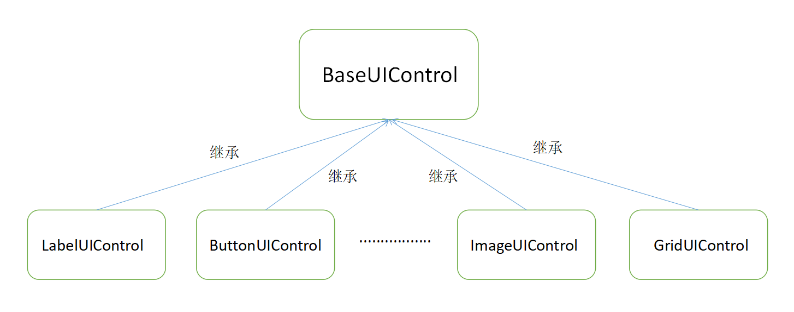

---
front:
hard: 入门
time: 分钟
---

# UI控件对象

## 设计初衷

目前在编写UI逻辑时，各个控件的相关功能接口都放在ScreenNode类中，开发者在查询可用UIAPI时只能通过接口名初步判断功能，并通过注释和试用确定该功能接口是否可以用在想要的控件上。此外，控件与控件的连接性较弱，单个控件的控制只能通过手写该控件的路径获取，使得UI代码有相当大一部分在手写控件路径。

为了解决以上问题，我们将单个控件在脚本层对象化，每种控件都继承自同一个基类，可以使用一些通用函数，又保留了该类控件特有的函数，完成了UIAPI的归类。通过UI控件对象，开发者在开发过程中能更好的明确控件类型与其可用的函数，减少重复代码的编写和查询UIAPI的时间，提高易用性。

## 控件对象用法

### 控件对象结构



由示意图可知，各类控件对象均继承自同一个基类BaseUIControl，基类实现了SetVisible、SetSize等UI控件通用的函数，而子类实现各自控件所独有的函数，如LabelUIControl实现SetText等函数，ImageUIControl实现SetSprite等函数。

### 控件对象的获得

由控件对象结构可知，无论一个控件是什么类型，首先它都是一个BaseUIControl，然后才有一个具体的控件类型。ScreenNode提供了GetBaseUIControl接口，支持开发者通过控件路径获得一个BaseUIControl实例。

- 示例

```python
# 我们通过路径获得BaseUIControl实例
textPath = "/text"
textBaseUIControl = uiNode.GetBaseUIControl(textPath)
```

该接口提供了控件路径到控件对象的转换方法，并当传入路径找不到对应的控件时直接返回None，能帮助开发者更早的发现代码中的问题。

当开发者不关心路径所对应的控件是什么类型，只想做通用操作时，BaseUIControl实例已经够用了，如果需要调用明确控件类型的函数时，就需要用到控件对象的具体转化。

### 控件对象的具体转化


由示意图可知BaseUIControl提供了一系列转换接口将一个基类控件实例转换成相应的子类实例。在转换过程中会判断该控件是否符合转换要求，如asLabel接口调用时会判断BaseUIControl实例对应的界面控件是不是label类型，若是则转换成功，返回LabelUIControl实例，反之则返回None

- 示例

```python
# 我们通过路径获得Label实例，并设置文本
textPath = "/text"
textBaseUIControl = uiNode.GetBaseUIControl(textPath).asLabel()
if textBaseUIControl:
    textBaseUIControl.SetText("myLabel")
```

部分控件的转换接口判断比较宽泛，在使用时还是需要注意是否转换成功

### 控件对象的链式查找方法

BaseUIControl类提供了根据子节点名称获得子BaseUIControl实例的GetChildByName接口和根据相对路径获得子BaseUIControl实例的GetChildByPath接口。

- 示例

```python
buttonPath = "/button0"
buttonBaseUIControl = uiNode.GetBaseUIControl(buttonPath)
# 我们通过子控件名获得子控件实例
labelBaseUIControl = buttonBaseUIControl.GetChildByName("button_label")
# 我们通过子控件路径获得子控件实例
labelUIControl = buttonBaseUIControl.GetChildByPath("/button_label").asLabel()
```

开发者可以仅从ScreenNode.GetBaseUIControl接口获得一个根BaseUIControl，并通过链式查找接口获得根节点相关的其他节点对象，增强控件与控件之前的链接性，提高易用性。

#### 更多UI控件对象文档与接口详见<a href="../../mcdocs/1-ModAPI/接口/自定义UI/UI控件.html#baseuicontrol" rel="noopenner">这里</a>，代码示例详见UIDemoMod中的文本与按钮范例