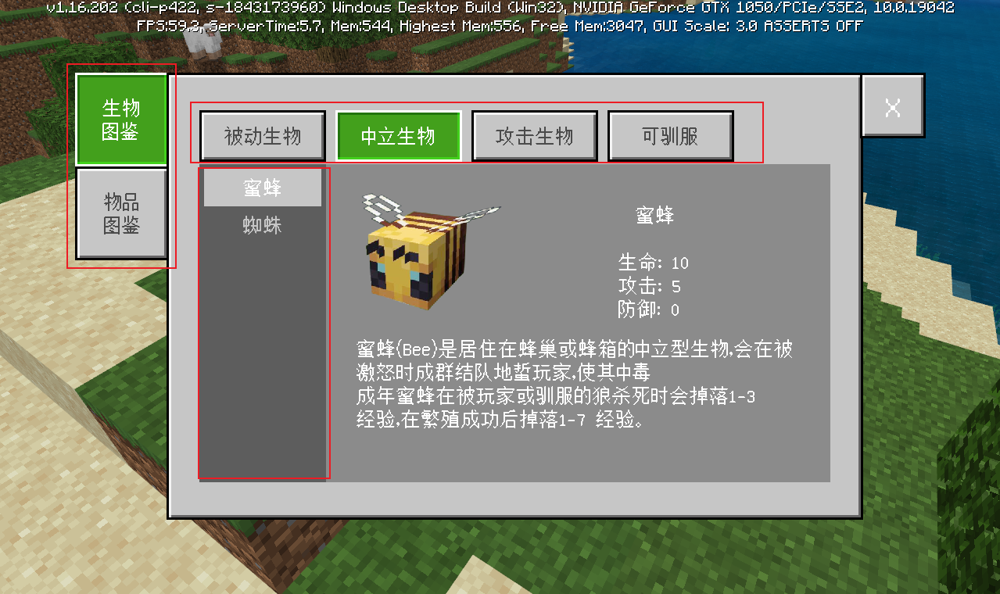

# UI数据绑定


## 效果展示

如图所示为季度mod西游：大闹天宫中图鉴的效果展示，下面我们将一步步拆解，通过一个demo复刻来详细介绍如何实现ui数据绑定


## toggle控件

toggle控件继承自原版的common.toggle，可以理解为开关或者选项控件，可用于设置中的单选、复选。其中我们是选用单选toggle来实现分页效果。具体mod及源码可参考示例中的DataBindingMod。


## stack_grid控件

该控件结合了stack_panel和grid，可以理解它就是一个一维（或横向扩展或纵向扩展）的grid。通过绑定collection可以快速实现类似记分牌、列表展示等功能。本例中三级分页tab列表便采用了该控件。


## UI节点树

实际上在本例中，红框中的三个部分都采用了toggle，实现了三级分页效果：



整体UI的节点树如下所示：

- guideBookPanel 根目录
  - bookToggleGroup 一级分页
    - 生物图鉴
    - 物品图鉴
  - guidePanelWrap 中间panel的根节点，生物图鉴和物品图鉴对应的是两个panel，根据当前选择的tab来显示对应panel并隐藏另一个panel
    - monsterHeaderContentPanel 生物图鉴panel
      - monsterToggleGroup 二级分页
        - 被动生物
        - 中立生物
        - 攻击生物
        - 可驯服
      - monsterGuideContentLeft 左半边panel，用于scrolling_panel展示三级分页
        - monsterToggleGrid 三级分页，通过stack_grid实现动态数据绑定的三级分页列表
          - monsterToggleBtn 三级分页tab的模板控件
      - monsterGuideContentRight 右半边panel，用于展示三级分页的详细内容，实现细节与本文内容无关，不做详细介绍，可根据自己需求进行修改
    - itemHeaderContentPanel 物品图鉴panel
      - ...物品图鉴结构同生物图鉴，不做重复介绍


## 具体用例

### tab分页的简单实现

上述效果展示中的例子，因为是一个三级分页，我们分两部分来介绍，首先来介绍一下第一级和第二级这种固定的分页，以第二级的tab为例，其json代码如下：

```json
{
    "namespace": "guideBookUI",
	"locationToggleGroup": {
        "anchor_from": "top_middle",
        "anchor_to": "top_middle",
        "type": "stack_panel",
        "orientation": "horizontal", // 扩展方向，默认是垂直，这里我们需要水平
        "layer": 1,
        "size": [ "100%", 22 ],
        "controls": [
            {
                "toggle0@guideBookUI.typeToggleBtn": {
                    "$buttonLabel": "被动生物",
                    "$toggle_group_forced_index": 0
                }
            },
            {
                "content_padding_1": {
                   "size" : [ 4, "100%" ],
                   "type" : "panel"
                }
            },
            {
                "toggle1@guideBookUI.typeToggleBtn": {
                    "$buttonLabel": "中立生物",
                    "$toggle_group_forced_index": 1
                }
            },
            {
                "content_padding_2": {
                   "size" : [ 4, "100%" ],
                   "type" : "panel"
                }
            },
            {
                "toggle2@guideBookUI.typeToggleBtn": {
                    "$buttonLabel": "攻击生物",
                    "$toggle_group_forced_index": 2
                }
            },
            {
                "content_padding_3": {
                   "size" : [ 4, "100%" ],
                   "type" : "panel"
                }
            },
            {
                "toggle3@guideBookUI.typeToggleBtn": {
                    "$buttonLabel": "可驯服",
                    "$toggle_group_forced_index": 3
                }
            }
        ]
    },
    "typeToggleBtn@common.toggle": {
        "$checked_img": "textures/ui/guide_book/checked",
        "$default_texture": "textures/ui/guide_book/btn02_unuse",
        "$pressed_texture": "textures/ui/guide_book/btn02_click",
        "$locked_texture": "textures/ui/guide_book/btn02_unuse",
        "$default_font_color": [ 0.674, 0.482, 0.361 ],
        "$pressed_font_color": [ 0.494, 0.188, 0.02 ],
        "$locked_font_color": [ 0.674, 0.482, 0.361 ],
        "$unchecked_control": "mod7CommonUI.toggle_unchecked_state", // 未选中状态
        "$checked_control": "mod7CommonUI.toggle_checked_state", // 选中状态
        "$unchecked_hover_control": "mod7CommonUI.toggle_unchecked_state", // 未选中时hover状态
        "$checked_hover_control": "mod7CommonUI.toggle_checked_state", // 选中时hover状态
        "$unchecked_locked_control": "mod7CommonUI.toggle_locked_state", // 未选中且锁定状态（不可交互）
        "$unchecked_locked_hover_control": "mod7CommonUI.toggle_locked_state", // 未选中且锁定时hover状态（不可交互）
        "$checked_locked_control": "mod7CommonUI.toggle_locked_state", // 选中且锁定状态（不可交互）
        "$checked_locked_hover_control": "mod7CommonUI.toggle_locked_state", // 选中且锁定时hover状态（不可交互）
        "anchor_from": "top_left",
        "anchor_to": "top_left",
        "size": [ 54, 22 ],
        "$radio_toggle_group": true, // 是否单选，true的时候同一个toggle_name的被视为同一个group，同一个group同一时刻只能有一个toggle被选中
        "$toggle_name": "#typeTab", // toggle绑定的group名
        "$toggle_group_default_selected": 0
    }
}
```


这里直接继承了ui_common.json中微软封装的toggle组件，具体字段的含义可参考注释，其中$toggle_name所绑定的参数在python中进行管理：

```python
@ViewBinder.binding(view_binder.BF_ToggleChanged, "#typeTab")
def OnTypeTabChecked(self, args):
    # 二级tab切换时触发，将三级分页默认切换至第一个tab详情页
    self.mCurTypeTab = args["index"]
    self.OnMonsterToggleChecked({ "index": self.mCurMonsterIndex })
```


从json中我们可以看到toggle总共有八种状态，各种状态的详细效果可以打开游戏设置界面查看，左侧的按钮就是toggle。主要有选中、未选中两种基础状态，每种状态又有hover和非hover，然后还有锁定、未锁定，所以总共就有2^3=8种状态组合，需要不同的控件展示。由于我们这里比较简单，只考虑了选中、未选中以及锁定三种状态，所以只实现了对应的三种控制panel，其json如下：

```json
{
    "namespace" : "mod7CommonUI",
	"toggle_checked_state": {
        "$pressed_texture|default": "",
        "$pressed_font_color|default": [ 1, 1, 1 ],
        "type": "image",
        "texture": "$pressed_texture",
        "nineslice_size": 4,
        "controls": [
            {
                "toggleText": {
                    "type": "label",
                    "$buttonLabel|default": "测试",
                    "color": "$pressed_font_color",
                    "text": "$buttonLabel",
                    "layer": 3
                }
            },
            {
                "checkedImg": {
                    "type": "image",
                    "$checked_img|default": "",
                    "texture": "$checked_img",
                    "size": [ 12, 6 ],
                    "layer": 3,
                    "anchor_from": "bottom_middle",
                    "anchor_to": "bottom_middle"
                }
            }
        ],
        "layer": 10
    },
    "toggle_unchecked_state": {
        "$default_texture|default": "",
        "$default_font_color|default": [ 0, 0, 0 ],
        "type": "image",
        "texture": "$default_texture",
        "nineslice_size": 4,
        "controls": [
            {
                "toggleText": {
                    "type": "label",
                    "$buttonLabel|default": "测试",
                    "color": "$default_font_color",
                    "text": "$buttonLabel",
                    "layer": 3
                }
            }
        ],
        "layer": 1
    },
    "toggle_locked_state": {
        "$locked_texture|default": "",
        "$locked_font_color|default": [ 0, 0, 0 ],
        "type": "image",
        "texture": "$locked_texture",
        "nineslice_size": 4,
        "controls": [
            {
                "toggleText": {
                    "type": "label",
                    "offset": [ 6, 0 ],
                    "$buttonLabel|default": "测试",
                    "color": "$locked_font_color",
                    "text": "$buttonLabel",
                    "layer": 3
                }
            },
            {
                "lockedImg": {
                    "type": "image",
                    "size": [ 12, 12 ],
                    "offset": [ -8, 0 ],
                    "texture": "textures/ui/lock",
                    "color": "$locked_font_color",
                    "layer": 1
                }
            }
        ],
        "layer": 2
    }
}
```


这里把三种状态的label统一通过$buttonLabel来管理，这样在子类中（上面的每个具体的toggle）只用管理这一个参数就行。另外各个状态的贴图和字体颜色也是分开控制的，细心的朋友可能发现了选中状态多了个checkedImg，锁定的状态多了个lockedImg，前者是用来实现选中时按钮下方的小箭头的，而后者则是用来实现锁的图标的。是否锁定只需要设置其*enabled*字段就可以，也可以在python中通过调用SetTouchEnable接口来动态设置。效果如图所示：


以上即为最简单的分页实现。


### 高度数据绑定的自适应tab列表

接下来以第三级分页来介绍数据绑定，我们先来看看对应的json：

```json
{
    "namespace": "guideBookUI",
    "itemToggleGrid": {
        "anchor_from": "top_middle",
        "anchor_to": "top_middle",
        "bindings": [
            {
                "binding_condition": "always",
                "binding_name": "#itemToggleGrid.item_count", // 我们通过该变量名复写引擎中对应的变量名
                "binding_name_override": "#StackGridItemsCount" // 这是引擎中的变量名，用于控制stack_grid的数量
            }
        ],
        "collection_name": "itemToggles", // 绑定的集合名
        "controls": [
            {
                "itemToggleBtn@guideBookUI.itemToggleBtn" : {} // stack_grid中的template，改变#StackGridItemsCount的值会动态克隆所有controls
            }
        ],
        "item_count": 10,
        "layer": 0,
        "orientation": "vertical", // 扩展方向，垂直
        "property_bag": {
            "#itemToggleGrid.item_count": 10 // 默认有10个item，实际根据绑定值返回实时更新
        },
        "size": [ "100%", "default" ],
        "type": "stack_grid",
        "visible": true
    },
    "itemToggleBtn@common.toggle": {
        "$unchecked_control": "guideBookUI.itemUncheckedState",
        "$checked_control": "guideBookUI.itemCheckedState",
        "$unchecked_hover_control": "guideBookUI.itemUncheckedState",
        "$checked_hover_control": "guideBookUI.itemCheckedState",
        "$unchecked_locked_control": "guideBookUI.itemUncheckedState",
        "$unchecked_locked_hover_control": "guideBookUI.itemUncheckedState",
        "$checked_locked_control": "guideBookUI.itemUncheckedState",
        "$checked_locked_hover_control": "guideBookUI.itemUncheckedState",
        "$toggle_grid_collection_name": "itemToggles", // toggle列表绑定的collection，在common.toggle中定义
        "$item_collection_name": "itemToggles", // 文字绑定的collection，在下方的itemLabel中定义
        "anchor_from": "top_left",
        "anchor_to": "top_left",
        "size": [ "100%", 16 ],
        "$radio_toggle_group": true,
        "$toggle_name": "#itemToggleGroup",
        "$toggle_group_default_selected": 0
    },
    "itemCheckedState": {
        "type": "image",
        "texture": "textures/ui/white_bg",
        "color": [ 0.7764, 0.7764, 0.7764 ],
        "nineslice_size": 1,
        "controls": [
            {
                "itemLabel@guideBookUI.itemLabel": {}
            }
        ],
        "layer": 2
    },
    "itemUncheckedState": {
        "type": "image",
        "texture": "textures/ui/white_bg",
        "color": [ 0.3647, 0.3647, 0.3647 ],
        "$label_color": [ 0.776, 0.776, 0.776],
        "nineslice_size": 1,
        "controls": [
            {
                "itemLabel@guideBookUI.itemLabel": {}
            }
        ],
        "layer": 2
    },
    "itemLabel": {
        "bindings": [
            {
                "binding_collection_name" : "$item_collection_name",
                "binding_name" : "#label_name.text",
                "binding_type" : "collection"
            }
        ],
        "$label_color|default": [ 1, 1, 1 ],
        "color": "$label_color",
        "property_bag": {
            "#label_name.text" : "ha ha"
        },
        "layer": 3,
        "text" : "#label_name.text",
        "type" : "label"
    },
}
```


我们先看toggleBtn的实现，与上面的二级tab相比，三级tab没有锁定的状态，因此只用了选中和未选中两种状态panel。两个panel简单改变了不同的背景颜色和字体颜色，重点在itemLabel，通过绑定collection，在python中可以绑定对应的数据：

```python
@ViewBinder.binding_collection(view_binder.BF_BindString, "itemToggles", "#label_name.text")
def OnRefreshItemLabel(self, index):
    # 这里返回的文字会显示在对应index的itemLabel上
	return self.mItemData[self.mCurItemTab][index]["name"] if len(self.mItemData[self.mCurItemTab]) > index else ""
```


我们再来看stack_grid的实现，重点就在于collection_name的绑定和#StackGridItemsCount的绑定，这里通过#itemToggleGrid.item_count来复盖#StackGridItemsCount并在python中实现动态绑定：

```python
@ViewBinder.binding(view_binder.BF_BindInt, "#itemToggleGrid.item_count")
def OnItemGridResize(self):
    # 将stack_grid的size和对应的data数量绑定起来，实现数据驱动，有多少内容显示多少
    return len(self.mItemData[self.mCurItemTab])
```


最后就是点击item列表之后的回调了：

```python
@ViewBinder.binding(view_binder.BF_ToggleChanged, "#itemToggleGroup")
def OnItemToggleChecked(self, args):
    # 当点击#itemToggleGroup中的toggle时会调用该函数，传入的args中有对应点击的index，在该回调函数中完成分页内容的设置
    toggleIndex = args["index"]
    if toggleIndex >= len(self.mItemData[self.mCurItemTab]):
    	toggleIndex = 0
    self.mCurItemIndex = toggleIndex
    itemDict = self.mItemData[self.mCurItemTab][toggleIndex]
    self.GetBaseUIControl(self.mItemIcon).asImage().SetSprite(itemDict["icon"])
    self.GetBaseUIControl(self.mItemName).asLabel().SetText(itemDict["name"])
    self.GetBaseUIControl(self.mItemDesc).asLabel().SetText(itemDict["desc"])
    self.set_control_visible(self.mItemInfoWrap, True)
```


## 总结

### 单选toggle

- 通过绑定BF_ToggleChanged实现点击对应$toggle_name的toggle的回调，在回调中展示对应分页内容
- $radio_toggle_group设置为true时为单选，同$toggle_name的toggle在同一时间只有一个toggle处于开启状态

### stack_grid数据绑定

- 通过绑定"\#itemToggleGrid.item_count"来实时更新列表的size
- 通过集合绑定来实时更新每个index的内容，文中列举的是label的文字，同理也可以绑定image的贴图
- demo中绑定的数据内容放在modCommon/dataBindingCfg.py中，可自行修改数据查看效果