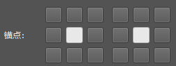
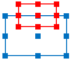
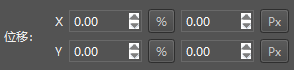
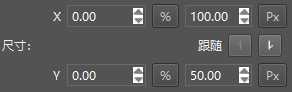
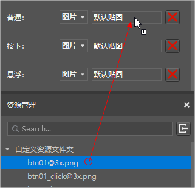
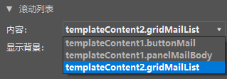
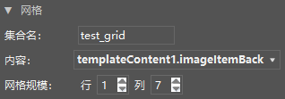
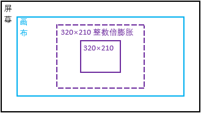

# 旧版界面编辑器使用说明
## 基本介绍

界面编辑器用于可视化的编辑《我的世界》游戏内的界面。

建议跟随下面的视频进行学习哦。

<iframe src="https://cc.163.com/act/m/daily/iframeplayer/?id=5ea7d81e6a37ca8de9c0bf47" height="600" width="800" allow="fullscreen" />

进入编辑器后，如果当前显示的为地图编辑器，那么点击左上角图标，会显示编辑器列表，选择其中的“界面编辑器”。如下图：

界面编辑器的界面构成如下：

下面简单介绍各个界面的作用：

- **工程文件**：显示当前界面工程文件（文件后缀为.mcgui）。点击“+”可新增界面工程文件。在保存时，每个mcgui文件都会对应的另存一个同名Json文件，Json文件就是游戏中要用到的界面文件。

- **界面结构**：当前选中工程的界面控件树状结构，在这里可以对控件进行选中、隐藏/显示等操作，右键控件，可进行添加子控件、删除、复制等操作。

- **控件类型**：选中“界面结构”中某个控件，再单击“控件类型”区域的控件，可以添加一个子控件。其中画布比较特殊，画布用于挂载各种非画布控件，不能作为其他控件的子控件。

- **控件属性**：选中控件时，这里会显示该控件可编辑的属性。

- **编辑区域**：编辑区域会实时显示界面编辑效果，也可选中、移动、缩放控件。

- **资源管理**：点击右上角的导入按钮，可导入图片资源 （可多选批量导入）。

- **对齐操作**：在界面结构中，按住Ctrl键后多选控件，然后点击对齐按钮，可对齐选中的控件。

## 界面编辑

### 添加控件

有两种方式在界面中添加控件：

- 直接点击菜单栏中的控件图标，会在当前选中的控件下添加一个该类型的子控件；
- 在控件结构中的控件上右键，依次选择添加对象->控件。添加控件后，编辑区域会实时显示添加的控件。

### 控件基础属性

在控件列表或者编辑区域中选择控件后，被选中的控件会显示一个红框，其父控件会显示一个蓝框。

在右侧属性面板中会显示被选中控件的属性，控件有一些通用的属性，如下：

- **锚点**：每个控件有9个定位点，包括四个角、四边的中点、中心点，锚点可以设定子控件的哪个定位点和父控件的哪个定位点重合，下图中左侧对应父控件、右侧对应子控件。

    

    下图为子控件中心和父控件上边中点重合的情况。

    

    下图为子控件右下角和父控件左上角重合的情况。

    

- **名称**：控件的名字，只能是字母和数字的组合。

- **隐藏控件**：勾选后会隐藏控件。在控件列表中，点击控件右侧的眼睛也能够实现类似效果。

    

- **层级**：层级用于控制控件的上下关系。层级高的显示在上面。

- **位移**：位移用于控制该控件相对于锚点位置的偏移。位移的形式为%+Px。%表示父控件尺寸的百分比，Px表示像素。如果X配置为10%+10Px，父控件的宽度为100像素，那么子控件的横向（X）的偏移就为10%*100+10=20Px。

    需要子控件的偏移和父控件的尺寸相关时，就需要用%配置。%和Px的按钮可点击，点击后会在两种形式中切换。

    

- **尺寸**：尺寸为控件的宽（X）和高（Y）。也是%+Px的形式，其意义同位移。相比于位移的配置，尺寸还可设置跟随关系。下图中，点亮了“↓”后，表示X跟随Y，如果Y的尺寸是100Px，X是20%+5Px，那么宽度为20%*100+5=25。点亮“↑”时，表示Y跟随X，计算方式同理。需要宽和高关联时，就需要用到%配置。

    

    举一个复杂一点的例子。父控件的宽为100，子控件的宽设置为50%+5Px，子控件的高设置为跟随宽，数值为80%。那么子控件的高度为80%\*(50%\*100Px+5Px)=44Px。

    一般来说，控件的偏移和尺寸均用Px配置即可，比较复杂的情况才需要用到%。

### 控件类型

- **画布**：画布是一个完整的界面，画布下可以挂除了画布以外的子控件。一个界面工程文件中可以有多个画布。新建的界面工程文件会自带一个名字为main的画布。

- **面板**：面板本身并没有可视元素，把归属一个模块的控件挂在一个面板下，能够让界面结构更加清晰，调整起来也更加方便。

- **图片**：图片控件用于显示图片。图片会在不变形的情况下尽量撑满控件的尺寸。

- **按钮**：按钮是重要的交互控件。可设置按钮上的文本、文本颜色、文本字号、文本偏移。按钮的贴图分为普通、按下、悬浮三种情况。“普通”即为正常状态下的贴图，“按下”为按钮被按下时的贴图，“悬浮”为在PC中，鼠标移动到按钮上时的按钮贴图。设置贴图的方式：在资源管理窗口中，左键按住贴图拖动到贴图框中，待鼠标变为带“+”号的样式时，松开鼠标，即可完成贴图设置。

    

- **文本**：文本控件用于显示文本，可设置字号和颜色。

- **滚动列表**：滚动的内容可在“内容”配置项中选择。“内容”的下拉列表中，会出现其他画布中的控件供选择。下图中，templateContent1、templateContent2是画布名称，buttonMail、panelMailBody、gridMailList等是控件名称。

    

    并不是所有控件都能够作为滚动列表的内容，目前仅限于面板、按钮、网格三种类型可作为滚动列表的内容。如果想在滚动面板里显示文本控件，可将文本控件放在面板下，然后将面板作为滚动列表内容。不过并不支持将滚动列表挂在面板下，再将面板作为另外一个滚动列表的内容。

- **网格**：网格用于需要规律排布的界面，如背包界面。其中内容的配置方式类似滚动列表中的内容。网格规模用于配置网格的行列数。网格会自动将内容均匀的显示在各个格子内。
    

    需要注意的是，我的世界游戏引擎中，对网格的尺寸和内容的尺寸有一定要求，否则显示会不符合预期。具体的要求为：

    - 内容的尺寸为固定像素时:
        - 网格的宽度应大于等于内容的宽度乘以列数，小于内容的宽度乘以（列数+1）；
        - 网格的高度应大于等于内容的高度乘以行数；
    - 内容的尺寸为百分比时：
        - 内容的宽度乘以列数需小于等于100%，内容的宽度乘以（列数+1）需大于100%；
        - 内容的高度乘以行数需大于等于100%。

    集合名在代码中绑定UI控件时会用到，具体可参考《UI说明文档》。

## 《我的世界》界面适配方法

手机的分辨率是多种多样的，想尽量的适配更多的分辨率，就需要了解《我的世界》中界面适配的方法。适配界面时涉及的尺寸如下：

其中画布一般和屏幕大小相同，少数情况会小于屏幕，由系统和玩家设置决定。

前面我们已经知道，控件的尺寸为百分比加一个固定像素值的形式。系统在计算控件实际的显示尺寸时，会对所有固定像素乘以一个比例a。举例如下：

|        | **画布尺寸** | **父控件尺寸** | **子控件设定尺寸** | **子控件实际显示尺寸** |
| ------ | ------------ | -------------- | ------------------ | ---------------------- |
| **宽** | 900Px        | 800Px          | 10%+50Px           | 80Px+50Px\*a           |
| **高** | 750Px        | 750Px          | 20%+100Px          | 150Px+100Px\*a         |

那么比例a是怎么确定的呢？系统会按如下步骤计算这个比例：

1. **计算画布的宽除以320、画布的高除以210的值**。上面的例子中，这两个值为900/320=2.81,750/210=3.57。

2. **计算a的最大值**。在1)中计算的两个比例分别取整，然后再取最小值，作为a的最大值。在上面的例子两个比例取整后分别为2和3，最小值就是2。

3. **计算a的最终值**。根据某些的规则得到一个比2)中小的值，作为a最终的值。这个规则开发者无需关心。一般来说最终值和2)里计算的最大值是一样的。

在上面的例子中，a的值为2，那么控件显示的宽为80Px+50Px\*a=180Px，高为150Px+100Px\*a=350Px。

通俗一点来说，游戏里有一个320Px\*210Px的适配区域（下图中紫色实线部分），游戏把这个适配区域按整数倍膨胀，直到再膨胀就会超出画布为止。然后将这个整数比例乘以控件尺寸中的固定像素，再加上比例部分计算得到的像素，作为最终的控件显示尺寸。

因此，如果我们想UI在各种分辨率的屏幕下都不会超出屏幕边界，可以把决定显示范围的父控件（比如顶层的面板控件）的尺寸设为固定尺寸，且数值在320\*210以下。需要注意的是，贴图并不需要受限于这个尺寸，可以适当扩大贴图尺寸，以在大分辨率的屏幕里获得更好的效果。

此外，在PC基岩版中，适配的基准值为376x250，略大于手机适配的320x210，如果想一份界面资源同时适配手机和PC基岩版，那么需要以手机的标准来制作。