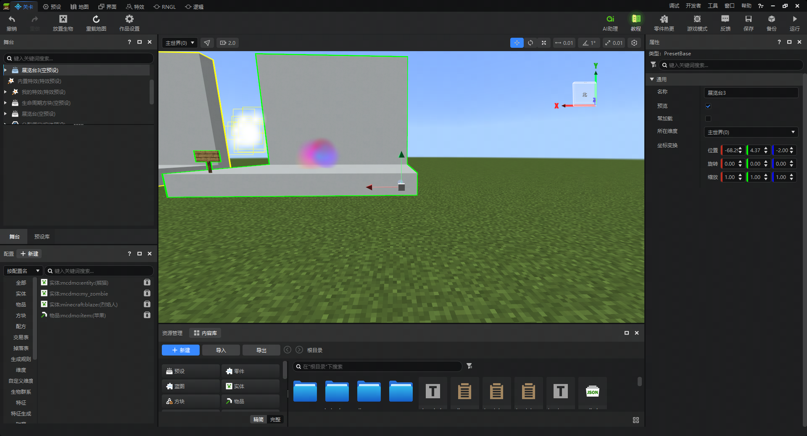
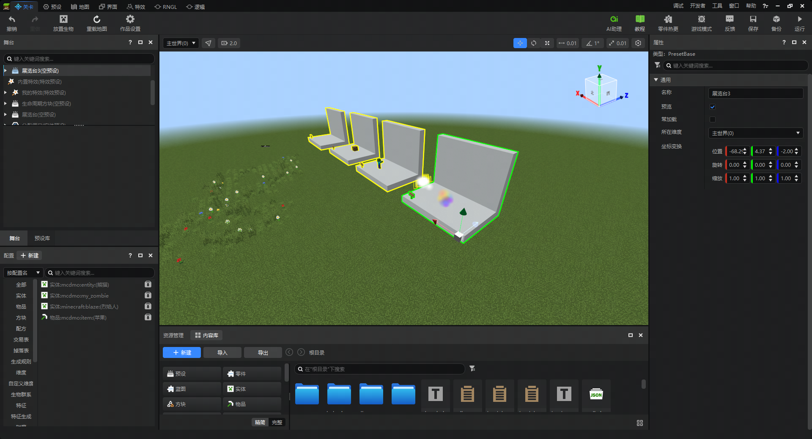
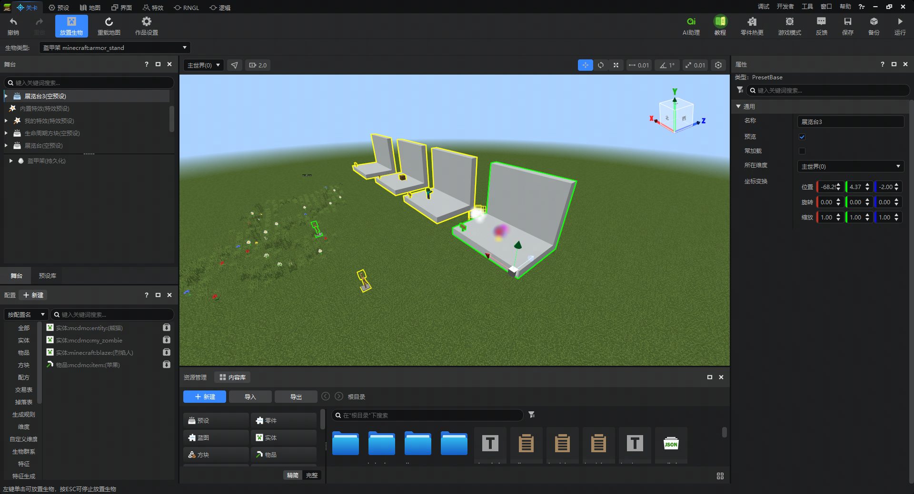
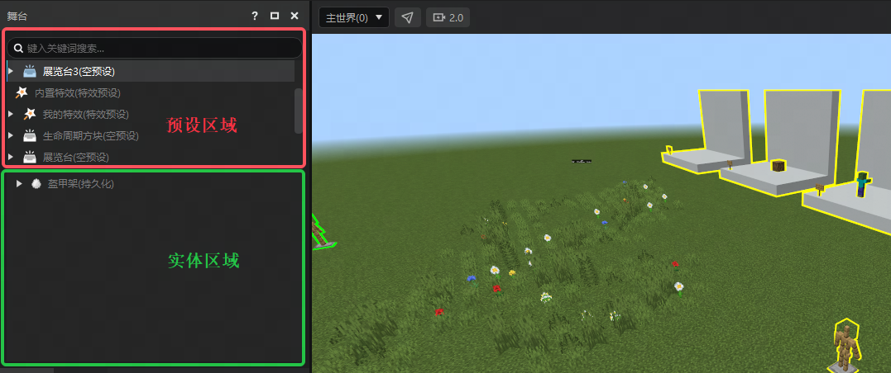
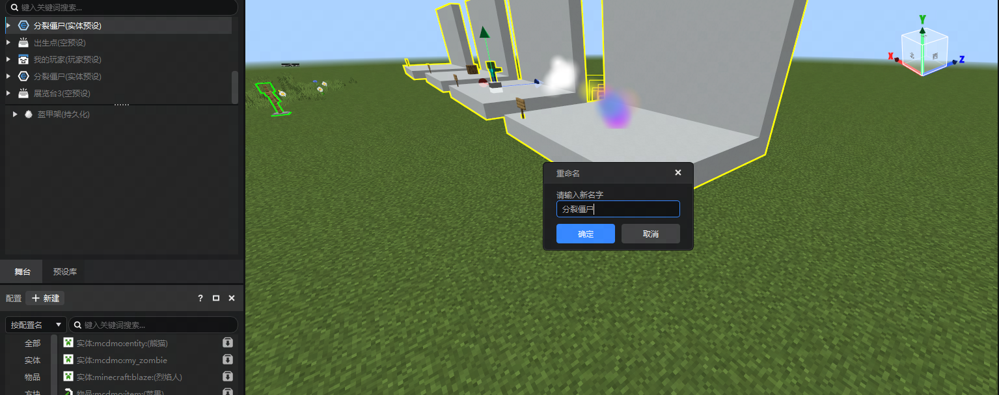
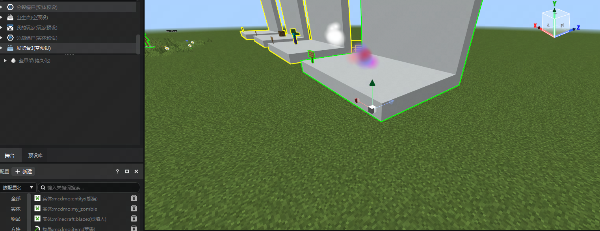
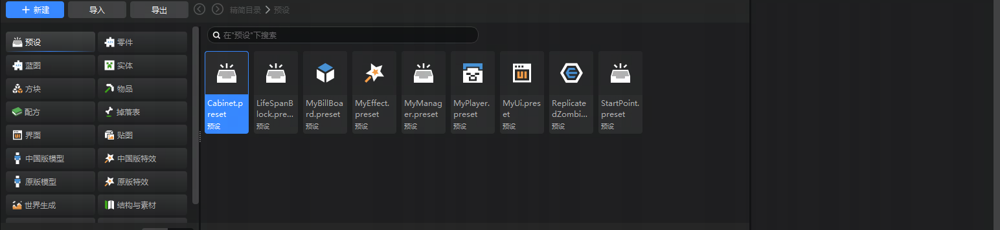
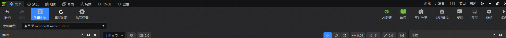
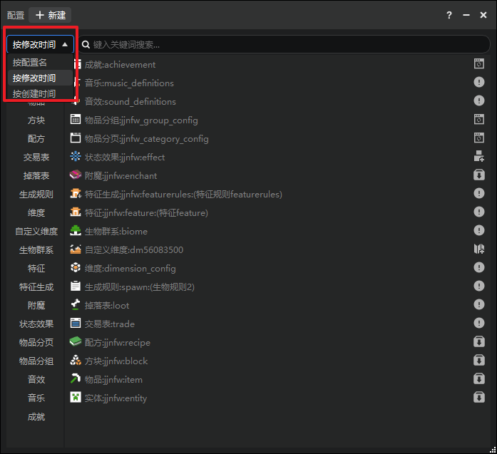
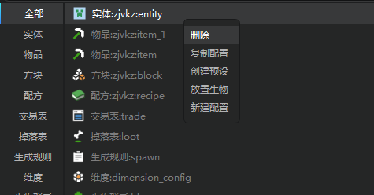

# 充分利用关卡编辑器

**在本文中** ：

- [舞台](#舞台)
- [预览窗](#预览窗)
- [顶部工具栏](#顶部工具栏)
- [配置面板](#配置面板)
- [QA](#QA)

本指南将向您展示如何通过 **预设示例模板** 使用关卡编辑器的主要区域。

::: tip 提示

您可在 **新建** - **功能演示** 中找到 **预设示例模板** 案例。并点击 **编辑** - **启动编辑** 进入地图案例。

:::

## 舞台

进入关卡编辑器，您可在内嵌游戏中看到被放置在游戏地图中的各种[预设](../../20-玩法开发/14-预设玩法编程/0-理解预设系统/6-理解预设概念.md)。您可以把这里想象为一个舞台，需要放置的生物实体与预设都会在此创建。

1. 点击左上角 **舞台** 的首个预设，将相机镜头快速聚焦到预设锁在区域，如下图：

2. 更直观地看到预设全景，则使用W、A、S、D控制玩家移动方向，鼠标右键旋转角度。

3. 点击左上角 **放置生物** ，任意选择一种实体，例如盔甲架。在舞台中移动鼠标，可以看到盔甲架随鼠标进行移动，左键点击确认即可放置在内嵌游戏内。

4. 舞台面板分为预设和生物实体两个区域，每一行都对应了内嵌游戏中的物件，且带有独立的图标。当创建预设时，则新的预设会出现在预设区域。生物实体则会出现在实体区域。如图所示：

5. 点击预设并按下快捷键`F2`，可以快速修改预设的名称。使用右键弹出的选单，选择重命名实现相同的效果。

6. 使用`Crtl+C`与`Crtl+V`或`Crtl+D`快速创建预设副本。或使用右键弹出的选单，选择复制、粘贴、粘贴为副本实现同样效果。新的预设将会出现在旧预设的位置上，并保持相同朝向、

7. 选中预设，点击`Del`键快速删除预设。或使用右键弹出的选单，选择删除选项删除预设。

8. 右键弹出的选单，可以借助在 **资源管理器中定位** 更方便地在资源管理器中寻找到对应的预设。

9. 当内嵌游戏内存在大量物件时，可在输入框快捷搜索对应内容。

##  操作实例

1. 单击一个物件，右侧属性窗口显示这一物件的属性。

2. 双击物件后可在预览窗中聚焦对象。

## 预览窗

通过预览窗，您可以直观地通过内嵌游戏看到《我的世界》，这是针对编辑器进行过特殊改动的基岩版游戏引擎。主要用于在编辑器中预览游戏场景和进行部分游戏地图的编辑，其中，关卡编辑器的预览窗与最终的游戏效果最为接近。

::: danger 提示

1. 为了区分预设实例和MC地图本身，所有的实例都会显示高亮描边。
2. 事实上，所有的实体都会显示高亮描边，即使没有绑定预设。

:::

在预览窗中，你可以直观的查看和调整场景中的所有实例，并且可以和舞台、资源管理器中的预设文件进行一定交互。

选择一个物件，会显示这个实例的坐标变换拖柄,可以拖动拖柄对实例进行位置、旋转、缩放的调整。

::: tip 提示

预览窗右上角可以切换拖柄类型，同时也可以使用主键盘区的数字123键来切换变换拖柄的功能。

:::

使用鼠标拖拽某个箭头，可以让实例沿着这个方向移动。位置拖柄的3个轴与预览窗右上角的轴向的方向相同。

移动的时候，你可以在属性面板中发现，这个实例的位置属性也在改变。

::: warning 注意

1. 对于素材来说，由于MC的方块只能位于整数位置，所以，在移动停止的时候，素材的位置会自动取整。
2. 如果一个空预设下，或者空预设的子预设下有挂接素材，那么这个空预设的位置也会取整。
3. 上述取整的规则无论是坐标系拖拽还是在属性面板输入数值，都会生效。

:::

按2，切换到旋转拖柄，会显示3个扇环，拖拽扇环进行角度的修改。

素材只能以90°作为步长旋转，如下图。

按3，切换到缩放拖柄，拖拽缩放拖柄，来实现各个轴向的缩放。目前，还不支持通过拖柄进行整体缩放。

特效预设并不适合使用这种方式进行缩放，对于方块素材，您仍然可以使用类似[地图编辑器](../../14-地图制作/2-地图编辑器使用说明.md)的选区的方式进行缩放。

::: warning 注意

1. 素材在编辑器中，当前任何情况下实际的缩放值都不会小于0.01。

:::

### 在场景中放置实例

物件只有放置在内嵌游戏的地图场景中才会生效。当前有两种方式可以在场景中放置预设以生成物件。

1. 在资源管理器找到常用目录的Presets目录，或直接在精简模式打开预设菜单，将想要实例化的预设拖拽至场景中即可。

2. 通过预设库拖拽，直接将预设拖拽到世界的某个位置上。

- 预设库是一个展示当前作品中所有预设类型的面板。
- 所有您创建的预设，以及编辑器内置的预设都可以在这个地方看到。
- 如果你的关卡编辑器中没有显示预设库，你可以通过编辑器的 **顶部菜单** - **窗口** - **预设库** ，打开这一面板。
- 预设库与舞台一样支持搜索功能。
- 你可以通过下图的方式，直接将预设拖拽到场景中进行实例化。

## 顶部工具栏

当前顶部工具栏一共有13个功能按钮，其中，除 **Ai助理** 按钮会跳出编辑器界面之外，其他按钮与编辑器功能关联更强。

当你在编辑时发生错误步骤，可以点击 **撤销** 或快捷键`Crtl+Z`移除上一次操作造成的影响，目前支持无限次的撤销。但一旦切换编辑器后，不再记录之前的操作。使用 **重做** 或快捷键`Crtl+Y`则恰好相反，可以还原上一次撤销的操作。

**放置生物** 允许您放置生物实体到内嵌游戏中，详情内容请参考[放置和管理生物](./1-放置和管理生物.md)。

在必要时，可以点击 **重新加载** 按钮重载地图。

使用 **作品设置** ，您可以修改作品的作品命名空间、游戏设置 **（仅限地图作品）** 、作弊设置 **（仅限地图作品）** 、内嵌游戏效果与其他设置。详情内容请参考[作品设置](./5-作品设置.md)。

**零件热更** 按钮仅供自动热更修改零件代码由于某些原因热更不生效时使用。

当在编辑器遇到闪退、报错等bug时，可随时通过 **反馈** 按钮前往开发者反馈页面向我们反馈。

**保存** 按钮用于保存当前的地图和预设存档。由于保存地图的时间较长，所以仅当需要保存地图时才会保存地图。

**备份** 按钮用于在启动器的作品库中生成一份当前作品的拷贝。

最后，当您想要保存所有编辑器的内容，并进行测试时，点击 **运行** 按钮即可。

::: danger 提示

在编辑器保存时，玩家预设的实例不会保存在预设存档中，如果需要修改，请在预设编辑器中直接修改玩家预设。

:::

## 配置面板

使用配置面板自定义物品、方块、掉落表等配置时，可以在配置面板上看到当前作品中创建的所有自定义配置。

配置面板提供了**类型分页**、**排序规则**和**搜索**三种方式帮助您快速定位需要的配置。

在配置面板选中任意配置，可在属性面板查看和编辑该配置的属性，修改属性的本质就是修改对应的`Json`字段。

面对过多的属性时，可以通过搜索和左侧的筛选器快速定位自己所需的属性，如下图：

### 配置右键菜单
右键任意配置，提供了如下功能：
1. 删除：删除当前配置。
2. 复制配置：复制当前配置的内容，并且自动修改标识符。
3. 创建预设：为所选的配置创建预设，当前仅支持实体、方块。
4. 放置生物：仅支持实体配置开启放置生物功能，可在预览窗中点击放置对应实体。
5. 新建配置：打开新建文件向导，并选中对应类型的配置，快速新建同类型的配置。

6. 预览设置：设置快捷预览的相关属性。

### 快捷预览
使用快捷预览功能可以快速帮您在运行游戏中预览相关的配置效果：

1. 生成对应物品到背包：对于**实体**、**物品**、**方块**、**配方**、**附魔**5种配置，点击快捷预览按钮，会将对应的物品生成到玩家的背包，供开发者快速测试对应内容；

2. 新建地图存档，并传送至该维度：对于**自定义维度配置**，点击快捷预览按钮，会创建一个新的地图存档并加载，加载完成后传送至对应的维度，供开发者测试对应的维度内容；

3. 重载UI：对于**物品分页**、**物品分组**、**成就**等UI类的配置，点击快捷预览按钮，会在ModPC开发包重载对应的UI界面，供开发者测试对应内容；

4. 添加效果：对于状态效果配置，点击快捷预览按钮，会在ModPC开发包中直接对玩家添加对应的状态效果，供开发者测试对应内容；

5. 预览提示：对于其他无法直接预览的配置，会提供对应的提示，指引开发者通过其他方式进行测试；

### 配置数据模板导出与导入

当您希望将已有的配置属性进行迁移和复用时，可以通过数据模板导出和导入功能，将配置的配套文件一键迁移至其他作品进行应用，详情参考[这篇文档](../../15-资源管理/13-配置数据模板.md)。

## QA

### 如何处理旧版编辑器中的组件？

1. 新版编辑器目前不再支持旧版组件的属性编辑（你可以看到关卡编辑器中已经没有组件面板了）。

2. 使用组件的旧版作品在升级到新版编辑器之后，其组件的逻辑仍然是生效的，但编辑器不再支持继续编辑组件内容。

3. 我们会逐渐使用预设架构和配置代替当前的组件，如下：

   - ### 自动转化为配置的组件

       - 生物

       - 物品 - 普通物品

       - 物品 - 武器和工具

       - 物品 - 盔甲

       - 方块

       - 配方

       - 特征

       - 特征分布规则

       - 维度

       - 生物生成规则

       - 生物群系

       - 交易表

       - 掉落表

   - ### 删除并替换为零件的组件

       - 世界 - 基础属性，建议删除行为包目录下的script_World文件夹，并使用WorldPart零件替换。

       - 玩家 - 基础属性，建议删除行为包目录下的script_Player文件夹，并使用PlayerBasicPart零件替换。

       - 自定义传送门，建议删除行为包目录下的script_PortalGate文件夹，并使用PortalImpPart零件替换。

       - 按键绑定：建议删除行为包目录下的script_InputBind文件夹，并使用InputBind零件替换。

       - 队伍：建议使用内容库中的队伍零件进行替换。

       - 初始物品：建议使用内容库中的初始物品零件进行替换。

       - 初始装备：建议使用内容库中的初始装备零件进行替换。

       - 有限复活：建议使用内容库中的有限复活零件进行替换。

       - 技能：建议使用内容库中的技能零件进行替换。

       - 个人排行榜：建议使用内容库中的排行榜零件进行替换。

       - 货币：建议使用内容库中的货币零件进行替换。

       - 对话：建议使用内容库中的任务与对话零件进行替换。

       - 任务：建议使用内容库中的任务与对话零件进行替换。

       - 塔防大本营：建议使用内容库中的初始装备零件进行替换。

       - 攻击手：建议使用内容库中的生物警卫零件进行替换。

       - 生物点：建议使用内容库中的刷怪点零件进行替换。

       - 巡逻路径：建议使用内容库中的生物巡逻零件进行替换。

       - 开始游戏：建议使用内容库中的开始游戏零件进行替换。

       - 结束游戏：建议使用内容库中的结束游戏零件进行替换。

::: danger 提示

1. 如需进行升级和替换，请尽量在刚升级作品后立即进行替换。
2. 创建新零件时，会在第一个script_xxx目录下生成零件文件的链接。如果在这之后想要删除组件文件夹，可以先通过新建文件向导创建一个ModMain，然后把Parts目录移动到新创建的script_xxx中，然后再删除需要删除的路径。
3. 其他组件我们会在后续的更新中逐步支持。

:::

